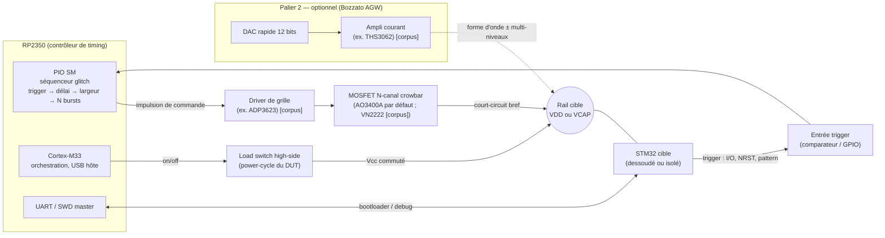

# 01 — Préconisations d'architecture (carte RP2350)

> **Nature du document — RECOMMANDATION.** Aucun des 68 PDF de `docs_pdf/` ne décrit le **RP2350** :
> ce choix-là reste de l'**ingénierie appuyée sur l'état de l'art** (Bozzato TCHES'19 pour la chaîne
> de référence, produits PicoGlitcher / ChipWhisperer, et le **product brief officiel RP2350**,
> août 2024).
> ★ **Nuance nouvelle, et elle compte : le *PIO*, lui, n'est plus hors corpus.**
> Voir l'encadré « Le PIO entre au corpus » ci-dessous.
>
> Les valeurs *sourcées du corpus* sont marquées **[corpus]** ; le reste est une proposition à valider
> sur banc. La nomenclature détaillée est dans [`02_BOM_MATERIEL.md`](02_BOM_MATERIEL.md).
>
> ★ **Deux étiquettes de plus depuis la campagne de banc de septembre 2026** : **`[fait]`** =
> **mesuré sur un banc réel** (date citée) · **`[fw]`** = **lu dans le code source** d'un firmware
> (fichier + ligne). Elles portent les pièges PIO du §1.2 et les limites matérielles du §1.3.
> ★ Une mesure de première main **prime sur le corpus** pour la pièce mesurée — mais **ne se
> généralise pas**. ⚠ **Un modèle n'est jamais un `[fait]`**, même recoupé par deux solveurs.
>
> ★ **Correction par rapport aux versions précédentes de ce document.** Il affirmait qu'« aucun PDF du
> corpus ne décrit un **montage crowbar** ». **Ce n'est plus vrai** : O'Flynn, *Fault Injection using
> Crowbars on Embedded Systems* (IACR ePrint 2016/810, `docs_pdf/2016-810.pdf`, **ajouté au corpus**)
> est un papier **entièrement consacré au crowbar** — il en revendique la technique comme
> contribution, la caractérise sur **5 plateformes** et publie ses formes d'onde. Le §3 ci-dessous
> passe donc en partie de `[reco]` à **`[corpus]`**. Deux conséquences directes :
> - O'Flynn 2016 **précède Bozzato de trois ans** et est la **référence-racine** de la topologie que
>   [`05`](05_SCHEMAS_ELECTRONIQUES.md) §4 attribuait jusqu'ici à Bozzato seul.
> - Le rôle donné ici au RP2350 est **explicitement attesté** : *« The crowbar attack method requires
>   a very simple fault signal… one **only requires a pulse generator to drive the MOSFET**. This
>   signal **can even be generated by a simple microcontroller** »* **[corpus, O'Flynn p. 8]** ; et
>   pour la variante haute précision (salve verrouillée en phase sur l'horloge cible), *« almost any
>   FPGA board is capable of performing the required clock multiplication and shifting »* (p. 8) —
>   soit exactement la fonction assurée par le **PIO**.

> ★★ **Le PIO entre au corpus** *(ajout gist `dev-zzo`)*. Le deck **GigaVulnerability: GD32 Security
> Protection bypass** (Kovrizhnykh, OFFZONE 2023, `docs_pdf/2023_OFFZONE_GD32-…_K.pdf`,
> [`04`](04_REFERENCES.md) §D) documente **le raisonnement exact qui fonde ce projet**, sur une cible
> voisine du STM32 :
> - **Le problème posé** (sl. 35) : avec un **J-Link piloté par USB**, *« there is **no known way to
>   control NRST in sync with SWD** — due to USB, there are **large floating delays** »*. C'est,
>   mot pour mot, la raison pour laquelle un contrôleur temps réel dédié est nécessaire plutôt qu'un
>   outil piloté depuis un PC.
> - **La solution retenue** (sl. 36-38) : un **RP2040**, avec **SWD réimplémenté en programme PIO**
>   (repris de Picoprobe) et **`NRST` piloté en synchronisme** par la même machine d'état. Cela
>   fonctionne là où le J-Link échouait.
> - **La généralisation imprimée** (sl. 37) : le PIO *« peut remplacer un FPGA dans certains cas »* et
>   a une *« **large application en sécurité matérielle, en particulier pour les glitchs** »*, avec
>   trois exemples nommés — **PicoFly**, **ChipSHOUTER-PicoEMP** et le **modchip Starlink**.
>
> ⚠️ **Portée exacte, à ne pas outrepasser** : c'est un **RP2040**, pas un RP2350 ; et le PIO y assure
> un **protocole synchronisé (SWD + NRST)**, **pas la génération d'un glitch**. Ce qui est désormais
> `[corpus]` est donc le **principe** — *« PIO = séquenceur déterministe pour la sécurité matérielle,
> là où l'USB introduit du jitter »* — et non le dimensionnement du §1.2. Les caractéristiques
> chiffrées du RP2350 restent issues du **product brief officiel**.
> ⚠️ Le même deck contient un **essai de voltage glitcher qui échoue** (sl. 57, *« My First Voltage
> Glitcher (which doesn't work) »*, à base d'**IRLML2502**, *« like in ChipWhisperer-Lite »*) : **ne
> pas le citer comme une attaque FI réussie**.

---

## 1. Pourquoi le RP2350

### 1.1 Ce que le RP2350 apporte (product brief officiel, vérifié)

| Caractéristique | Valeur | Intérêt pour un glitcher |
|---|---|---|
| Cœurs | 2× Cortex-M33 **ou** 2× Hazard3 RISC-V @ **150 MHz** | 1 cœur séquenceur, 1 cœur E/S |
| **PIO** | **3 blocs = 12 state machines** | génération d'impulsion **déterministe au cycle**, indépendante du CPU |
| SRAM | 520 KB (10 banques) | buffers de campagne, tables de balayage |
| GPIO | RP2350**A** = 30 · RP2350**B** = 48 | trigger + gate + SWD + UART + contrôle alim |
| IOVDD (GPIO) | **1,8–3,3 V** nominal | compatible niveau VDD d'un STM32 (SWD/UART directs) |
| Cœur | 1,1 V (régulateur interne, entrée 2,7–5,5 V) | — |

**Le rôle du RP2350 est exactement celui du STM32F407 dans Bozzato** [corpus, p. 204] : un
**contrôleur de timing** qui déclenche le glitch avec une résolution fine et pilote les interfaces
vers la cible. Le PIO remplace avantageusement le « timer matériel, résolution 10 ns » du F407.

### 1.2 Résolution PIO — et son piège

Le PIO exécute une instruction par cycle d'horloge système : **6,67 ns à 150 MHz** (fréquence
**vérifiée** au product brief officiel). Un overclock au-delà de 150 MHz est possible sur cette
famille mais reste **non spécifié — fréquence ET tenue thermique à valider sur banc** : ne pas s'en
servir pour dimensionner le matériel. À 150 MHz, la résolution est déjà **largement** suffisante au
regard des besoins du corpus :

- résolution de délai utile **[corpus]** : **10 ns** (Bozzato), pas de balayage **25 ns**
  (Skorobogatov) ;
- pour l'attaque PLL d'un STM32 sur HSE **[corpus]**, le besoin est un **burst de ~100 µs**, pas une
  impulsion picoseconde (*Peak Clock* p. 89).

> ⚠️ **Piège à éviter dans la communication du projet.** Le tick PIO (6,67 ns) est la **résolution
> de commande**, **pas** la largeur d'impulsion réalisable en sortie. Sneaky Glitch **[corpus]**
> mesure qu'une commande à 14,8 ps ne produit un glitch visible qu'à **531 ps**, et 20 % de VDD à
> **921 ps**. Sur une carte réelle, **le plancher de largeur d'impulsion est fixé par le MOSFET
> (charge de grille Qg), le driver de grille et les parasites du PCB/câbles — pas par le RP2350.**
> Ne jamais annoncer « résolution 6,67 ns » comme résolution de glitch.

> ★★ **Ce piège est désormais démontré sur du code réel, pas seulement argumenté** `[fw]`
> (détail en [`07`](07_BAT32G135_FAULTYCAT.md) §9septies). Dans un firmware de glitcher RP2350
> réellement déployé, **deux effets se composent** : le pilote soustrait 5 à la valeur réglée
> (`if (w > 5) w -= 5;`) tandis que le programme PIO tient le pad haut pendant **`W + 3` cycles**.
> Résultat mesurable :
>
> | `WIDTH` réglé | Cycles réellement hauts |
> |---:|---:|
> | 0 | **3** (≈ 20 ns — le vrai minimum) |
> | 5 | 8 |
> | **6** | **4** ⚠ |
> | **9** | **7** ⚠ |
> | 10 | 8 — *égale* `WIDTH` 5 |
> | ≥ 11 | `W − 2` |
>
> ⇒ ★ **`WIDTH` 6 à 9 livrent strictement MOINS que `WIDTH` 5** : un balayage naïf de 0 à 15 est
> **non monotone**, il repasse deux fois par les mêmes largeurs et creuse un trou. **Ne jamais
> balayer une largeur sous le seuil où la correction s'applique.** Et le minimum réel est de
> **3 cycles ≈ 20 ns**, pas 6,67 ns — le `README` du firmware concerné annonçait 6,67 ns, il a été
> corrigé.
>
> ★ **Corollaire de dimensionnement : il y a DEUX planchers, et seul le second borne un balayage.**
> Le plancher **instrumental** est ce que l'électronique sait produire (**133 ns** sur ce banc) ; le
> plancher **utile** est l'instant où le rail passe réellement sous le seuil de décrochage du cœur
> (**≈ 673 ns**). Chercher plus fin que le second **ne sert à rien** : l'impulsion part, mais le
> rail n'a pas le temps de descendre.

> ⚠⚠ **Second piège PIO, sur le TRIGGER cette fois — et il est silencieux** `[fait]`. Sur ce même
> firmware, le déclenchement GPIO **se produisait systématiquement sur front DESCENDANT**, quelle
> que soit la configuration `RISING`/`FALLING` demandée. Cause identifiée : les programmes PIO de
> détection de front **n'avaient ni anti-rebond ni vérification de stabilité du signal** — un front
> lent ou bruité produit des fronts parasites et une mauvaise identification du type de front.
> ⇒ **C'est la justification mesurée du comparateur du Bloc C** ([`05`](05_SCHEMAS_ELECTRONIQUES.md)
> §5) : ce document le recommandait déjà parce que la pull-up NRST (~40 kΩ) ralentit le front —
> on sait maintenant ce que coûte de s'en passer. **Vérifier la polarité réellement obtenue à
> l'oscilloscope avant toute campagne**, et ne pas croire la configuration sur parole.

### 1.3 Limite honnête du RP2350 comme glitcher

- **Pas de DAC rapide intégré** : le Palier 2 (forme d'onde arbitraire) exige un DAC externe (voir §4).
- **Le RP2350 embarque lui-même des *fast glitch detectors*** (brief officiel) — sans effet sur son
  usage en *attaquant*, mais anecdote parlante : on glitche une cible avec une puce conçue pour
  résister au glitch. (Le RP2350 a d'ailleurs fait l'objet d'un concours public de hacking matériel
  en 2024–2025 ; cette info est **hors corpus** et n'entre pas dans la conception.)
- **IOVDD ≤ 3,3 V, non tolérant 5 V** : prévoir un level-shift si une cible ou un signal dépasse 3,3 V.

★★ **Trois limites matérielles supplémentaires, découvertes sur banc, et qui touchent directement
la carte de ce projet** (détail et arithmétique en [`05`](05_SCHEMAS_ELECTRONIQUES.md) §2 et §4) :

- ★ **Erratum RP2350-E9 — un pad repassé en ENTRÉE fuit jusqu'à 120 µA.** Toute grille de MOSFET
  pilotée par un GPIO doit donc porter un **pull-down obligatoire de 1 kΩ**, monté **sur la carte
  MOSFET**, pas côté contrôleur : hors firmware (bootrom, BOOTSEL, reflash, **fil arraché**) la
  broche est une entrée et la grille flotte. ⚠ **1 kΩ, pas le réflexe 10 kΩ** — 120 µA × 10 kΩ =
  **1,20 V**, bien au-dessus du `V_GS(th)` min de 0,65 V d'un AO3400A, qui **conduirait**. Le
  « workaround E9 » de la datasheet (*« 8,2 kΩ ou moins »*) vise `V_IL`, **pas une grille de
  puissance**. ⚠ **Erratum daté d'un stepping** : la datasheet l'annonce sur **RP2350 A2** et
  mentionne un silicium corrigé — **vérifier le stepping employé**.
  Source : `datasheet/RP2350_RaspberryPi.pdf`, section **RP2350-E9** (chiffre officiel : ~120 µA,
  et le pad est maintenu autour de **2,2 V**).
- ★ **L'ADC n'a aucune référence interne : il utilise sa propre alimentation.** `ADC_AVDD` étant
  dérivée du rail par un filtre R-C et l'ADC consommant ~150 µA, il existe un **offset structurel
  d'environ 30 mV** ⇒ **`ADC_VREF = rail − 30 mV`**, et **une entrée posée sur le rail brut sature
  à pleine échelle avec un écart-type nul**. Ce n'est pas une panne : c'est la construction
  (datasheet Pico 2 W **RP-008304-DS-3** §3.3). ⇒ **mesurer après la résistance série, ou diviser.**
  ⚠ S'y ajoute que `adc_gpio_init()` **latche la broche haute** — toute mesure ADC doit **précéder**
  la première capture de trace de la session. `[fait]`
- ⚠ **Si le RP2350 alimente la cible** : la sortie 3V3 d'une Pico 2 W est donnée pour **moins de
  300 mA**. Un court-circuit de test à travers 9,4 Ω tire **351 mA** et met le SMPS en protection —
  les cartes quittent le bus USB. `[fait]`

> ★ **Ce que ces trois points changent au discours du projet.** Le RP2350 reste le bon contrôleur de
> timing — rien ici ne remet en cause le §1.1. Mais **ce n'est pas un bon capteur analogique
> « clés en main »**, et **ses broches ne sont sûres que tant que son firmware tourne**. Les deux
> nuances doivent figurer dans toute présentation de la carte.

---

## 2. Schéma-bloc de la carte

**Chemins critiques à soigner** : le trajet `PIO → driver → MOSFET → rail` doit être **le plus court
possible** (parasites = plancher de largeur) ; l'entrée trigger doit être **rapide et propre**
(comparateur plutôt que simple GPIO si le front cible est lent — cas NRST **[corpus]**, pull-up
interne ~40 kΩ).

---

## 3. Palier 1 — Crowbar (à construire en premier)

**Principe** : un MOSFET N-canal en parallèle sur le rail d'alimentation de la cible court-circuite
brièvement VDD (ou VCAP) vers GND, créant un creux de tension. C'est la technique du ChipWhisperer
et le montage « Mosfet » de référence de Bozzato **[corpus, p. 216]**.

**Chaîne minimale** :

1. **Load switch high-side** en série sur le Vcc de la cible → **power-cycle** entre tentatives.
   *Peak Clock* **[corpus, p. 88]** insère un transistor série piloté par le contrôleur ; **64,2 %
   de crashes** sur une campagne AES → cette fonction est **obligatoire**, pas optionnelle.
2. **Résistance série** entre l'alim et le Vcc cible **[corpus, Bozzato Fig. 1a]**.
   **Valeur toujours non donnée → à caractériser sur banc** : O'Flynn ne la chiffre pas davantage
   (ni dans le texte, ni sur la Fig. 1, vérifié en rendu image). Il en **requalifie le rôle**, ce qui
   change la façon de la dimensionner **[corpus, O'Flynn p. 3]** :
   - elle a **deux fonctions**, pas une : *« first, it allows the **lower-power MOSFET** to clamp the
     supply voltage towards zero, and second it allows **simultaneous power-analysis**, including
     **triggering the fault based on patterns in the power consumption waveform** »* — c'est donc
     **aussi le shunt de mesure de courant**, et sa valeur est un compromis crowbar ⟷ sensibilité de
     mesure, pas seulement une limitation de courant ;
   - elle n'est **nécessaire qu'avec un MOSFET faible puissance** : sur les cibles attaquées avec le
     gros MOSFET (IRF7807), O'Flynn n'en met **aucune** et branche le crowbar **directement aux
     bornes d'un condensateur de découplage existant** (p. 3).
3. **MOSFET crowbar** à faible Qg + **driver de grille** pour des fronts nets et rapides
   **[corpus]** — c'est le driver, pas le GPIO du RP2350, qui garantit la vitesse de commutation.
4. **Sortie de glitch sur pointe courte** vers le rail cible, sonde de mesure **< 10 mm** de la
   broche d'alim **[corpus, p. 203]**.

**Avantages** : simple, robuste, peu de composants, glitch le plus court et le plus profond
(undershoot < 0 V) **[corpus, Fig. 4]**. **Limite** : forme d'onde **imprévisible**, figée à 0 V
(source à la masse), dépendante de la Rds(on) et des capacités **[corpus, p. 202]**.

**Ce que le papier crowbar ajoute à ce palier [corpus, O'Flynn 2016]** :

- **Le mécanisme de faute revendiqué n'est pas le creux, c'est le *ringing*** (p. 9) : *« The crowbar
  technique **takes advantage of the properties of the power distribution networks** on printed
  circuit boards **to generate ringing** in these networks »*, ringing qui se propage dans le PDN
  interne de la puce. Conséquence : la forme obtenue dépend **du PDN de la carte cible** et du
  **point de branchement**, pas seulement du MOSFET (p. 4).
- **Durées d'activation réellement nécessaires** (p. 5, Table 1) : **135 ns** sur ATMega328P,
  **485 ns** sur BeagleBone Black, **615 ns** sur smartphone Android, **635 ns** sur Raspberry Pi —
  des ordres de grandeur bien supérieurs au tick du contrôleur, ce qui conforte le §1.2 ci-dessus.
- ★ **La précision temporelle du voltage glitch n'est pas l'obstacle qu'on croyait** (p. 1) :
  *« Previously it was considered that **clock glitching could achieve much better temporal accuracy
  than power supply glitching**… we will demonstrate that it is possible to achieve high temporal
  accuracy with power supply glitching »*. La méthode : une **horloge de faute verrouillée en phase
  sur l'horloge cible, à 4× sa fréquence** (p. 6), avec 4 paramètres — *starting offset*, *cycles
  glitched*, *phase offset*, *glitch length* (fixée à **16,9 ns**). Résultat : **~100 % de fiabilité**
  à certains offsets, et **4 bits précis d'un octet** fautés dans 100 % des observations (p. 8,
  Fig. 11). ★ **C'est exactement la fonction que le PIO doit assurer** — et O'Flynn note qu'un
  générateur d'impulsions simple suffit pour le mode de base (p. 8).
- **La difficulté n'est pas le montage, c'est le choix du rail** (p. 8) : sur BeagleBone Black,
  `VDDCORE` a échoué *« à plusieurs emplacements sous le boîtier BGA »* alors que **`VDDMPU` a réussi
  du premier coup** ; sur le smartphone, quatre rails ont été sondés (2,6 / 1,8 / 1,25 / 1,33 V) et
  seul le **1,33 V** s'est révélé vulnérable. → prévoir de **pouvoir changer de rail** (cavalier
  `J-RAIL`, cf. [`05`](05_SCHEMAS_ELECTRONIQUES.md) §1) est une décision de conception, pas un confort.

---

## 4. Palier 2 — Forme d'onde arbitraire (évolution, d'après Bozzato)

C'est **le seul fork réellement informé par le corpus** : la contribution de Bozzato est de produire
des **formes d'onde de glitch arbitraires** avec du matériel bon marché, et de montrer qu'elles sont
**63 % plus rapides** que le crowbar **[corpus, Table 5]**.

**Chaîne AGW de référence** **[corpus, pp. 203–204]** :

- **Générateur de forme d'onde 12 bits** alimentant un DAC (Bozzato : FeelTech FY3200S, ±10 V, 2048
  points, 6 MHz, ~50 $ ; sur une carte intégrée on remplace par un **DAC rapide piloté par le
  RP2350**).
- **Ampli à contre-réaction de courant, haut slew-rate** (Bozzato : TI THS3062, **145 mA**, montage
  non-inverseur 2 étages) — il **alimente la cible en permanence** et injecte le glitch, sans alim
  externe réglable.
- **Relais reed** de coupure totale (hard reset + protection pendant le rechargement de la forme).

**Contraintes chiffrées à respecter** **[corpus]** :

| Spec | Valeur | Justification |
|---|---|---|
| Résolution verticale DAC | **≥ 12 bits** | une dérive de **170 mV** sur un seul point **annule** l'attaque (p. 218) |
| Plage de sortie | **±10 V (20 Vpp)**, glitchs **sous 0 V** courants | p. 204 |
| Bande passante | **6 MHz** suffit pour MCU sub-GHz ; limite pour SoC rapides | p. 219 |
| Courant à la cible | **< 100 mA** typique ; ampli à 145 mA | p. 204 |
| Débit de reconfiguration de forme | viser **~200 ms** | goulot d'étranglement (30 s en natif sur le FY3200S) (p. 203) |

> **Stratégie recommandée** : construire et valider le **Palier 1** d'abord (attaques RDP STM32F103
> déjà faisables avec un simple crowbar **[corpus]**), puis ajouter le **Palier 2** pour les cibles
> résistantes où la forme d'onde fait la différence (SVS/BOR contournés par transitions douces
> 1400 → 880 mV **[corpus, p. 211]**).

---

## 5. Point d'injection : quel rail attaquer

Le crowbar se branche **[corpus, p. 202]** sur la broche du **condensateur de filtrage du régulateur
interne** quand la cible en a un, *« pour contourner le régulateur interne et éviter son
interférence »*. Le mapping vers les broches STM32 dépend de la famille :

| Famille STM32 | Régulateur cœur externe ? | Rail à attaquer | Remarque |
|---|---|---|---|
| F0 / F1 / F3 | non (pas de broche cœur externe) | **VDD** | crowbar sur VDD ; le régulateur/PVD filtre → forme d'onde à soigner |
| F2 / F4 / F7 | **oui — broches VCAP1/VCAP2** | **VCAP** (cœur 1,2–1,8 V) | crowbar directement sur le rail cœur, plus efficace |
| L4 / G0 / G4 / U5 | variable (LDO/SMPS selon pièce) | **à vérifier par datasheet** | familles modernes, protections renforcées |

> ⚠️ Bozzato **ne prononce jamais « VCAP »** ; le mapping « broche condensateur → VCAP » est une
> **inférence d'ingénierie à valider sur le datasheet de la cible réelle**. La carte doit donc
> exposer une **sortie de glitch branchable indifféremment sur VDD ou VCAP** (cavalier / bornier),
> ce qui la rend **famille-agnostique** — conforme à la cible retenue au cadrage.

---

## 6. Trigger, power-cycle, interfaces

- **Trigger** : au choix selon la cible **[corpus]** — activité I/O UART (bootloader série,
  STM32F103), **front sur NRST** (downgrade RDP au power-up, STM32F373 ; attention pull-up interne
  ~40 kΩ qui ralentit le front → comparateur conseillé), ou pattern matching sur une trace de
  puissance (approche ChipWhisperer). Prévoir une entrée **SMA** + un comparateur rapide.
- **Δ (recharge du condensateur)** : mesurer le temps minimal entre deux glitchs de la chaîne
  complète **[corpus, DSN'21 p. 405 ; Martín Déf. 2]** — c'est la **borne dure** du multi-glitch. Le
  découplage de la cible doit être **minimal** (Bozzato soude le MCU sur un breakout **sans
  condensateurs de découplage** **[corpus, p. 203]**).
- **Power-cycle** : le load switch doit couper franchement et rétablir proprement ; prévoir un délai
  de POR (STM32 : **1,5 à 4,5 ms** **[corpus, p. 209]**) avant de re-trigger.
- **Interfaces DUT** : **UART** + **SWD** pilotés par le RP2350 pour envoyer les commandes bootloader
  et lire registres/mémoire après faute. Prévoir un **nop-slide (~160 instructions)** dans le
  firmware de test avant le code d'analyse **[corpus, Peak Clock p. 89]**.
- **Mesure de température** loguée à chaque essai (compensation ~0,1 %/°C **[corpus]**).

---

## 7. Récapitulatif des décisions d'architecture

| Décision | Choix | Source |
|---|---|---|
| Contrôleur de timing | RP2350, séquenceur en **PIO** | recommandation (rôle = STM32F407 de Bozzato [corpus]) |
| Étage de sortie de base | **Crowbar** MOSFET + driver de grille | [corpus] Bozzato Fig. 1a |
| Évolution | **AGW** DAC 12 bits + ampli 145 mA | [corpus] Bozzato §3 |
| Contrôle d'alim | **load switch high-side obligatoire** | [corpus] Peak Clock p. 88 |
| Rail attaqué | **sortie branchable VDD *ou* VCAP** (agnostique) | recommandation + [corpus] p. 202 |
| Trigger | SMA + comparateur (I/O, NRST, pattern) | [corpus] Bozzato §5 |
| Résolution à annoncer | **de commande ≠ de glitch** ; plancher = MOSFET/PCB | [corpus] Sneaky Glitch |

*Suite : [`02_BOM_MATERIEL.md`](02_BOM_MATERIEL.md) — composants, coûts, comparatif acheter/construire.*
