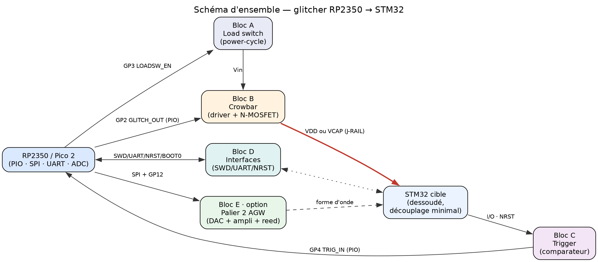
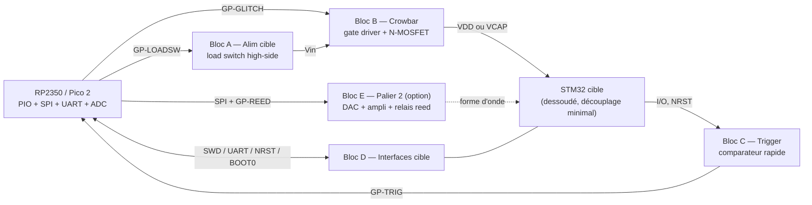
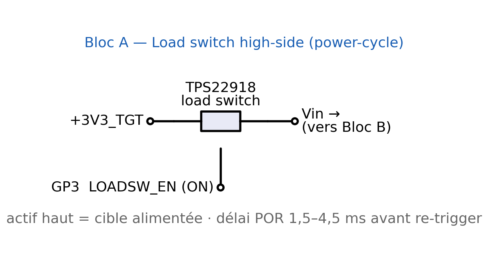
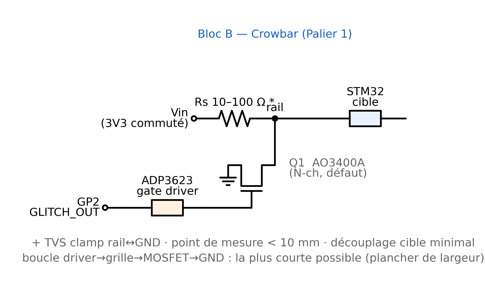
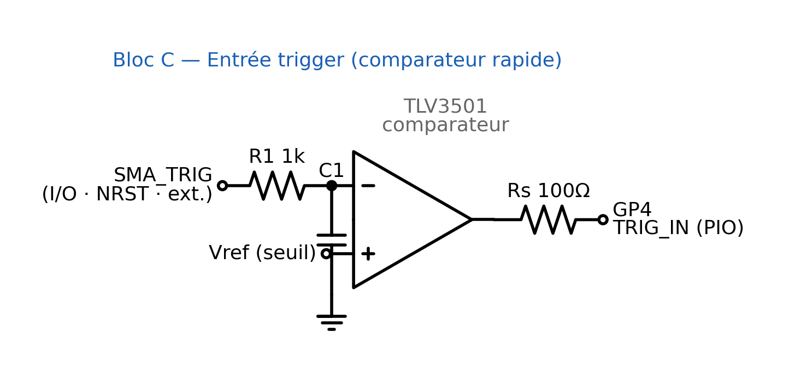
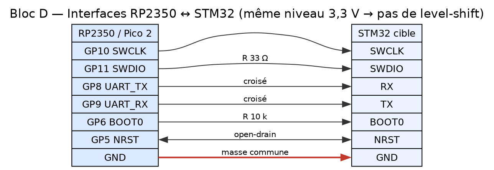
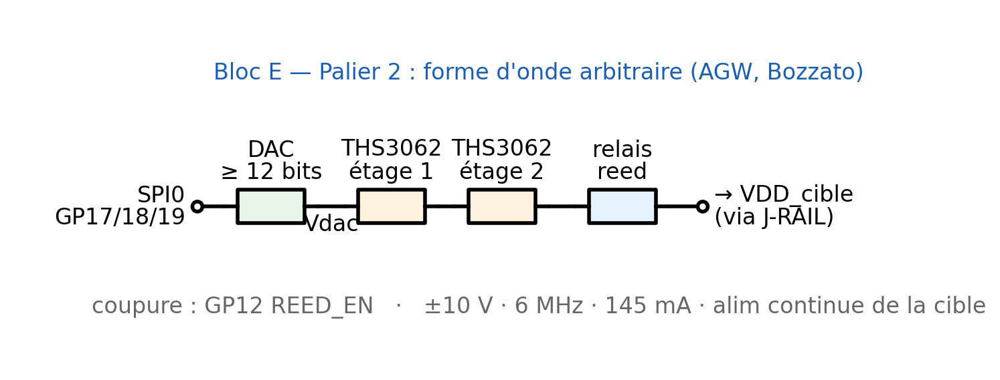

# 05 — Schémas électroniques (carte RP2350 voltage glitcher)

> **Nature — RECOMMANDATION, schémas de PRINCIPE.** Ce sont des schémas fonctionnels à **valider sur
> banc**, pas un routage ni des Gerbers. Les composants **[corpus]** sont ceux nommés par Bozzato
> (TCHES'19) ; les **[reco]** sont mes suggestions (familles réelles, références/valeurs à confirmer).
> Une seule règle d'implantation (§8, point 2) cite un second papier **[corpus]** — O'Flynn 2020,
> parce qu'il **contredit** la règle de découplage de Bozzato dans le cas EMFI.
> Se lit avec [`01_PRECONISATIONS_ARCHITECTURE.md`](01_PRECONISATIONS_ARCHITECTURE.md) (architecture)
> et [`02_BOM_MATERIEL.md`](02_BOM_MATERIEL.md) (nomenclature). Cible d'exemple : **Raspberry Pi
> Pico 2 (RP2350A)**, IOVDD 1,8–3,3 V (utilisé à 3,3 V).
>
> ★ **Deux étiquettes supplémentaires depuis la campagne de banc du 2026-09** :
> **`[fait]`** = mesuré sur un banc réel (date citée) · **`[fw]`** = lu dans le code source d'un
> firmware (fichier + ligne). Elles portent les ajouts du §4 (les trois composants manquants) et
> du §8 (règles 7 à 9). Le banc complet est décrit dans
> [`09_BANC_BAT32_FAULTYCAT_RAIDEN.md`](09_BANC_BAT32_FAULTYCAT_RAIDEN.md).
> ⚠ **Un modèle n'est jamais un `[fait]`** : les valeurs de `R_damp` viennent d'une simulation
> recoupée par ngspice à 0,7 %, ce qui reste du **`[reco]`**.

**Conventions** : `●` = point de connexion (net) ; `┤├` = condensateur ; `[R]` = résistance ;
`▷|` = diode ; les flèches indiquent le sens du signal de commande. Toutes les masses sont reliées
en **étoile** au plan de masse (voir §8).

---

> **Schémas en PNG** : chaque bloc ci-dessous est illustré par une image dans
> [`../assets/schemas/`](../assets/schemas/) (générées avec `schemdraw` / `graphviz` ; scripts et
> instructions de régénération dans [`../assets/schemas/src/`](../assets/schemas/src/)). Les tables
> de netlist et les schémas ASCII restent fournis comme complément de précision pour le câblage.

## 1. Schéma d'ensemble (interconnexion des blocs)





Deux étages de sortie **mutuellement exclusifs** partagent le même point d'injection sur la cible :
le **crowbar** (Bloc B, Palier 1) **ou** l'**ampli AGW** (Bloc E, Palier 2). Un cavalier `J-RAIL`
sélectionne le rail attaqué (**VDD** ou **VCAP**), ce qui rend la carte agnostique de la famille STM32.

---

## 2. Assignation des GPIO — RP2350 / Pico 2

| Signal | GPIO | Sens | Bloc | Rôle |
|---|---|---|---|---|
| `GLITCH_OUT` | **GP2** | sortie (PIO) | B | impulsion de commande → gate driver |
| `LOADSW_EN` | **GP3** | sortie | A | active l'alimentation cible (power-cycle) |
| `TRIG_IN` | **GP4** | entrée (PIO) | C | front de déclenchement issu du comparateur |
| `TGT_NRST` | **GP5** | E/S (open-drain) | D | surveille / force le reset de la cible |
| `TGT_BOOT0` | **GP6** | sortie | D | sélection bootloader série |
| `UART_TX` / `UART_RX` | **GP8 / GP9** | sortie / entrée | D | UART1 vers la cible (bootloader/debug) |
| `SWCLK` / `SWDIO` | **GP10 / GP11** | sortie / E/S | D | SWD (bit-bang ou PIO) |
| `REED_EN` | **GP12** | sortie | E | commande du relais reed (coupure Palier 2) |
| `DAC_SCK` / `DAC_MOSI` / `DAC_CS` | **GP18 / GP19 / GP17** | sortie | E | SPI0 vers le DAC (Palier 2) |
| `VSENSE_TGT` | **GP26 / ADC0** | entrée ADC | — | mesure la tension du rail cible — ⚠ **via `R_adc` 1 kΩ**, et **jamais sur le rail 3,3 V brut** (voir l'encadré ci-dessous) |
| `TEMP_SENSE` | **GP27 / ADC1** | entrée ADC | — | thermistance (compensation ~0,1 %/°C) — ⚠ **via `R_adc` 1 kΩ** si la broche est posée sur le nœud de glitch |

> Tous les GPIO du RP2350 sont pilotables par PIO ; `GLITCH_OUT` et `TRIG_IN` **doivent** l'être pour
> le séquençage déterministe (délai → largeur → bursts). Router `GP2` (glitch) au plus court vers le
> gate driver.

> ⚠⚠ **Trois contraintes d'ADC propres au RP2350, apprises sur banc — elles invalident un câblage
> « évident »** (`[fait]` 2026-09-07 ; détail en [`09`](09_BANC_BAT32_FAULTYCAT_RAIDEN.md) Partie III) :
>
> 1. ★ **Le convertisseur n'a AUCUNE référence interne : il utilise sa propre alimentation.** Sur une
>    Pico 2 W, `ADC_AVDD` est tirée du SMPS 3,3 V à travers un filtre **R-C 201 Ω / 2,2 µF**, et
>    l'ADC consomme ~150 µA ⇒ **offset structurel d'environ 30 mV**, soit
>    **`ADC_VREF = rail − 30 mV`**. **Conséquence : une entrée posée sur le rail 3,3 V BRUT dépasse
>    la référence et rend `4095` avec σ = 0.** Ce n'est pas une panne, c'est la construction.
>    ⇒ mesurer **côté cible** de `Rs` (où la chute ramène la lecture dans la plage), ou interposer un
>    **diviseur**. Source : datasheet **Pico 2 W RP-008304-DS-3** §3.3.
> 2. ★ **Le nœud de glitch descend sous 0 V** (jusqu'à −2,37 V sans `R_damp`) contre un maximum
>    absolu d'E/S de **−0,3 V** ⇒ **`R_adc` 1 kΩ en série, posée en premier**. ⚠ **Jamais de
>    condensateur** à cet endroit.
> 3. ⚠ **`adc_gpio_init()` latche la broche HAUTE** : mesuré 4092 avec σ = 7,9 **avant** la première
>    capture de trace, **4095 avec σ = 0,00 après**, et cela ne se relâche **qu'au reboot** du
>    contrôleur. ⇒ **toute mesure ADC doit précéder la première trace de la session.**
>
> ⚠ **Et si le RP2350 alimente la cible** : la sortie 3V3 d'une Pico 2 W est donnée pour **moins de
> 300 mA**. Mettre le nœud à la masse à travers 9,4 Ω tire **351 mA** → protection du SMPS, et les
> deux cartes quittent le bus USB. **Ne jamais tester une entrée ADC en la mettant à la masse tant
> qu'elle est reliée à un nœud alimenté** — débrancher le fil d'abord, ou intercaler 1 kΩ. La bonne
> mesure est au **multimètre en tension**, qui ne fait circuler aucun courant.

---

## 3. Bloc A — Alimentation cible & load switch (power-cycle)

Coupe/rétablit franchement le Vcc de la cible entre deux tentatives (obligatoire — 64 % de crashes,
*Peak Clock* p. 88 **[corpus]**). Deux implémentations au choix.



**Option A1 — load switch intégré [reco]**
```
 +3V3_TGT ──── IN ┌───────────────┐ OUT ──●── Vin  (→ Bloc B, Rs)
                  │  TPS22918 /   │
                  │  load switch  │
 GP3 (LOADSW_EN)──┤ ON            │
                  │        GND    │
                  └────────┬──────┘
                          GND
```

**Option A2 — P-MOSFET high-side [reco]**
```
 +3V3_TGT ──●───────────────┤S  Q_LS (P-MOSFET)  D├──●── Vin
            │                        │G
           [R_pu 100k]               │
            │                       [R_g 1k]
            └──────────────●──────────┴──── (niveau logique)
                           │
              GP3 ──[Q_inv 2N7002]──┘   (inverseur : GP3 haut = alim ON)
```

| Net | De | Vers | Note |
|---|---|---|---|
| Vin | sortie load switch | Bloc B (`Rs`) | rail commuté |
| LOADSW_EN | GP3 | ON / grille | actif haut = cible alimentée |

> Prévoir un **délai POR de 1,5–4,5 ms** (STM32) après rétablissement avant de re-trigger **[corpus,
> Bozzato p. 209]**.

---

## 4. Bloc B — Crowbar (Palier 1) — *le cœur du glitcher*

Court-circuit bref du rail cible vers la masse. Topologie de Bozzato Fig. 1a **[corpus]**.



```
      C_res 100 µF                point de mesure (< 10 mm de la broche d'alim) [corpus]
      faible ESR // 100 nF                   │
      (côté SOURCE) ┤├                       │
                     │                       │
 Vin ────────────────●──[ Rs* ]──●──────────●──────────●── VDD_cible  (ou VCAP via J-RAIL)
                                 │           │          │
                                 │           │       ┤├ C_tgt (sur CAVALIER, cf. §8)
                    ┌────────────┴───┐       │          │
                    │                │       │         ...→ STM32
             [R_adc 1k]        [R_adc 1k]    │
                    │                │       │
                 GP26/ADC0        GP27/ADC1  │
              (VSENSE_TGT)      (TEMP/TRACE) │
                                             ●── via R_damp (0,15 / 0,47 / 1,2 Ω · 1 W · non bobinée)
                                             │
                                             ●── Drain (3)
                                           ┌─┴─┐
                                 Q1 ▷      │   │  N-MOSFET — AO3400A (défaut) [reco]
                               (crowbar)   └─┬─┘  VN2222 [corpus] / IRLML2502 en alt.
                                    Gate (1) ●── Source (2)
                                        │     │
                                   [R_pd 1k]  │
                                        │     │
                                        ●─────●
                                              │
                                             GND (retour TRÈS court, faible inductance)

 Commande de grille :
   GP2 (GLITCH_OUT) ──► ┌───────────────┐
                        │  ADP3623 [corpus] │──► Gate Q1
                        │  driver de grille │
                        └───────────────┘
   (le driver isole le RP2350 et donne des fronts rapides/nets)

 Protection : TVS bidirectionnel entre VDD_cible et GND (undershoot < 0 V / overshoot > VCC, Fig. 4)
```

★★ **Trois composants ajoutés le 2026-09-16, chacun parce qu'un banc réel les a exigés**
(`[fait]`/`[fw]`, voir [`09`](09_BANC_BAT32_FAULTYCAT_RAIDEN.md) §4 et §8) :

| Ajout | Pourquoi il n'est pas optionnel |
|---|---|
| **`R_pd` 1 kΩ** grille→source, **sur la carte MOSFET**, au ras du transistor | Hors firmware (bootrom, BOOTSEL, reflash, **fil de grille arraché**) le GPIO redevient une **entrée**, et l'**erratum RP2350-E9** y injecte jusqu'à **120 µA**. ⚠ **1 kΩ, pas le réflexe 10 kΩ** : 120 µA × 1 kΩ = **0,12 V** (bien sous `V_GS(th)` min 0,65 V de l'AO3400A) contre 120 µA × 8,2 kΩ = **0,98 V**, qui **allume** le MOSFET. Le « workaround E9 » de la **datasheet officielle** (*« 8,2 kΩ ou moins »*) vise `V_IL`, **pas une grille**. ⚠ Erratum annoncé sur le stepping **RP2350 A2** — vérifier celui de la puce employée. Source : `../datasheet/RP2350_RaspberryPi.pdf` §RP2350-E9. |
| **`R_damp`** en série avec le **drain** — jeu de **0,15 / 0,47 / 1,2 Ω, 1 W, non bobinées** | Avec un MOSFET moderne la maille est **fortement sous-amortie** : sans elle le nœud **oscille jusqu'à −2,37 V**. Règle : **`R_damp ≈ Z0 = √(L_boucle/C_résid)`** ⇒ 0,15 Ω à 10 µF · **0,47 Ω à 1 µF** · 1,2 Ω à 100 nF. **Elle se choisit APRÈS la mesure de `C_résid`.** ⚠ Raccourcir la boucle **ne remplace pas** l'amortissement : 10 → 3 cm ne fait passer `ζ` que de 0,05 à 0,055. |
| **`R_adc` 1 kΩ** en série sur **chaque** entrée ADC posée sur le nœud, **posées en premier** | Le nœud **plonge sous 0 V** pendant le tir alors que le maximum absolu d'une E/S RP2350 est **−0,3 V**. Avec 1 kΩ le clamp interne n'encaisse que **~1,7 mA**. ⚠⚠ **Jamais de condensateur ici** — 1 nF donnerait 1 µs de constante et tuerait la résolution à 500 ksps. |

⚠ **Et le réservoir `C_res` n'est pas décoratif** : le tir tire `Vin / Rs` — soit **≈ 0,77 A à
4,3 Ω** — pendant toute sa durée, ~15 µC sur 20 µs. Sur **100 µF ⇒ ΔV ≈ 150 mV** (rail stable) ;
sur 10 µF ⇒ **1,5 V**, brownout de l'instrument et campagne ruinée. Il va **côté SOURCE** de `Rs`.
⚠ **`Vin / Rs` est un RÉGIME ÉTABLI, pas une crête** : la vraie crête est celle de la maille LC,
**≈ 8 A** (`I ≈ V/Z0`) — sans effet sur le 0,25 W de `Rs`, mais **décisive pour le MOSFET**
(AO3400A **`I_DM` 30 A pulsé** contre IRLML0060 **1,2 A continus**).

★ **Contrôle anti-contrefaçon du MOSFET avant soudure** (multimètre en mode diode, SOT-23 :
1 = G, 2 = S, 3 = D — la broche seule en face des deux autres est le **drain**) : rouge sur br. 2,
noir sur br. 3 ⇒ **0,5–0,7 V** ; sens inverse ⇒ OL ; grille isolée ⇒ OL. **Tout autre résultat =
rebut.**

`* Rs` : **valeur non donnée par le corpus** (Bozzato Fig. 1a). Le corpus ne la chiffre toujours
pas — mais un banc réel a donné **la méthode**, et elle **remplace** le « départ typique 10–100 Ω »
que ce document annonçait :

★★ **`Rs` se MESURE, elle ne se choisit pas.** Entre ~2 et ~22 Ω le plancher de tension est
**toujours très en dessous de `VPDR`** ⇒ **la profondeur n'est jamais le facteur limitant**. Ce qui
tranche est la **capacité résiduelle du rail**, obtenue en une mesure :
**`C_résid = τ_remontée / Rs`**. Arbitrage :

| `C_résid` mesurée | `Rs` à retenir | Pourquoi |
|---|---|---|
| **≲ 1 µF** | **10 Ω** | remontée `3τ` = 30 µs, et **2,3× de sensibilité** sur la mesure de consommation |
| **≳ 5 µF** | **4,3 Ω** | et surtout **retirer davantage de condensateurs** de la cible |
| — | **> 22 Ω : ne pas y aller** | la remontée mange le budget `TPW` |

**Plafond dur** : `3τ` doit rester **≪ TPW**, la largeur minimale de POR de la cible (300 µs sur le
BAT32G135). ⚠ **Mise en œuvre** : résistance **non bobinée** (couche métal ou carbone — une bobinée
est inductive et tue le front), **≥ 0,25 W**, **sur borne à vis ou support** pour être changée
sans fer, et **jamais un potentiomètre**.
⚠ **Ordre de grandeur à corriger** : les valeurs qui marchent sont des **unités d'ohms**, pas des
dizaines — le « 10–100 Ω » d'origine visait trop haut. `[reco]` appuyé sur un modèle recoupé
ngspice à 0,7 % ([`09`](09_BANC_BAT32_FAULTYCAT_RAIDEN.md) §3.3bis et §4.4).

| Net | De | Vers | Valeur / réf. | Source |
|---|---|---|---|---|
| Réservoir | Vin | GND | **`C_res` 100 µF faible ESR // 100 nF**, **côté SOURCE** de `Rs` | `[reco]` + [`09`] §3.3 |
| Vin → rail | Bloc A | `Rs` → VDD_cible | **`Rs` à mesurer** (unités d'Ω ; 4,3 Ω / 10 Ω selon `C_résid`), ≥ 0,25 W, **non bobinée** | [corpus] Fig. 1a + [`09`] §3.3bis |
| Drain Q1 | rail VDD_cible | **via `R_damp`** | **`R_damp` 0,15 / 0,47 / 1,2 Ω · 1 W · non bobinée**, choisie après mesure de `C_résid` | `[reco]` + [`09`] §4.4 |
| Q1 | — | — | **AO3400A** (défaut) ; VN2222 / IRLML2502 en alt. | [reco] + [corpus] p. 216 |
| Source Q1 | — | GND (étoile) | retour court | §8 |
| Gate Q1 | sortie ADP3623 | — | driver rapide | [corpus] p. 216 |
| **`R_pd`** | **Gate Q1** | **Source Q1** | ★ **1 kΩ OBLIGATOIRE**, sur la carte MOSFET, au ras du transistor — erratum **RP2350-E9** | `[ref]` E9 + [`09`] §4.2 |
| Entrée driver | GP2 | ADP3623 IN | logique 3,3 V (vérifier VIH) | [reco] |
| **`R_adc` ×2** | rail VDD_cible | **GP26 / GP27** | ★ **1 kΩ chacune**, posées **en premier** — le nœud plonge sous 0 V | `[reco]` + [`09`] §4.4 |
| Clamp | VDD_cible | GND | TVS bidir. | [reco] |

> **Règle d'or [corpus, Sneaky Glitch]** : la boucle `driver → grille → MOSFET → rail → GND` fixe le
> **plancher de largeur d'impulsion** (parasites, Qg). La router **la plus courte possible** ; ne pas
> attendre du RP2350 la résolution de sortie.

### 4.1 Ce que la source dédiée au crowbar impose **[corpus, O'Flynn, ePrint 2016/810]**

Ce bloc s'appuyait sur Bozzato Fig. 1a et sur de la `[reco]`. Le papier **entièrement consacré au
crowbar** (ajouté au corpus) le re-source et **corrige deux dimensionnements** :

| Point | Ce que dit la source | Conséquence sur le schéma |
|---|---|---|
| **Topologie** (p. 3, Fig. 1) | `VCC` → **découplage** → **résistance série** → `VCC` cible ; **drain** du N-MOSFET sur le nœud côté cible, **source** à la masse commune avec le `GND` de la puce | conforme au §4 ci-dessus ; noter que le découplage est **en amont** de la résistance |
| ★ **TVS** | **overshoot de plusieurs fois le nominal à la relâche** : ≈ **5,6 V** sur un rail 1,3 V (RPi, Fig. 3) et excursion **−0,35 → +4,95 V** sur un rail 3,2 V (AVR, Fig. 8) *(valeurs lues sur graphe, axes sans unité imprimée pour la Fig. 3)* | le TVS bidirectionnel n'est plus `[reco]` : le **dimensionner pour un overshoot de plusieurs fois VDD**, pas pour un simple undershoot |
| ★ **MOSFET** | **IRLML2502** (35 mΩ) est celui **effectivement employé sur l'ATMega328P**, c.-à-d. la classe de cible du projet ; **IRF7807** (14 mΩ, **88 A pulsé**) est réservé aux SoC/FPGA. Un RDS(on) de 35 mΩ *« would be **less effective against low-impedance power rails** likely to be found on high-speed processor boards »* (p. 2) | l'**AO3400A** (19–32 mΩ, 30 A pulsé) reste le défaut : bon pour STM32, **marginal pour un rail cœur de SoC rapide** — critère désormais sourcé |
| **Driver de grille** | ⚠️ **aucun driver n'est nommé** : commande par « the glitch generation circuitry from the ChipWhisperer », et renvoi à Balogh (TI/Unitrode) pour les impulsions étroites | l'**ADP3623 reste attribuable à Bozzato seul** — ne pas le re-sourcer sur O'Flynn |
| **`Rs`** | **valeur non donnée** (texte et Fig. 1 muets, figure inspectée en rendu image) | **toujours non chiffrée par le corpus** — mais la **méthode** existe désormais (§4 : `C_résid = τ_remontée / Rs` tranche entre 4,3 Ω et 10 Ω) ; voir [`01`](01_PRECONISATIONS_ARCHITECTURE.md) §3 pour son **double rôle** (shunt de mesure + trigger sur la consommation) |
| **Trigger** | le shunt sert aussi à déclencher *« based on patterns in the power consumption waveform »* (p. 3, p. 8) | le point de mesure de courant a **deux fonctions** — conforte le Bloc C (§5) et le SMA-SENSE (§9) |

> **Non donné par le papier, à ne pas inventer** : profondeur du creux comme paramètre commandé
> (*« the **only parameter to vary is the pulse width** »*, p. 4), taux de succès sur les 4 cibles MCU
> (la Table 1 ne donne que la durée d'activation), et **quelles composantes de la forme d'onde causent
> la faute** — *« This work does not characterize which aspects of this waveform are critical to fault
> generation »* (p. 4).

### 4.2 Topologie alternative au crowbar : le **multiplexeur analogique** [corpus, Gerlinsky · chip.fail]

Deux sources du corpus n'utilisent **pas de crowbar** et obtiennent pourtant des résultats sur des
cibles réelles — dont un **STM32F2**. Leur organe de glitch est un **commutateur analogique
Maxim MAX4619** (3 canaux) qui **bascule le rail de la cible entre deux niveaux de tension** au lieu
de le court-circuiter à la masse.

- **Origine** : Gerlinsky, deck RECON Brussels 2017, sl. 27-28 et 33 (MAX4619 nommé, datasheet citée) ;
  entrée depuis une **alimentation ajustable**, *« red = normal voltage level, **green = glitched
  voltage level** »* (sl. 35).
- **Reprise** : chip.fail, sl. 65-66 — un **breakout PMOD** du MAX4619, dont les Gerbers sont publiés
  (sl. 155), piloté par un FPGA **Digilent Cmod A7** ; c'est ce montage qui casse le **STM32F2 du
  Trezor One** (sl. 145-151).

| | **Crowbar** (§4, Bozzato/O'Flynn) | **MUX analogique** (Gerlinsky/chip.fail) |
|---|---|---|
| Principe | court-circuit bref du rail **vers GND** | **commutation** entre `VCC` nominal et une tension basse réglable |
| Paramètre commandé | **largeur uniquement** (la profondeur résulte du PDN) | **largeur ET niveau glitché** — réglés indépendamment |
| Forme réellement vue | creux + **ringing** dicté par le PDN — ⚠ **c'est le comportement NON amorti** ; avec `R_damp` posée à `≈ Z0` (§4), le ringing est maîtrisé et le nœud ne passe plus sous 0 V | transition entre deux niveaux, ringing moindre |
| Contrainte électrique | courant de crowbar élevé, **overshoot à la relâche** (≈ 5,6 V sur un rail 1,3 V) | *vérifié datasheet* : **R_on 10 Ω @5 V / 20 Ω @3 V**, **±75 mA continus par borne**, **t_ON 15 ns / t_OFF 10 ns** |
| Coût / disponibilité | MOSFET < 1 € | MUX ~2–3 €, breakout PMOD ~1,80 $ (chip.fail) |

> ★ **Ce que cela change pour la carte.** Le MUX **découple les deux paramètres** que le crowbar
> laisse liés : on commande la **profondeur** du glitch directement, au lieu de la subir via le PDN
> (cf. Zussa/O'Flynn en [`00`](00_SYNTHESE_CORPUS.md) §4).
> ⚠ **Argument à repondérer depuis le 2026-09-16.** Cet avantage était en partie celui d'« éviter le
> ringing » du crowbar. Or le ringing du crowbar est désormais **maîtrisable par construction** :
> `R_damp ≈ Z0` le ramène d'une excursion à **−2,37 V** à **+0,17 V** (§4). Le MUX garde son
> avantage propre — **commander la profondeur**, que le crowbar ne permet toujours pas — mais
> **plus l'argument « forme d'onde plus propre »**, qui n'était qu'un défaut de dimensionnement du
> crowbar. C'est aussi ce qui rapproche le Palier 1
> du Palier 2 (AGW, §7) sans en payer le prix. **En contrepartie** : un MUX analogique n'encaisse pas
> les courants d'un crowbar, et sa résistance passante s'ajoute au chemin — **il ne conviendra pas à
> un rail de cœur basse impédance** (même critère que le RDS(on) en §4.1).
> ⚠️ **Le chiffre qui décide** : **±75 mA continus par borne** (datasheet vérifiée). Or Bozzato donne
> **< 100 mA** comme courant cible typique d'un MCU **[corpus, p. 204]** — le MAX4619 est donc **au
> bord de sa spécification** sur un STM32, et **hors spécification** sur un SoC. À valider à
> l'oscilloscope sur la cible réelle avant d'en faire le chemin par défaut.
> **`[reco]` : prévoir l'empreinte des deux** sur la carte (crowbar §4 **ou** MUX, sélection par
> cavalier), et comparer sur cible réelle. Specs complètes :
> [`../datasheet/README.md`](../datasheet/README.md).

### 4.3 Règle d'implantation confirmée par un second vecteur [corpus, COSIC EM-pulse]

La règle « boucle de crowbar minimale » (§8, point 1) reçoit une **confirmation indépendante depuis
l'EMFI** : *« The main focus during PCB layout should be the **high current RLC loop, which should be
kept as small as possible** »* [corpus, Beckers *et al.*, p. 12]. Même phrase, autre vecteur, même
cause — l'inductance parasite de la boucle de décharge fixe le front réellement obtenu.
Le même papier donne une **protection de MOSFET par auto-limitation** transposable au Bloc B :
grille à **12 V**, `VGS(th) = 3 V`, **résistance de source `R2 = 0,22 Ω`** ⇒ la chute sur `R2` réduit
`VGS` et **borne le courant à 40 A** sans circuit de mesure. `[reco]` : à évaluer en variante du §4,
où le courant de crowbar n'est aujourd'hui borné que par `Rs` et le RDS(on).

---

## 5. Bloc C — Entrée trigger (comparateur rapide)

Transforme un signal cible (activité I/O UART, front NRST, ou impulsion externe) en front logique
propre pour le PIO. Utile car la pull-up interne NRST (~40 kΩ) ralentit le front **[corpus, p. 209]**.



```
 SMA_TRIG ──●───[R1 1k]───●── IN+ ┌──────────────┐
            │             │       │  TLV3501     │
        [R_term 50Ω]*   ┤├ C1     │  comparateur │── OUT ──●── GP4 (TRIG_IN)
            │           (filtre)   │  rapide      │        │
           GND                     │              │      [R_s 100Ω] (série anti-ringing)
                                   │  IN−         │
 Vref ──[R2]──●──[R3]── GND ───────┤ (seuil)      │
              │                    └──────┬───────┘
             IN−                        +3V3 / GND
```

`* R_term` : à peupler uniquement si le trigger vient d'un câble adapté 50 Ω. `Vref` = seuil réglé
par pont diviseur (`R2/R3`), typiquement à mi-VDD du signal surveillé.

| Net | De | Vers | Note |
|---|---|---|---|
| SMA_TRIG | source cible | IN+ | I/O UART, NRST, ou impulsion externe |
| Vref (IN−) | pont R2/R3 | comparateur | seuil de basculement |
| OUT | comparateur | GP4 | via R_s série |

> Alternative sans comparateur : brancher un GPIO directement sur une I/O rapide de la cible (front
> net). Le comparateur est recommandé pour NRST et les signaux lents.

---

## 6. Bloc D — Interfaces cible (SWD / UART / reset / boot)

Le RP2350 (**IOVDD à 3,3 V**) et un STM32 en **VDD 3,3 V** sont au **même niveau logique** →
**aucun level-shifter nécessaire** pour SWD/UART. Ajouter un shifter uniquement si la cible tourne à
1,8 V ou si une I/O dépasse 3,3 V.



```
 GP10 SWCLK ─────────────────── SWCLK  ┐
 GP11 SWDIO ──[R_s 33Ω]───────── SWDIO  │
 GP8  UART_TX ─────────────────── RX     │  connecteur cible
 GP9  UART_RX ─────────────────── TX     │  (header 2.54mm ou Tag-Connect)
 GP6  BOOT0 ──[R 10k]──────────── BOOT0  │
 GP5  NRST ──●─────────────────── NRST  ┘
             │
           [R_pu 10k → 3V3]   (facultatif si pull-up interne suffit — cf. [corpus])
 GND ──────────────────────────── GND (référence commune)
```

| Signal | GPIO | Broche cible | Note |
|---|---|---|---|
| SWCLK / SWDIO | GP10 / GP11 | SWCLK / SWDIO | R série 33 Ω sur SWDIO (intégrité) |
| UART | GP8 / GP9 | RX / TX (**croisé**) | bootloader série STM32 |
| BOOT0 | GP6 | BOOT0 | R 10 k, sélection bootloader |
| NRST | GP5 | NRST | open-drain ; surveille POR et force reset |
| GND | — | GND | **masse commune obligatoire** |

---

## 7. Bloc E — Palier 2 : forme d'onde arbitraire (option, d'après Bozzato)

Chaîne AGW **[corpus, pp. 203–204]** : un DAC rapide piloté par le RP2350 alimente la cible **en
continu** via un ampli à contre-réaction de courant, et injecte la forme de glitch ; un relais reed
coupe totalement pour le hard reset.



```
 SPI0 (GP17/18/19) ──► ┌──────────┐   Vdac   ┌───────────────┐   ┌───────────────┐
                       │ DAC ≥12b │──────────►│ THS3062 [corpus]│──►│ THS3062 [corpus]│──●─┐
                       │  rapide  │           │ étage 1 (non-inv)│   │ étage 2 (non-inv)│   │
                       └──────────┘           └───────────────┘   └───────────────┘     │
                                              (current-feedback, 145 mA, ±10 V)          │
                                                                                         │
   GP12 (REED_EN) ──►[ pilote ]──► ┌──────────┐                                          │
                                   │ relais   │◄─────────────────────────────────────────┘
                                   │  reed    │──●── VDD_cible (via J-RAIL)  → alimente la cible
                                   └──────────┘     (coupure totale = hard reset + protection upload)
```

| Contrainte | Valeur | Source |
|---|---|---|
| Résolution DAC | **≥ 12 bits** (170 mV de dérive = attaque KO) | [corpus] p. 218 |
| Plage / BP ampli | **±10 V**, **6 MHz**, **145 mA** | [corpus] p. 204 |
| Courant cible | < 100 mA typique | [corpus] p. 204 |
| Coupure | relais reed | [corpus] p. 204 |

> Le générateur DDS externe **FeelTech FY3200S** **[corpus]** peut remplacer l'ensemble DAC (±10 V,
> 12 bits, 2048 points, ~50 $) pour un premier prototype avant d'intégrer un DAC piloté par SPI.

---

## 8. Masse, découplage et implantation (critique pour le glitching)

Ces règles conditionnent la **reproductibilité** et le **plancher de largeur d'impulsion** :

1. **Boucle de crowbar minimale** — `driver → grille → MOSFET → rail → GND` la plus courte et la plus
   large (faible inductance). C'est ce qui limite la largeur réalisable **[corpus, Sneaky Glitch]**.
2. **Découplage cible MINIMAL** — Bozzato soude le MCU sur un breakout **sans condensateurs de
   découplage** pour laisser le rail s'effondrer et **réduire Δ** (temps de recharge) **[corpus,
   p. 203]**. `C_tgt` (Bloc B) : à réduire/retirer selon la cible.

   > ⚠️ **Attention, deux papiers différents du même auteur interviennent sur ce point** :
   > **O'Flynn 2016** (*Crowbars*, `2016-810.pdf`) pour le **voltage glitching** ci-dessous, et
   > **O'Flynn 2020** (*BAM BAM!!*, `2020-937.pdf`) pour l'**EMFI** plus bas. Ils recommandent des
   > choses **opposées** parce que les vecteurs diffèrent — ce n'est pas une contradiction.
   >
   > ★ **Règle à QUALIFIER, même en voltage glitching — le découplage change la *nature* de la
   > perturbation, pas seulement son amplitude [corpus, O'Flynn **2016**, crowbar].** Il ne retire
   > **aucun**
   > condensateur : il branche au contraire le crowbar **délibérément aux bornes d'un condensateur de
   > découplage existant** (C65 220 nF sur Raspberry Pi, C63 100 nF sur BeagleBone, p. 3), parce que
   > le mécanisme de faute qu'il revendique **est le ringing** produit par le PDN à la relâche (p. 9).
   > Les deux régimes, mesurés dans le même papier :
   >
   > | Régime | Ce que voit le rail |
   > |---|---|
   > | **Avec découplage** (RPi, Fig. 3) | le rail **ne s'effondre pas** (1,3 V → ~0,9 V seulement) mais la relâche produit un **overshoot ≈ 5,6 V** puis un ringing amorti sur ~350 ns |
   > | **Sans découplage** (SAKURA-G, Fig. 6) | décroissance **lente et propre** jusqu'à ~0,16 V, **aucun overshoot, aucun ringing** — *« almost no ringing as a result of releasing the crowbar »* (p. 5) |
   >
   > **Conséquence pratique** : retirer le découplage donne un **creux franc** (régime Bozzato, bon
   > pour réduire Δ) ; le garder donne un **ringing violent** (régime O'Flynn, qui est *son* vecteur
   > de faute). Ce sont **deux stratégies d'attaque distinctes**, pas une bonne et une mauvaise
   > pratique. → prévoir `C_tgt` **montable/démontable** (pad + cavalier) et **essayer les deux**.
   > Un troisième point `[corpus]` confirme le retrait côté Riscure : la carte STM32F415RG de
   > *Controlling PC on ARM* liste « **Removal of capacitors** » parmi ses modifications (sl. 52).

   > ⚠ **Cette règle est propre au voltage glitching — elle peut s'INVERSER en EMFI.** O'Flynn
   > **2020** **[corpus, `2020-937.pdf` p. 11]** rapporte que sur la carte NAE-CW308T-MPC5676R, l'EMFI
   > **n'aboutissait pas** telle que la carte était conçue : il a fallu **court-circuiter la
   > résistance de shunt par un cavalier filaire** *et* **monter un condensateur de découplage en
   > position B1** pour que l'injection réussisse. Explication plausible (`[reco]`) : l'EMFI induit
   > un courant transitoire local et a besoin d'un chemin de retour basse impédance, là où le
   > crowbar a besoin que le rail puisse s'effondrer. **Conséquence pratique** : si la carte porte
   > les deux étages (crowbar §4 et sonde EMFI, cf. [`06`](06_EMI_INJECTOR_EMFI.md)), prévoir
   > `C_tgt` **montable/démontable** (pad + cavalier) plutôt que définitivement retiré — le réglage
   > optimal dépend du vecteur employé.
   >
   > Note connexe `[ref]` : sur ce même point, le talk hardwear.io 2018 de Cordoba affirme à l'oral
   > qu'aucun composant n'a été retiré de l'ECU de démonstration, alors que le whitepaper `[corpus]`
   > des mêmes auteurs documente le retrait des condensateurs de découplage — divergence non résolue,
   > signalée dans [`03`](03_METHODOLOGIE_CAMPAGNE.md) §9.2.
3. **Point de mesure < 10 mm** de la broche d'alim du MCU **[corpus, p. 203]** — prévoir un pad de
   sonde / SMA de mesure.
4. **Masse en étoile** — retours de crowbar, de logique et d'ampli ramenés séparément au plan de
   masse ; ne pas faire circuler le courant de crowbar dans la masse logique du RP2350.
5. **Mesurer Δ** (recharge du condensateur) sur la chaîne complète → borne du multi-glitch **[corpus,
   DSN'21 p. 405]**.
6. **Thermistance** (ADC1) au plus près de la cible ; loguer T à chaque essai (compensation
   ~0,1 %/°C **[corpus]**).
7. ★ **Résistances série ~100 Ω sur `SWCLK` et `SWDIO`** si un debugger reste branché pendant le
   tir. Sans elles, il maintient ses lignes à 3,3 V pendant le creux et **réinjecte du courant dans
   la cible par les diodes de protection de ses E/S** : **le rail ne descend pas**. ⚠ Vérifier la
   profondeur à l'oscilloscope **debugger BRANCHÉ**, jamais seulement débranché — c'est le piège
   exact. `[reco]` + [`09`](09_BANC_BAT32_FAULTYCAT_RAIDEN.md) §8 règle 3.
8. ⚠⚠ **Règle de sécurité, dès qu'une source EXTERNE alimente le nœud VDD : débrancher
   physiquement les GPIO d'alimentation du RP2350.** Aucun mode firmware ne les met en haute
   impédance — sur raiden-pico, `target_uart.c:1430-1463` `[fw]` montre que GP10/11/12 sont des
   **sorties pilotées dans tous les modes**, le firmware forçant même GP12 à 0 V **à cause de
   l'erratum E9**. Une sortie à 0 V posée sur un rail alimenté à travers quelques ohms, c'est
   **~0,77 A permanents** dans une broche prévue pour **12 mA**.
9. ★ **Le réservoir `C_res` va côté SOURCE de `Rs`, la sortie crowbar côté CIBLE** — et la sortie
   crowbar est le **DRAIN du MOSFET**, jamais la broche GPIO qui pilote la grille. Sur un FaultyCat,
   écrire « GP16 → VDD » est un **raccourci dangereux** : `GP16` est la **grille**, sur le PCB
   ([`09`](09_BANC_BAT32_FAULTYCAT_RAIDEN.md) §8 règle 2).

---

## 9. Récapitulatif des connecteurs

| Connecteur | Signaux | Usage |
|---|---|---|
| **J-TARGET** (header) | VDD/VCAP, GND, SWCLK, SWDIO, UART TX/RX, NRST, BOOT0 | liaison à la cible |
| **J-RAIL** (cavalier) | sélection VDD ⟷ VCAP | agnosticité famille STM32 |
| **SMA-TRIG** | entrée trigger | signal externe / sonde |
| **SMA-SENSE** | point de mesure rail | oscilloscope (< 10 mm) |
| **J-CROWBAR** (carte fille) | Drain via `R_damp`, Source, Gate + `R_pd` | ★ porte **`R_damp`** (jeu 0,15/0,47/1,2 Ω) et **`R_pd` 1 kΩ** — les deux se montent **sur la carte MOSFET**, pas côté RP2350 (§4) |
| **J-ADC** | `R_adc` 1 kΩ ×2 → GP26 / GP27 | ★ à poser **en premier** ; le nœud plonge sous 0 V (§4, §2) |
| **J-RES** | `C_res` 100 µF faible ESR // 100 nF | **côté SOURCE** de `Rs` (§4, §8) |
| **USB** | RP2350 ↔ PC | orchestration / recherche de paramètres |
| **J-PWR** | +3V3_TGT, +3V3_LOGIC, GND | alimentations séparées (cible vs logique) |

---

*Voir aussi : [`01`](01_PRECONISATIONS_ARCHITECTURE.md) (architecture & schéma-bloc),
[`02`](02_BOM_MATERIEL.md) (BOM chiffrée), [`03`](03_METHODOLOGIE_CAMPAGNE.md) (méthodologie).*

> ⚠️ Schémas de principe à **vérifier avant fabrication** : valeurs (Rs, seuils, Qg du MOSFET),
> compatibilité VIH du gate driver, tenue en courant du crowbar, et brochage exact de la cible
> (VDD vs VCAP selon la famille — **consulter le datasheet STM32 visé**).
