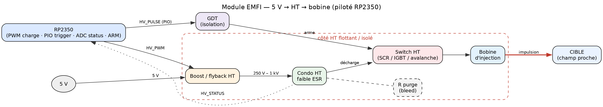
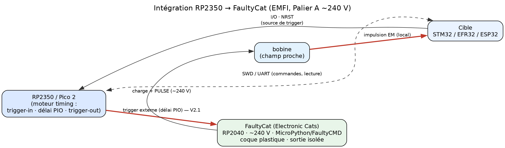

# 06 — Module d'injection EMFI (5 V → 1 kV) piloté par RP2350

> ⚠️ **DANGER HAUTE TENSION — LÉTAL.** Ce module stocke de l'énergie à **250 V à 1 kV**. Un
> condensateur chargé **reste dangereux après coupure de l'alimentation**. Ne jamais toucher le côté
> haute tension sans **décharge active + vérification au multimètre**. Lire la **[section 8
> Sécurité](#8-sécurité--non-négociable)** *avant* de câbler quoi que ce soit. Ne construire le
> palier 1 kV qu'après avoir maîtrisé le palier 250 V.

> **Nature — mixte.** Le corpus `docs_pdf/` inclut désormais **17 papiers EMFI** : **SiliconToaster**
> (injecteur EM 1,2 kV, Ledger Donjon), **Ordas 2015** (modèle de faute EMFI), **Nabhan 2024**
> (mécanisme + capteur), **Beckers 2023** (survey), **Fraunhofer 2022** (*EM-Fault It Yourself*, cité
> en détail en §7), **O'Flynn 2020** — papier + slides, *BAM BAM!! On Reliability of EMFI for
> in-situ Automotive ECU Attacks* (ESCAR EU 2020, détaillé en §1.2) — et les **slides Toldo**
> (hardwear.io USA 2023, détaillé en §1.3) — auxquels s'ajoutent **4 ajouts récents** : **BADFET**
> (Cui & Housley, WOOT'17, EMFI *second-order*, §1.4), **Faults in Our Bus** (NDSS 2024, fautes de bus
> système, §1.5), **Moro 2013** (modèle de faute EMFI sur MCU 32 bits Cortex-M, §1.6) et
> **Trouchkine 2021** (modèles micro-architecturaux sur SoC 1,2 GHz, §7), **+ 4 minés dans la
> bibliographie de la thèse Werner** : **Rivière** (EMFI cache d'instruction ARMv7-M, HOST'15),
> **Proy** (EMFI superscalaire au niveau ISA, arXiv'19), **Maldini** (recherche de paramètres EMFI par
> algorithme génétique, 2019) et **Madau** (critère de susceptibilité EMFI / localisation de hotspots,
> CARDIS'17 ⚠️ fourni par l'utilisateur). Ils sont cités **`[corpus]`** — détail par papier dans
> [`04`](04_REFERENCES.md) §E (ces 4-là ne sont pas développés dans le corps de `06`, seulement comptés).
> Le reste — PicoEMP, ChipShouter, et **4 talks vidéo** (Hackfest LeClair 2026, RECESSIM ×2, Toldo/
> hardwear.io 2023 — voir §1.2, §1.3, §2.1, §9) — est **`[ref]`** (sources publiques web, sous-titres
> auto-générés uniquement) ; les choix d'ingénierie sont **`[reco]`**.
> ★ **Deux étiquettes s'ajoutent depuis la campagne de banc de septembre 2026** :
> **`[fait]`** = mesuré sur un banc réel (date + journal cités — §1.8) · **`[fw]`** = lu dans le code
> source d'un firmware (fichier + ligne — §5.2). Les artefacts correspondants vivent dans l'archive
> `tplink_tapo-20260909.tgz`, **hors de ce dépôt**. Aucun paramètre chiffré n'est
> inventé : ce qui n'est pas sourcé est marqué **à caractériser** ; ce qui vient d'une transcription
> automatique **non recoupée** est marqué explicitement comme tel plutôt que présenté comme un chiffre
> solide. Liens corpus antérieurs : DATE 2014 (EMFI locale échappe aux détecteurs globaux), SoK 2025
> (coûts).

---

## 1. EMFI vs voltage glitching — pourquoi ajouter ce vecteur

Le reste du projet fait du **voltage glitching par contact** (crowbar sur VDD/VCAP). L'**EMFI**
(*electromagnetic fault injection*) est le vecteur **sans contact** : une **bobine** placée en champ
proche au-dessus du boîtier décharge une **impulsion HT brève**, induisant des **courants transitoires
localisés** dans le silicium → faute (`[ref]` PicoEMP, ChipShouter).

| Critère | Voltage glitch (projet) | EMFI (ce module) |
|---|---|---|
| Contact | oui (rail d'alim) | **non** (champ proche) |
| Spatial | global (tout le die) | **local** (positionnement XY) |
| Détecteurs | vu par les détecteurs *globaux* | **échappe** aux détecteurs globaux (`[corpus]` DATE'14) |
| Coût indicatif | ~50 $ | **< 10 $ (DIY extrême)** → ~133 $ (PicoEMP, vérifié) → 4 k$ (ChipShouter) (`[corpus]` SoK 2025) |
| Nouveauté à maîtriser | timing | **timing + position + énergie** |

> **Plancher de coût observé** `[ref, talk Hackfest LeClair 2026, 03:06–07:15]` : l'orateur démontre un
> injecteur EMFI **à peine plus qu'un allume-gaz piézo de barbecue** (quelques dollars) **+ une
> inductance à noyau ferrite** (quelques dollars), déclenché manuellement, produisant *« de l'ordre du
> kilovolt »* — assez pour perturber des registres CPU. **Chiffre précis non recoupé** (transcription
> automatique) → traité comme démonstration qualitative, pas comme donnée de BOM (§4). Ce banc n'offre
> **ni position répétable ni forme d'impulsion contrôlée** : c'est un seuil de faisabilité, pas un
> point de départ d'ingénierie — le PicoEMP/FaultyCat (~133–240 $, contrôle programmable) reste le
> palier A recommandé du projet (§3, §4, §5.1). Le talk annonce aussi le ChipShouter à **~5 000 $** ;
> le prix exact n'a pas pu être confirmé sur `store.newae.com` au moment de la vérification (page
> injoignable depuis l'environnement de build) — le chiffre **~4 000 $ `[corpus]` SoK 2025** reste la
> référence retenue dans ce document.

> Le **moteur de trigger/timing RP2350** est le **même** que pour le glitcher (PIO : trigger → délai →
> impulsion). Ce qui change est l'**étage de sortie** (générateur HT + bobine) et une **variable
> supplémentaire : la position de la sonde**. La méthodologie de campagne de
> [`03_METHODOLOGIE_CAMPAGNE.md`](03_METHODOLOGIE_CAMPAGNE.md) s'applique, augmentée d'un **balayage
> spatial**.

**Pourquoi « touchless » compte en pratique** `[ref, talk Hackfest LeClair 2026, 04:38–05:41]` : le
voltage glitching impose souvent de retirer les condensateurs de découplage de la carte (cf.
[`05`](05_SCHEMAS_ELECTRONIQUES.md) §8) et, sur du matériel militaire/industriel récupéré, de retirer
un **potting/encapsulation** de protection. L'EMFI, elle, **traverse le potting et l'encapsulation
conforme** — la bobine peut viser le **dessous du PCB** — et son faisceau **étroit** ne perturbe en
principe pas le reste de la carte, contrairement au voltage glitch qui affecte le rail global. C'est
la même distinction *local vs global* déjà posée par Ordas 2015 `[corpus]` (§ ci-dessus), reformulée
ici du point de vue « boîtier fermé, pas d'accès au rail ».

> **Repère de contraste (voltage, pas EMFI)** `[ref, talk Hackfest LeClair 2026, 05:09–05:41]` :
> l'orateur cite en exemple le hack public de Joe Grand sur un portefeuille matériel **Trezor One**
> (récupération de ~2 M$ de cryptomonnaie), qui est un **voltage fault injection** via ChipWhisperer
> exploitant le fait que le PIN et la clé transitaient temporairement en RAM lisible — **vérifié sur
> sources tierces** (VoidStar Security, *Replicant: Reproducing a Fault Injection Attack on the Trezor
> One* ; couverture presse Decrypt/BitDegree). Cité ici pour le contraste pédagogique voltage/EMFI, pas
> comme cas EMFI — voir plutôt §1.1 pour un cas EMFI réel sur SoC.

**Modèle de faute EMFI** `[corpus, Ordas 2015]` : contrairement au voltage/clock glitch (violation de
setup → *set/reset*, cf. [`00`](00_SYNTHESE_CORPUS.md) §3), les fautes EMFI sont des **« sampling
faults »** (perturbation de l'échantillonnage des bascules), produisant **bitset / bitreset / fautes
mono- ou multi-octets** selon la **polarité/orientation** de la sonde, et **localisées** (petite zone
du die → meilleur focus). Nabhan 2024 `[corpus]` raffine le mécanisme : l'EMFI agit par **deux voies**
— couplage au **PDN** (réseau d'alim → voltage glitch) et au **clock tree** (→ glitch d'horloge induit)
— ce qui oriente aussi la conception des détecteurs anti-EMFI.

### 1.1 Cas EMFI réel sur SoC applicatif — Google TV Streamer `[corpus]`

**Preuve que l'EMFI atteint un SoC applicatif haute fréquence** (contraste avec le STM32) : Timmers
(Raelize, Hardwear.io NL 2025 — `docs_pdf/hwio-nl-2025_setresuid-glitching-google-tv-streamer-from-adb-to-root.pdf`)
obtient **adb → root** sur le **Google TV Streamer** (SoC **MediaTek MT8696**, quad-ARM **~1,8 GHz**)
par **glitch EM** (sl. 28-30).

- **Banc** : sonde EMFI commerciale **Keysight/Riscure** + contrôleur **Spider** + **platine XYZ
  motorisée** (balayage spatial) + power-cycle USB — l'effet est **localisé**, on cherche une position
  sensible (sl. 28-31).
- **Faute** : **corruption d'instruction** (1 bit-flip : opérande `add x1`→`add x0`, opcode
  `add`→`adrp`) sur l'appel **`setresuid(0,0,0)`** → retour 0 = root (sl. 34-35, 49-54).
- **Méthodo notable** : **attaque runtime SANS trigger ni délai** (la cible boucle), glitchs aléatoires
  continus ; scan initial ~40 min ; analyse **par cœur** (`taskset`). Limite : **SELinux non contourné**.
- Paramètres EM (tension bobine, diamètre de sonde, distance, polarité) **non communiqués** → **à
  caractériser**.

> ★ **Write-up `[ref]` à connaître — le même bug, par EMFI au lieu du voltage.**
> *Raelize — Espressif ESP32: Bypassing Secure Boot using EMFI*
> (`docs_pdf/writeups/Espressif_ESP32_Raelize_Bypassing-Secure-Boot-using-EMFI.pdf`,
> [`04`](04_REFERENCES.md) §J — **`[ref]`, cité par URL, jamais par page**). Les auteurs
> **reproduisent CVE-2019-15894 par EMFI** là où la publication d'origine utilisait du **voltage** :
> *« we used EM glitches instead of voltage glitches to trigger a **similar hardware vulnerability** »*.
> Sonde **Riscure EM-FI Transient Probe** ; ★ **seule modification de la cible : le retrait du capot
> métallique** du module ESP32-WROOM-32 — rien d'autre, ni dessoudage ni retrait de condensateurs,
> ce qui illustre concrètement l'avantage « touchless » de §1. Paramètres qu'ils désignent comme
> décisifs : **position, puissance, timing**.
> ★★ **Nuance directement applicable au choix d'outillage de ce projet** : ils jugent le résultat
> atteignable *« using low cost (e.g. ChipShouter) or Do-It-Yourself (e.g. **BADFET**) tooling as
> well »*, **mais** — *« this type of tooling may be limiting and is often **not able to sufficiently
> sweep the glitch parameter search space**. Nonetheless… once a FI vulnerability is identified and
> exploited, and therefore the required glitch parameters are known, **low cost tooling may be tuned
> or built to inject a successful glitch** »*. C'est **exactement** la répartition des rôles retenue
> ici : un outil bas coût (FaultyCat, §5.1) **rejoue** des paramètres connus ; il ne **découvre** pas
> efficacement un espace de paramètres inconnu.

> **Autres cas EMFI liés** (via *False Injections*, Dartmouth 2025, sl. 74) : modèles de faute EMFI
> sur **Cortex-M [2014]** et **Cortex-A8 1 GHz [2014]** — `[ref]`, hors corpus. ★ En revanche
> *« Faults in Our Bus »* **[2024]** (casse ARM TrustZone) **est désormais `[corpus]`** et détaillé en
> **§1.5** : ne plus le citer en `[ref]`. Un **EMFI → EL3** sur **Qualcomm IPQ5018** est par ailleurs
> signalé (Hardwear.io USA 2025, `[ref]`, hors corpus).

### 1.2 Cas EMFI réel sur ECU automobile in-situ — O'Flynn `[corpus]`

**Second cas EMFI documenté par un papier du corpus**, et le seul portant sur un **ECU automobile
réel** (contraste avec le SoC grand public du §1.1) : O'Flynn (NewAE/Dalhousie University), *BAM
BAM!! On Reliability of EMFI for in-situ Automotive ECU Attacks*, ESCAR EU 2020 —
`docs_pdf/2020-937.pdf` (papier, 18 p.) et `docs_pdf/On-Reliability-of-EMFI-for-in-situ-Automotive-ECU.pdf`
(slides, 35 p.).

- **Cible** : bootloader **BAM** (*Boot Assist Module*) des microcontrôleurs automobiles PowerPC
  **MPC55xx/56xx** (NXP/Freescale ; variante ST SPC5xx architecturalement proche). Testé sur 4
  environnements : carte SCA NAE-CW308T-MPC5676R, kit de dev MPC5676R, kit de dev **MPC5566**, et un
  **ECU GM réel (référence E41, P/N 12691652)** extrait d'un Chevrolet Silverado/GMC Sierra 2500 HD
  2019 (p. 8-11).
- **Banc** : **ChipSHOUTER** (décharge capacitive) + **ChipWhisperer-Pro** (trigger, offset ajustable
  par pas de **50 ns**) ; tension par défaut **444 V** ; pointe **4 mm**, testée en polarité **CW et
  CCW** (p. 7-8, p. 12).
- **Fenêtre d'injection** : succès quasi constant **0,1–3,5 µs**, plage utile **0,1–5,0 µs**, aucun
  succès validé au-delà de ~5,5 µs (balayage jusqu'à 1000 µs, p. 13). Trigger sur le temps écoulé
  depuis l'écho du dernier caractère du mot de passe transmis.
- **Taxonomie à 6 résultats, regroupés en 5 libellés** (p. 10), plus fine que le scoring
  5-catégories de [`03`](03_METHODOLOGIE_CAMPAGNE.md) §1. Le papier énumère *« six potential
  results »* : ① pas d'effet, mot de passe refusé = **Normal** · ② reset de la cible =
  **Err-Reset** · ③ mot de passe accepté, erreur pendant le téléchargement du code =
  **Err-Protocol** · ④ code téléchargé mais ne démarre pas **et** ⑤ code démarré mais accès flash
  toujours désactivé = **tous deux Err-RunFail** · ⑥ code démarré, mot de passe privé imprimé =
  **Success**. ⚠ **Les auteurs regroupent explicitement ④ et ⑤** — *« we found differentiating
  between (4) and (5) unreliable »* (p. 10) — d'où **six résultats mais cinq libellés distincts** ;
  ne pas chercher une 6ᵉ étiquette, elle n'existe pas. ⚠ **« Normal »
  (~92–98 %) est la catégorie « aucun effet », pas un taux de succès** — le taux de bypass effectif
  (« Success ») est **~1,2–1,9 %** sur les cartes de développement, avec un **outlier à 36,3 %** sur
  le MPC5566DK (mot de passe public) (Table 1, p. 12).
- ★ **Corrobore Ordas 2015 `[corpus]`** (§1 ci-dessus, dépendance à la **polarité** de sonde) par une
  observation empirique sur cible réelle : sur l'**ECU E41**, **0 % de succès avec la pointe 4 mm
  CCW**, mais succès **reproduit** avec la pointe 4 mm **CW** — recherche de position/polarité
  **4-6 heures** avant de trouver la configuration gagnante, contre 1-5 min sur les cartes de dev
  (p. 12, p. 17).
- **Contre-mesure la plus robuste identifiée** : configurer le device **censuré + mot de passe
  public** — dans cette config, **aucun bypass EMFI n'a été obtenu** (p. 14, p. 16). Les séries plus
  récentes (**MPC57xx**, ST **SPC57xx/58xx**) permettent de désactiver le strapping externe du pin de
  boot, rendant l'attaque single-fault présentée inopérante (p. 3, p. 16). Tentative sur la variante
  ST **SPC560B** : **inconclusive** — comparaison du mot de passe déportée vers un périphérique
  matériel, vérifiée seulement en fin de téléchargement → recherche bien plus lente, laissée ouverte
  par les auteurs (p. 16, p. 32-33).
- **Comparaison avec l'état de l'art citée par les auteurs** — O'Flynn **[corpus, `2020-937.pdf`
  p. 3]** rapporte, d'après Wiersma & Pareja : EM glitching sur code applicatif **18–57 %**, **JTAG
  lock bits 0,34 %**, **life cycle 0,00 %** — protections différentes, taux **non directement
  comparables**.

  > ⚠️ **Deux artefacts distincts, à ne pas fusionner.** O'Flynn cite le **papier IEEE FDTC 2017**
  > (8 p., paywallé, **hors corpus**). Ce qui est entré au corpus est le **deck de présentation** des
  > mêmes auteurs (`docs_pdf/2017_FDTC_Safety-not-Security_PW.pdf`, 70 sl., signé **Pareja &
  > Wiersma**, Riscure — sl. 70). Confrontation faite slide par slide (deck quasi intégralement en
  > image, lu en rendu page-image) :
  >
  > | Chiffre | Statut face au deck |
  > |---|---|
  > | **0,34 %** | ✅ **corroboré** — sl. 59, colonne **D2** (PowerPC, ASIL-D), **vecteur EM**, déverrouillage JTAG. Mais le libellé « lock bits » **n'est pas celui du deck** : le deck ne décrit **jamais** le mécanisme de verrouillage. |
  > | **18–57 %** | ❌ **absent du deck** (recherche texte + relecture image des 70 slides). |
  > | **life cycle 0,00 %** | ❌ **absent du deck** — ni les mots, ni la valeur. Le `<0,01 %` de sl. 59 est **une autre ligne et une autre grandeur** : ne pas les fusionner. |
  >
  > **Ces deux chiffres restent donc sourcés via O'Flynn `[corpus, p. 3]`, pas en première main.**
  > Pour les obtenir en première main il faudrait le papier IEEE, non récupérable librement.

- **Chiffres de première main du deck `[corpus]`** (`2017_FDTC_Safety-not-Security_PW.pdf`) — trois
  cibles **anonymisées** `QM` / `D1` / `D2` (aucune référence constructeur n'est donnée), vecteurs lus
  sur les pictogrammes de sl. 38/46/59 : **QM = voltage**, **D1 = voltage + EM**, **D2 = EM**.
  - **Code applicatif, succès moyen** (sl. 46) : **QM 100 %** · **D1 16 %** · **D2 37 %**.
  - **Déverrouillage JTAG** (sl. 59) : **QM 80 %** · **D1 1,3 %** · **D2 0,34 %**.
  - ⚠️ **Ne pas présenter 16 %/37 % comme « la version corrigée » de 18–57 %** : ce sont des
    **moyennes** issues d'un **autre document** ; les deux peuvent coexister.
  - ★ **Efficacité des contre-mesures de sûreté** (sl. 47, sur D1) : **CPU lockstep 90 %** ·
    **FLASH ECC 68 %** · **alarme 25 %** · **OTP ECC 20 %** · **RAM parity 14 %**. Utile bien au-delà
    de l'automobile : c'est un classement `[corpus]` de ce qui résiste réellement à la FI.
  - **Balayage voltage** (sl. 45) : longueur **50 → 350 ns**, tension **−0,6 → −0,2 V**, scoring en
    4 catégories (UU / R / SD / SU).
  - **Méthode de localisation** (sl. 51-58) : firmware **inconnu**, la fenêtre d'injection est trouvée
    par **analyse différentielle de consommation** (traces JTAG déverrouillé vs verrouillé) — le point
    de divergence sur D1 apparaît à **≈ 12 µs**. Méthode transposable telle quelle à une cible fermée.
  - **Recommandations finales** (sl. 66), trois : *Add HW/SW countermeasures* · *Don't reinvent the
    wheel* · ★ ***Don't trust in recovered errors***. Conclusion de la partie caractérisation :
    « **ISO 26262 ≠ Security** » (sl. 48-49).

> **Recoupement vidéo `[ref]`** : la chaîne RECESSIM (*Hacking an Automotive ECU!*, 2025) cite
> explicitement ce papier comme référence de méthode et reproduit l'attaque sur la **même puce
> MPC5566**, mais avec un **PicoEMP (plafond 250 V)** au lieu du ChipSHOUTER (444 V). Fait notable,
> **non recoupé indépendamment** (chiffre oral, ASR) : un succès aurait été obtenu à seulement
> **~60 V** en glitchant via le bus **CAN** plutôt qu'UART. Méthodologie transférable au projet :
> détection d'un glitch réussi **sans firmware de test**, par observation à l'oscilloscope d'une
> dérive du pin `clock-out` du MCU, plutôt que d'écrire un payload embarqué de vérification.

### 1.3 Cas EMFI sur SoC IoT moderne — banc DIY intermédiaire `[corpus]`

Davide Toldo (SEEMOO, TU Darmstadt — hardwear.io USA 2023, *Affordable EMFI Attacks Against Modern
IoT Chips*) documente un banc EMFI **DIY à budget intermédiaire**, entre le PicoEMP et le
ChipShouter pro. Slides au corpus :
`docs_pdf/hwio-usa-2023_affordable-emfi-attacks-against-modern-iot-chips.pdf` (23 p.).

> ⚠ **Provenance de l'identité de la cible — à ne pas sur-attribuer.** Les slides ne nomment
> **jamais** la puce en texte : elles la décrivent comme *« VFI protected IoT chip »*, **secure boot,
> processeur RISC-V mono-cœur, aucune recherche de glitching publiée sur cette version** (p. 15).
> Seule la sérigraphie **« C3 Mini »** de la carte de développement est lisible sur la photo (p. 15).
> L'identification usuelle **Espressif ESP32-C3** est une **inférence** (nom de carte + résumé
> officiel de la conférence) → **`[ref]`, pas `[corpus]`**. Tout le reste de cette section est
> `[corpus]` avec page.

- **Générateur de délai** `[corpus, p. 10]` : FPGA + bitstream open-source *chip.fail* — ★ **le deck
  chip.fail est lui-même entré au corpus** (`docs_pdf/2019_chipfail_deck_RDN.pdf`,
  [`04`](04_REFERENCES.md) §A) : il documente ce banc de première main (Digilent **Cmod A7**, MUX
  **MAX4619**, ≈ **92 $**, timing FPGA **10 ns**), là où Toldo ne fait que le citer.
  (@stacksmashing) ; alternatives citées : **Raspberry Pi Pico** (firmware custom, WIP) ou
  **ChipWhisperer Husky**. Résolution annoncée **400 MHz → pas de 2,5 ns** (p. 6).
- **Pulseur** `[corpus, p. 11]` : trois options nommées — **ChipSHOUTER**, **PicoEMP**,
  **SiliconToaster** (Ledger) — toutes déjà citées dans ce document.
- **Platine de positionnement** `[corpus, p. 9]` : CNC **ou** imprimante 3D, interchangeables via
  G-code, disponibles à très bas coût. ★ Détail utile : les entraînements **vis-écrou ont ~10× plus
  de backlash que les courroies** → privilégier les courroies si le budget le permet.
- **Budget total** `[corpus, p. 21]` : **~200 $** platine XY + **~2000 $** pulseur EMFI + **~100 $**
  générateur de délai. Améliorations suggérées à faible surcoût : imprimante 3D à courroies, reset
  matériel propre, pulseur plus haute tension.
- **Banc de test** `[corpus, p. 15]` : boucle synthétique — GPIO haut → 100 additions → GPIO bas →
  vérification du résultat ; le glitch est injecté au milieu.
- **Résultat** `[corpus, p. 18]` : **« Successful Instruction Skip »** revendiqué. La zone de fautes
  se groupe dans le **coin supérieur gauche** (hypothèse de l'orateur : le CPU), coin par ailleurs
  « protégé » par les détecteurs de brown-out. ⚠ Le succès porte sur la **boucle synthétique**, pas
  sur le secure boot réel.
- **Obstacles de caractérisation** `[corpus, p. 16]` — les trois sont directement transférables :
  ① la toolchain compile vers FreeRTOS avec **détection de brown-out** (non dédiée à l'EMFI) et
  d'autres contrôles de sûreté ; ② la boucle de test était **éliminée par l'optimisation du
  compilateur** — et même sans optimisation, aucun succès → passage en **assembleur inline** ;
  ③ les transferts **UART corrompus par l'injection elle-même** → abandon de l'UART-USB intégré au
  profit d'un UART sur GPIO.
- **Crashes liés à l'horloge** `[corpus, p. 19]` : concentrés dans la zone centre-droite, attribués à
  la proximité d'un oscillateur. Des **die-shots** (nécessitant décapsulation) permettraient une
  cartographie plus précise du SoC.
- **Portée et limites** `[corpus, p. 20-21]` : attaque jugée **avancée, pas encore assez fiable pour
  le terrain** ; les fonctions de sécurité et **les chemins de code qui les vérifient peuvent être
  sautés**. Conclusion : la puce est **sécurisée contre le VFI et les canaux auxiliaires, mais pas
  contre un attaquant sérieux** — écho direct au principe DATE 2014 `[corpus]` (l'EMFI locale échappe
  aux détecteurs globaux).
- **Scoring et outillage** `[corpus, p. 13]` : logiciel custom *EMFIControl* (campagne + visualisation
  des résultats) ; scoring **par position** en 5 catégories — logique quasi identique au scoring 5
  catégories de [`03`](03_METHODOLOGIE_CAMPAGNE.md) §1, labels différents. Ressources publiées :
  `github.com/unixb0y/EMFI-Resources` (p. 23).
- ⚠ **Divergence signalée** : la **transcription ASR** du talk cite oralement le SiliconToaster à
  « 750 V », en désaccord avec le **1,2 kV `[corpus]`** du papier Ledger (§3.1). Chiffre ASR non
  recoupé, **non retenu** — le 1,2 kV du papier reste la référence du projet. Les slides, elles, ne
  donnent aucune tension pour le SiliconToaster.

### 1.4 EMFI *second-order* — BADFET `[corpus]`

Cui & Housley (Red Balloon Security), *BADFET: Defeating Modern Secure Boot Using Second-Order Pulsed
Electromagnetic Fault Injection*, USENIX WOOT'17 — `docs_pdf/woot17-paper-cui.pdf`.
⚠️ **Ce PDF ne porte aucun numéro de page imprimé** : les « p. N » ci-dessous sont l'**index de page
PDF (1–12)** et ne correspondent pas à la pagination des actes.

- ★ **Ce qu'est le « second order »** (p. 3) : au lieu de modéliser la cible comme *un* ordinateur, on
  la modélise comme **une collection de composants synchrones indépendants** reliés par des
  interconnexions (i2c, SPI, **AXI**). Le 1ᵉʳ ordre faute un composant et exploite la faute **dans ce
  composant** ; le 2ⁿᵈ ordre **faute un composant pour exploiter la conséquence chez un autre**.
  Bénéfice revendiqué : **réduire les exigences de résolution spatiale ET temporelle** de l'injecteur.
- **Mise en œuvre** (p. 3-4) : la corruption **non ciblée** de la DRAM crée une *« data-dependent fault
  condition that is normally unreachable »* dans uBoot (**7 conditions** y mènent) ; le working-set du
  bootloader étant en **cache d'instructions**, corrompre le code en RAM est sans effet — c'est la
  **donnée** qui compte. Le CPU est à **~19 mm** de la DRAM, donc *« without significant spatial
  resolution requirement »*.
- **Cible et résultat** (p. 2, p. 4, p. 9) : **Cisco 8861**, SoC **BCM11123** multi-cœur **1 GHz+**,
  DDR3L **D9SFT** 100 MHz. Accès à la CLI uBoot → binaire de 2ᵉ étage → vulnérabilités TrustZone
  (`memcpy` non validé + défaut de vérification de signature, **service TEE 0xE00013**) → **secure boot
  contourné**. ⚠️ La *découverte* de ces vulnérabilités n'a **pas** utilisé l'EMFI mais un **glitch de
  la NAND** (p. 9).
- **Paramètres** (p. 4, p. 6) : **une impulsion de 10 µs à 300 V**, à **4,62 s après le power-cycle**,
  sonde à **3 mm**, au-dessus des puces DRAM. **Répétabilité : 72 succès sur 100 impulsions.**
  Le trigger est un **délai fixe depuis le power-cycle**, pas un trigger sur signal de la cible.
- **Injecteur, pour ~350 $** (p. 3, p. 7) : **280 A @ 300 V** et **54 A @ 1100 V** — le point
  prix/performance le moins cher de la classe kV du corpus (à comparer au SiliconToaster 1,2 kV, §3.1,
  et au pulseur ~2000 $ de Toldo, §1.3). Contrôle par **STM32 embarqué** (timing, tension de charge,
  trigger USB **ou** SMA, **ADC coupant la charge au seuil**) — **deuxième attestation `[corpus]`
  indépendante** du rôle assigné au RP2350 en §2/§5. Stage XYZ = **imprimante 3D pilotée en gcode**.
- ★ **Écueils de conception attestés** (p. 4-5) — ils requalifient des lignes aujourd'hui `[reco]`
  en §4 : un banc de MOSFET bas coût en série avec la sonde **échoue par effet Miller** ; il faut un
  **gate driver opto-isolé** en série avec un driver fort courant, sans quoi **l'EMF émis re-déclenche
  l'impulsion** ; une **diode flyback alignée avec la sonde** est indispensable (sinon le montage se
  détruit) ; résistances **céramique faible inductance « pulse-tolerant »** ; **ne jamais laisser le
  condensateur se décharger entièrement dans les MOSFET** (destruction + latching permanent) ; PCB
  symétrique, **boucle de décharge minimale**, grand plan de masse.
- **Sondes** (p. 5) : **A** = 13 spires de fil émaillé 54 mil · **B** = idem + **noyau ferrite
  Ø 10 × 25 mm** · **C** = 8 spires de fil 25 mil en rectangle **22 × 17 mm** ; toutes en SMA femelle.
  ⚠️ Le papier **ne dit pas** laquelle a servi à l'attaque. Recharge : **4 s** entre impulsions.
- ★ **Ancrage `[corpus]` du « touchless »** (p. 2) — jusqu'ici seulement `[ref]` (talk LeClair, §1) :
  *« Most documented EMFI attacks do not require decapsulation of IC chips nor electrical connection…
  considering the permittivity and magnetic permeability of plastic enclosures… numerous EMFI attacks
  can be leveraged against COTS devices non-invasively and in an air-gapped manner. »*
- ⚠️ **Incohérence interne, non tranchée** : p. 4, le texte injecte *« above the DRAM chips (Location B
  in Figure 7) »* alors que la **Table 2 de la même page** donne **B = Processor** et **A = DRAM**.
- **Non donné** : capacité du banc de condensateurs, énergie par impulsion, références MOSFET / gate
  drivers / inverseur HT, nombre total de tentatives de campagne.

### 1.5 Fautes de **bus système** — Faults in Our Bus `[corpus]`

Mishra, Chakraborty, Mukhopadhyay (IIT Kharagpur), *Faults in Our Bus: Novel Bus Fault Attack to Break
ARM TrustZone*, NDSS 2024 — `docs_pdf/ndss-2024-499_Faults-in-Our-Bus.pdf` (pagination imprimée =
index PDF).

- ★ **Modèle de faute inédit dans le corpus** (p. 1, p. 4-5) : l'impulsion vise **les pistes du bus
  système sur le PCB**, entre processeur et mémoire — pas le die. Pendant un `load`/`store`, elle
  corrompt le **bus de données** *ou* le **bus d'adresses**. Avantage revendiqué : **contourne les
  contre-mesures anti-fautes du processeur** et **évite les fautes mémoire persistantes** (Rowhammer).
- ★ **La longueur de burst sélectionne le bus fauté** (p. 8) : **~20 impulsions → bus de données**,
  **~100 impulsions → bus d'adresses**. C'est un **bouton de contrôle du type de faute**, pas
  seulement de son intensité — directement transposable au balayage de
  [`03`](03_METHODOLOGIE_CAMPAGNE.md) §5.
- **« Register sweeping »** (p. 8) : les fautes de bus de données font passer **un registre 32 bits
  entier de non-nul à `0x0`**. Appliqué au `mov` qui charge le code retour de `verify_signature`
  d'OP-TEE → le `cbnz` ne branche pas → **TA malveillant chargé** (p. 10). **CVE-2022-47549.**
- **Taux mesurés** (p. 8) : bus de données, **10 000 injections → 62 % de données corrompues**, dont
  **27 % de mise à `0x0`** ; bus d'adresses, **31 % de fautes**. Seuls les **16 bits de poids fort**
  sont fautables ; **pas d'asymétrie 1→0 / 0→1**. **~40 injections** suffisent à compromettre
  TrustZone. ⚠️ Ces taux sont **très supérieurs** aux 1–5 % habituels du corpus : ne pas les
  généraliser hors de ces cibles.
- **Banc — une classe d'injecteur absente du projet** (p. 12, p. 17) : **chaîne RF, pas décharge
  capacitive**. Keysight **33500B** → Keysight **81160A** (train de **15 impulsions, 200 MHz, 2 ns,
  −8,13 dBm**) → ampli **Teseq CBA 400M-260** → sonde champ proche **Rigol NFP-3 P3** sur table XYZ,
  **injection par la face arrière**. **Aucune HT, aucun condensateur, aucun IGBT** — et cela faute un
  SoC à **600 MHz+**. À verser en alternative d'architecture face aux paliers A/B/C de §3.
- **Trigger non invasif par analyse de consommation** (p. 10-11) : les multiplications de la
  vérification RSA d'OP-TEE forment un motif reconnaissable ; l'oscilloscope est lu en **VISA** et un
  GPIO lance la chaîne. Le trigger **par GPIO du code** n'a servi qu'au **profilage** ; l'UART a été
  **rejeté** (latences de bufferisation).
- **Cibles** : **OP-TEE et MyTEE**, sur **RPi3 et RPi4**, sans modification de l'attaque (p. 11-12).
- ⚠️ **Divergence interne signalée** : la légende Fig. 6 (p. 17) dit que la sonde faute *« both the
  Broadcom processor… as well as the memory chip »*, alors que §III-D (p. 7) affirme l'inverse — *« the
  processor is beyond the field of influence of our probe »*. Ne pas citer Fig. 6 sur le placement de
  sonde sans signaler ce point.

### 1.6 Modèle de faute EMFI sur MCU 32 bits — Moro 2013 `[corpus]`

Moro, Dehbaoui, Heydemann, Robisson, Encrenaz, *Electromagnetic fault injection: towards a fault model
on a 32-bit microcontroller*, FDTC 2013 — `docs_pdf/1402.6421v1.pdf`. **C'est la cible la plus proche
du STM32 de tout le lot EMFI** : Cortex-M3, Harvard modifié, bus AHB-Lite, Flash + SRAM.

- **Cible** (p. 2) : MCU 32 bits **CMOS 130 nm**, **Cortex-M3 à 56 MHz**, **sans cache**, jeu
  **Thumb-2**, bus **AMBA AHB-Lite**. ⚠️ **La référence exacte du MCU n'est jamais donnée** — ne pas
  inférer un STM32F1 malgré la coïncidence des caractéristiques.
- **Banc** (p. 2) : platine **XYZ motorisée**, générateur d'impulsions **−200 V à +200 V**, fronts
  **2 ns**, largeur **10 à 200 ns** ; antenne de **quelques spires, Ø 1 mm** ; observation par **SWD**.
  Réglages par défaut : **190 V, 10 ns** — soit **moins que la période d'horloge (17 ns)**.
- ★ **Le modèle de faute** (p. 8-9) : le glitch EM est une **faute de timing** sur le **transfert de
  bus depuis la Flash** (`HRDATAI` pour le fetch d'instruction, `HRDATA` pour la donnée). Raison : la
  Flash répond plus lentement que la SRAM, sa valeur arrive **en fin de cycle** — c'est elle le chemin
  critique. **Aucune faute n'a pu être injectée sur un transfert depuis la SRAM** (p. 6).
- **Hiérarchie de vulnérabilité** (p. 6-7) : **loads depuis la Flash ≫ branchements > ALU**. Les
  registres dont l'**encodage contient le plus de 1** fautent le plus (r7 = `111`, et pc) ; **jamais**
  de faute sur r1–r6 ni r8–r14. Remplacement identifié : **`NOP` (`BF00`, poids 7) → `STR r0,[r0,#0]`
  (`6000`, poids 2)**.
- **Seuil et saturation** (Table III, p. 6) : **aucune faute à 172 V**, première faute à **174 V**
  (73 %), **saturation à `0xFFFFFFFF` dès 186 V** (100 %). Tendance générale des fetches de données =
  **set-at-1** : l'attaquant *« rapproche la valeur chargée de la valeur de précharge du bus »*.
  ⚠️ **Cette précharge est propre à chaque fabricant** (les auteurs le disent) → **le sens du set-at-1
  est à re-caractériser sur la cible**, jamais à recopier.
- **Impulsions plus longues = moins de stress** (p. 5) : la f.é.m. induite suit `d(flux)/dt`
  (Faraday) — l'inverse de l'intuition « plus long = plus fort », et l'inverse du régime voltage.
- ★ **Lien avec le projet** (p. 10) : l'EMFI produit ici un effet **équivalent à un glitch de tension
  ou d'horloge**, mais **local** — donc susceptible de *« contourner certaines contre-mesures contre
  les moyens d'injection par timing traditionnels »*. C'est l'argument `[corpus]` le plus direct en
  faveur du module EMFI comme **vecteur de repli** du glitcher.

> ★ **Portée du modèle « sampling faults » d'Ordas 2015, à qualifier.** Ordas reste valide **au niveau
> du die**. Mais le corpus contient désormais **trois** cas EMFI dont le siège de la faute est
> ailleurs : **la DRAM voisine** (BADFET, §1.4), **les pistes de bus du PCB** (Faults in Our Bus, §1.5
> — qui mesure d'ailleurs **aucune asymétrie 1→0 / 0→1**, là où Ordas prédit une dépendance à la
> polarité) et **le transfert de bus Flash** (Moro, §1.6, qui conclut à une **faute de timing** et non
> à un *sampling fault*). Nabhan 2024 `[corpus]` réconcilie partiellement par les **deux voies de
> couplage** (PDN + clock tree). À lire comme une **chronologie de raffinement** (Moro 2013 → Ordas
> 2015 → Nabhan 2024), pas comme une contradiction à trancher.

---

### 1.7 ★ EMFI **sur STM32** — le cas le plus proche de la cible du projet `[corpus]`

Beckers, Kinugawa, Hayashi, Fujimoto, Balasch, Gierlichs, Verbauwhede (imec-COSIC KU Leuven),
*Design Considerations for EM Pulse Fault Injection*, 16 p. —
`docs_pdf/2019_COSIC_Design-Considerations-for-EM-Pulse-FI_B.pdf`.
⚠️ **À ne pas confondre avec `290093.pdf`** (Beckers *et al.*, IEEE TC 2023, §9) : **même auteur
principal, papier différent** — l'un est le survey, celui-ci la **note de conception**.
⚠️ **Venue non imprimée** sur le PDF (version auteur, créée en octobre 2019).

**Pourquoi c'est le cas EMFI le plus important du corpus pour ce projet :** toutes les autres cibles
EMFI sont des SoC applicatifs (§1.1), des ECU PowerPC (§1.2), des SoC IoT (§1.3), des bus de PCB
(§1.5) ou un Cortex-M non identifié (§1.6). Ici la cible est **un STM32, nommé** : *« We target an
**STM32F411** from ST Microelectronics mounted on a **NUCLEO-F411RE** development board »* (p. 12) —
Cortex-M4, **pipeline 3 étages**, 100 MHz — et l'expérience est menée **en non invasif, sans exposer
le die** (p. 13), sur une platine XYZ.

- **Protocole de test, directement réutilisable** (p. 13) : une instruction **`STM` (store multiple)**
  écrivant r0–r9 en mémoire, tous à **`0x55555555`** — motif alterné **choisi pour capter
  indifféremment un bit-set, un bit-reset ou un bit-flip**. Trigger **GPIO**. Balayage sur **100 ns
  par pas de 1 ns**, **100 impulsions par pas**. Le chip est d'abord **scanné entièrement** pour
  trouver une position sensible.
- ★★ **Résultat central — un bouton de réglage que le projet n'avait pas : l'amortissement.**
  À sonde, position, tension et instant **identiques**, seule la résistance `R3` change :
  - **amortissement critique** (`R3 = 10 Ω`) ⇒ on faute **des écritures individuelles**, registre par
    registre — la carte de fautes distingue chaque registre écrit par le `STM` ;
  - **sous-amorti** (`R3 = 1 Ω`) ⇒ les **oscillations harmoniques** qui suivent la première impulsion
    **allongent `t_sensitive`** et **fautent plusieurs instructions simultanément** (p. 13-14).

  **Le facteur d'amortissement fixe donc la sélectivité temporelle de l'injecteur** — indépendamment
  de la largeur commandée. C'est l'équivalent EMFI du *sharping/addition* de Zussa côté voltage
  ([`00`](00_SYNTHESE_CORPUS.md) §4) : ★ **la finesse réelle vient de la réponse du circuit, pas du
  tick du contrôleur**.
- **Mécanisme** (p. 3) : violation des **temps de setup/hold** à l'échantillonnage des bascules —
  cohérent avec Ordas (§1) et Nabhan, et avec le *set/reset* du voltage glitch.
- ⚠️ **Ce que le papier ne donne pas** : aucun **taux de succès** chiffré, aucune tension de bobine
  pour la campagne STM32. Ne pas en dériver de chiffre.

> **Conséquence sur le positionnement du module.** Le vecteur EMFI n'est plus seulement un « repli
> théorique » pour ce projet : **il est attesté `[corpus]` sur la famille exacte visée**, sans
> décapsulation, avec un banc dont le coût d'assemblage est de **≈ 40 €** (§4). Détail de conception
> en **§4.1**.

---

### 1.8 ★ EMFI réussi sur un bootloader LPC1114 — paramètres publiés `[fait]`

> **Nature : `[fait]`**, mesuré sur banc le **2026-10-28**. Journal et scripts dans l'archive
> `tplink_tapo-20260909.tgz` (`raiden-pico/SUCCESS_FOUND.md`,
> `raiden-pico/GLITCH_TEST_RESULTS.md`, `raiden-pico/scripts/adaptive_glitch_explorer.py`).

**Intérêt pour ce projet** : le **LPC1114 / Cortex-M0** est déjà une cible connue du corpus — c'est
l'une des deux plateformes de la cartographie par étage de pipeline de Korak & Höfler
([`00`](00_SYNTHESE_CORPUS.md) §3.5) — et la **protection en lecture de la famille LPC** est le
sujet du deck Gerlinsky `[corpus]`. Voir tomber son bootloader **par EMFI** complète ces deux
entrées par le versant pratique.

**Le résultat** : la commande de sécurité du bootloader renvoie **`0`** au lieu de l'erreur `19`
attendue ⇒ contournement. Paramètres :

| Paramètre | Valeur |
|---|---|
| **Tension de bobine** | **290 V** |
| `PAUSE` (délai après trigger) | **0 cycle** — impulsion immédiate |
| `WIDTH` | **150 cycles = 1,00 µs** |
| **Trigger** | octet **UART `0x0D`** (retour chariot) |
| Résultat sur 10 tirs | **1 succès (10 %)** · 5 crashs (`NO_RESPONSE`) · 4 réponses normales |

⚠⚠ **Deux garde-fous de lecture, sans lesquels ces chiffres induisent en erreur :**

1. ★ **Le vecteur est l'EMFI, pas le voltage glitch.** « 290 V » est une **tension de bobine**,
   **pas une profondeur de creux sur un rail** — confondre les deux rendrait le chiffre absurde.
   Le fichier compagnon est titré *« ChipSHOUTER LPC Glitch Parameter Exploration »* et les scripts
   de banc sont `test_chipshouter_lpc_glitch.py` / `check_chipshouter_voltage.py`.
2. ⚠ **n = 10.** Ce n'est pas un taux de succès établi, c'est un ordre de grandeur sur un
   échantillon minuscule. À ne pas comparer aux 22 % de Fraunhofer (§7) ni aux 72/100 de BADFET
   (§1.4), qui reposent sur des campagnes autrement plus larges.

★★ **Ce qui vaut vraiment le détour : la stratégie de recherche, et elle n'est pas dans
[`03`](03_METHODOLOGIE_CAMPAGNE.md) §5.** Elle attaque l'axe **amplitude par la DESCENTE** :

| Étape | Tension | Observation |
|---|---|---|
| 1. Trouver la fenêtre de crash | **500 V**, `PAUSE` balayé 0→7500 | **100 % de crashs** à `PAUSE = 0` |
| 2. Descendre jusqu'à les faire cesser | 500 → **275 V** par pas de 25 V | 500–300 V : 100 % de crashs · **275 V : 0 %** |
| 3. Remonter finement | 280, 285, **290 V** par pas de 5 V | 280 et 285 V : **rien** · ★ **290 V : 50 % de crashs, 10 % de succès** |

⇒ ★ **Le succès se trouve au BORD de la région de crash, et on l'atteint par le haut.** C'est
exactement la **frontière de décision / zone `CHANGING`** de Carpi *et al.*
([`00`](00_SYNTHESE_CORPUS.md) §5, CARDIS 2013) — mais **exécutée sur l'axe d'amplitude et mesurée
sur matériel**, là où le projet n'en avait qu'une description `[corpus]`. Elle a un avantage
pratique décisif : **la région de crash est facile à trouver** (elle est large et bruyante), alors
que la région de succès est étroite ; partir du crash donne donc un point d'ancrage gratuit.
⚠ La contrepartie est que l'on **traverse une zone à 100 % de crashs** — à ne faire que sur une
cible qu'on accepte de redémarrer sans cesse, et jamais avec un condensateur de découplage qui
transformerait les crashs en brownouts prolongés.

---

## 2. Architecture du module (références : PicoEMP + SiliconToaster)

Deux designs de référence : le **PicoEMP** (NewAE / O'Flynn, `[ref]`, ~250 V, **déjà basé sur un
Pico**, kit vendu **133 $** sur Tindie — vérifié) pour le palier bas, et le **SiliconToaster** (Ledger
Donjon, `[corpus]`, **1,2 kV programmable, USB 5 V, piloté STM32**) pour le palier haut — détaillé en
[§3.1](#31-chaîne-ht-1-kv-concrète--silicontoaster-corpus). Chaîne commune :



```
 5 V ──► [Boost/flyback HT] ──► [Condo HT faible ESR] ──► [Switch HT] ──► [Bobine d'injection]
              ▲ PWM                     │ Status                ▲ Pulse            │
              │                         │                       │            (champ proche)
          RP2350 (charge)          RP2350 (HV monitor)     RP2350 (trigger)   ► CIBLE
```

Principes de sécurité repris du PicoEMP (`[ref]`) :

- **Côté HT flottant/isolé** : aucun chemin électrique entre la sortie sonde et la masse d'entrée.
- **Switching bas-côté via GDT** (*gate drive transformer*) → isolation de la commande du switch.
- Isolation validée par **hipot** (PicoEMP : 1000 V DC, < 1 µA de fuite sur 60 s).

**Contrôle RP2350** (3 signaux, comme le PicoEMP) :

| Signal | GPIO (suggéré) | Rôle |
|---|---|---|
| `HV_PWM` | GP14 | pilote le convertisseur HT (charge du condo) |
| `HV_PULSE` | GP2 (PIO) | déclenche la décharge (impulsion via GDT → switch) — **même GPIO trigger que le glitcher** |
| `HV_STATUS` | GP26 / ADC0 | surveille le niveau HT (feedback, non calibré sur PicoEMP) |
| `ARM` | GP15 | **interlock logiciel** : charge autorisée uniquement si armé |

> Le **SiliconToaster** `[corpus]` implémente exactement ces rôles avec un **STM32F2** : le **rapport
> cyclique PWM** règle la tension de charge, l'**ADC** lit la tension du banc, un **trigger** sur
> activité cible déclenche la décharge. **Le RP2350 remplace le STM32F2 à l'identique.**

> **Énergie** : PicoEMP ~**0,2 W** de sortie, ChipShouter ~**30 W** (`[ref]`). Les cibles dures
> (boîtier épais, IHS, gros découplage — cf. §7 x86) exigent **plus d'énergie** → c'est ce qui motive
> le palier 1 kV. Temps de recharge PicoEMP : **~1 à 4 s** entre impulsions (`[ref]`) — à améliorer si
> multi-glitch requis.

### 2.1 Amélioration matérielle tierce du PicoEMP (RECESSIM) `[ref]`, non affiliée NewAE

La chaîne RECESSIM (*SuperCharging the PicoEMP*, 2026) documente une **modification non officielle**
du PicoEMP stock : le circuit de charge HT interne est **contourné** au profit d'une **alimentation HT
externe programmable** — modèle identifié et recoupé indépendamment : **Bio-Rad PowerPac 3000Xi**
(alimentation de laboratoire d'électrophorèse, 25–3 000 V DC, 400 W, fiche constructeur officielle),
soudée directement aux bornes du condensateur HT de la carte. Le MOSFET et le condensateur d'origine
sont conservés (jugés tenir au-delà de 250 V d'après leur datasheet).

- **Résultat démontré** : **500 V à 1 kHz**, tenu en continu **~24 min avec ventilation active**
  (comparé à ~1 impulsion/s sur PicoEMP stock — gain de débit ×100 à ×1000). Sans ventilation forcée,
  **emballement thermique et destruction du MOSFET** rapportés.
- **Aucune cible réelle n'est attaquée avec ce dispositif modifié** dans cette vidéo — uniquement des
  bancs de mesure (forme d'impulsion à l'oscilloscope, comparée au PicoEMP stock et à un ChipShouter
  de référence).
- **Coût** : PicoEMP (50 $) + alimentation d'occasion (~100–150 $ selon les mentions orales, fourchette
  non recoupée) + accessoires (~50 $) ≈ **150–250 $** — reste très inférieur au ChipShouter (~4 000–
  5 000 $, cf. §9).
- **Garde-fou de sécurité affaibli** : le PicoEMP est conçu sans dissipateur exposé (sécurité
  utilisateur, `[ref]`) ; pousser plus de puissance dans ce boîtier dégrade cette protection d'origine.
  Aucune mise en garde chiffrée supplémentaire (tension létale, temps de décharge) n'est donnée au-delà
  du rappel générique déjà couvert en §8.
- **Non affiliée à NewAE/O'Flynn** : modification tierce, à ne pas confondre avec une évolution
  officielle du produit PicoEMP déjà cité en référence dans ce document (ci-dessus).

---

## 3. Paliers de tension (progressif)

| Palier | Tension | Classe | Switch HT | Cible typique |
|---|---|---|---|---|
| **A** | **~250 V** | **FaultyCat** / PicoEMP (`[ref]`) | prêt à l'emploi (FaultyCat, RP2040 — voir §5.1) ou MOSFET/IGBT bas-côté + GDT (DIY) | MCU/SoC (STM32, EFR32, ESP32) |
| **B** | **~500 V** | ChipShouter 150–500 V (`[ref]`) | IGBT / drive haut-côté | MCU/SoC durcis |
| **C** | **~1 kV** | **SiliconToaster** `[corpus]` | **IGBT 1,2 kV / 40 A** + driver MOSFET + diode (réf. SiliconToaster) ; alt. SCR/avalanche `[ref]` | cibles dures (x86, gros boîtier) |

- **Construire A d'abord.** C'est le design éprouvé, le plus sûr, et suffisant pour les cibles du
  projet. B et C sont des évolutions.
- **Le switch HT est la vraie difficulté du palier C.** Les générateurs 1 kV+ utilisent des **strings
  d'avalanche transistors** ou des **thyristors en mode avalanche** (fronts sub-ns, sorties 1–4 kV)
  (`[ref]`). Alternative plus simple mais plus lente : **IGBT 1200 V** ou **SCR HT**.
- **Condo HT** : tension nominale **> 1,5× la tension de service**, faible ESR (céramique/film HT).
- La montée en tension **augmente linéairement le danger** (énergie `E = ½·C·V²`) → voir §8.

### 3.1 Chaîne HT 1 kV concrète — SiliconToaster `[corpus]`

Design éprouvé (Ledger Donjon, Abdellatif & Hériveaux) : **USB 5 V → 1,2 kV programmable, bas coût**.

- **Génération HT** : transfo élévateur **ratio 200** (primaire commuté par un transistor **Q1 ~5 A à
  ~10 kHz**) → ~200 V, puis **multiplicateur Cockcroft-Walton ×4** → **1,2 kV**, stocké dans un **banc
  de condensateurs** (tous claquage **≥ 1,2 kV**).
- **Tension programmable** : **rapport cyclique PWM** (STM32F2 → **RP2350**) ; ex. **8 ms à 10 kHz →
  1,2 kV**. **ADC** mesure la charge ; **auto-décharge** de sécurité.
- **Switch HT** : **IGBT** (1,2 kV Vce, **40 A pulsé**, 20 V Vge) + **diode de protection** ; **driver
  MOSFET** pour convertir l'impulsion 5 V → **15–20 V** de grille.
- **Sonde** : bobine plate **⌀ 6,6 mm, 9 spires**.
- **Trigger** : sur activité cible (UART). **Faute réelle démontrée dès ~400 V** (bypass d'un mode de
  configuration) — **le 1,2 kV est le plafond, pas le point de fonctionnement**.

> C'est **la référence directe** de ta carte : le RP2350 tient le rôle du STM32F2 (PWM charge, trigger
> IGBT, ADC monitor). Le PicoEMP (`[ref]`) reste pertinent pour le **palier A** (~250 V, flyback).

---

## 4. Nomenclature (BOM) indicative

`[reco]` — familles et points d'achat réels, **références et valeurs à valider** avant commande.

| Fonction | Palier A (~250 V) | Palier C (~1 kV) |
|---|---|---|
| Convertisseur HT | transfo de charge type flash + boost piloté PWM | **transfo ×200 + Cockcroft-Walton ×4** (SiliconToaster `[corpus]`) |
| Condo HT | céramique faible ESR, ~10–25 nF / 400 V | **banc de condos, claquage ≥ 1,2 kV** (SiliconToaster `[corpus]`) |
| **Switch HT** | MOSFET/IGBT + **GDT** (isolation) | **IGBT 1,2 kV / 40 A + driver MOSFET + diode** (SiliconToaster `[corpus]`) |
| Bobine/pointe | ferrite + fil émaillé + SMA (`[ref]`) — pointes DIY, artisanales | **bobine plate ⌀ 6,6 mm, 9 spires** (SiliconToaster `[corpus]`) |
| Résistance de purge | bleed **obligatoire** en parallèle du condo | idem, dimensionnée HT |
| Interface RP2350 | GDT + opto/level-shift, LED HV-present, interlock | idem, isolation renforcée |
| Sécurité | enceinte isolée, connecteurs HT, décharge active | idem + distances de fuite/claquage accrues |
| Reset après crash cible | relais de coupure USB — un glitch peut figer la liaison série cible ; détecter via un timer watchdog logiciel et forcer un power-cycle | idem |
| XY stage (banc, hors carte) | imprimante 3D ou CNC de récupération reconvertie — solution bas coût pour le balayage spatial (§5, §6) avant d'investir dans une platine dédiée | platine XY/XYZ motorisée si cibles dures (§7) |

> **Ordres de grandeur cités par l'orateur, non recoupés indépendamment — à confirmer en sourcing
> avant commande, ne pas les traiter comme des prix fournisseur** `[ref, talk Hackfest LeClair 2026]` :
> pointes EMFI DIY **~3–5 $/pièce** (09:19), relais de coupure USB **~20 $** (10:20). Volontairement
> **omis de la colonne chiffrée** de ce tableau pour ne pas laisser croire à un prix sourcé — seul le
> **PicoEMP à 133 $** (vérifié sur Tindie, §2) et les composants `[corpus]` du SiliconToaster ont un
> chiffre confirmé dans ce document.

### 4.1 ★ Le seul jeu de paramètres de conception `[corpus]` du module — COSIC EM-pulse

Jusqu'ici, **toutes les valeurs de ce tableau étaient `[reco]`** : le corpus donnait des injecteurs
finis (SiliconToaster, BADFET, PicoEMP) mais **aucun raisonnement de dimensionnement**. Beckers
*et al.* (§1.7) comble exactement ce trou — et sur **STM32**.

| Élément | Valeur `[corpus]` | Page |
|---|---|---|
| **Coût d'assemblage total** | **≈ 40 €** | p. 12 |
| **Sonde** | **barreau ferrite Ø 750 µm**, **4 spires**, fil émaillé **150 µm** | p. 12, p. 6 |
| **Matériau de ferrite** | **Fair-Rite « 67 »** — retenu pour la **haute fréquence** *bien qu'il donne la plus faible amplitude* | p. 7 |
| **Condensateur de décharge `C1`** | **1000 pF** (estimé sous **SPICE** pour viser 10 ns) | p. 12 |
| **Résistance d'amortissement `R3`** | **10 Ω** → léger **sur-amortissement** ; **1 Ω** → sous-amorti (cf. §1.7) | p. 12-13 |
| **Largeur d'impulsion** | **10 ns visés** ; **12 ns mesurés** au premier montage, ramenés à 10 ns en **abaissant `C1`** | p. 12 |
| **Commande du MOSFET** | grille **12 V**, `VGS(th)` **3 V** | p. 12 |
| **Limitation de courant** | **`R2 = 0,22 Ω`** en source ⇒ la chute réduit `VGS` et **borne le courant à 40 A**, sans circuit de mesure | p. 12 |
| **Cadence maximale d'impulsions** | ≈ `4·R1·(C1 + C_parasite)` — `R1` dépend du courant que peut fournir l'alimentation | p. 14 |
| **Implantation PCB** | ★ *« the **high current RLC loop** should be kept **as small as possible** »* ; éviter couplages et points chauds | p. 12 |

**Relations de conception à connaître avant de bobiner une sonde** (p. 8) :

- **plus de spires** ⇒ inductance en **N²** ⇒ **amplitude ↓** et **largeur ↑** ; le champ, lui, ne
  croît que **linéairement** — il ne compense donc que partiellement ;
- **diamètre de noyau ↑** ⇒ **amplitude ↓** ;
- ⇒ **une petite sonde à peu de spires donne l'impulsion la plus courte et la plus intense**, ce qui
  recoupe l'heuristique « petite pointe = résolution fine » de §6, désormais **sourcée**.

★ **Méthode de caractérisation de sonde, transposable telle quelle** (p. 6) : mesurer la réponse
au-dessus d'une **ligne microstrip 50 Ω** (FR-4 **0,3 mm**, cuivre **18 µm**, εr **4,7**, largeur
**0,532 mm**), balayée au **pas de 15 µm**. Elle donne **à la fois** la résolution **spatiale** et la
forme **temporelle** — *« an alternative method is to use loop antennas, but these **cannot capture
the spatial resolution** of the probe »*. À faire **avant** toute campagne sur cible réelle, et à
refaire à chaque nouvelle pointe (§6).

> ⚠️ **Ce que ce papier ne remplace pas** : il travaille en **décharge capacitive basse tension**
> (l'étage de caractérisation utilise un **tube à décharge gazeuse** de claquage **370 V**, condensateur
> chargé à **400 V**, p. 5-6) — il **ne dimensionne pas** un étage **1 kV** (Palier C, §3.1, qui reste
> le SiliconToaster) ni ne discute les écueils de gate driver relevés par BADFET (§1.4).

> Alternatives **prêtes à l'emploi** avant DIY : le **FaultyCat** (Electronic Cats, `[ref]` — RP2040,
> ~240 V, USB-C, firmware **v3** C/PIO + host **faultycat-TUI**) — **outil Palier A retenu pour ce
> projet** (voir **§5.1**) —
> ou le **PicoEMP** (kit/PCB open-source, `[ref]`). Recommandés pour un premier banc ; le palier C
> 1 kV (SiliconToaster) reste à construire pour les cibles dures.

---

## 5. Intégration RP2350 (réutilise le moteur du glitcher)

- **Trigger/timing** : identique au glitcher — `trigger (I/O cible / NRST) → délai (PIO) → HV_PULSE`.
  Le PIO donne un délai déterministe ; l'impulsion `HV_PULSE` traverse le **GDT** et arme le switch HT
  qui décharge le condo dans la bobine.
- **Charge / arm / disarm** : `HV_PWM` charge le condo seulement si `ARM` est actif ; `HV_STATUS`
  (ADC) surveille le niveau ; couper `HV_PWM` + purge = **disarm**.
- **Balayage spatial (nouveau)** : l'EMFI étant *locale*, prévoir un **balayage XY** de la position de
  la sonde (manuel, ou platine XY motorisée pilotée par le RP2350/hôte). Scorer par position **et** par
  (délai, tension) — extension du scoring 5 catégories de
  [`03_METHODOLOGIE_CAMPAGNE.md`](03_METHODOLOGIE_CAMPAGNE.md).
- **Méthodologie de reconnaissance XY** `[ref, talk Hackfest LeClair 2026, 12:27–13:30]` : pour
  cartographier les zones sensibles d'une puce avant de chercher un exploit, la procédure décrite est
  — geler le CPU cible, écrire des valeurs connues en RAM et dans les registres, injecter un pulse à
  une position (X, Y), relire, comparer à la valeur attendue, marquer la position « sans effet »,
  « RAM modifiée » ou « registre modifié ». Répété sur une grille (pas typique **~0,5 à 1 mm**,
  non recoupé indépendamment), cela produit une carte des zones actives **avant** toute tentative
  d'exploitation — approche directement réutilisable pour le firmware RP2350 de contrôle (host Python,
  cf. `03_METHODOLOGIE_CAMPAGNE.md` §5 pour l'équivalent en balayage temporel).
- **Cible de calibration de sonde** `[ref]` : le **NewAE ChipSHOUTER Ballistic Gel (CW521)** — vérifié
  via son dépôt GitHub `newaetech/ChipSHOUTER-ballisticgel` — est une carte à grande puce SRAM conçue
  pour ce même usage : charger un motif connu, injecter, relire, et **visualiser spatialement** la zone
  de bits retournés. Utile pour caractériser une nouvelle pointe EMFI (§6) avant de viser une cible
  réelle, indépendamment du fournisseur du reste de la chaîne (PicoEMP/FaultyCat/carte custom).
- **Sécurité firmware** : `ARM` bas au boot ; timeout de charge ; purge automatique sur perte de
  liaison hôte ; ne jamais laisser le condo chargé au repos.

### 5.1 Intégration avec un FaultyCat (Electronic Cats) — outil Palier A retenu

Le **FaultyCat** est l'outil EMFI **prêt à l'emploi** choisi pour ce projet : dérivé open-source du
PicoEMP, **RP2040**, **~240 V**, alim **USB-C** (ou 3× AA), firmware **v3** (réécriture **C/PIO**)
piloté par le host **faultycat-TUI** (ex-FaultyCMD, MicroPython v2.x), **coque plastique** de sécurité
et **sortie isolée** (`[ref]`, Electronic Cats).



**Deux modes d'usage :**
- **Autonome** : son RP2040 gère charge / `ARM` / `PULSE` **et, en firmware v3, le timing lui-même**
  — délai programmable balayable sur trigger externe + mode **Campaign** (voir §5.2 pour le détail).
- **Piloté par le RP2350** (carte custom du projet) : le RP2350 fait le **timing** — `trigger` sur
  activité cible → **délai PIO** → impulsion vers l'**entrée trigger externe** du FaultyCat, qui
  délivre l'impulsion EM. En parallèle, le RP2350 dialogue avec la cible en **SWD/UART** (commandes,
  lecture du résultat). → **Prendre la V2.1** (broches de trigger externe + référence de tension).

> **⚠ Mise à jour firmware v3 (vérifiée sur source primaire).** Le FaultyCat v3 possède désormais son
> propre `trigger → délai → pulse` (délai balayable), donc **un RP2350 séparé n'est plus requis pour
> le timing**. Un simple outil de support (alim + reset + comms) suffit à côté : voir le banc
> **Bus Pirate 5 + FaultyCat** en **§5.2**.

**Ce qui transfère du reste du projet** : le moteur trigger/timing (§5), la méthodologie de campagne
([`03`](03_METHODOLOGIE_CAMPAGNE.md)) augmentée du **balayage spatial** de la sonde (§6).

> ⚠️ **Plafond ~240 V = Palier A.** Le FaultyCat est idéal pour les **MCU/SoC** (STM32, EFR32, ESP32)
> mais **n'atteint pas** le ~1 kV nécessaire aux cibles dures (**x86/NUC** : IHS, gros découplage,
> cf. §7). Pour celles-ci, construire le **Palier C** (SiliconToaster, §3.1).

### 5.2 Banc « Bus Pirate 5 + FaultyCat » — support et attaque séparés `[ref]`

Troisième topologie de banc EMFI (à côté des deux modes du §5.1) : un **Bus Pirate 5** assure tout le
**support** (alimentation, power-cycle/reset, comms, monitoring) et un **FaultyCat** assure l'**attaque**
(HT + bobine + **timing du glitch**). **La paire se suffit à deux** — aucun RP2350 séparé n'est requis.

| Fonction | Outil | Détail `[ref]` |
|---|---|---|
| Alimentation cible **1–5 V / 300 mA** | **Bus Pirate 5** | PSU programmable (RP2040) ; `W 3.3` active, `w` coupe, `v` lit V **et** I |
| Power-cycle + reset | **Bus Pirate 5** | `W`/`w` (coupure alim) + une IO GPIO sur **NRST** ; respecter le POR 1,5–4,5 ms |
| Comms cible | **Bus Pirate 5** | UART bootloader (**8E1** supporté : 5–8 bits / parité N-E-O / 1–2 stop), **détection** SWD/JTAG ; 8 IO bufferisées |
| Monitoring | **Bus Pirate 5** | mesure V/I de sortie (`v`) → signature de crash/reset |
| **Trigger → délai → pulse EM** | **FaultyCat v3** | ~240 V ; **délai programmable balayable** après trigger externe |

**Le timing est porté par le FaultyCat, jamais par le Bus Pirate.** Le BP5 est un outil terminal,
**pas un contrôleur temps-réel déterministe** : il ne doit **jamais** être dans le chemin de trigger du
glitch. Le firmware **FaultyCat v3** `[ref]` embarque, lui, le moteur `trigger → délai → pulse` en PIO :
son entrée de trigger externe (**GP8 `TRIGGER_IN`**, seuil réglé par **`TRIGGER_VREF`**, 5 polarités
`ext_rising | ext_falling | ext_pulse_pos | ext_pulse_neg`) déclenche, puis une **boucle de délai
programmable** `delay_us ∈ 0…1 000 000 µs` (granularité **1 µs**, tick PIO **8 ns**) s'écoule **avant**
le pulse. Le **mode Campaign** balaie `--delay START:END:STEP` de façon autonome et journalise les
résultats (ring buffer firmware) → il **implémente directement** le balayage monotone de délai de la
méthodo ([`03`](03_METHODOLOGIE_CAMPAGNE.md) §5, Skorobogatov/Bozzato).

★★ **Le « à caractériser » sur le jitter est levé — à moitié, et la moitié compte** `[fw]`
(`services/glitch_engine/pio_glitch_prog.h`, lu dans le source ; détail en
[`09`](09_BANC_BAT32_FAULTYCAT_RAIDEN.md) §2.2). Le trigger externe **n'est pas une interruption
CPU** : c'est un **`WAIT` PIO**, deux instructions (`WAIT 0 PIN0` / `WAIT 1 PIN0`) au sein d'un
programme qui enchaîne délai et impulsion **sans jamais repasser par le processeur**.

| Grandeur | Statut |
|---|---|
| **Gigue** trigger → impulsion | ✅ **répondue : un tick, soit 8 ns** — c'est la période PIO, et rien d'autre ne s'y ajoute |
| **Latence** (l'offset fixe) | ⚠ **toujours à mesurer** : « quelques dizaines de ns, ordre de grandeur ~50 ns » (synchroniseur d'entrée 2 cycles + quelques instructions), **et le délai de propagation du level-shifter TXS0108EPW n'est pas chiffré** |

⇒ **Ce qui change pratiquement** : le retard est **déterministe et constant**, donc **calibrable
une fois pour toutes** à l'oscilloscope. C'est précisément ce qui autorise à **confier la largeur
au FaultyCat et le délai fin à un contrôleur plus résolu** (6,67 ns côté RP2350) sans perdre en
précision — le partage de rôles du [`09`](09_BANC_BAT32_FAULTYCAT_RAIDEN.md) §1.
⚠ **Ce qui ne change pas** : la valeur de l'offset **n'est publiée nulle part**, et le document
d'origine le dit sans détour — *« le chiffre exact se mesure, il ne se calcule pas »*.

Exemple (host `faultycat-TUI`) :

```
# le FaultyCat s'auto-déclenche sur l'activité cible et balaie le délai lui-même
campaign --engine emfi configure --trigger ext_rising --delay <START:END:STEP> --width <µs> …
```

> Le FaultyCat v3 offre **aussi** un mode **Crowbar** (voltage-glitch, sortie N-MOSFET, `--width-ns`,
> tick 8 ns) et une **entrée analogique de monitoring cible** (GP29/ADC) — recoupe le Palier 1 crowbar
> du projet, mais hors sujet EMFI immédiat.

**Garde-fous de provenance :**
- **Underpowering** : le PSU réglable du BP5 permet un **margining de VDD** vers le brown-out `[reco]`
  → élargit la fenêtre. ⚠️ Ne pas l'assimiler au chiffre **1,0 → 0,93 V** de TCHES, qui porte sur le
  **rail cœur** `[corpus]` (non pilotable de l'extérieur via VDD sur un STM32 à LDO interne) ; le report
  de ce gain sur un VDD externe est **à caractériser**.
- **SWD** : le BP5 fait de la **détection** JTAG/SWD, pas un débogueur complet. Pour lire RAM+registres
  après un downgrade RDP ([`03`](03_METHODOLOGIE_CAMPAGNE.md) §3.2), prévoir un **ST-Link / CMSIS-DAP**
  dédié.

**Cibles atteignables :**
- **F103 — bypass RDP sur `Read Memory` = 1ère cible réaliste** : front UART propre pendant l'échange
  → trigger direct dans le FaultyCat, balayage du délai en Campaign ([`03`](03_METHODOLOGIE_CAMPAGNE.md) §3.1).
- **F373 — downgrade au power-up : atteignable en principe, jamais via le BP5.** Le FaultyCat déclenche
  en **`ext_rising` sur NRST** (seuil `TRIGGER_VREF`) et applique lui-même les **~11 µs** ; le délai
  étant mesuré depuis le **vrai front NRST**, la dispersion du POR (1,5–4,5 ms) est sans effet. Le BP5
  ne fait que le power-cycle (sa boucle de mesure est trop lente pour trigger ici). **À caractériser** :
  propreté du front NRST (pull-up ~40 kΩ = montée lente, cf. [`05`](05_SCHEMAS_ELECTRONIQUES.md) §5 — un
  comparateur ou un `TRIGGER_VREF` bas peut aider) et répétabilité du power-up.

**Réalités de banc :**
- **Couplage EM dans le harnais BP5** : alim + jusqu'à 8 IO courent vers une cible frappée par ~240 V →
  attendre des **octets UART corrompus, des resets du BP5, un déclenchement du fuse numérique** ; la
  mesure de courant est inutilisable *pendant* le pulse. Parades : **fils courts torsadés, ferrite**, et
  **compter les erreurs de comms BP5 comme une catégorie de score** (crash/reset), pas comme un bug.
- **Masse commune** : le BP5 fournit alim+GND+comms ; la **bobine HT du FaultyCat reste isolée/sans
  contact**. La référence de trigger externe (V2.1, via `TRIGGER_VREF`) partage la masse logique
  BP5/cible ; le côté HT reste flottant.
- **Cadence** : F103 ≈ 9 000 glitchs ([`00`](00_SYNTHESE_CORPUS.md)). Piloté via la CLI terminal du BP5
  (rampe PSU + attentes POR), compter **~1 s/itération ≈ 2,5 h** là où un pilote dédié ferait ~15 min :
  c'est le coût d'utiliser un outil terminal comme pilote de campagne.

**Boucle d'orchestration** (script hôte, 2 USB) : `BP5 power-cycle → attendre POR → BP5 envoie la
commande cible → FaultyCat s'auto-déclenche + balaie le délai → pulse → BP5 lit ACK/NACK + courant →
scoring 5 catégories → répéter`, augmentée du **balayage spatial** de la sonde (§6).

> **Prendre un FaultyCat V2.1+** (broches de trigger externe + `TRIGGER_VREF`) et un **Bus Pirate 5**
> (specs et commandes `[ref]` — voir §9). Plafond ~240 V = **Palier A**, MCU/SoC uniquement (le BP5
> plafonne à 300 mA) : pour l'x86/NUC, cf. §7 et le Palier C.

---

## 6. Bobine / pointe d'injection

- Construction PicoEMP/ChipShouter (`[ref]`) : **noyau ferrite**, **fil émaillé** (magnet wire),
  connecteur **SMA** ; quelques spires → faible inductance pour un front rapide.
- **Taille** : pointes fines (**1 mm**) pour la résolution spatiale, larges (**4 mm**) pour l'énergie
  (ChipShouter fournit les deux). **Polarité CW/CCW** change le signe du champ → tester les deux.
- **Distance** : le plus proche possible du boîtier ; sur cible à couvercle métallique (IHS, cf. §7),
  la distance au die augmente → il faut plus d'énergie ou un *delidding*.
- **Retour d'expérience DIY** `[ref, talk Hackfest LeClair 2026, 09:19–09:50]` : pointes fabriquées
  soi-même (**~3–5 $/pièce**, pas de fournisseur dédié identifié par l'orateur), **polarisées** selon
  leur câblage — ce qui recoupe directement le modèle de faute EMFI polarité-dépendant d'Ordas 2015
  `[corpus]` (§1). Confirme, sans ajouter de chiffre nouveau, la logique **petite pointe = résolution
  spatiale fine ; grande pointe = « Hail Mary » pour valider qu'un banc fonctionne du tout** avant
  d'affiner — utile comme heuristique de mise en route du Palier A.

---

## 7. Faisabilité EMFI sur x86 / premiers NUC Intel

**Question de l'utilisateur : est-ce faisable sur un x86 Intel (1ᵉʳˢ NUC) ?**

**Réponse : oui, l'EMFI sur x86 desktop est démontré en recherche — mais c'est une cible avancée, pas
du plug-and-play.**

Ce qui est établi :

- **Fraunhofer — *EM-Fault It Yourself* `[corpus]`** (Kühnapfel *et al.*, PAINE 2022,
  `docs_pdf/2209.09835v1.pdf`) : banc EMFI **réplicable** pour matériel **desktop/serveur** ; résultat
  phare = **premier EMFI rapporté contre un CPU desktop AMD** (Ryzen 5 2600 / Zen+) — bypass de la
  vérification de signature de l'**AMD root key** par l'AMD-SP (p. 1, p. 6), succès **jusqu'à ~22 %**
  (Table I, p. 6). Enseignements transférables : **underpowering aide l'EMFI** (VSoC **0,9 → 0,59 V**,
  p. 5) et **trigger matériel obligatoire** pour éviter le délai du trigger logiciel (p. 2, p. 4). Banc
  ChipShouter **500 V**, stage XYZ **2,5 µm**, **délidage** (capot indium à 200 °C, p. 4), coût
  ~**6905 €** (Table II, p. 6). Cible aussi ARM/RISC-V.
- **Trouchkine *et al.* — *Electromagnetic fault injection against a complex CPU, toward new
  micro-architectural fault models*, JCEN 2021 `[corpus]`**
  (`docs_pdf/hal-03175704_Trouchkine_EMFI-complex-CPU.pdf`).
  > ⚠️ **Correction d'une erreur de ce document.** Une version antérieure de cette section affirmait
  > que ce papier réussissait une EMFI « contre un **Intel Core i3** sous Linux ». **Les deux points
  > sont faux**, vérifié à la source : la cible est le **BCM2837** (Raspberry Pi 3 B, quad
  > Cortex-A53 **1,2 GHz**, 28 nm, p. 3), et le code s'exécute **bare-metal, sans aucun OS**
  > (p. 3-4) — c'est l'argument méthodologique central du papier, qui reproche justement aux
  > travaux antérieurs de mesurer sous OS. Le seul Intel du papier (**E5-1620 v3**, p. 12) est le
  > **poste d'analyse**, pas une cible. Le cas **x86 / Core i3** est un **autre travail des mêmes
  > auteurs** — *Fault Injection Characterization on Modern CPUs* (WISTP 2019), **hors corpus →
  > `[ref]`** — à citer séparément si l'on veut étayer le x86.

  Apport réel : **quatre modèles de faute micro-architecturaux**, tous prouvés par débogue JTAG —
  faute **persistante en cache L1I** (« *sticky instruction skip* » : l'instruction reste fautée
  jusqu'à `ic iallu`, p. 7), **corruption du mapping MMU** (pages remappées sur `0x0` ou décalées,
  invalider le TLB n'y change rien → c'est la config MMU elle-même, p. 8-9), **décalage de blocs de
  16 B en L2** (= la largeur du bus mémoire externe, p. 11), et **faute persistante en L1D exploitée
  par PFA** sur AES (une seule injection puis 10 000 chiffrements → clé ramenée de 2¹²⁸ à **2²⁴**
  hypothèses, p. 11-13). Banc : générateur **Keysight 33509B/81160A**, ampli **Milmega 80RF1000-175**
  (80 MHz–1 GHz), sonde **Langer RF U 5-2** posée **sur le boîtier**, **275 MHz**, **−14 dBm**,
  point sensible X=4 / Y=4,5 mm sur une carte 14×14 mm (p. 5).
  ★ **Aucun taux de succès n'est publié** — « we are not able to measure the fault ratio » (p. 5) :
  ne pas en dériver un chiffre, ni le comparer aux ~22 % de Fraunhofer.

> ⚠️ **Conséquence sur le dossier x86 de cette section** : après cette correction,
> **Fraunhofer 2022 (Ryzen 5 2600) reste la SEULE preuve `[corpus]` d'EMFI sur CPU desktop.**
> Trouchkine étaye désormais l'**ARM haute fréquence** (1,2 GHz), pas le x86. Le verdict ci-dessous
> tient, son étai est plus mince d'un cran.

Ce que Trouchkine apporte quand même au dossier « cible complexe » :

- **Pas de délidage requis** (p. 2, p. 5) : sonde commerciale **sur le boîtier**, « without chip
  alteration » — borne basse de préparation, à opposer au délidage de Fraunhofer.
- **1,2 GHz est atteignable** avec un banc conçu pour « operate at higher frequencies than most
  setups targeting microcontrollers » (p. 5) — tempère l'obstacle « horloge » ci-dessous.
- ★ **Le vrai obstacle temporel est le jitter de cache miss, pas la fréquence brute** (p. 6).
- ★ **Viser les transferts mémoire, pas le pipeline** : sur CPU complexe le skip d'instruction
  direct **échoue** (p. 7 §4.1) ; les fautes atterrissent dans les transferts de cache, **plus lents
  donc à fenêtre plus large** (p. 6) — même conclusion que Raelize ([`03`](03_METHODOLOGIE_CAMPAGNE.md)
  §9.1) par un tout autre chemin.
- **~700 ns de latence trigger → cible** (p. 5) : la routine visée doit durer au moins cela.

> ⚠️ **Ne pas comparer ce banc aux paliers de [§3](#3-paliers-de-tension-progressif).** Trouchkine
> pilote une **chaîne RF continue** (amplitude en **dBm**, ampli 80 MHz–1 GHz), pas une **décharge
> capacitive** : les 250 V / 500 V / 1 kV des paliers A/B/C ne sont pas commensurables avec ses
> −14 dBm.

Pourquoi un **premier NUC** (Ivy Bridge, Core i3/i5) est **dur** :

| Obstacle | Conséquence |
|---|---|
| **IHS** (capot métallique sur le die) | éloigne la bobine du silicium → **plus d'énergie** (palier C) ou *delidding* |
| **Horloge ~1,4–2,3 GHz** | fenêtre de faute très courte → **synchro temporelle** exigeante. ⚠️ Nuance `[corpus]` : Trouchkine faute un cœur à **1,2 GHz sans délidage** (p. 3, p. 5) — la fréquence seule n'est pas rédhibitoire |
| **Jitter de cache miss** `[corpus]` | ★ obstacle **temporel dominant** sur CPU complexe : la durée d'un accès mémoire est imprévisible (Trouchkine p. 6). Parade employée : répéter à paramètres constants, l'instruction fautée variant dans un petit ensemble |
| **Découplage massif + PDN complexe** | absorbe les transitoires → énergie plus élevée |
| **Multi-cœur, pas de trigger simple** | difficile de synchroniser sur l'instruction visée |
| VRM **externe** (pré-FIVR sur Ivy Bridge) | *aide* plutôt le voltage FI que l'EMFI |

**Verdict** : le **module est constructible** et le **palier 1 kV est justement ce qu'il faut** pour
tenter un CPU desktop (énergie). Mais viser le die d'un NUC demande en plus une **platine XY** (champ
proche à cartographier) et une **synchro temporelle** — c'est un banc de niveau recherche.
**Surfaces alternatives souvent plus productives sur un NUC** : la **flash SPI du BIOS**, la **DRAM**
(Rowhammer), les **rails d'alimentation plateforme**, ou le **ME**. **Meilleures premières cibles pour
valider le module : MCU/SoC** (STM32, EFR32, ESP32) — domaine du projet.

### 7.1 Outil de caractérisation côté cible — `mmiotic` `[ref]`

Le point dur de cette section est la **synchronisation temporelle** : Fraunhofer impose un **trigger
matériel** *« pour éviter le délai du trigger logiciel »* `[corpus]`, et Trouchkine chiffre **~700 ns**
de latence trigger → cible en désignant le **jitter de cache miss** comme l'obstacle dominant sur CPU
complexe `[corpus]`. Un outil public adresse précisément la **mesure** de ce jitter :

**`mmiotic`** — *« Latency x-ray for undocumented hardware »*, Christopher Domas, C, 2026 —
https://github.com/xoreaxeaxeax/mmiotic . Il chronomètre **n'importe quelle adresse physique** et
déduit la structure du matériel de la latence observée.

| Fait | Vérifié dans |
|---|---|
| ★ **x86-64 EXCLUSIVEMENT** — `#if defined(__x86_64__)`, avec `#error` explicite sur `__i386__`, `__arm__` et `__aarch64__` ; mesure par `rdtsc`/`rdtscp` | `arch_timing.h` (source) |
| Nécessite **root**, `/dev/mem`, base ECAM lue dans l'ACPI MCFG, parfois `iomem=relaxed` | `README.md` |
| Rapporte **`min` / `max` / `stdev`** par adresse | `README.md`, section *Result lines* |
| ★ **`--find-target <s>`** cherche une adresse dont le temps d'accès **atteint une durée voulue**, en **deux phases** : scan aligné 4 octets retenant les **N meilleurs candidats** (défaut 10), puis **escalade de largeur d'accès** dans l'ordre `4 o non aligné → 8 → 16 (xmm) → 32 (ymm) → 64 (zmm) → 512 (fxrstor)`. `--find-longest` fait la même chose sans sortie anticipée | `scan.c`, fonction `find_target()` |
| Cas mesuré : une lecture 4 octets alignée sur un BAR de Radeon inactif coûte **110 152 cycles** | `README.md` |

★ **Ce que cela apporte au dossier x86 de ce document**, en trois points :

1. **Choisir une latence *stable*, pas seulement longue.** Le `stdev` par adresse est l'élément
   décisif : il dit **laquelle** des latences observées est reproductible — exactement la grandeur
   que le jitter de cache miss dégrade.
2. **Placer un *stall* calibré.** `--find-target` fournit un moyen de **fabriquer un délai
   déterministe de durée choisie** sur la plateforme, utilisable comme repère temporel.
3. **Cartographier le matériel sans datasheet** : sur un GPU sans pilote, la carte de latences
   révèle les domaines d'alimentation via les round-trips SMU.

> ⚠️ **Trois réserves, et la première est structurante.**
> ① ★ **Ce n'est PAS un remplacement du trigger matériel** — l'écrire serait contredire les deux
> sources `[corpus]` citées en tête de section. C'est un **instrument de mesure et de sélection** de
> latence, en amont du trigger.
> ② ★ **Inversion du prérequis** : il tourne **en root sur la cible**, c'est-à-dire l'accès que le
> fault injection cherche justement à obtenir. Son usage réel est donc la **caractérisation d'une
> plateforme qu'on possède déjà** — réplique de banc, carte identique à la cible finale — ce qui est
> précisément le cas de figure du NUC discuté ici.
> ③ ⚠️ **Il trouve aussi des adresses dont la simple lecture redémarre la machine** (section
> *« killer peek »* du README) — classe **déni de service matériel**, hors périmètre FI, mais à
> connaître avant de scanner une plateforme qu'on tient à garder vivante.
> ⚠️ **La frontière x86-64 est formelle** : rien ici ne se transpose aux SoC ARM de §1.1, §1.2 ou
> §1.3 — le fichier ne compile simplement pas ailleurs.

---

## 8. Sécurité — non négociable

À **250 V comme à 1 kV**, l'énergie stockée peut être **létale** et le condo **reste chargé après
coupure**.

1. **Résistance de purge (bleed)** en permanence en parallèle du condensateur ; **décharge active** +
   **vérification au multimètre** avant toute manipulation.
2. **Côté HT flottant/isolé** (comme PicoEMP) ; valider l'isolation par **hipot** (ex. 1000 V DC,
   fuite < 1 µA/60 s, `[ref]`).
3. **Interlock matériel + logiciel** : `ARM` bas par défaut, **LED « HV present »**, capot fermé
   requis pour charger.
4. **Règle une main** ; jamais de sonde/doigt sur le côté HT sous tension ; enceinte isolée,
   distances de fuite/claquage respectées (surtout au palier 1 kV).
5. **`E = ½·C·V²`** : au palier C, recalculer l'énergie et dimensionner purge, connecteurs et
   isolation en conséquence.
6. **Firmware** : purge automatique sur perte de liaison ou timeout ; ne jamais laisser le condo
   chargé au repos.
7. **Attendre avant de manipuler une pointe** `[ref, talk Hackfest LeClair 2026, 06:12–06:43]` :
   certains bancs EMFI génèrent des pointes annoncées à **plus de 100 000 V** (chiffre de l'orateur,
   non recoupé indépendamment — traité comme ordre de grandeur, pas comme spec) ; la charge résiduelle
   persiste **des minutes** après coupure. Règle donnée : **toujours couper, débrancher, attendre
   ~5 minutes avant de changer une pointe**, et **isoler systématiquement la pointe et ses connexions
   sous plusieurs couches de gaine thermorétractable ou de ruban isolant**. L'orateur rapporte s'être
   électrocuté lui-même en saisissant une pointe sans cette précaution — retenu ici comme retour
   d'expérience de première main, pas comme donnée chiffrée fiable.

> Si tu n'es pas à l'aise avec la HT, **reste au palier A (~250 V) et/ou achète un FaultyCat /
> PicoEMP** avant de construire un 1 kV maison.

---

## 9. Références

**Corpus `docs_pdf/` (`[corpus]`)** :
- **SiliconToaster** — Abdellatif & Hériveaux (Ledger Donjon), *SiliconToaster: A Cheap and
  Programmable EM Injector for Extracting Secrets* — `docs_pdf/2020-1115.pdf`.
- **Ordas, Guillaume-Sage, Maurine** — *EM Injection: Fault Model and Locality*, FDTC 2015 —
  `docs_pdf/ordas2015_FDTC.pdf`.
- **Nabhan, Dutertre, Rigaud, Danger, Sauvage** — *EM Fault Injection-Induced Clock Glitches: From
  Mechanism Analysis to Novel Sensor Design*, IOLTS 2024 — `docs_pdf/hal_NAB24_….pdf`.
- **Beckers, Guilley, Maurine, O'Flynn, Picek** — *(Adversarial) Electromagnetic Disturbance in the
  Industry*, IEEE Trans. Computers 72(2), 2023 — `docs_pdf/290093.pdf`.
- **Kühnapfel, Buhren, Jacob, Krachenfels, Werling, Seifert** — *EM-Fault It Yourself: Building a
  Replicable EMFI Setup for Desktop and Server Hardware*, PAINE 2022, arXiv:2209.09835v1 —
  `docs_pdf/2209.09835v1.pdf`.
- **Timmers (Raelize)** — *setresuid(): Glitching Google's TV Streamer from adb to root*,
  Hardwear.io NL 2025 — `docs_pdf/hwio-nl-2025_setresuid-glitching-google-tv-streamer-from-adb-to-root.pdf`
  (cas EMFI pratique → root d'un SoC ARM ~1,8 GHz ; détaillé en §1.1).
- **O'Flynn** — *BAM BAM!! On Reliability of EMFI for in-situ Automotive ECU Attacks*, ESCAR EU 2020 —
  `docs_pdf/2020-937.pdf` (papier, 18 p.) et `docs_pdf/On-Reliability-of-EMFI-for-in-situ-Automotive-ECU.pdf`
  (slides, 35 p.) — cas EMFI in-situ sur ECU automobile réel ; détaillé en §1.2.
- **Toldo** (SEEMOO, TU Darmstadt) — *Affordable EMFI Attacks Against Modern IoT Chips*, hardwear.io
  USA 2023 — `docs_pdf/hwio-usa-2023_affordable-emfi-attacks-against-modern-iot-chips.pdf` (slides,
  23 p.) — banc EMFI DIY intermédiaire sur SoC IoT ; détaillé en §1.3. Source officielle :
  https://hardwear.io/wp-content/uploads/2026/04/affordable-EMFI-attacks-against-modern-IoT-chips_compressed.pdf ·
  archive (2026-08-22) : https://web.archive.org/web/20260822215141/https://hardwear.io/wp-content/uploads/2026/04/affordable-EMFI-attacks-against-modern-IoT-chips_compressed.pdf

- **Cui, Housley** (Red Balloon Security) — *BADFET: Defeating Modern Secure Boot Using Second-Order
  Pulsed Electromagnetic Fault Injection*, USENIX WOOT'17 — `docs_pdf/woot17-paper-cui.pdf`
  (injecteur < 350 $, 300 V / 1100 V ; EMFI *second-order* ; détaillé en §1.4). ⚠️ PDF **sans
  pagination imprimée** : citer l'index de page PDF.
- **Mishra, Chakraborty, Mukhopadhyay** (IIT Kharagpur) — *Faults in Our Bus: Novel Bus Fault Attack to
  Break ARM TrustZone*, NDSS 2024 — `docs_pdf/ndss-2024-499_Faults-in-Our-Bus.pdf` (fautes de **bus
  système** par chaîne RF ; CVE-2022-47549 ; détaillé en §1.5). Source :
  https://www.ndss-symposium.org/wp-content/uploads/2024-499-paper.pdf
- **Moro, Dehbaoui, Heydemann, Robisson, Encrenaz** — *Electromagnetic fault injection: towards a fault
  model on a 32-bit microcontroller*, FDTC 2013 — `docs_pdf/1402.6421v1.pdf` (Cortex-M3 56 MHz ; faute
  de timing sur le transfert de bus **Flash** ; détaillé en §1.6). arXiv : https://arxiv.org/abs/1402.6421
- **Trouchkine, Bukasa, Escouteloup, Lashermes, Bouffard** — *Electromagnetic fault injection against a
  complex CPU, toward new micro-architectural fault models*, JCEN 11(4):353–367, 2021 —
  `docs_pdf/hal-03175704_Trouchkine_EMFI-complex-CPU.pdf` (**BCM2837 / Raspberry Pi 3, bare-metal** —
  ⚠️ **pas** un Intel Core i3 : voir la correction en §7). HAL : https://hal.science/hal-03175704 · archive : https://web.archive.org/web/20260616005352/https://hal.science/hal-03175704
- **Beckers, Kinugawa, Hayashi, Fujimoto, Balasch, Gierlichs, Verbauwhede** (imec-COSIC KU Leuven,
  KOSEN Sendai, NAIST) — *Design Considerations for EM Pulse Fault Injection*, 16 p. —
  `docs_pdf/2019_COSIC_Design-Considerations-for-EM-Pulse-FI_B.pdf` (**seul EMFI sur STM32 du corpus**
  — STM32F411/NUCLEO-F411RE — **et seul papier de conception d'injecteur** : banc ≈ 40 €, sonde
  ferrite Ø 750 µm/4 spires, sélectivité par amortissement ; détaillé en **§1.7** et **§4.1**).
  ⚠️ **Distinct de `290093.pdf`** (même auteur principal, survey IEEE TC 2023). Source :
  https://www.esat.kuleuven.be/cosic/publications/article-3086.pdf
- **Pareja, Wiersma** (Riscure) — *Safety != security: On the resilience of ASIL-D certified
  microcontrollers against fault injection attacks*, **deck** FDTC 2017 (70 sl.) —
  `docs_pdf/2017_FDTC_Safety-not-Security_PW.pdf` (chiffres ASIL-D de première main, §1.2). Source :
  https://fdtc.deib.polimi.it/FDTC17/shared/FDTC%202017%20-%20session%201.2.pdf · archive 2026-10-05 :
  https://web.archive.org/web/20261005001656/https://fdtc.deib.polimi.it/FDTC17/shared/FDTC%202017%20-%20session%201.2.pdf

**Sources publiques (`[ref]`)** :
- **Trouchkine, Bouffard, Clédière** — *Fault Injection Characterization on Modern CPUs — From the ISA
  to the Micro-Architecture*, **WISTP 2019** — **c'est ce travail-là**, et non le JCEN 2021 ci-dessus,
  qui porte sur un **Intel Core i3 (x86)**. **Hors corpus** : à citer `[ref]` pour toute affirmation
  x86 (cf. §7).
- **Raelize — *Espressif ESP32: Bypassing Secure Boot using EMFI*** (`[ref]`) — archivé en PDF dans
  `docs_pdf/writeups/` ; **cité par URL, jamais par page** (pagination = artefact de conversion).
  Voir [`04`](04_REFERENCES.md) §J. Reproduction de **CVE-2019-15894** par EMFI ; sonde Riscure
  EM-FI Transient Probe ; seule modification de la cible = **retrait du capot métallique**.
- **PicoEMP** — dépôt : https://github.com/newaetech/chipshouter-picoemp · article :
  *PicoEMP: A Low-Cost EMFI Platform…*, IACR ePrint **2023/1195**, https://eprint.iacr.org/2023/1195
- **ChipShouter (CW520)** — manuel :
  https://www.mouser.com/datasheet/2/894/ChipSHOUTER_PRESS_1_4-2846503.pdf ·
  doc : https://chipwhisperer.readthedocs.io/en/latest/ChipSHOUTER/ChipSHOUTER.html
- **FaultyCat** (Electronic Cats, `[ref]`) — wiki : https://github.com/ElectronicCats/faultycat/wiki/ ·
  RP2040, ~240 V, coque plastique, sortie isolée, V2.1 trigger externe (firmware/host : voir bullet suivant).
- **FaultyCat v3 — firmware + host** (`[ref]`, sources primaires vérifiées) — firmware :
  https://github.com/ElectronicCats/FaultyCat-Firmware (archive 2026-10-05 : https://web.archive.org/web/20261005001713/https://github.com/ElectronicCats/FaultyCat-Firmware) · host (ex-FaultyCMD) :
  https://github.com/ElectronicCats/faultycat-TUI · **délai programmable `delay_us` 0–1 000 000 µs sur
  trigger externe** (GP8 `TRIGGER_IN`, seuil `TRIGGER_VREF`, 5 polarités), mode **Campaign** (balayage
  délai/largeur, tick PIO 8 ns), mode **Crowbar** (voltage-glitch) en plus de l'EMFI.
- **Bus Pirate 5** (Dangerous Prototypes / SMD Prutser, `[ref]`) — doc : https://docs.buspirate.com (archive : https://web.archive.org/web/20260719165921/https://docs.buspirate.com) ·
  RP2040 ; PSU programmable **1–5 V / 300 mA** (`W`/`w` on/off, `v` lit V et I) ; **8 IO** bufferisées
  avec mesure de tension par pin ; UART (5–8 bits, parité None/Even/Odd, 1–2 stop → **8E1** possible),
  détection SWD/JTAG. → banc de support EMFI, cf. §5.2.
  *(Le JCEN 2021 de Trouchkine* et al. *est désormais `[corpus]` — voir le bloc ci-dessus. L'ancienne
  entrée `[ref]` qui le décrivait comme « Intel Core i3 sous Linux » était erronée : cf. §7.)*
- **Générateurs d'impulsions HT** (1–4 kV, avalanche/thyristor) — Naito, *A high voltage pulse
  generator using avalanche-mode thyristors*, 2021, https://onlinelibrary.wiley.com/doi/10.1002/eej.23327
- **NewAE ChipSHOUTER Ballistic Gel (CW521)** — dépôt (vérifié) :
  https://github.com/newaetech/ChipSHOUTER-ballisticgel — carte cible SRAM pour cartographier
  spatialement l'effet d'une injection ; cf. §5 (calibration de sonde).
- **PhyWhisperer-USB (CW610)** (NewAE, `[ref]`) — boutique :
  https://store.newae.com/phywhisperer-usb/ — outil de triggering/monitoring cycle-accurate sur bus
  USB pour déclencher une injection sur un motif de bus précis (FPGA Xilinx Spartan-7, lib Python) ;
  cité par l'orateur du talk Hackfest ci-dessous comme outil de déclenchement scientifique (§5).
- **Talk Hackfest — John LeClair, *Electromagnetic Fault Injection: Low Cost, Touchless Method of
  manipulating hardware*** (Hackfest Communication, 19 min 44 s, publié 2026-02-19, `[ref]`) —
  https://www.youtube.com/watch?v=zmzEtI_wt_Y . Retour d'expérience praticien sur un banc EMFI
  ultra-bas-coût (allumeur piézo + inductance ferrite), sélection de cible, méthodologie de
  reconnaissance XY, sécurité HT (§1, §5, §6, §8 de ce document). Citations
  `[ref, talk Hackfest LeClair 2026, mm:ss]`. Les diapositives annoncées par l'orateur (lien GitHub
  personnel) n'ont pas été localisées de façon fiable → deux angles évoqués (localisation automatique
  de registres CPU, contournement TrustZone sur tablette) restent thématiques seulement, non détaillés
  en méthode.
- **RECESSIM — *Hacking an Automotive ECU!*** (2025-06-14, 1h21, `[ref]`) —
  https://www.youtube.com/watch?v=0tkdst3JE0g . Reproduction de l'attaque BAM/MPC5566 d'O'Flynn
  (§1.2) au PicoEMP au lieu du ChipSHOUTER ; méthodologie de détection sans firmware de test.
  Citations `[ref, RECESSIM ECU 2025, mm:ss]`.
- **RECESSIM — *SuperCharging the PicoEMP*** (2026-06-07, 1h24, `[ref]`) —
  https://www.youtube.com/watch?v=-WiIupSWss4 . Modification tierce du PicoEMP (§2.1), non affiliée
  NewAE. Citations `[ref, RECESSIM PicoEMP 2026, mm:ss]`.
- **Hardwear.io — Davide Toldo, *Affordable EMFI Attacks Against Modern IoT Chips*** (2023-07-28,
  30 min, `[ref]`) — https://www.youtube.com/watch?v=_Uz4tN-I2D4 . ⚠ **Les slides de ce talk sont
  désormais au corpus** (voir bloc `[corpus]` ci-dessus) : §1.3 se cite **`[corpus, p. N]`**, et la
  vidéo n'est plus citée que pour ce qui n'est **pas** dans les slides (essentiellement le Q&A —
  méthodes de recherche du délai, et la confirmation orale que le succès porte sur la boucle
  synthétique). Citations résiduelles `[ref, Toldo hardwear.io 2023, mm:ss]`.
- **Archivage des 4 talks ci-dessus** : tous en **sous-titres auto-générés uniquement** (aucun
  sous-titre manuel disponible). Sous-titres bruts complets conservés tels quels dans
  `assets/transcripts/*.en-orig.{json3,vtt}` (téléchargement public YouTube via `yt-dlp`, non
  modifiés) ; un `.txt` par talk = **index de faits en paraphrase courte, horodatés** (jamais de
  citation verbatim de l'ASR, jamais la transcription intégrale — représente 3 à 19 % du volume de
  la source selon le talk). L'index couvre les faits techniques exploitables du talk, pas seulement
  ceux effectivement cités dans les docs, pour ne pas perdre la matière extraite. Chiffres/noms
  propres non recoupés indépendamment signalés explicitement comme tels dans le texte, jamais
  présentés comme une donnée solide ; les déformations ASR identifiées sont listées en fin d'index.
  **Chaque talk dispose aussi d'une archive Wayback Machine** (liens dans
  [`04_REFERENCES.md`](04_REFERENCES.md) section H — les write-ups web étant, eux, en section J)
  qui fixe titre/chaîne/date/durée si la vidéo
  disparaît — mais ⚠ **une archive Wayback d'une page YouTube ne conserve ni le flux vidéo ni les
  sous-titres** : l'ancrage réel du contenu reste les fichiers de `assets/transcripts/`. Liste bibliographique complète (avec ces 4
  talks et les 2 autres talks hors périmètre EMFI de ce document) : [`04_REFERENCES.md`](04_REFERENCES.md)
  section H.
- Corpus lié : DATE 2014 (détecteurs, EMFI locale) et SoK 2025 (coûts) — voir
  [`04_REFERENCES.md`](04_REFERENCES.md).

*Voir aussi : [`03_METHODOLOGIE_CAMPAGNE.md`](03_METHODOLOGIE_CAMPAGNE.md) (méthodo commune),
[`02_BOM_MATERIEL.md`](02_BOM_MATERIEL.md) (BOM glitcher), [`00_SYNTHESE_CORPUS.md`](00_SYNTHESE_CORPUS.md)
(taxonomie des mécanismes).*
