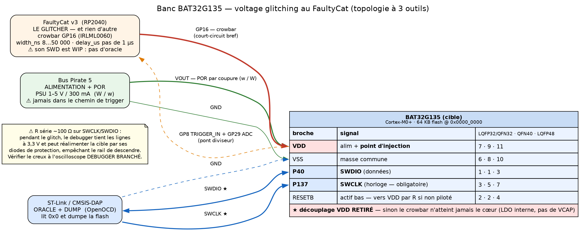
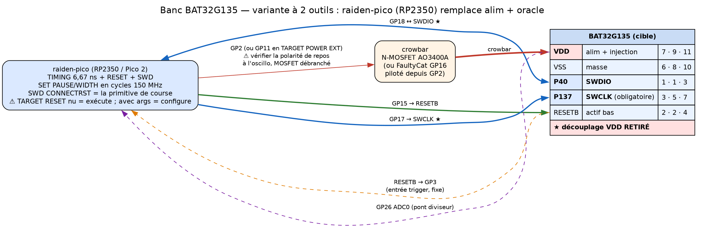

# 07 — Dump de la flash d'un BAT32G135 par voltage glitching (FaultyCat)

> **Objet.** Extraire la flash interne d'un **Cmsemicon BAT32G135** (Cortex-M0+) via **SWD**, en
> levant sa protection en lecture par **injection de faute par la tension**, avec un **FaultyCat**
> (crowbar), éventuellement épaulé d'un **Bus Pirate 5** et du projet **raiden-pico**.
>
> **⚠ Ce document est volontairement AUTONOME.** Il est fait pour être copié tel quel dans une autre
> session / un autre dépôt : tous les faits nécessaires sont **portés en ligne**, avec leur source,
> plutôt que renvoyés vers d'autres fichiers du projet. Aucun lien relatif n'est nécessaire à sa
> compréhension.
>
> **Étiquettes de provenance** (respectées à chaque affirmation) :
> | Étiquette | Signification |
> |---|---|
> | **`[UM]`** | *BAT32G135 用户手册* **V0.11**, 746 p. — **manuel utilisateur officiel Cmsemicon** (cité §/page) |
> | **`[DS]`** | *BAT32G135 Datasheet* **V1.40**, 71 p. — **datasheet officielle Cmsemicon** (cité page) |
> | **`[SVD]`** | Fichier **SVD officiel** Cmsemicon `BAT32G135.svd` (pack CMSIS 0.2.1) |
> | **`[lit]`** | Littérature académique/conférence d'injection de fautes (papier nommé à chaque fois) |
> | **`[ref]`** | Source publique externe (dépôt, blog, page constructeur) — **citée par URL** |
> | **`[reco]`** | **Recommandation d'ingénierie de ma part** — pas une source |
> | **`[fait]`** | ★ **mesuré sur la puce réelle du banc** — date et journal cités |
> | **`[fw]`** | ★ **lu dans le code source** d'un firmware — fichier et ligne cités |
>
> **Règle d'or appliquée ici** : *aucun paramètre de glitch n'est inventé*. Tout ce qui n'est pas
> sourcé est marqué **« à caractériser »**.
>
> ★ **`[fait]` prime sur `[lit]`** : une mesure de première main sur *cette* puce bat un papier
> portant sur une autre. ⚠ Mais **un modèle n'est jamais un `[fait]`**, même recoupé par deux
> solveurs indépendants.
>
> ---
>
> ### 📦 Où vivent les artefacts cités
>
> Ce document cite des **dumps, journaux et scripts qui ne sont PAS dans ce dépôt**. Ils vivent
> dans l'archive **`tplink_tapo-20260909.tgz`** (md5 **`710552fd8478250644d69eb233fddb1e`**,
> 4,99 Mo), sous le préfixe `tplink_tapo_bootloader_dump/`. Tout chemin de la forme
> `assets/bat32_dump_*/`, `src/*.py` ou `raiden-pico/scripts/*.py` s'y rapporte, **jamais à
> `voltage_glitch/`**. Lecture sans extraction :
>
> ```bash
> tar -xzOf tplink_tapo-20260909.tgz tplink_tapo_bootloader_dump/<chemin>
> ```
>
> ⚠ **Le dossier de travail d'origine n'existe plus** : cette archive en est la seule copie.
> Intégrité re-vérifiée : `bat32_code_flash.bin` du 2026-08-31 rend bien
> `md5 = 6f37bd86c41a75c19db65cc5824f7199`, valeur que le §0bis annonce.
>
> ⚠ **Le compte du corpus ne bouge pas.** Rien de ce document n'est un PDF de `docs_pdf/` : les
> apports `[fait]`/`[fw]` sont des mesures de banc et des lectures de code. **Le corpus reste à
> 68 papiers.**
>
> Vérifié le **2026-08-30** ; campagnes `[fait]` des **2026-08-31**, **2026-09-01**, **2026-09-02**,
> **2026-09-06** et **2026-09-07**.

---

## 0bis. ★★★ RÉSULTAT DE CAMPAGNE — 2026-08-31 : **flash dumpée, aucun glitch, aucune course**

> **Nature : `[fait]`** — mesuré sur la puce réelle du banc, pas inféré. C'est le seul bloc de ce
> document qui rapporte des observations matérielles ; **il invalide le postulat de départ pour
> CETTE puce** et doit être lu avant tout le reste.

**La puce du banc n'était pas protégée du tout.** Lu via `SWD OPT` (raiden-pico v0.8+) :

| Registre | Valeur lue | Signification |
|---|---|---|
| `OCDEN` (`0x0000_00C3`) | **`0xFF`** | ≠ `0xC3` ⇒ **Level 0, flash ouverte** (tableau §0.2) |
| `OCDM` (`0x0050_0004`) | `0xFF` | indifférent en Level 0 |
| `BTEN` (`0x0050_0005`) | `1` | boot-swap désactivé ⇒ c'est bien le cluster `0x00C0` qui fait foi |
| `DBGSTOPCR` (`0x4001_B004`) | **`0x0000_0000`** | **`SWDIS = 0`** ⇒ le SWD n'est **jamais** désactivé |
| `DPIDR` | `0x0BC1_1477` | SW-DP ARM Cortex-M0+ |

Les trois verrous du §0.6 étaient **tous ouverts**. Dump obtenu en lecture SWD simple :
64 KB code flash + 1,5 KB data flash + 8 KB SRAM (`assets/bat32_dump_20260831/`, `MD5SUMS` joint ;
code flash `md5=6f37bd86c41a75c19db65cc5824f7199`, confirmé par deux passes indépendantes
identiques). SP `0x2000_0E10` / PC `0x0000_01A9` cohérents, entropie 4,50 bits/octet (code compilé,
ni chiffré ni compressé).

### ★★ Le vrai obstacle était `SWD SPEED 0` — et il imitait parfaitement une puce verrouillée

Pendant toute la campagne, `SWD CONNECT` échouait avec `ACK=0x7` et `SWD RACE` renvoyait `no_dp` sur
**~7000 tirs** de 0 à 8000 µs. Diagnostic apparent : « SWD désactivé, il faut gagner la course ».
**C'était faux.** À `SWD SPEED 0` (vitesse max, aucun délai de bit) l'échantillonnage tombe à côté :

- l'`ACK` lu vaut `0x7` = `0b111`, qui n'est **aucun** des trois codes valides (`OK=1`, `WAIT=2`,
  `FAULT=4`) — signature d'une lecture décalée, pas d'un refus de la cible ;
- le `DPIDR` capturé lors des rares « hits » valait `0x1780_28EF`, soit **exactement un DPIDR ARM
  canonique décalé d'un bit** : `(0x0BC0_1477 << 1) | 1`. Un mot de bruit ne tombe pas par hasard
  sur le décalage d'un DPIDR valide.

À `SWD SPEED 1/2/4/8`, la **même** puce, sur le **même** câblage, se connecte **du premier coup** et
rend `DPIDR=0x0BC1_1477`. ⇒ **`SWD SPEED 0` est inutilisable sur ce banc** (fils volants, pas de
résistances série — cf. §4.4 point 3).

> ⚠ **Piège de méthode à retenir.** Un SWD trop rapide produit exactement les mêmes symptômes qu'un
> SWD verrouillé : pas de DP, ACK invalide, et même un taux de « réussite » de ~1 % qui **ressemble
> à une fenêtre de course** (ici un faux pic à 520 µs, alors qu'à 100/300/900/1400 µs le taux était
> nul — un artefact d'échantillonnage, pas une fenêtre). **Avant de conclure qu'une cible est
> protégée, ralentir l'horloge SWD et relire `DPIDR` : s'il est le décalage binaire d'un DPIDR
> valide, le problème est électrique, pas cryptographique.**

### Ce que ça change pour la suite du document

- **§9 phase 1, §9bis, §9ter.3, §9quinquies (la course `SWD RACE`) sont sans objet pour cette
  puce** — `SWDIS` n'est jamais posé. Ils restent valides *en tant que méthode* pour un exemplaire
  réellement verrouillé, et `SWD RACE` reste implémenté (v0.8+), mais **ce n'est pas ce qui a
  ouvert cette cible**.
- **§6, §9ter.5, §9quater (injection de faute)** : **non nécessaires ici**. Aucun glitch n'a été
  tiré, aucun matériel d'injection n'a été utilisé.
- **§9ter.2 phase 0 devient l'étape décisive** — et il faut y ajouter, **avant tout le reste** :
  `SWD SPEED 4` puis `SWD CONNECT`, puis `SWD OPT`. Si la puce est en Level 0, la campagne s'arrête
  là.
- Le **dump se fait avec `scripts/bat32_dump.py`** (raiden-pico), qui impose une horloge lente,
  place les octets **par adresse** et **relit la flash pour vérifier** — voir §9sexies.

---

## 0. TL;DR opérationnel

> 📎 **Suite matérielle : [`09_BANC_BAT32_FAULTYCAT_RAIDEN.md`](09_BANC_BAT32_FAULTYCAT_RAIDEN.md).**
> Le 09 donne les **câblages concrets** FaultyCat + raiden-pico + T310 (quatre variantes,
> schémas rendus), le budget électrique de la résistance série, et le pont UART du
> FaultyCat. ⚠ Il **corrige** deux raccourcis de ce document-ci : la sortie crowbar est le
> **drain** du MOSFET et non la broche `GP16`, et le trigger externe du FaultyCat est un
> `WAIT` **PIO** — donc déterministe, ce qui permet de confier le délai fin au raiden.

> ⚠ Ce TL;DR décrit le **modèle de menace général** du BAT32G135. Pour la puce réellement testée sur
> ce banc, **lire d'abord le §0bis** : elle était en Level 0, SWD actif, et n'a demandé ni glitch ni
> course.

1. **La cible.** BAT32G135 = Cortex-M0+ 64 MHz, **64 KB de code flash en `0x0000_0000`**, 1,5 KB de
   data flash en `0x0050_0000`, 8 KB de SRAM en `0x2000_0000`. **SWD = `P40` (SWDIO) + `P137`
   (SWCLK)**, reset = `RESETB`. `[DS]` p. 6-9, p. 20 ; `[UM]` p. 6.

2. ★ **Toute la protection tient dans deux octets, et le tableau de vérité est en faveur de
   l'attaquant** `[UM]` §28.3, fig. 28-4, p. 735 :

   | `OCDM` (`0x0050_0004`) | `OCDEN` (`0x0000_00C3`) | Effet |
   |---|---|---|
   | `0x3C` | **`0xC3`** | **Level 2** — aucune opération debugger sur la flash |
   | ≠ `0x3C` | **`0xC3`** | **Level 1** — chip erase seul, lecture/écriture interdites |
   | *(indifférent)* | **≠ `0xC3`** | **Level 0** — lecture / écriture / effacement autorisés |

   ⇒ **`OCDEN` doit valoir *exactement* `0xC3` pour qu'une quelconque protection existe.** Les
   **255 autres valeurs stockées donnent Level 0** — ça, c'est le tableau officiel.
   ⚠ **`[reco]` — l'étape suivante est une inférence, pas une source.** Le tableau décrit la
   **valeur stockée**, pas le comportement d'une **lecture fautée**. En déduire qu'une corruption de
   la lecture de `OCDEN` fait tomber **directement en Level 0** (sans passer par Level 1) suppose que
   la logique matérielle **ne retombe pas sur un défaut *fail-safe* fermé** en cas de lecture
   malformée. C'est plausible et c'est l'hypothèse de travail de ce document — **à confirmer par la
   première campagne**, pas à présenter comme acquis.

3. **La cible du glitch est donc la lecture de `OCDEN`, pas celle de `OCDM`.** Fauter `OCDM` seul ne
   fait que L2→L1, et **L1 interdit toujours la lecture**. C'est la seule erreur de ciblage qui
   coûterait une campagne entière.

4. **La fenêtre** est le **chargement automatique des option bytes à la mise sous tension ou au
   reset** — *« 在接通电源或者复位启动时，自动参照选项字节进行指定功能的设定 »* (« à la mise sous
   tension ou au démarrage par reset, les option bytes sont automatiquement consultés pour appliquer
   les réglages ») `[UM]` §28.1, p. 727.

5. **Une fois en Level 0, le dump est une recette publiée qui fonctionne sur cette famille** — deux
   lignes d'OpenOCD (§7.4). Il n'y a **pas** de support OpenOCD intégré pour le BAT32 : on écrit un
   `.cfg` à la main, et il en existe un public, éprouvé.

6. ⚠ **Il y a TROIS verrous indépendants, pas deux.** En plus de `OCDEN`/`OCDM`, le firmware peut
   poser à l'exécution le bit **`SWDIS`** du registre **`DBGSTOPCR` (`0x4001_B004`, bit 24)** qui
   **désactive purement et simplement l'interface SWD** `[UM]` p. 6, `[SVD]`. Celui-là est un verrou
   *logiciel et tardif* — donc **une course**, pas un glitch (§8.3).

7. ★ **Si ta puce est en Level 2**, va directement au **§9bis** : c'est jouable, et c'est même le
   niveau le plus favorable des trois — il n'y a **qu'un seul octet à fauter**, et **une seule faute
   réussie suffit à vie**. Les **commandes raiden-pico exactes et le script de campagne** sont au
   **§9ter** (raiden-pico) et au **§9quater** (FaultyCat).

8. ⚠ **Commencer sur un échantillon sacrificiel.** Le manuel ne documente **aucun** effacement
   automatique à la connexion du debugger (§2.5) — mais « non documenté » n'est pas « prouvé
   absent », et le Level 1 autorise explicitement le chip erase.

---

## 2bis. ★★★ Level 1 mesuré sur puce — aller ET retour (2026-09-01) `[fait]`

> **Nature : `[fait]`.** La puce du banc a été **délibérément mise en Level 1**, mesurée, puis
> **ramenée en Level 0 avec son firmware restauré au md5 près**
> (`6f37bd86c41a75c19db65cc5824f7199`, identique octet pour octet à la référence du §0bis).
> Cette section remplace plusieurs suppositions du document par des mesures.

### 2bis.1 Ce que fait réellement le Level 1

| Test | Résultat |
|---|---|
| `SWD CONNECT` | ✅ **`DPIDR = 0x0BC1_1477`** — le DP répond |
| `SWD IDCODE` → `CPUID` | ✅ **`0x410CC601`** (Cortex-M0+ r0p1) — l'espace debug/SCS ARM reste lisible |
| `SWD READ 0x0` (code flash) | ❌ **`ACK=0x4` (FAULT)** |
| `SWD READ 0x00500004` (data flash) | ❌ **`ACK=0x4`** |
| Lecture des option bytes | ❌ illisibles |
| Programmation flash (`OCDEN 0xC3→0x83`) | ❌ **refusée** dès le premier octet |
| **Chip erase par SWD** | ✅ **fonctionne** — `OCDEN` revient à `0xFF`, Level 0 retrouvé |

⇒ **Cible « molle » au sens du §8.1** : le port de debug vit, seule la matrice flash est fermée.
⇒ **La table §2.3 est confirmée empiriquement** : « lecture et écriture interdites, chip erase
autorisé » — les trois se vérifient exactement, y compris que le chip erase **est atteignable par
SWD** (le manuel dit « autorisé » sans dire par quel outillage ; c'était une question ouverte).

★ **Piège découvert : le sticky error.** Une lecture flash en FAULT (`ACK=0x4`) verrouille
`STICKYERR` dans `CTRL/STAT`, après quoi **toutes** les transactions AP échouent jusqu'à un
`DP_ABORT`. Sans effacement préalable, une simple lecture de contrôle empoisonne le lien et fait
échouer l'opération suivante pour une raison sans rapport — c'est ce qui a d'abord fait passer un
refus d'écriture pour un défaut de halt.

### 2bis.1bis ★★ La SRAM reste GRANDE OUVERTE au Level 1 — la vraie brèche

Mesuré dans un même run, au même instant (600 µs après la relâche de `nRST`) :

| Cible | Level 1 |
|---|---|
| Flash `0x0000_0000` | ❌ **`FAULT` (ACK=0x4)** |
| **SRAM `0x2000_0008`** | ✅ **`ACK=0x1`, valeur réelle `0xE864F825`** |
| Lecture directe de 64 octets en `0x2000_0000` | ✅ contenu complet, **identique au Level 0** |

⇒ **La protection ne couvre que la flash.** La table §2.3 ne parle en effet que des
« données flash » — c'est désormais vérifié, et ce n'est pas anodin : le code de démarrage C
**recopie la section `.data` depuis la flash vers la SRAM à chaque boot**. Lire la SRAM
restitue donc du contenu **d'origine flash sans jamais lire la flash**.

★ **Et le cœur peut être halté au Level 1** (mesuré : `swd_halt()` réussit une fois le sticky
error effacé). SRAM lisible + cœur contrôlable ⇒ la voie logique suivante est l'**injection
d'un payload en SRAM** exécuté par le cœur, qui lui a le droit de lire la flash puisqu'il
s'exécute dessus. Ce serait un contournement complet du Level 1 **sans aucun glitch** — voir
§2bis.5. Non réalisé à ce jour.

### 2bis.2 `SWD RACE` sous Level 1 — et pourquoi ça ne teste pas la course

`dp_only` **aux six délais testés** (0, 100, 520, 800, 1400, 2000 µs), `SP=PC=0`.
Conforme au modèle du §8.3 : `OCDEN` est la **fenêtre A**, statique, réappliquée à chaque reset —
il n'y a aucune fenêtre temporelle à viser. La course vise la **fenêtre B**
(`DBGSTOPCR.SWDIS`, écrit par le firmware à l'exécution). **Armer `OCDEN` n'éprouve donc pas la
course** ; ce run ne doit pas être présenté comme un test de `SWD RACE`.

**Contre-épreuve avec une séquence 30x plus courte — la fenêtre A est bien imprenable.**
`SWD RACE` refait toute la connexion après le reset (~250 µs avant la première lecture), ce qui
pouvait suffire à manquer une fenêtre étroite. D'où `SWD RACE PERSIST` (v0.12) : on parie que
`nRST` réinitialise le cœur **mais pas le SW-DP**, on pré-arme `CSW`/`TAR` *avant* le reset, et
on ne tire qu'une lecture `DRW` après. **Le pari est gagné** — `ACK=0x1` même à délai 0, le
DP et l'AHB-AP survivent au reset. La première lecture tombe alors quelques µs après le front.

| Délai après relâche `nRST` | Level 0 | Level 1 |
|---|---|---|
| 0 → **440 µs** | `READ_OK`, `0x00000000` | `READ_OK`, `0x00000000` |
| **450 µs** et au-delà | `READ_OK`, **`0x20000E10`** | **`FAULT` (ACK=0x4)** |

Transition franche entre 440 et 450 µs, **9 tirs de chaque côté, aucune dispersion**.
⇒ **Aucun interstice** : la protection se verrouille exactement à l'instant où la mémoire
devient accessible. Raccourcir encore la séquence ne servirait à rien — le problème n'est pas
d'arriver plus tôt, c'est qu'arriver plus tôt ne donne rien.

⚠ **Correction d'interprétation.** Cette fenêtre de zéros n'est **pas** un « réveil de la macro
flash » : la **SRAM rend elle aussi `0x00000000` avant 450 µs**, aux deux niveaux. C'est le
**système entier maintenu en reset** — l'AP de debug survit (d'où `ACK=0x1`), mais le bus AHB
derrière lui ne rend rien. Toute idée de lire quoi que ce soit « avant les 400 µs » est donc
vaine, SRAM comprise.

### 2bis.3 Correction du §7.4 par la source du fondeur

Le driver **officiel Cmsemicon** (`Driver/src/flash.c` du pack CMSIS
`Cmsemicon.BAT32G135.1.0.4.pack`, récupérable sur `mcu.com.cn/pack/`) contredit le §7.4 :

| | §7.4 du document | **Driver fondeur** |
|---|---|---|
| Granularité de programmation | « mot 32 bits » | ★ **octet** — `FLOPMD1/2` réarmés **avant chaque octet** |
| `FLERMD` | `0x8` chip erase | `0x08` ✓ **et `0x10` = sector erase** |
| Après l'opération | — | **`FLERMD=0x00`** puis **`FLPROT=0xF0`** |
| Registres de timing `FL*CNT` | — | **jamais touchés** — les valeurs de reset conviennent |

La granularité **octet** est ce qui permet d'écrire `OCDEN` seul sans toucher aux octets
WDT/LVD/HOCO qui partagent son mot de 32 bits.

### 2bis.4 Recette de l'aller-retour (raiden-pico ≥ v0.11)

```
SWD BAT32 ARM CONFIRM          # OCDEN 0xFF -> 0xC3, effet au prochain reset
TARGET RESET                    # la protection s'applique
...                             # mesures
SWD BAT32 CHIPERASE CONFIRM     # SEULE sortie du Level 1 -- efface la CODE flash
                                # ★ PAS la data flash (mesure 2026-09-02, voir ci-dessous)
SWD BAT32 SECTORERASE <addr> CONFIRM  # seul moyen de blanchir la data flash (secteur 512 o)
SWD BAT32 WRITE <addr> <hex> CONFIRM   # restauration, 256 octets/commande
```

★★ **Correction mesurée le 2026-09-02 : le chip erase ne détruit PAS tout.** Après un
`SWD BAT32 CHIPERASE CONFIRM` réussi, la code flash était uniformément `0xFF` mais
`0x0050_0008` contenait toujours l'enregistrement d'appairage du capteur
(`AA 55 AA 55 "device_id"`), **identique octet pour octet au dump pris avant l'effacement**.
Rediriger l'écriture de déclenchement vers `0x0050_0000` n'y change rien : la data flash est
hors du périmètre de `FLERMD=0x08`. **Conséquence directe : sortir du Level 1 par chip erase
conserve la data flash**, appairage compris. Pour la blanchir il faut le **sector erase**
(`FLERMD=0x10`, exposé depuis v0.13 par `SWD BAT32 SECTORERASE`), trois secteurs de 512 o.

⚠ **Le chip erase détruit la code flash** : ne l'armer qu'avec un dump **vérifié** en main. La restauration
des 64 Ko prend ~70 s à 2500 kHz. `SWD BAT32 DISARM` (reprogrammer `OCDEN`) **ne marche pas** en
Level 1 — vérifié, c'est l'écriture qui est refusée.

### 2bis.5 ~~Voie d'attaque ouverte : payload en SRAM~~ — ⛔ **CLOSE, voir §2ter**

> ⛔⛔ **LIRE LE [§2ter](#2ter--le-2bis5-est-clos--le-payload-sram-ne-passe-pas-2026-09-07-fait)
> AVANT CETTE SECTION.** Elle a été **réfutée sur banc le 2026-09-07** : au Level 1, la lecture
> de la flash **par le cœur** produit une erreur de bus, et le `.data` n'est jamais recopié
> puisque le cœur ne démarre pas. La section est conservée **pour sa méthode et pour la trace
> du raisonnement**, pas comme une voie praticable. Ne pas investir dessus.


Les trois prérequis sont **mesurés, pas supposés** :

1. **SRAM lisible au Level 1** (§2bis.1bis) ;
2. **cœur haltable au Level 1** — `swd_halt()` réussit, une fois le sticky error effacé ;
3. **le cœur, lui, lit la flash** — c'est dessus qu'il s'exécute. La protection vise le
   *debugger*, pas le CPU.

⇒ Recette de principe, entièrement **sans glitch** :

```
1. TARGET RESET, attendre > 450 µs (sortie du reset système)
2. SWD CONNECT, halt du cœur
3. écrire en SRAM un petit payload : boucle qui recopie
   la code flash 0x0000-0xFFFF vers un tampon SRAM
4. positionner PC sur le payload, SP en haut de SRAM, puis relancer
5. re-halter, relire le tampon en SRAM par SWD
6. répéter par tranches (8 Ko de SRAM seulement, donc ~16 passes)
```

**Ce qui reste à vérifier** avant d'y croire : la **SRAM est-elle écrivable** au Level 1
(la lecture l'est, l'écriture n'a pas été testée) ; l'écriture de `PC`/`SP` via `DCRSR`/`DCRDR`
passe-t-elle ; et le cœur accepte-t-il de s'exécuter depuis la SRAM sur cet ARMv6-M.

★ **Mise à jour (v0.13, 2026-09-01) : ces trois points sont vérifiés — mais au Level 0.**
`SWD BAT32 RAMREAD` implémente la recette ci-dessus et a rendu 64 Ko de code flash
identiques au md5 près à ce que lit le debugger : la SRAM **est** écrivable, `DCRSR`/`DCRDR`
**acceptent** l'écriture de `PC`/`SP`, et cet ARMv6-M **exécute** bien depuis la SRAM.
Il ne reste donc qu'**une** inconnue, celle qui décide de tout : le contrôleur flash
distingue-t-il un *fetch du cœur* d'un *accès du debugger* ? C'est la seule chose que le
Level 0 ne peut pas dire.

★ **Banc d'essai (2026-09-06) : `scripts/bat32_l1_ramread_test.py`.** Conduit la séquence
complète dans le bon ordre — oracle de niveau **fonctionnel** (la flash faute, la SRAM
répond ; `SWD OPT` est inutilisable ici, ses option bytes vivent en code flash), **dump SRAM
avant la première passe** (RAMREAD écrase `0x20000000`-`0x2000101F`, donc le `.data` du repli
ci-dessous), puis passe d'essai et comparaison. La cible est **remise en marche en sortant**
(`TARGET RESET`, sur tous les chemins) : ni le halt ni le payload ne doivent lui survivre.

> ★ **Le Level 1 y est exigé, et contrôlé deux fois** — en phase 1, puis à nouveau juste
> avant la passe, parce qu'entre les deux il y a eu un dump SRAM, parfois un armement et un
> reset. Ce n'est pas une précaution, c'est la validité de la mesure : **au Level 0 le
> debugger a déjà le droit de lire la flash**, donc un RAMREAD réussi n'y prouve rien du
> bypass. Sur une puce non protégée le script refuse de tirer ; `--allow-level0` lève le
> refus explicitement, et sert à éprouver le harnais avant d'armer quoi que ce soit. Sa vraie valeur est le **classement des neuf
messages `[BAT32-RAM]`** : `CORE_FAULT` (DFSR bit 3, VCATCH) signifie que le `ldr r3,[r0]` a
fauté sur la flash ⇒ la protection gêne **aussi le cœur** et cette section est close ;
`SRAM_RO`, `NO_DCRSR` et `NO_RESUME` disent que la flash n'a même pas été atteinte ⇒ même
conclusion, cause différente. À ne pas confondre avec `PC_ELSEWHERE` (DFSR bit 1), qui ne
conclut rien. **Non encore lancé au Level 1** : la puce du banc est au Level 0 depuis la
reconstruction du 2026-09-02.

**Repli si l'écriture SRAM est bloquée** : ne rien injecter du tout et se contenter de lire la
SRAM après un boot normal — la section **`.data`**, recopiée depuis la flash à chaque
démarrage, y est déjà. La fuite est plus petite mais ne demande **aucune** écriture.

> ⚠ **Ce repli se prend AVANT le premier RAMREAD, et une seule fois.** Mesuré sur le banc le
> 2026-09-06 : après un RAMREAD suivi d'un `TARGET RESET`, **93 %** seulement de la zone
> `0x2000_0000`-`0x2000_101F` revient à sa valeur d'avant — ~282 octets gardent ce que le
> payload y a laissé (le copieur lui-même n'était réécrit qu'à moitié). Le boot n'initialise
> que ce que `.data`/`.bss` couvrent ; le reste garde la dernière écriture. Autrement dit
> **RAMREAD détruit une partie du repli de façon irréversible** : dumper la SRAM d'abord.

⇒ Si cette voie aboutit, **le Level 1 du BAT32G135 tombe sans injection de faute**, et les
§6/§9ter.5/§9quater deviennent inutiles pour ce niveau. Le **Level 2** resterait à traiter
séparément : le §5.3 y ajoute `DBGSTOPCR.SWDIS`, et rien ne dit que le DP y répond encore
(question ouverte n°2 du §12, tranchée pour L1 seulement).

---

## 2ter. ★★★ Le §2bis.5 est CLOS — le payload SRAM ne passe pas (2026-09-07) `[fait]`

> **Nature : `[fait]`.** Mesuré sur la puce du banc, **après** la rédaction du §2bis. Ce bloc
> **renverse deux conclusions** de la section précédente : lire le §2bis.5 sans lire celle-ci
> conduirait à investir dans une voie morte. Journal :
> `assets/bat32_dump_20260907/bat32_l1_ramread_20260907_001517.log` dans l'archive.

### 2ter.1 Le fait brut : `RAMREAD` au Level 1 finit en `LOCKUP`

Armement propre (`OCDEN : 0xFF → 0xC3`, relu à l'écriture puis **confirmé fonctionnellement deux
fois** — flash `0x0` en `FAULT (ACK=0x4)`, SRAM `0x2000_0008` toujours lisible). Puis :

```
SWD BAT32 RAMREAD 0x0 1024
[BAT32-RAM] payload did not reach BKPT (core LOCKED UP, DHCSR=0x01080001)
```

Décodage de `DHCSR = 0x01080001` :

| bit | nom | valeur | ce que ça dit |
|---|---|---|---|
| 0 | `C_DEBUGEN` | 1 | le debug est activé |
| 17 | `S_HALT` | 0 | il n'est **pas** halté — il est parti en vrille |
| 19 | `S_LOCKUP` | **1** | le cœur est en **LOCKUP** |
| 24 | `S_RETIRE_ST` | **1** | ★ **au moins une instruction a été exécutée** |

★ **`S_RETIRE_ST = 1` écarte d'emblée trois des neuf codes de diagnostic** du §2bis.5 : `SRAM_RO`,
`NO_DCRSR` et `NO_RESUME` supposent tous que le cœur n'a rien exécuté. **Le payload a bien été
reçu et lancé.**

⚠ **La cause suggérée par le script — « vérifier que `SP=0x20002000` tombe dans la SRAM de ce
boîtier » — est écartée empiriquement** : le **même** payload, le **même** SP, sur la **même**
puce, a tourné avec succès **au Level 0 le 2026-09-06** et rendu 4 Ko identiques à ce que lit le
debugger (`bat32_code_flash_4k_via_coeur.bin`). **La seule variable qui a changé est le niveau de
protection.**

### 2ter.2 ★★ La sonde différentielle qui tranche — et qui falsifie l'explication évidente

L'explication naturelle était : *le `ldr` depuis la flash faute → HardFault → mais la table de
vecteurs **et** le handler vivent en code flash, illisible au Level 1 → l'entrée en exception faute
à son tour → escalade en LOCKUP.* **Elle est fausse.**

`src/l1_vtor_probe.py` la teste directement, **entièrement depuis l'hôte, sans recompiler le
firmware** (la CLI expose déjà `SWD WRITE`, `SWD SETREG` via `DCRSR`/`DCRDR`, `SWD RESUME`,
`SWD HALT`). ★ **`VTOR` tient sur ce M0+** : écrit `0x20001800`, relu `0x20001800` — table de
vecteurs, handler de HardFault et pile **placés en SRAM**, les 16 vecteurs pointant sur le handler
SRAM. Plus rien ne va chercher un handler en flash. Résultat :

| Cible lue par le cœur | marqueur | `DHCSR` | Ce que ça isole |
|---|---|---|---|
| SRAM `0x2000_0100` | **LU** | `halt` | contrôle initial — le harnais marche au Level 1 |
| ★ **non mappée `0x6000_0000`** | jamais atteint | **LOCKUP** | **erreur de bus pure**, sans rapport avec la protection |
| code flash `0x0000_0000` | jamais atteint | **LOCKUP** | l'expérience |
| code flash `0x0002_0000` | jamais atteint | **LOCKUP** | au-delà du réseau 64 Ko |
| data flash `0x0050_0000` | jamais atteint | **LOCKUP** | second réseau, gouverné par `OCDM` (= `0xFF`) |
| SRAM `0x2000_0100` | **LU** | `halt` | contre-contrôle **final** — le banc a tenu |

★★ **Ce que le différentiel établit.** Handler en SRAM, ça locke pareil ⇒ l'hypothèse « le fault
escalade parce que le handler est en flash » est **FALSIFIÉE**. L'explication est plus simple :
**ce cœur escalade en LOCKUP sur TOUTE erreur de bus** — l'adresse inexistante le prouve. Le
LOCKUP n'est donc pas un artefact de montage, c'est la **signature d'une erreur de bus**.

⇒ **Au Level 1, la lecture de la flash PAR LE CŒUR produit une erreur de bus**, exactement comme
une adresse qui n'existe pas. **La protection ne vise pas que le debugger.** Le §2bis.5 est **clos**,
et **le crowbar redevient la voie** (§6, §9ter.5, §9quater retrouvent leur utilité).

⚠ **Limite honnête de la méthode.** Puisque ce cœur escalade *toute* erreur de bus en LOCKUP, la
sonde ne peut **pas** distinguer *quelle* erreur. Elle sépare « lecture réussie » (SRAM) de
« lecture en erreur » (tout le reste) — suffisant pour la question posée, mais le code
`CORE_FAULT` (DFSR bit 3, VCATCH) reste **inatteignable sur cette pièce**.

### 2ter.3 ⚠⚠ Le « repli gratuit » du §2bis.5 N'EXISTE PAS sur cette puce

> ⚠ **Une rédaction antérieure annonçait « 104 octets de code flash lisibles au Level 1 sans
> injection », puis « 187 octets, 0,28 % de l'image ». C'ÉTAIT FAUX** — et l'erreur est instructive.
> Les octets trouvés en SRAM étaient un **résidu de l'époque Level 0**, quand le firmware tournait
> encore : la SRAM conserve son contenu jusqu'à `Vramhold = 0,8 V`, **bien en dessous de ce qu'un
> `RESETB` provoque**. Rien n'avait été recopié au Level 1.

**Le test qui tranche** — SRAM badigeonnée de `0xA5A5A5A5`, `TARGET RESET`, une seconde d'attente,
relecture :

| Mesure | Résultat |
|---|---|
| mots encore à `0xA5A5A5A5` | **255 / 256** (le 256ᵉ est une écriture ratée de l'hôte, stall CDC) |
| `DHCSR` après le reset | `0x03080001` → **`S_LOCKUP`**, `S_RETIRE_ST`, `S_RESET_ST` |

⇒ **Au Level 1, sonde attachée, le cœur ne démarre pas.** Il part en LOCKUP dès le reset —
cohérent avec le §2ter.2 : il ne peut pas lire sa table de vecteurs en `0x0000_0000`. **Aucun
`.data` n'est recopié, donc aucune fuite.**

★ **Deux indices l'annonçaient et méritaient d'être suivis plus tôt** : le md5 de la SRAM
**identique** à 50 ms, 300 ms, 1 s et 3 s — *un firmware vivant fait bouger sa pile* — et le fait
que la puce venait de passer des heures au Level 0.

### 2ter.4 ★★ La question que ça ouvre, et qui n'est PAS tranchée

**Comment un T310 vendu en Level 1 démarre-t-il ?** Si le cœur ne pouvait réellement pas lire sa
flash, **aucun capteur de cette famille ne fonctionnerait**. L'hypothèse la plus économique —
**non testée** — est que le verrou est conditionné à la **présence du debugger** : `C_DEBUGEN = 1`,
ou la montée du domaine d'alimentation de debug par `CDBGPWRUPREQ` que provoque `SWD CONNECT`.

Si c'est le cas, **tout le modèle du §2bis mérite d'être nuancé** : la protection ne fermerait pas
la flash au cœur *en général*, mais **tant qu'une sonde est connectée**.

⇒ **Comment le tester, sans aucun tir** : `TARGET RESET` **sans jamais** faire `SWD CONNECT`, puis
observer la **consommation** sur GP26/GP27 — un firmware qui tourne consomme plus qu'un cœur
verrouillé. Une raison de plus de câbler les ADC (phase C du banc). → **question ouverte n°12**.

### 2ter.5 Deux pièges de méthode rencontrés — à ne pas refaire

1. ⚠ **`DFSR` est *write-1-to-clear*, et `SWD WRITE` auto-vérifie.** Écrire `0x1F` puis relire
   `0x00` est **correct**, mais la vérification automatique le rapporte comme un **échec**. D'où un
   helper `w32_w1c()` tolérant — **là et seulement là**. Et sans nettoyage, le `DFSR` d'une passe
   porte les bits de la précédente : mesuré `0x3` partout.
2. ⚠⚠ **Un cœur en LOCKUP le reste.** Sans **reset + reconnexion + réinstallation du payload entre
   chaque passe**, toutes celles qui suivent le premier LOCKUP rapporteraient LOCKUP **quelle que
   soit la cible** — et le différentiel du §2ter.2 n'aurait **rien voulu dire**. C'est aussi
   pourquoi la série est **encadrée par deux contrôles SRAM** : celui de fin prouve que le banc n'a
   pas dérivé en route.

### 2ter.6 Les autres voies, si l'on voulait le code `CORE_FAULT` formel

1. **Vector catch** — poser `DEMCR.VC_HARDERR` (bit 10) pour que le cœur **halte** sur le HardFault
   au lieu d'escalader ; `DFSR` bit 3 donnerait alors le `CORE_FAULT` décisif. ⚠ La question
   ouverte n°10 signale que les bits de `DEMCR` de ce M0+ pourraient ne pas tenir — se vérifie par
   écriture puis relecture.
2. ★ **Relocaliser la table de vecteurs en SRAM par `VTOR`** avec un handler de HardFault **en
   SRAM** qui rapporte *quelle adresse* a fauté. C'est l'expérience propre — le §2ter.2 en fait la
   moitié (il relocalise) sans la seconde (il ne rapporte pas l'adresse).
3. **Rétrécir la sonde** : lire **un seul mot** au lieu de copier 4 Ko, pour réduire le rayon
   d'action.

Les trois demandent une modification du payload, qui vit dans `raiden-pico/src/swd.c`.

### 2ter.7 Retour au Level 0

`SWD BAT32 CHIPERASE CONFIRM`, puis
`bat32_restore.py --image assets/bat32_dump_20260907/bat32_code_flash.bin --confirm`.
L'image est **vérifiée** (`6f37bd86…`) et le chip erase **épargne la data flash**, appairage
compris (§2bis.4).

---

## 1. Fiche de la cible

| Élément | Valeur | Source |
|---|---|---|
| Fabricant | **Cmsemicon** — 中微半导体（深圳）股份有限公司 | `[DS]` p. 1 |
| Cœur | **ARM Cortex-M0+** (avec MPU), **32 kHz → 64 MHz** | `[DS]` p. 2, p. 21 |
| Tension | **1,8 – 5,5 V** ; −40 → +105 °C | `[DS]` p. 2 |
| **Code flash** | **64 KB @ `0x0000_0000`**, **128 secteurs de 512 o** | `[DS]` p. 11, p. 21 ; `[UM]` §29.1 p. 736 |
| **Data flash** | **1,5 KB @ `0x0050_0000`** | `[DS]` p. 11 |
| **SRAM** | **8 KB @ `0x2000_0000`**, avec **parité** | `[DS]` p. 11, p. 21 |
| SFR / périphériques | `0x4000_0000` · cœur `0xE000_0000` | `[DS]` p. 11 |
| Timings flash | prog. mot 32 bits **24–30 µs** · erase secteur **4–5 ms** · **chip erase 20–40 ms** | `[DS]` §6.9.1 p. 65 |
| Endurance / rétention | 100 kcycles / 20 ans | `[DS]` §6.9.1 p. 65 |
| **UID 128 bits** | base **`0x0050_084C`**, lecture seule, programmé en usine | `[UM]` §26.3.8 p. 723 ; `[SVD]` |
| Boîtiers | LQFP32, QFN32, QFN40, LQFP48 | `[DS]` p. 4 |
| Réf. de commande | `GE32FP` / `GE32NA` / `GE40NB` / `GE48FA` | `[DS]` p. 4 |

**Fonctions de sûreté annoncées** `[DS]` p. 2 : CRC flash haute vitesse, **parité RAM**, **SFR
guard**, **détection d'accès mémoire illégal**, UID 128 bits, et *« Flash secondary protection in
debug mode »* — c'est cette dernière qui nous intéresse.

> 💡 **Note d'exploitation sur l'UID.** Le manuel recommande lui-même d'utiliser l'UID *« comme clé,
> combinée à un algorithme de chiffrement logiciel lors de la programmation de la flash, pour
> améliorer la sécurité du code »* `[UM]` §26.3.8 p. 723. **Si le firmware dumpé paraît chiffré,
> lire l'UID en `0x0050_084C` avant de conclure** — c'est probablement la clé.

---

## 2. Le modèle de protection — le cœur du sujet

### 2.1 Ce que dit la datasheet (résumé marketing)

> *« Flash secondary protection in debug mode (level1: only erase the entire area of flash; level2:
> the emulator connection is invalid) »* — `[DS]` p. 2.

### 2.2 Ce que dit le manuel utilisateur (le vrai mécanisme)

`[UM]` **§28.1 « Fonction des option bytes », p. 727** :

> La zone d'option bytes du BAT32G135 est **`000C0H~000C3H`** et **`500004H~500005H`**. Elle se
> compose des **user option bytes (`000C0H~000C2H`)** et des **flash data protection option bytes
> (`000C3H`, `500004H~500005H`)**. **À la mise sous tension ou au démarrage par reset, les option
> bytes sont automatiquement consultés pour appliquer les réglages.**

Répartition complète `[UM]` §28.2–28.3, p. 729-735 :

| Adresse | Symbole | Contenu |
|---|---|---|
| `0x0000_00C0` | — | **Watchdog** : `WDTINT`, `WINDOW1/0`, `WDTON`, `WDCS2..0`, `WDSTBYON` |
| `0x0000_00C1` | — | **LVD** : `VPOC2..0`, bit4=1 forcé, `LVIS1/0`, `LVIMDS1/0` (mode + seuil) |
| `0x0000_00C2` | — | **Fréquence HOCO** : `FRQSEL4..0` (1 MHz → 64 MHz) |
| **`0x0000_00C3`** | **`OCDEN[7:0]`** | ★ **protection en lecture** |
| **`0x0050_0004`** | **`OCDM[7:0]`** | ★ **protection en lecture (niveau 2)** |
| `0x0050_0005` | `BTEN` (bit 0) | **contrôle du boot swap** (§5.1) |

### 2.3 ★ Le tableau de vérité — figure 28-4, p. 735

Traduction fidèle de la figure `[UM]` :

| `OCDM` | `OCDEN` | Contrôle de la protection des données flash |
|---|---|---|
| `3C` | `C3` | *Aucune opération sur les données flash n'est autorisée via le debugger.* |
| valeur **autre que** `3C` | `C3` | *Le chip erase complet est autorisé via le debugger ; lecture et écriture interdites.* |
| — | **valeur autre que ce qui précède** | *Lecture / écriture / effacement des données flash autorisés via le debugger.* |

### 2.4 ★★ Les deux conséquences qui commandent toute la campagne

**(a) La bonne cible est `OCDEN`, jamais `OCDM`.**
`OCDM` ne discrimine qu'entre L2 et L1 — **et L1 interdit toujours la lecture**. Seul
`OCDEN ≠ 0xC3` ouvre la flash. Une campagne qui balaierait la fenêtre de lecture de la data flash
(`0x0050_0004`) échouerait même en cas de faute réussie.

**(b) La polarité est inversée par rapport au STM32, en faveur de l'attaquant.**

| | STM32 (RDP) | **BAT32G135 (`OCDEN`)** |
|---|---|---|
| Valeur « ouverte » | **une seule** : `0xAA` | **255 valeurs sur 256** |
| Valeur « fermée » | 255 valeurs sur 256 | **une seule** : `0xC3` |
| Effet d'une corruption *quelconque* de l'octet | **referme** (L0 → L1) | ★ **ouvre** (L2 → **L0**) |

> C'est exactement l'**asymétrie de l'espace des valeurs** décrite par **Gerlinsky** sur le NXP
> LPC1343 — *4 mots de 32 bits activent la protection contre 4 294 967 292 qui la désactivent* — et
> l'**anti-pattern A6 « default to unprotected »** de ***Fill your Boots*** (TCHES 2021) `[lit]`.
> Sur STM32, Bozzato (*Shaping the Glitch*, TCHES 2019) juge le passage **L1 → L0 non faisable par
> glitch** précisément parce qu'il faudrait **écrire exactement `0xAA55`** ; seul le downgrade
> L2 → L1 est reproductible `[lit]`. **Sur BAT32, ce raisonnement s'inverse : il n'y a rien à
> "deviner", il suffit de casser une égalité.**
>
> ⇒ **Le BAT32G135 est structurellement plus facile à ouvrir qu'un STM32 au niveau nominal
> équivalent.** `[reco]`, appuyé sur un tableau de vérité officiel.
>
> ⚠ **Où s'arrête le sourcé, où commence l'inférence — à ne pas gommer.**
> **Sourcé `[UM]`** : les trois lignes du tableau, qui décrivent l'effet de **valeurs stockées** dans
> les option bytes. **`[reco]`** : le fait qu'une **lecture fautée** de `OCDEN` atterrisse dans la
> troisième ligne (Level 0) plutôt que sur un **défaut fail-safe fermé**. La logique de chargement
> des option bytes est matérielle, et un tel bloc peut parfaitement se verrouiller par défaut sur une
> lecture malformée. **Ce que cela change en pratique : rien sur le ciblage** — `OCDEN` reste le bon
> octet et l'asymétrie reste réelle — **mais tout sur la prudence du discours** : si la campagne ne
> produit jamais de `success`, cette hypothèse est le premier candidat à réfuter, avant d'incriminer
> les paramètres de glitch.

### 2.5 ⚠ Erase-on-connect : non documenté, donc non exclu

Le manuel **ne mentionne nulle part** un effacement automatique déclenché par la connexion d'un
debugger, et le BAT32 **ne possède pas** d'« ID de sécurité on-chip debug » (le Renesas RL78, dont
ce composant reprend visiblement la carte des option bytes `000C0H–000C3H`, a un bit `OCDERSD` qui
efface la flash en cas de non-correspondance de l'ID — **il n'y a pas d'équivalent ici**).
Recherche exhaustive faite sur les 746 pages : les seules occurrences de « debugger » sont le
tableau de la §28.1.2 et le registre `DBGSTOPCR`.

**`[reco]` : traiter quand même le premier exemplaire comme sacrificiel.** Le Level 1 *autorise
explicitement* le chip erase — la marge entre « autorisé » et « déclenché automatiquement » repose
sur une absence de documentation, pas sur une garantie.

### 2.6 ⚠ Un piège de conception que le manuel signale lui-même

> *« Les adresses `50_0004H` et `50_0005H` appartiennent à la zone de data flash ; si ces adresses
> sont utilisées pour du stockage de données, il faut d'abord s'assurer que les valeurs ne
> provoqueront pas un réglage erroné des options de protection. »* `[UM]` p. 735.

⇒ **Sur une cible réelle, `OCDM` et `BTEN` vivent dans la data flash utilisateur.** Un firmware qui
écrit sa data flash sans précaution peut **poser ou lever sa propre protection** par accident.
`[reco]` : si le dump de la data flash est possible avant celui du code, lire `0x0050_0004` et
`0x0050_0005` **en premier** — ils donnent le niveau de protection réel sans devinette.

---

## 3. Similarités avec un STM32 — le verdict : **peau ST, os Renesas**

C'est la réponse honnête à la question « en quoi ça ressemble à un STM32 », et elle a un **rendement
opérationnel direct** : elle indique *quel manuel lire* quand le comportement du BAT32 n'est pas
documenté. Analyse **`[reco]`**, appuyée sur des faits sourcés.

| Ce qui est **ST-shaped** | Ce qui est **Renesas RL78-shaped** |
|---|---|
| Titre de datasheet décalqué : *« LowPower-line Arm®-based 32-bit MCU with up to 64KB Flash, Analog functions, Timers and Communication interfaces »* `[DS]` p. 1 | **Option bytes en `000C0H–000C3H`** avec le **même ordre fonctionnel** que le RL78 : `C0`=watchdog, `C1`=LVD, `C2`=oscillateur interne, `C3`=on-chip debug `[UM]` §28 |
| **Modèle de protection à 3 niveaux L0/L1/L2** calqué sur la RDP `[UM]` §28.1.2 | **Miroir `010C0H–010C3H`** + **boot swap** de clusters de 4 KB — mécanisme RL78 caractéristique `[UM]` §28.1, p. 727 |
| Cœur ARM Cortex-M0+, **SWD standard**, CoreSight (le manuel renvoie au *Cortex-M0+ TRM* et à *ARM Debug Interface V5*) `[UM]` §1.5 p. 6 | **Jeu de fonctions de sûreté RL78/RA** : CRC flash haute vitesse, parité RAM, **SFR guard**, détection d'accès mémoire illégal `[DS]` p. 2, `[UM]` §26 |
| Argument commercial *« BAT32G135-S Pin-To-Pin 兼容 STM32G031C4 »* — ⚠ voir encadré | **Nommage des broches et périphériques** : `P40`, `P137`, `INTP0..3`, `KR0..5`, `TO/TI` (timer array), `SAU`-like — pas du tout la convention `PA0/PB1` de ST |
| Nom de la puce sœur : **CMS32L051** (cf. **STM32L051**) `[ref]` | **Boot toujours depuis `0x0000_0000`**, **aucune broche BOOT0/BOOT1** `[DS]` §1.3 |

> ⚠ **Sur la compatibilité « pin-to-pin STM32G031C4 » — à citer avec sa réserve.**
> L'affirmation vient d'une **page commerciale** (`sekorm.com/news/81399440.html`, `[ref]`) qui parle
> du **BAT32G135-S en QFN32**, alors que la fiche JLCPCB du même `BAT32G135-S` le liste en
> **LQFP-48** (`jlcpcb.com/partdetail/Cmsemicon-BAT32G135S/C2835497`, `[ref]`). **Les deux sources
> se contredisent sur le boîtier.** Aucune compatibilité **logicielle** n'est revendiquée nulle part.
> ⇒ **Ne pas s'appuyer dessus pour un brochage** : utiliser les figures officielles (§4).

**Ce que cette parenté change concrètement :**
- Pour un comportement **non documenté** du debugger ou de la flash, la **doc Renesas RL78** est un
  meilleur guide que la doc STM32.
- Les **techniques d'attaque STM32** (fenêtre au power-up, downgrade de niveau) se transposent ;
  les **valeurs** (`0xAA`, `0xCC`) et les **broches** (`BOOT0`, `VCAP`) **non**.

---

## 4. Brochage — connexion SWD

### 4.1 Fonctions des broches concernées

| Signal | Broche logique | Rôle | Source |
|---|---|---|---|
| **SWDIO** | **`P40`** | *SWD data line* — E/S | `[DS]` p. 20 ; `[UM]` p. 6 |
| **SWCLK** | **`P137`** | *SWD clock line* — entrée | `[DS]` p. 20 ; `[UM]` p. 6 |
| **RESETB** | `RESETB` | Reset système **actif bas**. *« Si non utilisée, relier cette broche à VDD par une résistance ou directement. »* | `[DS]` p. 19 |
| **VDD** | `VDD` | Alimentation positive — **point d'injection du glitch** (§6) | `[DS]` p. 20 |
| **VSS** | `VSS` | Masse | `[DS]` p. 20 |

> ★ **Il n'existe qu'une seule paire `VDD`/`VSS` et AUCUNE broche `VCAP`/`REGC`** — vérifié sur les
> quatre figures de brochage et sur la table « Pins Other Than Port Pins » `[DS]` p. 19-20. Le
> régulateur interne n'a pas de condensateur externe accessible. **Conséquence majeure au §6.**

### 4.2 Numéros de broches physiques par boîtier

Relevés **directement sur les figures de brochage** `[DS]` §1.3, p. 6-9 (rendues en image : les
libellés verticaux ne sont pas dans la couche texte du PDF).

**LQFP32 (`GE32FP`) et QFN32 (`GE32NA`) — brochages identiques** `[DS]` p. 6-7 :

| Broche | Fonction |
|---:|---|
| **1** | **`P40` / SWDIO** |
| **2** | **`RESETB`** |
| **3** | **`P137` / SWCLK** |
| 4 | `P122` / X2 / EXCLK |
| 5 | `P121` / X1 |
| **6** | **`VSS`** |
| **7** | **`VDD`** |
| 8 | `P136` / INTP0 |

**QFN40 (`GE40NB`)** `[DS]` p. 8 :

| Broche | Fonction |
|---:|---|
| **1** | **`P40` / SWDIO** |
| **2** | **`RESETB`** |
| 3 | `P124` / XT2 / EXCLKS |
| 4 | `P123` / XT1 |
| **5** | **`P137` / SWCLK** |
| 6 | `P122` / X2 / EXCLK |
| 7 | `P121` / X1 |
| **8** | **`VSS`** |
| **9** | **`VDD`** |
| 10 | `P136` / INTP0 |

**LQFP48 (`GE48FA`)** `[DS]` p. 9 :

| Broche | Fonction |
|---:|---|
| 1 | `P120` / ANI14 / VCOUT0 |
| 2 | `P41` |
| **3** | **`P40` / SWDIO** |
| **4** | **`RESETB`** |
| 5 | `P124` / XT2 / EXCLKS |
| 6 | `P123` / XT1 |
| **7** | **`P137` / SWCLK** |
| 8 | `P122` / X2 / EXCLK |
| 9 | `P121` / X1 |
| **10** | **`VSS`** |
| **11** | **`VDD`** |
| 12 | `P136` / INTP0 |

> 🔎 **Repère de terrain commode** : sur **tous** les boîtiers, `P40`(SWDIO) et `RESETB` sont les
> **broches 1 et 2**, et `VSS`/`VDD` sont **adjacentes**, juste avant `P136`. Sur les boîtiers 32
> broches, SWDIO/RESETB/SWCLK sont **les trois premières broches, dans cet ordre**.

### 4.3 Exemple de connecteur trouvé en pratique `[ref]`

Sur un chargeur **iMax B6 clone** à base de **CMS32L051** (même famille Cmsemicon), un en-tête non
peuplé est sérigraphié sur la carte, avec le brochage
**`5v · gnd · clk · dio · gnd · p51 · p50`**, et les auteurs précisent : *« Connect an STLink 1:1
to it. Use **3.3 V instead of 5 V** and **DO NOT PLUG IN POWER** »*
(`github.com/DSchndr/charge-me-up`).
⇒ **`[reco]` : chercher un en-tête 6-7 points près du MCU avant de sortir le fer à souder.** Les
intégrateurs de cette famille laissent souvent le port de programmation accessible.

### 4.4 Câblage du banc

★ **Rappel avant le schéma : le SWD est un bus à DEUX fils plus la masse.**
**`SWDIO` (`P40`, bidirectionnel) + `SWCLK` (`P137`, horloge — *entrée* de la cible, générée par le
debugger) + `VSS` commun.** **`SWCLK` n'est pas optionnel** : sans horloge, aucune transaction SWD
n'a lieu. `RESETB` est utile mais n'appartient pas au bus.

**Topologie à trois outils** — c'est celle du §9quater, et elle découle du fait que **le FaultyCat
ne sait pas faire d'oracle SWD** (§7.2, §9quater.0) :



> 📎 **Note d'export.** Les deux images de cette section sont un **complément**. Chaque schéma est
> **aussi** rendu en ASCII juste en dessous : le document reste donc **complet et lisible une fois
> exporté hors du dépôt**, sans les fichiers PNG. Sources des schémas :
> `assets/schemas/src/bat32_bench.dot` et `bat32_bench_raiden.dot` (graphviz), régénérables par
> `assets/schemas/src/generate.sh`.
>
> ⚠ **Divergence de dépôt, signalée pour éviter une fausse correction.** Le document d'origine
> portait ici une « correction 2026-09-05 » affirmant que ces `.dot` et ce `generate.sh`
> **n'existaient pas**. C'était vrai du dépôt `tplink_tapo_bootloader_dump`, **faux de
> `voltage_glitch`** où les trois fichiers existent bel et bien. Les schémas du **document 09**
> sont eux aussi reproductibles — voir `assets/schemas/src/README.md`.

```
   ┌──────────────────────┐                        ┌───────────────────────────┐
   │   Bus Pirate 5       │                        │      BAT32G135 (DUT)      │
   │  = ALIM + POR        │  VOUT 1–5 V ──────────►│ VDD    (br. 7 / 9 / 11)   │
   │  (JAMAIS dans le     │  GND ─────────────────►│ VSS    (br. 6 / 8 / 10)   │
   │   chemin de trigger) │                        │                           │
   └──────────────────────┘                        │  ★ découplage VDD RETIRÉ  │
                                                   │                           │
   ┌──────────────────────┐                        │                           │
   │   FaultyCat v3       │  SORTIE CROWBAR ──────►│ VDD ◄── court-circuit bref│
   │   = LE GLITCHER      │  GP8  TRIGGER_IN ◄─────┤ VDD (pont div.) ou RESETB │
   │   (pas d'oracle SWD) │  GP29 ADC monitor ◄────┤ VDD (pont diviseur)       │
   └──────────────────────┘                        │                           │
                                                   │                           │
   ┌──────────────────────┐                        │                           │
   │  ST-Link / CMSIS-DAP │  SWCLK ★ ─────────────►│ P137   (br. 3 / 5 / 7)    │
   │  = ORACLE + DUMP     │  SWDIO ★ ◄────────────►│ P40    (br. 1 / 1 / 3)    │
   │  (piloté par OpenOCD)│  GND ─────────────────►│ VSS                       │
   └──────────────────────┘                        │                           │
                                                   │ RESETB : via R vers VDD   │
                                                   │  si personne ne le pilote │
                                                   └───────────────────────────┘

   ── Variante à DEUX outils : un raiden-pico remplace le Bus Pirate ET le ST-Link ──
   ┌──────────────────────┐
   │  raiden-pico (RP2350)│  GP15 ─────► RESETB      GP3 ◄───── RESETB (trigger)
   │  6,67 ns             │  GP17 ★ ───► P137/SWCLK  GP18 ★ ◄─► P40/SWDIO
   │  (fait reset + SWD)  │  GP2 glitch out ──► FaultyCat GP8   (ou GP11 ──► MOSFET)
   └──────────────────────┘
```



⚠ **Trois règles de câblage :**
1. **Une seule masse commune** à tous les instruments et à la cible.
2. **Une seule source pilote `RESETB` à la fois** (Bus Pirate, raiden `GP15`, ou personne). Si
   personne ne le pilote, **le relier à `VDD` par une résistance** — c'est ce que demande la
   datasheet : *« Si non utilisée, relier cette broche à VDD par une résistance ou directement »*
   `[DS]` p. 19. Dans le banc FaultyCat du §9quater, l'événement de reset est un **POR** obtenu en
   coupant l'alimentation au Bus Pirate : `RESETB` n'est alors piloté par personne.
3. ★ `[reco]` **Protéger le debugger du crowbar.** Pendant l'impulsion, `VDD` s'effondre alors que
   le ST-Link maintient `SWCLK`/`SWDIO` autour de 3,3 V : du courant peut refluer dans la cible par
   les diodes de protection de ses I/O et **empêcher le rail de descendre**. Prévoir des
   **résistances série (~100 Ω) sur `SWCLK` et `SWDIO`**, et vérifier à l'oscilloscope que le creux
   atteint bien la profondeur voulue **debugger branché** — pas seulement débranché.

---

## 5. Configuration du boot

### 5.1 Ce qui existe : le **boot swap** (`BTEN`)

C'est **la** configuration de boot du BAT32G135, et elle est de facture Renesas, pas ST.

`[UM]` §28.3, fig. 28-4, p. 735 — adresse **`0x0050_0005`**, bits 7..1 à `1`, **bit 0 = `BTEN`** :

| `BTEN` | Contrôle de la fonction de boot swap |
|---|---|
| **`0`** | **Boot swap utilisé** : les contenus de **`0000H~0FFFH`** et **`1000H~1FFFH`** sont **échangés** |
| **`1`** | Fonction d'échange **désactivée** |

Et `[UM]` §28.1, p. 727 : *« Pour utiliser la fonction de boot swap pendant l'auto-programmation,
comme `000C0H~000C3H` sont remplacés par `010C0H~010C3H`, il faut donner à `010C0H~010C3H` les mêmes
valeurs qu'à `000C0H~000C3H`. »*

> ★★ **Conséquence offensive à ne pas manquer.** Quand le boot swap est actif, **le jeu d'option
> bytes réellement consulté est `010C0H–010C3H`**, pas `000C0H–000C3H`. Donc :
> - l'octet à fauter devient **`0x0000_01C3`** et non `0x0000_00C3` ;
> - et **si le développeur a oublié de recopier les valeurs dans le cluster 1** (le manuel insiste
>   trois fois sur cette obligation, ce qui trahit un piège courant), **la puce peut être en Level 0
>   après un swap** — sans aucun glitch.
>
> `[reco]` **Vérification gratuite à faire en premier** : si un dump partiel devient possible, lire
> `0x0000_00C0..C3` **et** `0x0000_01C0..C3` et les comparer.
>
> ★ **FAIT le 2026-09-06, et le piège est bien là.** `SWD OPT` sur la puce du banc :
> cluster 0 = `0xFFE0397E` (**OCDEN `0x00000C3` = `0xFF`**) mais cluster 1 = **`0xE7FEE7FE`**
> (**OCDEN `0x000001C3` = `0xE7`**). `E7FE` est `b .` en Thumb : `0x0000_01C0..C3` porte du
> **code**, pas des option bytes recopiés — le développeur n'a **pas** fait le miroir que le
> manuel réclame trois fois. Sans effet aujourd'hui (`BTEN = 1`, boot swap désactivé, mesuré),
> mais la conséquence est nette : **une puce de cette famille mise en Level 1 puis passée en boot
> swap consulterait `0xE7` ≠ `0xC3` et repasserait en Level 0.** Ça ne se transforme pas en
> attaque telle quelle — `BTEN` vit en data flash `0x0050_0005`, et au Level 1 toute écriture
> flash est refusée (§2bis.1). Et une faute pendant une *lecture* ne persiste pas dans une
> cellule flash : il faudrait qu'elle tombe pendant une écriture que le firmware fait lui-même
> sur ce mot. Fenêtre bien plus étroite que le fauteage d'`OCDEN` au reset — à garder en tête
> comme piste, pas comme raccourci.

### 5.2 Ce qui n'existe pas

- ❌ **Aucune broche de mode boot** (pas de `BOOT0`/`BOOT1`) — vérifié sur les 4 figures de brochage
  et sur la table des broches non-port `[DS]` §1.3, §4.2. Le CPU démarre **toujours** depuis
  `0x0000_0000`.
- ❌ **Aucun bootloader série / ISP documenté** — recherche exhaustive sur les 746 pages du `[UM]` et
  sur la datasheet : aucune section « programmation série », aucun protocole UART de boot. La
  programmation passe par les outils Cmsemicon **CMS-ICE8 OB / CMS-ICE8 PRO** (émulateurs),
  **CMS WriterPro**, **CMS-WRITER8** (`[ref]` mcu.com.cn), c'est-à-dire *a priori* par SWD.

> ⚠ **Ne pas durcir en « SWD uniquement ».** L'absence dans la documentation publique n'est pas
> l'absence dans le silicium. Un ISP série serait une **seconde surface d'attaque** (l'analogue de la
> commande `Read Memory` du bootloader STM32F103, que Bozzato glitche pour dumper 128 KB en moins
> d'une minute `[lit]`). **Question ouverte** — voir §12.

### 5.2bis ★★ L'espace d'adressage sondé sur puce — **aucune ROM de boot** (2026-09-06) `[fait]`

Le §5.2 ci-dessus était une conclusion **documentaire** (746 pages lues). Elle est maintenant
**mesurée** : 47 adresses candidates sondées par SWD au Level 0, cœur halté
(`assets/bat32_dump_20260906/`, scripts et journaux inclus).

★ **Le piège qu'il fallait éviter : les lectures hors cartographie ne fautent pas toujours.**
Elles rendent `ACK=0x1` **avec la dernière donnée vue sur l'AHB**. Un premier balayage faisait
ainsi apparaître « du contenu » à `0x0001_0000`, `0x0010_0000`, `0x0050_1000`, `0x0060_0000`,
`0x0100_0000`… — tous faux. Le test qui tranche : lire **deux amorces de contenu différent** juste
avant la même sonde. Si la sonde suit l'amorce, il n'y a pas de mémoire là. Amorce B finissant par
`78 c8 78 c1`, **toutes** ces adresses ont rendu `78 c8 78 c1` répété.

| Région | Verdict |
|---|---|
| `0x0000_0000`-`0x0000_FFFF` | ✅ code flash 64 Ko (contenu stable) |
| `0x0050_0000` | ✅ data flash (`AA 55 AA 55` de l'appairage en `0x0050_0008`) |
| `0x0050_084C` | ✅ UID 128 bits |
| `0x2000_0000`-`0x2000_1FFF` | ✅ SRAM 8 Ko |
| `0x4001_B000` | ✅ DBG — `DBGSTR = 0x3000_0000` (CDBGPWRUPREQ/ACK, cf. §5.3) |
| `0x1FFF_0000` (system memory STM32) | ❌ **FAULT** |
| `0x0200_0000`, `0x0800_0000`, `0x1000_0000`, `0x2000_2000`, `0x4200_0000`, `0x5000_0000`, `0x6000_0000`, `0xA000_0000` | ❌ FAULT |
| tout le reste de l'espace code au-delà de 64 Ko | ❌ artefact de bus, pas de mémoire |

**ROM table CoreSight `0xE00F_F000`** — exactement **trois** entrées puis terminateur :
`0xFFF0F003` → SCS `0xE000_E000`, `0xFFF02003` → DWT `0xE000_1000`, `0xFFF03003` → BPU
`0xE000_2000`. `CIDR = 0xB105_100D` (classe 1, ROM table), `PIDR` part **`0x4C0`**, JEP106
`0x3B` = ARM. C'est la **table ARM standard d'un Cortex-M0+**, sans un seul composant
propriétaire, sans second AP, sans rien de caché.

⇒ **Il n'y a rien à dumper de plus.** Le BAT32G135 n'a pas d'étage ROM qui lancerait le firmware
de la flash : le cœur lit sa table de vecteurs directement en `0x0000_0000` (SP initial
`0x2000_0E10`, mesuré), et c'est tout. Les 64 Ko déjà dumpés **sont** le code de démarrage.

★★★ **Le bootloader existe — il est en FLASH, pas en ROM, et il occupe les 32 premiers Ko.**
`0x0000_8000` héberge une table de vecteurs aussi valide que celle de `0x0000_0000` : SP
`0x2000_10E8` (dans la SRAM), et les deux tables peuplent **exactement** les six index d'un
ARMv6-M — `[0,1,2,3,11,14,15]` = SP, Reset, NMI, HardFault, SVCall, PendSV, SysTick.

Le rôle de chaque moitié est **établi par le désassemblage**, pas déduit. En `0x0000_1250`, dans
le slot A uniquement :

```
1250: b672        cpsid i           ; masque les interruptions
1252: 2001        movs r0, #1
1254: 03c0        lsls r0, r0, #15  ; r0 = 0x8000  <- la base du slot B, CALCULEE
1256: 6801        ldr  r1, [r0]     ; r1 = SP de l'application
1258: f381 8808   msr  MSP, r1      ; installe ce SP
125c: 4902        ldr  r1, [pc, #8] ; r1 = 0xE000ED08 (VTOR)
125e: 6008        str  r0, [r1]     ; VTOR = 0x8000 -> relocalise la table de vecteurs
1260: 6840        ldr  r0, [r0, #4] ; r0 = vecteur Reset de l'application
1262: 4780        blx  r0           ; saute dans l'application
```

C'est la séquence canonique de passage de main d'un chargeur. Elle est **absente du slot B**, qui
ne contient **aucun `msr MSP`** — il ne passe la main à personne.

⇒ **slot A `0x0000`-`0x7FFF` = bootloader · slot B `0x8000`-`0xFFFF` = application.**
Ce n'est donc pas un schéma A/B symétrique. Les deux partagent 7 chaînes (heap, `channel`) : même
SDK de base, ce qui explique qu'ils fassent la même taille (code utile 17,4 Ko et 16,4 Ko).

> ⚠ **Pourquoi une recherche de constantes ne suffisait pas.** `0x8000` n'est nulle part dans un
> pool littéral : elle est **calculée** (`movs #1` + `lsls #15`). Chercher l'octet-motif
> `00 80 00 00` aligné ne rendait rien — il fallait désassembler. À retenir pour les prochaines
> chasses de ce genre.

Conséquence pour la campagne : **un dump d'un seul slot est déjà une image complète et
analysable**, et le bootloader — celui qui intéresse quand on cherche « ce qui lance le
firmware » — est le slot A, déjà entre nos mains.

⚠ **Portée exacte de ce résultat.** Balayage grossier — une lecture de 16 octets par adresse
candidate : il n'exclut pas une fenêtre étroite entre deux points de sonde. Et un **ISP série**
vivrait dans les broches et les straps de boot, pas dans la carte mémoire : cette mesure ne
referme donc **pas** la question ouverte du §12.

### 5.3 ⚠ Le troisième verrou : `SWDIS`

`[UM]` p. 6 : *« Lorsque la fonction SWD n'est pas utilisée, il est possible de **désactiver le SWD**
en configurant le registre de contrôle d'arrêt de debug (`DBGSTOPCR`). »*

| Registre | Adresse | Bit | Nom | Effet |
|---|---|---|---|---|
| `DBGSTOPCR` | **`0x4001_B004`** (base `DBG` = `0x4001_B000`, offset `0x004`) | **24** | **`SWDIS`** | `0` (défaut) = **SWD actif** · `1` = **interface SWD désactivée**, `P40` redevient un GPIO |
| `DBGSTOPCR` | idem | 16 | `RPERMSK` | masque l'erreur de parité RAM en mode debug |
| `DBGSTOPCR` | idem | 2 | `RESMSK` | masque le reset interne en mode debug |
| `DBGSTOPCR` | idem | 1 / 0 | `FRZEN1` / `FRZEN0` | gèlent les périphériques com. / timers quand le CPU est halted |
| `DBGSTR` | **`0x4001_B000`** | 29 / 28 | `CDBGPWRUPACK` / `CDBGPWRUPREQ` | **poignée de main d'alimentation du domaine de debug** |

Source : `[UM]` p. 6 pour le tableau de bits, `[SVD]` pour les adresses.

> ★ **`SWDIS` est un verrou *logiciel et tardif*, donc c'est une COURSE, pas un glitch.** Il est à
> `0` après reset ; il ne devient `1` que lorsque le firmware l'écrit. Entre la relâche du reset et
> cette écriture, **le SWD est vivant**. C'est exactement le régime que le deck **GD32 / OFFZONE
> 2023** exploite sur un clone de STM32 `[lit]` — et la présence de **`CDBGPWRUPREQ`/`CDBGPWRUPACK`**
> dans `DBGSTR` montre que le BAT32 expose **la même poignée de main de mise sous tension du domaine
> de debug** que celle qui y est mise en course. Voir §9, phase 1.

---

## 6. Point d'injection électrique et budget de profondeur

### 6.1 Où injecter : **VDD**, et il n'y a pas d'alternative

Il n'existe **pas de broche `VCAP`/`REGC`** sur le BAT32G135 (§4.1). Le régulateur interne (visible
au schéma-bloc `[DS]` p. 10 sous le libellé `REGULATOR`) n'a **aucun point d'accès externe**.

⇒ **Le crowbar doit effondrer le rail `VDD` de la carte, et le cœur est derrière un LDO interne.**

> ★★ **Conséquence de dimensionnement, et elle est contre-intuitive.** Un rail attaqué *à travers*
> un régulateur ne se prête pas aux impulsions ultra-courtes « sub-cycle » : il faut des impulsions
> **larges** — centaines de ns à quelques µs — pour que le creux se propage jusqu'au cœur.
> C'est cohérent avec deux résultats de la littérature `[lit]` :
> - **O'Flynn**, *Fault Injection using Crowbars on Embedded Systems* (ePrint 2016/810) : durées
>   d'activation de crowbar mesurées entre **135 et 635 ns** selon la plateforme ;
> - **Mune & Timmers**, *False Injections* (Dartmouth 2025) : succès obtenus sur ESP32 avec des
>   largeurs de **721 ns et 3944 ns**, soit **58× et 316× la période d'horloge** — le mythe du glitch
>   « sharp » y est explicitement démoli.
>
> ⇒ **Ne pas chercher la finesse en phase 1.** Et §7.2 montre que cela **annule** la limitation
> apparente du FaultyCat.

### 6.2 ⚠ Retirer le découplage de VDD n'est pas optionnel

Avec un LDO interne et sans point d'injection sur le cœur, le condensateur de découplage de `VDD`
maintiendra le rail. La datasheet demande explicitement *« des condensateurs de découplage (environ
0,1 µF) … avec des pistes relativement épaisses et le trajet le plus court entre VDD et VSS »*
`[DS]` p. 20 — c'est exactement ce qu'il faut **enlever**.

C'est la pratique constante de la littérature `[lit]` : Bozzato soude ses cibles sur un breakout
**sans condensateurs de découplage** ; le deck *Controlling PC on ARM* (FDTC 2016) liste
« **Removal of capacitors** » parmi les modifications de sa cible STM32F415RG ; le write-up Anvil
Secure sur STM32F401CC dessoude « les condensateurs de découplage pertinents ».

> ⚠ **Nuance à connaître, elle n'est pas cosmétique.** O'Flynn (ePrint 2016/810) `[lit]` montre que
> le découplage change la **nature** de la perturbation, pas seulement son amplitude : **avec**
> découplage, le rail ne s'effondre pas mais la relâche du crowbar produit un **overshoot violent**
> (≈ 5,6 V mesuré sur un rail 1,3 V) suivi d'un *ringing* — et c'est **ce ringing** qui est *son*
> vecteur de faute ; **sans** découplage, on obtient une décroissance propre sans overshoot.
> **Ce sont deux stratégies distinctes.** `[reco]` : monter `C_découplage` sur un **cavalier** et
> **essayer les deux**.

### 6.3 Budget de profondeur — jusqu'où on peut descendre

| Grandeur | Valeur | Ce que ça implique | Source |
|---|---|---|---|
| **`VPOR`** (seuil POR, montant) | typ **1,50 V**, max 1,75 V | — | `[DS]` §6.8.5 p. 61 |
| **`VPDR`** (seuil POR, descendant) | **1,37 V (min) – 1,45 V (typ)** | en dessous, un POR *peut* se produire | `[DS]` §6.8.5 p. 61 |
| ★ **`TPW`** (largeur minimale de POR) | **300 µs** | ★ **une chute sous `VPDR` plus courte que 300 µs ne produit PAS de POR** | `[DS]` §6.8.5 p. 61 |
| **`Vramhold`** | **0,8 V** | la SRAM conserve son contenu jusqu'à 0,8 V | `[DS]` §6.9.2 p. 65 |
| **LVD** (si armé) | 12 seuils, **1,88 V → 4,06 V** (montants) | **beaucoup plus haut et plus rapide que le POR** | `[DS]` §6.8.6 p. 62 ; `[UM]` §28.2 fig. 28-2 |

> ★ **Le fait le plus exploitable de cette section : les 300 µs de `TPW`.** Un glitch de crowbar de
> quelques µs peut faire plonger `VDD` **très en dessous** de `VPDR` **sans déclencher de POR**. La
> marge de manœuvre en profondeur est donc énorme — à condition que le LVD ne soit pas armé.

> ⚠ **Le LVD annule cette marge s'il est armé.** Le LVD est configuré par l'option byte `000C1H`
> (`LVIMDS1/0`) et peut être en **mode reset**, **mode interruption**, **mode interruption+reset**,
> ou **OFF** (`VPOC2=1` : *« LVD OFF, utilisation du reset externe par la broche RESETB »*)
> `[UM]` fig. 28-2 (4/4), p. 733. **En mode reset avec un seuil à 2,92 V, un glitch qui descend à
> 2,5 V produit un reset avant que le POR n'ait le moindre rôle.**
>
> ★ **Mesure gratuite qui tranche la question** (phase 0, §9) : **descendre lentement la tension du
> PSU du Bus Pirate 5 et noter où la cible cesse de démarrer.** Ce point est le seuil LVD réel (ou
> `VPDR` si le LVD est OFF). Il **borne le budget de profondeur** et, accessoirement, il donne le
> point de fonctionnement du **sous-alimentation** : faire tourner la cible **juste au-dessus** de ce
> plancher rallonge les délais de propagation et élargit la fenêtre utile — le mécanisme
> `t_pLH ∝ 1/(V_DD − V_th)²` mesuré par *Who Watches the Watchers* (TCHES 2024) `[lit]`.
> **Ici c'est particulièrement propre** : le BAT32 est spécifié **1,8–5,5 V sur un vrai VDD externe**,
> donc l'underpowering est une utilisation *supportée* du composant, pas un hack.

### 6.4 Mesurer avant de balayer

`[lit]` **Zussa *et al.*, HOST 2014** mesure au voltmètre on-chip que **ce n'est pas l'impulsion
commandée qui faute, mais la réponse du réseau d'alimentation** : la faute naît au *tip* d'une
**oscillation négative**, et −14 V commandés ne donnent que ~400 mV de creux au die.
⇒ `[reco]` **Mesurer la période de *ringing* du rail VDD de la carte cible à l'oscilloscope avant de
balayer la largeur.** C'est elle, et non le tick du contrôleur, qui fixe la finesse réellement
atteignable.

---

## 7. Le banc

### 7.1 Répartition des rôles

| Fonction | Outil | Pourquoi |
|---|---|---|
| **Alimentation cible, power-cycle, mesure V/I** | **Bus Pirate 5** | PSU programmable **1–5 V / 300 mA** (`W` on, `w` off, `v` lit V **et** I) `[ref]` |
| **Trigger → délai → impulsion crowbar** | **FaultyCat v3** | c'est le seul à avoir un moteur de glitch temps réel *et* un MOSFET de puissance |
| **SWD (lecture de l'oracle, dump final)** | **FaultyCat** (scanner) **ou** ST-Link/CMSIS-DAP + OpenOCD | voir §7.4 |
| **Affinage temporel (phase 3)** | **raiden-pico** (RP2350) | **6,67 ns** de résolution contre 1 µs |

> ⚠ **Le Bus Pirate 5 ne doit JAMAIS se trouver dans le chemin de trigger.** C'est un outil terminal,
> pas un contrôleur temps réel déterministe. Il alimente, il reset, il mesure, il parle — il ne
> déclenche pas.

### 7.2 FaultyCat v3 — ce que le firmware fait réellement

Vérifié dans le dépôt `ElectronicCats/FaultyCat-Firmware` (firmware **v3.0.0.0**, matériel **v2.x**,
RP2040) `[ref]` :

**Le mode crowbar est un vrai voltage glitch** : *« a power N-MOSFET briefly shorts the target's VCC
to GND, violating setup/hold on the target's flip-flops »*. Pas de haute tension impliquée —
l'invariant de sécurité de 100 ms du mode EMFI **ne s'applique pas**.

| Élément | Valeur | Source |
|---|---|---|
| **Sortie crowbar HP** | **GP16** — MOSFET **IRLML0060**, désignée *« real voltage glitch path »* | `docs/HARDWARE_V2.md` |
| Sortie crowbar LP | GP17 — chemin basse puissance | idem |
| **Entrée trigger externe** | **GP8**, adaptée en niveau par **`TRIGGER_VREF`** | idem |
| **ADC de monitoring cible** | **GP29** | idem |
| **Scanner header** (1×10) | **GP0–GP7** + VCC + GND ; défauts **SWCLK=GP0, SWDIO=GP1, NRST=GP2** (re-pinnables) | idem |
| Boutons / LED | GP28 ARM, GP11 PULSE, GP9/GP10/GP27 LED | idem |
| **Largeur d'impulsion** | **`width_ns` : min 8 ns, max 50 000 ns (50 µs)** | `crowbar_pio.h` |
| **Délai après trigger** | **`delay_us` : 0 à 1 000 000 µs — granularité 1 µs** | `crowbar_pio.h` |
| Polarités de trigger | `IMMEDIATE`, `EXT_RISING`, `EXT_FALLING`, `EXT_PULSE_POS`, `EXT_PULSE_NEG` | `crowbar_campaign.c` |
| Protocole direct | `PING → CONFIGURE → ARM → FIRE → STATUS → DISARM` (opcodes `0x01`, `0x10`–`0x14`), crowbar sur **CDC1** | `docs/GLITCHING.md` |
| **Mode campagne** | `CAMPAIGN_CONFIG → START → STATUS → DRAIN → STOP` (`0x20`–`0x24`) ; produit cartésien **`delay`(µs) × `width`(ns) × `power`** ; ordre *power interne → width → delay externe* ; `settle_ms` entre tirs ; ring buffer **256 entrées** | idem |
| Résultat par pas | 28 octets : `step_n, delay, width, power, fire_status, verify_status, target_state, ts_us` | idem |

> ★★ **La granularité de délai de 1 µs n'est PAS un obstacle sur cette cible — et c'est
> contre-intuitif.** À 64 MHz, 1 µs = 64 cycles CPU, ce qui semble beaucoup trop grossier. Mais §6.1
> a établi qu'il faut de toute façon des impulsions **larges** (LDO interne, pas de VCAP). **En
> balayant `width_ns ≥ 1000`, les impulsions successives se recouvrent et la grille de délai devient
> contiguë** : aucun instant n'est manqué. `[reco]` — c'est la raison pour laquelle le FaultyCat
> suffit en phases 1-2, et pourquoi raiden-pico n'est utile qu'en phase 3.

> ⚠⚠ **Le FaultyCat ne peut PAS servir d'oracle SWD en v3 — vérifié dans le code de l'outil hôte.**
> Seul **`scan swd`** est public, et c'est un **scanner de brochage** (il identifie *quelles broches*
> portent SWCLK/SWDIO), **pas un client de debug** capable de lire de la mémoire. Le véritable
> sous-shell SWD est **WIP** : *« The F6 SWD sub-shell and F8-1 JTAG sub-shell + `scan jtag` are
> **WIP and hidden from this release's public surface**; the firmware responds with **`ERR wip`** on
> those verbs »* (`faultycmd/protocols/scanner.py`).
> ⇒ **Prévoir un ST-Link + OpenOCD, ou un raiden-pico, pour l'oracle et le dump.** Le FaultyCat
> reste le glitcher — voir la topologie à trois outils du **§9quater.0**.
>
> ⚠ S'ajoute un **défaut matériel documenté** sur ce même en-tête : le level-shifter **TXS0108EPW**
> a un *« documented bidirectional flaw [that] breaks SWD ACK sampling »*, contourné par une
> **émulation open-drain sur SWDIO** (`docs/HARDWARE_V2.md`) — raison de plus de ne pas compter
> dessus.

### 7.3 raiden-pico — ce qui transpose et ce qui ne transpose pas

`AdamLaurie/raiden-pico` `[ref]` tourne sur **RP2350 (Pico 2)**, 150 MHz, **6,67 ns** de résolution,
latence de trigger ~120 ns auto-compensée.

| ✅ Transpose au BAT32 | ❌ **Ne transpose PAS** |
|---|---|
| Le **moteur de glitch PIO à 6,67 ns** (`SET PAUSE/WIDTH/GAP/COUNT`, `ARM`, `GLITCH`) | ★ **`TARGET GLITCH BYPASS`** — son attaque phare (boot depuis la SRAM + redirection **FPB**) **exige un BOOT0**. Le BAT32 **n'en a pas** : il boote toujours depuis `0x0000_0000` (§5.2) |
| `SWD CONNECTRST` — connexion *sous reset* : **ne transpose que si le DP répond pendant que `RESETB` est bas** (§8.1) — non garanti sur BAT32 (`[UM]` §23 note 3 : `P40`/`P137` en haute impédance pendant un reset externe/POR) | `TARGET STM32F1/F3/F4/L4` — entrée en bootloader série ST, inexistante ici |
| ★ **`SWD RACE [<delay_us>]` / `SWD RACE SWEEP ...`** (raiden-pico **≥ v0.8**) — **c'est la vraie primitive de la course** du §9 phase 1, dans le bon sens (relâche `RESETB` **puis** se précipite pour se connecter), avec un délai en µs réglable et balayable. `SWD CONNECTRST` fait l'inverse (connecte **pendant** que `RESETB` est bas) et ne s'applique donc **pas** ici — voir §9quinquies | `TARGET LPC / LPC2 / LPC17` — protocole ISP NXP |
| `SWD IDCODE / HALT / RESUME / REGS / READ / WRITE / FILL` — primitives génériques Cortex-M | — |
| `TRIGGER GPIO RISING/FALLING`, `TRIGGER UART <byte>` | — |
| `SWD OPT` (raiden-pico **≥ v0.8**) : décode `OCDEN`/`OCDM`/`BTEN` (les deux clusters, boot-swap compris) et `DBGSTOPCR.SWDIS` du BAT32 — **transpose**, à condition de `TARGET BAT32` (v0.8) | `SWD RDP` — modèle RDP inapplicable au BAT32 (refusé explicitement sous `TARGET BAT32`, v0.8) ; `SWD FLASH ERASE` — pas de séquence d'écriture flash BAT32 implémentée (lecture seule, v0.8) |
| Contrôle d'alimentation cible (GP10/11/12), `nRST` sur **GP15**, mode crowbar externe (GP11) | — |
| `TRACE` (capture ADC ~500 ksps sur GP27) pour la cartographie de consommation | — |
| Intégration ChipSHOUTER et platine GRBL XYZ (si passage à l'EMFI) | — |

> ★★ **Mise à jour du 2026-08-30.** Au moment de la première rédaction de cette section,
> `SWD RACE` n'existait pas dans raiden-pico — seul `SWD CONNECTRST` (connexion **sous**
> reset) était disponible, et cette table le présentait à tort comme suffisant pour la
> course du §9 phase 1. Ce n'est vrai que si le DP répond pendant que `RESETB` est bas —
> **question ouverte non tranchée** pour le BAT32 (§12, item 2). `SWD RACE` (branche
> `bat32-swd-race`, firmware **v0.8**) comble ce manque : il relâche `RESETB` **avant** de
> se connecter, avec un délai réglable — voir §9quinquies pour le détail et les limites
> mesurées (le SWD de raiden-pico est bit-bangé en C, pas en PIO : plancher de latence de
> quelques dizaines de µs même en chemin rapide, à caractériser sur banc).

**Brochage raiden-pico utile ici** : GP2 = sortie glitch · GP3 = entrée trigger · GP15 = nRST ·
GP17 = SWCLK · GP18 = SWDIO · GP26/GP27 = ADC.

### 7.4 Le dump — une recette publique **qui fonctionne sur cette famille**

⚠ **OpenOCD n'a aucun support intégré du BAT32** (aucun `bat32.cfg` dans l'arbre officiel, vérifié).
Mais ce n'est pas nécessaire : un `.cfg` générique Cortex-M suffit, et il en existe un **éprouvé sur
un CMS32L051** (même famille Cmsemicon, mêmes registres flash) — `github.com/DSchndr/charge-me-up`
`[ref]` :

```tcl
transport select dapdirect_swd
adapter speed 100
swd newdap chip cppu -enable
dap create chip.dap -chain-position 0
target create chip.cpu cortex_m -dap chip.dap
init
dap info
# ⚠ NE PAS faire "halt" — le dépôt le signale explicitement comme problématique
dump_image flash_main.bin 0x0      0x10000   ;# 64 KB de code flash
dump_image flash_data.bin 0x500000 0x600     ;# 1,5 KB de data flash
```

Invocation (exemple avec un ST-Link) :
```
openocd -f interface/stlink-dap.cfg -f dump_flash.cfg
```

> ★ Les adresses et tailles de ce script **correspondent exactement** à la carte mémoire officielle
> du BAT32G135 (§1) : `0x0`/`0x10000` et `0x500000`/`0x600`. La transposition est directe.
> ⚠ `adapter speed 100` (kHz) est lent — c'est volontaire dans le script d'origine. Monter
> progressivement une fois la liaison stable.

**Registres du contrôleur flash** (utiles pour effacer/reprogrammer, et pour vérifier qu'on est bien
en Level 0) — base **`FMC = 0x4002_0000`** `[SVD]`, séquences `[UM]` §29.3–29.4 p. 737 s. :

| Registre | Adresse | Rôle |
|---|---|---|
| `FLSTS` | `0x4002_0000` | statut ; bit **`OVF`** = opération terminée, bit `EVF` = vérification |
| `FLOPMD1` | `0x4002_0004` | clé d'opération 1 |
| `FLOPMD2` | `0x4002_0008` | clé d'opération 2 |
| `FLERMD` | `0x4002_000C` | mode d'effacement (`ERMD1`/`ERMD0`) — `0x8` = **chip erase** (★ **code flash uniquement**), `0x10` = **sector erase** (secteur data flash = **512 o**) |
| `FLPROT` | `0x4002_0020` | protection en écriture de `FLOPMD` : **`PRKEY[7:1]=0x78` + `WRP=1` ⇒ écrire `0xF1`** |

Séquences officielles `[UM]` §29.4 :
- **Erase** : `FLPROT ← 0xF1` · `FLOPMD1 ← 0x55` · `FLOPMD2 ← 0xAA` · écrire n'importe quoi dans la
  zone code flash · attendre `FLSTS.OVF = 1` · écrire `1` pour effacer le statut.
- **Program (mot 32 bits)** : `FLPROT ← 0xF1` · `FLOPMD1 ← 0xAA` · `FLOPMD2 ← 0x55` *(⚠ **ordre
  inversé** par rapport à l'erase)* · écrire la donnée à l'adresse cible · attendre `FLSTS.OVF = 1`.

---

## 8. Oracles — comment savoir ce qui se passe

### 8.1 Déterminer le niveau de protection réel (à faire avant tout)

⚠ **C'est une mesure, pas une hypothèse.** La question décisive : **au Level 2, le DP répond-il
encore ?**

| Test | Résultat | Interprétation |
|---|---|---|
| `dap info` / lecture `DPIDR` | **IDCODE valide** | Le **DP est vivant**. Seul l'accès mémoire est fermé ⇒ cible **molle**, la course du §9 phase 1 devient jouable **sans matériel de glitch** |
| `dap info` | **aucune réponse / erreur** | DP fermé ⇒ Level 2 « dur » ⇒ oracle = **1 bit binaire par power-cycle** |
| Lecture `0x0000_0000` (vecteur de reset) | valeurs plausibles (SP dans `0x2000_xxxx`, PC dans `0x0000_xxxx`) | **Level 0 — c'est gagné** |
| Lecture `0x0000_0000` | `0x0000_0000` / `0xFFFFFFFF` constants, ou faute de bus | Level 1 ou 2 |
| Lecture `0x0050_0004` / `0x0050_0005` | `OCDM` et `BTEN` en clair | donne le niveau **sans devinette** (si la data flash est lisible) |

### 8.2 Scoring en 5 catégories

À instrumenter dès le premier essai — c'est la taxonomie standard des campagnes FI `[lit]` :

| Catégorie | Signification sur cette cible |
|---|---|
| **negative** | pas d'effet : la cible démarre, SWD toujours fermé |
| **positive** | faute visible mais protection maintenue (comportement anormal, UART corrompu) |
| **crash / reset** | la cible redémarre ou se fige — **mode dominant attendu**, à mesurer |
| ★ **success** | `dap info` répond **et** `0x0000_0000` renvoie autre chose que `0`/`0xFF` |
| **brick** | la cible ne redémarre plus du tout ⇒ changer d'échantillon |

### 8.3 Deux fenêtres temporelles distinctes — ne pas les confondre

| Fenêtre | Ce qui s'y passe | Attaque adaptée |
|---|---|---|
| **A — chargement des option bytes** | juste après la relâche du reset, le matériel lit `OCDEN`/`OCDM` et applique le niveau `[UM]` §28.1 | **glitch** (§9 phase 2) |
| **B — avant que le firmware écrive `SWDIS`** | le SWD est actif par défaut ; il ne se ferme que quand le firmware pose `DBGSTOPCR.SWDIS` | **course**, pas glitch (§9 phase 1) |

> ★ **La fenêtre A est peut-être DOUBLE — le vérifier avant de balayer.** `OCDEN` vit en **code
> flash** (`0x0000_00C3`) et `OCDM` en **data flash** (`0x0050_0004`) : **deux matrices mémoire
> distinctes**, donc probablement **deux accès de timings différents**. Selon que la logique de
> protection lise `OCDEN` d'abord (et court-circuite le reste) ou lise les deux avant de combiner,
> la fenêtre utile n'est pas la même. **La trace de consommation de la phase 0.6 doit être lue en
> cherchant *deux* accès distinguables, pas un seul.** `[reco]`
>
> Ordres de grandeur comparables issus de cibles voisines `[lit]`, à titre de **repères de balayage
> uniquement — à caractériser sur le BAT32** : Bozzato injecte à **~11 µs** après le boot sur un
> STM32F373 ; **chip.fail** mesure sur STM32F2 un boot de **1,8 ms** dont les **200 premières µs**
> après reset séparent nettement *BootROM → lectures Flash/Option Bytes → application* ; le deck
> **GD32/OFFZONE** mesure des fenêtres de course de **~20 µs à plus de 1600 µs** selon la référence.

---

## 9. Playbook de campagne

> **Hypothèse posée explicitement : le premier exemplaire est sacrificiel** (§2.5). Idéalement,
> disposer d'un second exemplaire **non protégé** (Level 0) pour calibrer le banc et valider la
> chaîne de dump avant d'attaquer la vraie cible.

### Phase 0 — Caractérisation (aucun glitch)

1. **Identifier le boîtier** et repérer `P40`, `P137`, `RESETB`, `VDD`, `VSS` (§4.2). Chercher
   d'abord un **en-tête de programmation non peuplé** sur la carte (§4.3).
2. **Retirer le découplage de `VDD`** ; le remonter sur cavalier (§6.2).
3. Alimenter par le **Bus Pirate 5**, `W 3.3`, puis `v` pour lire V et I.
4. **Tenter le SWD nu** → remplir le tableau du §8.1. *Si `dap info` répond et que `0x0` est
   lisible : la puce est en Level 0, passer directement à la phase 4.*
5. ★ **Mesurer le plancher d'alimentation** : descendre le PSU par pas de 50 mV jusqu'à ce que la
   cible cesse de démarrer. **C'est le seuil LVD réel** (ou `VPDR` si LVD OFF). Il borne le budget de
   profondeur **et** fixe le point d'underpowering (§6.3).
6. **Cartographier le boot** : sonde ADC (FaultyCat GP29 ou raiden `TRACE`) ou oscilloscope sur le
   courant `VDD`, déclenchée sur la relâche de `RESETB`. Repérer les phases visibles dans les
   premières centaines de µs. *(Méthode reprise de chip.fail et du deck GD32, qui identifient tous
   deux les lectures d'option bytes par analyse de consommation `[lit]`.)*

### Phase 1 — La course, **sans glitch** (à tenter avant tout matériel d'injection)

Cible : la **fenêtre B** (§8.3) — et, au Level 2 « mou », la fenêtre de mise sous tension du domaine
de debug (`CDBGPWRUPREQ`/`CDBGPWRUPACK`, §5.3).

1. Piloter `RESETB` et le SWD **depuis le même contrôleur** pour supprimer le jitter USB.
   `raiden-pico` fournit la primitive exacte : **`SWD RACE`** (firmware **≥ v0.8** — voir
   §9quinquies). ⚠ **Pas `SWD CONNECTRST`** : celle-ci connecte *pendant* que `RESETB` est
   bas et exige que le DP réponde dans cet état — un scénario différent (§9quinquies.1),
   qui reste la bonne primitive **si** le §8.1 montre que le DP est vivant sous reset.
2. Relâcher `RESETB` et lancer immédiatement la séquence de connexion SWD, en balayant le délai
   relâche → connexion — c'est exactement `SWD RACE SWEEP <start_us> <end_us> <step_us>`.
3. Lire `0x0000_0000`.

> ★ **Pourquoi cette phase est prioritaire.** Le deck **GD32 / OFFZONE 2023** `[lit]` obtient ses
> résultats **exactement ainsi** sur un clone de STM32 — et signale que son propre *voltage glitcher*
> **ne fonctionne pas**. Il note aussi que le **jitter de l'USB** ruine la synchronisation, d'où
> l'usage d'un **RP2040 avec SWD réimplémenté en PIO**. C'est gratuit, non destructif, et si ça
> marche, la campagne s'arrête là.

### Phase 2 — Glitch grossier au FaultyCat (fenêtre A)

**Configuration de départ `[reco]`** — les valeurs de délai sont des **bornes de recherche**, pas des
paramètres sourcés :

| Paramètre | Valeur de départ | Justification |
|---|---|---|
| `output` | **`CROWBAR_OUT_HP`** (GP16) | seul chemin qualifié *« real voltage glitch path »* |
| `trigger` | **`EXT_RISING` sur GP8**, câblé sur `RESETB` | référence temporelle = la relâche du reset |
| `width_ns` | **1000 → 20000**, pas 1000 | ≥ 1 µs pour rendre la grille de délai contiguë (§7.2) ; plafond firmware 50 000 ns |
| `delay_us` | **0 → 2000**, pas 1 | couvre largement la fenêtre de chargement des option bytes ; à resserrer après la phase 0.6 |
| `settle_ms` | ≥ **50** | > POR (`TPW` 300 µs) et > chip erase (20–40 ms), marge de sécurité |
| Tension cible | **juste au-dessus du plancher mesuré** en phase 0.5 | underpowering — élargit la fenêtre `[lit]` TCHES 2024 |

**Boucle** : `power-cycle (BP5) → attendre le POR → armer le FaultyCat → relâcher RESETB → tir →
tenter SWD → scorer (§8.2) → répéter`.

> ★ **Stratégie de balayage à préférer** : plutôt qu'un balayage uniforme, **Carpi *et al.*
> (CARDIS 2013)** `[lit]` montre qu'une **dichotomie 2D « adaptive zoom & bound »** trouve la zone en
> **192 mesures** là où FastBoxing en demande 2048 et un algorithme génétique 1560 — pour un
> **meilleur** taux de succès. Modèle en deux phases : **la forme d'abord** (profondeur, largeur),
> **l'instant ensuite**. Et **répéter 3× chaque point**, en visant la **frontière** entre la zone
> « normale » et la zone « reset ».

### Phase 3 — Affinage (si la phase 2 plafonne)

- Passer le trigger au **raiden-pico** (6,67 ns) qui pilote soit son propre crowbar, soit l'entrée
  GP8 du FaultyCat.
- Balayer **profondeur × largeur ensemble, le long de la diagonale** : la zone de succès mesurée sur
  STM32F415RG dans *Controlling PC on ARM* (FDTC 2016) est une **crête diagonale**, pas un point —
  balayer un axe puis l'autre la manque `[lit]`.
- Exploiter le *ringing* mesuré en §6.4 : régler la largeur à la **demi-période** du ringing réduit
  fortement l'amplitude nécessaire (effet *addition*, Zussa HOST 2014) `[lit]`.

### Phase 4 — Dump et exploitation

1. Dès qu'un `success` est obtenu : **ne pas couper l'alimentation**. Lancer immédiatement
   `dump_image` (§7.4).
2. Dumper **le code flash `0x0`–`0x10000`** *et* **la data flash `0x500000`–`0x500600`**.
3. Lire **`0x0000_00C0..C3`** et **`0x0000_01C0..C3`** — ils donnent le niveau de protection réel et
   révèlent une éventuelle incohérence de boot swap (§5.1).
4. Lire l'**UID en `0x0050_084C`** — potentiellement la clé si le firmware est chiffré (§1).
5. **Vérifier le dump** avant toute autre manipulation : vecteur de reset plausible, entropie non
   uniforme, chaînes lisibles.

---

## 9bis. La branche **Level 2** — quand le SWD est totalement mort

> Cette section répond à une question précise : **peut-on encore lire la flash par SWD si la puce est
> en Level 2 ?** Réponse courte : **oui, et c'est le cas le plus favorable des trois niveaux** — pour
> une raison qui n'a pas d'équivalent sur STM32. Mais deux inconnues restent à lever.

### 9bis.1 Ce que L2 veut dire, et pourquoi le FI est la **seule** voie

En Level 2 (`OCDEN == 0xC3` **et** `OCDM == 0x3C`), le manuel est catégorique : *« 不允许通过
debugger对闪存数据进行操作 »* — **aucune** opération sur les données flash via le debugger
`[UM]` §28.1.2, p. 728. Ni lecture, **ni effacement**, ni reprogrammation.

⚠ **Il n'existe donc AUCUNE voie de récupération documentée.** C'est une différence de nature avec le
STM32, où la RDP niveau 1 se récupère par **mass erase** (on perd le firmware, mais la puce revit).
Ici, le chip erase lui-même est refusé — il n'est autorisé qu'en **Level 1**. Une puce en L2 est
close pour tout outillage normal. **L'injection de faute n'est pas une option parmi d'autres : c'est
la seule.**

### 9bis.2 Trois raisons pour lesquelles c'est structurellement jouable

**(1) La protection n'est pas un fusible : elle est rechargée à CHAQUE reset.**
`[UM]` §28.1, p. 727 : *« 在接通电源**或者复位启动时**，自动参照选项字节进行指定功能的设定 »* — « à
la mise sous tension **ou au démarrage par reset** ». Le chapitre reset `[UM]` §23, p. 677 énumère
**7 sources de reset** : broche `RESETB`, watchdog, POR, LVD, **`AIRCR.SYSRESETREQ`**, erreur de
parité RAM, accès mémoire illégal.

⇒ **La fenêtre d'attaque se rouvre à chaque impulsion sur `RESETB`**, dont la largeur minimale n'est
que **`tRSL` = 10 µs** `[DS]` §6.6, p. 49. **Pas besoin de couper l'alimentation à chaque
tentative** : la cadence de campagne peut être très élevée, ce qui compense un taux de succès faible.

> ★ **Détail de câblage qui découle du chapitre reset** `[UM]` §23, p. 677, note 3 :
> **`P40` et `P137` (donc SWDIO/SWCLK) sont en haute impédance pendant un reset externe ou un POR**,
> mais **hauts avec pull-up interne pendant les autres resets**. Le type de reset choisi change donc
> l'état électrique des lignes SWD pendant la fenêtre — à prendre en compte lors du câblage et du
> choix entre `RESETB` et un reset interne.
>
> ⚠ **À caractériser** : le manuel dit « au démarrage par reset » sans distinguer les 7 sources.
> Que **toutes** rechargent les option bytes, ou seulement POR et reset externe, n'est pas écrit.

**(2) Une seule faute, sur un seul octet, suffit.**
Relire la 3ᵉ ligne du tableau de vérité (§2.3) : quand `OCDEN ≠ 0xC3`, la valeur de **`OCDM` devient
indifférente**. En L2, il n'y a donc **pas** besoin de fauter deux octets : `OCDEN` seul suffit.

⇒ **Pas de multi-glitch.** C'est décisif, parce que *Fill your Boots* (TCHES 2021) `[lit]` mesure
qu'un double glitch réussit **36 fois moins** souvent que le produit de ses taux individuels
(0,0001 % mesuré contre 0,0036 % prédits), à cause du pipeline. Cette pénalité **ne s'applique pas
ici**.

**(3) Une faute réussie donne L0 — pas L1.**

| | **STM32 en L2** `[lit]` | **BAT32G135 en L2** `[UM]` |
|---|---|---|
| Une faute réussie donne… | **L1** — la flash reste **illisible** | ★ **L0 — lecture directe** |
| Ce qu'il faut faire ensuite | truc RAM/registres de Bozzato : **un downgrade réussi par octet extrait** | rien, on dumpe |
| Récupération sans FI | mass erase (perte du firmware, puce vivante) | **aucune** |
| Statut du niveau | **irréversible, y compris pour le fondeur** | deux octets de flash — réécrivables *après* une faute |

### 9bis.3 ★★ L'économie de la campagne : **une seule faute réussie suffit à vie**

C'est le point qui change tout, et il découle de faits déjà établis (§7.4) :

1. Une faute réussie met la puce en **L0 pour cette session de boot** → **dumper immédiatement**
   (`SWD READ` / `dump_image`). **C'est la priorité absolue, avant toute autre manipulation.**
2. Ensuite — et seulement ensuite — le contrôleur flash devient pilotable par SWD :
   `FLPROT ← 0xF1`, `FLOPMD1 ← 0xAA`, `FLOPMD2 ← 0x55`, puis **écrire `OCDEN` (`0x0000_00C3`) à une
   valeur ≠ `0xC3`**. La puce reste alors ouverte **définitivement**, sans re-glitcher.

⇒ **Tu ne cherches pas un taux de succès, tu cherches UN coup.** Un taux de **0,01 %** reste
parfaitement exploitable : à ~10 essais/s, c'est une nuit de campagne.

> ⚠ **Deux réserves sur l'étape 2, toutes deux `[reco]`.**
> - `0xC3` = `1100 0011` : il suffit de changer **un seul bit**. Mais **le sens autorisé par la
>   technologie flash sans effacement préalable (1→0 ou 0→1) n'est pas documenté** dans le manuel
>   → à caractériser sur l'échantillon sacrificiel.
> - **Ne JAMAIS faire d'effacement de secteur sur le secteur 0** pour y arriver : il contient aussi
>   la table des vecteurs. Une écriture de mot, oui ; un `sector erase`, jamais.
> - Opération **irréversible et destructive du point de vue de la cible** (elle modifie la flash) :
>   à réserver aux pièces qui n'ont pas à être restituées intactes, et **après** un dump vérifié.

### 9bis.4 ⚠ Les deux vraies difficultés

**(a) L'hypothèse *fail-safe*, non levée.** Déjà signalée en §2.4 : le tableau de vérité décrit des
**valeurs stockées**. Que la logique matérielle de chargement retombe en Level 0 sur une **lecture
malformée**, plutôt que de se verrouiller fermée par défaut, est une **inférence `[reco]`**. Si la
campagne ne marque jamais, **c'est la première hypothèse à réfuter**, avant d'incriminer les
paramètres de glitch.

**(b) L'oracle est binaire et muet.** En L2, il n'y a **ni UART, ni comportement observable, ni
retour partiel** : uniquement *« le SWD répond, oui ou non »*, **un bit par tentative**. C'est le
régime *grey-box* décrit par *Fill your Boots* `[lit]` — sauf que **leur parade ne s'applique pas
ici** : ils reflashent les sections critiques du bootloader en application utilisateur pour les
profiler, ce qui est impossible quand la décision est prise par du **matériel**, pas par du code.

### 9bis.5 La parade : profiler sur un **jumeau mis en L2 par tes soins**

Ne balaie **pas** à l'aveugle sur la vraie cible. La séquence qui rend le problème tractable :

1. **Prendre un second exemplaire et le mettre toi-même en Level 2** (tu sais écrire `OCDEN` et
   `OCDM` — §7.4). Tu disposes alors d'une cible L2 **dont tu connais le contenu et le comportement**.
2. ★ **Analyse différentielle de consommation du boot : trace d'un exemplaire L0 contre trace du
   jumeau L2.** Le **point de divergence des deux traces est l'instant de la décision de
   protection**. C'est exactement la méthode employée par **Pareja & Wiersma** (deck FDTC 2017,
   sl. 51-58 : firmware inconnu, fenêtre trouvée par analyse différentielle), par **chip.fail** sur
   STM32F2, et par le deck **GD32/OFFZONE** `[lit]`.
3. ⚠ **Chercher DEUX accès, pas un** (cf. §8.3) : `OCDEN` est en **code flash**, `OCDM` en **data
   flash** — deux matrices distinctes, donc probablement deux timings. Seul le premier compte.
4. **Transférer ce qui se transfère** : **Carpi *et al.*** (CARDIS 2013) `[lit]` mesure que les
   paramètres de **forme** (profondeur, largeur) sont les mêmes d'un exemplaire à l'autre du même
   composant, **mais pas les paramètres temporels**. ⇒ calibre la **forme** sur le jumeau,
   **re-balaye le seul offset** sur la vraie cible.

### 9bis.6 À tenter **avant** de sortir le crowbar (coût nul)

La **course** `CDBGPWRUPREQ` / `SWDIS` (§5.3, §8.3, phase 1 du §9) : relâcher `RESETB` et lancer la
connexion SWD immédiatement, avec **`RESETB` et le SWD pilotés par le même contrôleur** pour
supprimer le jitter USB — c'est la primitive `SWD RACE` de raiden-pico (firmware **≥ v0.8**,
§9quinquies ; **pas** `SWD CONNECTRST`, qui connecte dans l'autre sens — §9quinquies.1).

> ★ Le deck **GD32/OFFZONE 2023** `[lit]` est entré **exactement comme ça** sur un clone de STM32,
> **et son propre glitcher de tension, lui, échouait** (sl. 57). C'est gratuit, non destructif, et si
> ça passe, la campagne s'arrête là.

### 9bis.7 Honnêteté sur l'état de l'art

**Il n'existe aucun travail public sur le glitching des BAT32 / CMS32** — recherche faite, rien
trouvé. Tu serais en terrain vierge sur cette puce. Mais **les analogues les plus proches ont tous
abouti** `[lit]` : **chip.fail** casse la **RDP2** (un vrai niveau 2) d'un **STM32F2** de Trezor One ;
**Bozzato** casse le **L2** d'un STM32F373 en **~25 glitchs à ~4 %** de succès.

---

## 9ter. Scripts prêts à l'emploi — **raiden-pico**

> **Nature : `[reco]`.** Les **noms et la syntaxe** des commandes ci-dessous sont **extraits du code
> source** du firmware (`src/command_parser.c`, texte d'aide intégré) et du `CHANGELOG` **v0.7 du
> 2026-06-08** — ils ne sont pas devinés. En revanche, **les séquences et les valeurs de départ sont
> mes recommandations, et rien n'a été testé sur un BAT32 réel.** Traiter tout paramètre chiffré
> comme un point de départ de balayage, pas comme un réglage.

### 9ter.0 ⚠ Trois avertissements à lire avant de taper quoi que ce soit

1. **⚠ `GLITCHING_GUIDE.md` du dépôt raiden-pico est OBSOLÈTE — ne le suis pas.** Il décrit
   `IN`/`OUT`, des durées **en µs à 1 MHz**, et `GP2 = ERROR flag`. Le firmware actuel utilise des
   **cycles à 150 MHz (6,67 ns)** et **`GP2` = sortie de glitch**. Les sources qui font foi sont le
   **`README.md`** et le **`CHANGELOG.md`**. Le CHANGELOG le confirme explicitement :
   *« glitch PAUSE in **150 MHz cycles** »*.
   ⚠ **Le `README` a lui aussi un tort**, corrigé depuis : il annonce un `WIDTH` minimal de
   **6,67 ns** alors que le plancher réel est de **3 cycles ≈ 20 ns** (§9septies).
2. ★★ **⚠⚠ CORRIGÉ — cette entrée disait l'inverse de la vérité, et elle a survécu longtemps.**
   Les rédactions précédentes affirmaient ici que *« raiden-pico n'a pas de type de cible BAT32 »*
   et que *« `SWD OPT` et `SWD RDP` décodent les option bytes STM32, pas ceux du BAT32 »*.
   **Les deux sont faux sur le fork employé** (§7.3, §9quinquies, et c'est `SWD OPT` qui a produit
   la lecture du §0bis) :
   - **`TARGET BAT32` existe depuis la v0.8** — type de cible en lecture seule, qui active le test
     de plausibilité `SUCCESS` (SP en SRAM, PC en flash avec bit 0 à 1) de `SWD RACE` ;
   - **`SWD OPT` décode `OCDEN`/`OCDM`/`BTEN` — les DEUX clusters, miroir de boot-swap compris
     (`0x0000_00C3` et `0x0000_01C3`) — ainsi que `DBGSTOPCR.SWDIS`**, à condition d'avoir fait
     `TARGET BAT32` au préalable ;
   - **`SWD RDP`, lui, est bien inapplicable** — et le firmware le **refuse explicitement** sous
     `TARGET BAT32`, ce qui est mieux qu'un décodage silencieusement faux.

   ⚠ **Ce qui reste vrai** : `TARGET GLITCH BYPASS` (STM32F1, exige un BOOT0) et
   `TARGET BOOTLOADER` **ne transposent pas**. Et la distinction à ne jamais perdre :
   ★ **tout cela vaut du FORK local (v0.14), pas de l'amont `AdamLaurie/raiden-pico`**, où rien de
   ce qui touche au BAT32 n'existe. Chercher `SWD BAT32 RAMREAD` dans le dépôt public serait vain.
3. **⚠ Unités.** `SET PAUSE|WIDTH|GAP|COUNT` sont en **cycles système de 6,67 ns**.
   `SET VMIN <mV>` : **0 = impulsion PIO pilotée par WIDTH seule** (ce qu'on veut pour un crowbar
   simple) ; ≠ 0 = coupure asservie à l'ADC.
4. ★★ **⚠ Le piège qui ferait tirer zéro glitch — vérifié dans `src/command_parser.c`.**
   **`TARGET RESET` avec des arguments ne fait que CONFIGURER, il n'exécute pas le reset.**
   Le code est sans ambiguïté : `target_reset_config(...)` est toujours appelé, puis
   *« No parameters given — also execute the reset »* → `target_reset_execute()` **n'est appelé que
   si aucun argument n'est fourni**. Donc :
   - **`TARGET RESET PERIOD 1`** → configure (GP15, actif bas, 1 ms) et **ne reset pas** ;
   - **`TARGET RESET`** (nu) → **exécute** le reset avec la configuration courante.

   ⇒ **configurer une fois, puis boucler sur `TARGET RESET` nu.** Une boucle qui envoie
   `TARGET RESET PERIOD 1` à chaque tir ne déclencherait **jamais** le trigger, et la campagne
   tirerait **zéro glitch en silence**. Défauts du firmware : **GP15, 300 ms, actif bas**.
5. **⚠ Le dump de `SWD READ` est formaté OCTET par octet**, pas en mots :
   `0xAAAAAAAA: 00 11 22 33 …  ................`. Le **seul** groupe de 8 chiffres hexadécimaux
   d'une ligne est **l'adresse**. Tout parseur qui cherche des mots de 32 bits dans ce texte lira
   des adresses, jamais des données. (Le **compte**, lui, est bien un **nombre de mots** :
   *« SWD READ <addr> [n] - Read n words »*.)

### 9ter.1 Deux câblages possibles

| | **A — raiden = cerveau, FaultyCat = muscle** *(recommandé si tu as les deux)* | **B — raiden seul + MOSFET externe** |
|---|---|---|
| Sortie de glitch | **raiden `GP2`** → **FaultyCat `GP8` (TRIGGER_IN)** | **raiden `GP11`** → grille d'un **N-MOSFET** (AO3400A) |
| Le crowbar est fait par | le MOSFET du FaultyCat (`GP16`, IRLML0060) | ton MOSFET |
| Réglage FaultyCat | `trigger=EXT_RISING`, **`delay_us=0`**, `width_ns=<largeur>`, `output=HP` | — |
| L'offset fin vient de | **raiden `SET PAUSE`** (6,67 ns) | idem |
| Mode d'alim raiden | `TARGET POWER INT` (raiden alimente) ou alim externe | **`TARGET POWER EXT`** → `GP10` = enable, `GP11` = grille |

**Câblage commun (les deux options) :**

```
raiden GP15 ──────────────► BAT32 RESETB   (br. 2 / 2 / 4 selon boîtier)
BAT32 RESETB ─────────────► raiden GP3     (entrée trigger — fixe)
raiden GP17 ──────────────► BAT32 P137/SWCLK
raiden GP18 ◄────────────► BAT32 P40/SWDIO
raiden GP26 (ADC0) ◄──────┤ BAT32 VDD via pont diviseur
GND commun
```

> ⚠⚠ **Danger matériel, option B.** `TARGET POWER EXT [AHIGH|ALOW]` fixe la **polarité de repos** de
> la grille sur `GP11`. Une polarité de repos fausse laisse le **MOSFET passant en permanence** =
> **court-circuit franc de l'alimentation**. **Vérifie `GP11` à l'oscilloscope, MOSFET débranché,
> avant de le câbler** — puis `PINS` et `STATUS` pour confirmer.

### 9ter.2 Phase 0 — reconnaissance, **sans aucun glitch**

```
VERSION                     # confirme le firmware (viser ≥ 0.7)
PINS                        # relève l'affectation réelle des GPIO
TARGET POWER INT
TARGET POWER ON
SWD SPEED 1                 # démarrer lentement ; 0 = vitesse max
SWD CONNECT
SWD IDCODE
SWD READ 0x00000000 8       # vecteurs : SP puis PC
SWD READ 0x00500004 2       # OCDM et BTEN, si la data flash est lisible
                            #   -> OCDM = octet a 0x500004, BTEN = bit0 de l'octet a 0x500005
                            #      (les deux sont dans le MEME mot de 32 bits)
SWD READ 0x000000C0 1       # les 4 user/protection option bytes
SWD READ 0x0050084C 4       # UID 128 bits
```

**Lecture du résultat :**

| Observation | Niveau probable | Suite |
|---|---|---|
| `SWD IDCODE` OK **et** `0x0` renvoie SP ∈ `0x2000_xxxx` + PC ∈ `0x0000_xxxx` | **Level 0** | 🎉 rien à glitcher — passer au dump (§7.4) |
| `IDCODE` OK, `0x0` renvoie `0x00000000`/`0xFFFFFFFF` ou faute de bus | **L1 ou L2 « mou »** | le DP vit ⇒ **tenter la course, phase 1** |
| `SWD CONNECT` échoue, aucun IDCODE | **L2 « dur »** | oracle = 1 bit/essai ⇒ §9bis |

### 9ter.3 Phase 1 — la course, **sans glitch** (à faire avant tout)

⚠ **Corrigé le 2026-08-30** — la version précédente de cette section utilisait
`SWD CONNECTRST`, qui connecte *pendant* que `RESETB` est bas (ne marche que si le DP
répond dans cet état — non garanti sur BAT32, §9quinquies.1). Depuis raiden-pico
**v0.8**, la bonne primitive est **`SWD RACE`** — voir le détail complet, les limites
mesurées dans le code et le script de campagne au **§9quinquies**.

⚠ **Corrigé le 2026-09-01** — jusqu'à v0.9, `SWD RACE` exigeait `SWD SPEED 0`
(vitesse bit-bang max). Cette exigence était contradictoire avec le §0bis : `SWD SPEED
0` **échantillonne à côté** sur ce banc (fils volants, sans résistances série) —
`ACK=0x7`, `DPIDR` décalé d'un bit — et n'a donc jamais pu servir de base fiable pour
une course. Depuis raiden-pico **v0.10**, la primitive de course tourne sur une
couche physique **PIO** (`SWD PHY PIO`, PIO2, indépendante du bit-bang) : échantillonnage
correct à toute fréquence choisie, et **16,5x plus rapide** que `SPEED 4` (mesuré :
8 755 µs → 531 µs à 2500 kHz ; **249 µs** à 8 MHz). `SWD RACE` refuse désormais de
tourner sans `SWD PHY PIO` actif.

**Validé sur puce le 2026-09-01** : dump code flash via PIO au md5
`6f37bd86c41a75c19db65cc5824f7199`, **identique octet pour octet** à la référence
bit-bang ; contrôle positif `SWD RACE` 7 SUCCESS/7 tirs (SP=0x20000E10, PC=0x000001A9).

À 8 MHz la séquence complète (connexion + AHB-AP + lecture du vecteur) tient en
**249 µs** — confortablement dans la fourchette 20 µs–1600 µs du §8.3. Détail par phase
et rétractation de deux chiffres antérieurs erronés : voir §9quinquies.3 et le
CHANGELOG v0.10.

```
TRIGGER NONE
ARM OFF
TARGET BAT32                # active le test de plausibilité SUCCESS (SP/SRAM, PC/flash)
SWD PHY PIO 2500             # obligatoire pour SWD RACE depuis v0.10 — PAS SWD SPEED 0,
                              # voir la mise à jour du 2026-09-01 ci-dessous
SWD RACE 0                  # un tir, délai = 0 µs (borne basse du balayage)
SWD RACE SWEEP 0 2000 10 SHOTS 3   # balayage complet — voir §9quinquies.2
```

Si le DP s'avère répondre sous reset (§8.1 : `dap info`/`SWD IDCODE` répond en Level 2
« mou »), `SWD CONNECTRST` reste la meilleure option pour CETTE branche précise —
elle-même est *aussi* une course, mais contre `SWDIS` uniquement, pas contre la
disponibilité du DP :

```
SWD CONNECTRST               # connexion SOUS reset, synchronisée (si le DP y répond)
SWD IDCODE
SWD READ 0x00000000 4
```

**Recette manuelle**, pilotable pas à pas ou sur un firmware `< v0.8` sans `SWD RACE`
(porte le même jitter USB que le document mettait en garde contre à l'origine — à ne
garder qu'en dépannage) :

```
SWD RESET HOLD
SWD RESET RELEASE
SWD CONNECT
```

### 9ter.4 Phase 2 — cartographier le boot par la consommation

Objectif : trouver **où** se situe la lecture des option bytes (et vérifier s'il y a **un ou deux**
accès, cf. §8.3). À faire deux fois — sur un exemplaire **L0** et sur le **jumeau L2** — puis
comparer les deux traces (§9bis.5).

```
TARGET POWER INT
TRACE RATE 0                # ~2 µs/échantillon
TRIGGER GPIO RISING         # front montant de RESETB = sortie de reset (GP3)
TRACE 4096 20               # 4096 échantillons, 20 % avant le trigger
ARM TRACE                   # arme la trace SANS armer le glitch
TARGET RESET PERIOD 1
TRACE STATUS
TRACE DUMP
```

### 9ter.5 Phase 3 — la campagne de glitch

**Séquence CLI d'un tir unique** (à valider à la main avant d'automatiser) :

```
TARGET POWER EXT ALOW       # option B ; en option A : TARGET POWER INT
TRIGGER GPIO RISING         # trigger sur la relâche de RESETB (GP3)
SET COUNT 1
SET GAP 0
SET VMIN 0                  # impulsion pilotée par WIDTH seule
SET PAUSE 15000             # 15000 × 6,67 ns ≈ 100 µs après la relâche  [à balayer]
SET WIDTH 150               # 150 × 6,67 ns ≈ 1 µs                        [à balayer]
GET                         # relire tous les paramètres
TARGET RESET PERIOD 1       # CONFIGURE seulement (GP15, actif bas, 1 ms) — ne reset pas !
ARM ON
TARGET RESET                # nu = EXECUTE ; le front de relâche déclenche le glitch
SWD CONNECT
SWD IDCODE
SWD READ 0x00000000 4
ARM OFF
```

> **Choix des bornes de balayage `[reco]`** — aucun de ces chiffres n'est mesuré sur BAT32 :
> - **`WIDTH`** : commencer **large**, pas fin. §6.1 établit que l'absence de VCAP impose des
>   impulsions de **centaines de ns à quelques µs** (LDO interne). Plage de départ :
>   **`WIDTH` 75 → 3000** (≈ 0,5 µs → 20 µs), pas 75 (≈ 0,5 µs).
> - **`PAUSE`** : borné par la cartographie de la phase 2. À l'aveugle, couvrir
>   **0 → 300 000** (0 → 2 ms) par pas grossier, puis resserrer.
> - **Balayer la diagonale** : la zone de succès mesurée sur STM32F415RG est une **crête diagonale**
>   (plus le glitch est profond, plus il peut être court) — balayer un axe puis l'autre la manque
>   `[lit]`.

**Script hôte — balayage 2D avec scoring et journal CSV.**
⚠ **Non testé sur matériel.** Adapte `--port`, vérifie chaque commande à la main d'abord.

```python
#!/usr/bin/env python3
"""Balayage de glitch BAT32G135 via raiden-pico — cible : la lecture de OCDEN (0x000000C3)
au chargement des option bytes, pour faire tomber la puce en Level 0.

Statut : [reco], NON TESTE SUR MATERIEL. Verifier chaque commande a la main avant.
Prerequis : pip install pyserial ; firmware raiden-pico >= 0.7.
Cablage   : GP15->RESETB, RESETB->GP3, GP17->SWCLK(P137), GP18->SWDIO(P40), masse commune.
"""
import argparse, csv, re, sys, time
from datetime import datetime

import serial

P = argparse.ArgumentParser(description="Balayage glitch BAT32G135 (raiden-pico)")
P.add_argument('--port', default='/dev/ttyACM0')
P.add_argument('--baud', type=int, default=115200)
# PAUSE et WIDTH sont en CYCLES de 6,67 ns (150 MHz)
P.add_argument('--pause-start', type=int, default=0)
P.add_argument('--pause-end',   type=int, default=300000)   # ~2 ms
P.add_argument('--pause-step',  type=int, default=1500)     # ~10 us
P.add_argument('--width-start', type=int, default=75)       # ~0,5 us
P.add_argument('--width-end',   type=int, default=3000)     # ~20 us
P.add_argument('--width-step',  type=int, default=75)
P.add_argument('--shots', type=int, default=3, help="tirs par point (Carpi : repeter 3x)")
P.add_argument('--power-mode', default='EXT', choices=['INT', 'EXT'])
P.add_argument('--reset-ms', type=int, default=1)
P.add_argument('--csv', default=None)
A = P.parse_args()

CYC_NS = 20.0 / 3.0          # 6,667 ns par cycle a 150 MHz
cyc_us = lambda c: c * CYC_NS / 1000.0

s = serial.Serial(A.port, A.baud, timeout=0.3)
s.reset_input_buffer(); time.sleep(0.3)


def cmd(c, timeout=5.0):
    """Envoie une commande et rend la reponse brute."""
    s.write((c + '\r\n').encode()); time.sleep(0.03)
    out, t0 = '', time.time()
    while time.time() - t0 < timeout:
        if s.in_waiting:
            out += s.read(s.in_waiting).decode('utf-8', 'ignore')
            if 'OK:' in out or 'ERROR:' in out or out.rstrip().endswith('>'):
                break
        time.sleep(0.02)
    return out


# raiden affiche le dump OCTET par octet :
#   0xAAAAAAAA: 00 11 22 33 44 ...   ................
# Le seul groupe de 8 hex d'une ligne est l'ADRESSE : ne jamais parser des mots ici.
LINE = re.compile(r'^0x([0-9A-Fa-f]{8}):((?:[ \t]+[0-9A-Fa-f]{2})+)', re.M)


def dump_bytes(text):
    """Rend les octets lus, dans l'ordre memoire."""
    out = []
    for _addr, body in LINE.findall(text):
        out.extend(int(x, 16) for x in body.split())
    return out


def le32(b, i):
    return b[i] | b[i + 1] << 8 | b[i + 2] << 16 | b[i + 3] << 24


def classify():
    """Sonde le SWD et rend (categorie, detail). Categories = scoring du doc, §8.2."""
    if 'ERROR' in cmd('SWD CONNECT', timeout=3):
        return 'no_dp', 'connect_fail'
    if 'ERROR' in cmd('SWD IDCODE', timeout=3):
        return 'no_dp', 'idcode_fail'
    b = dump_bytes(cmd('SWD READ 0x00000000 4', timeout=4))
    if len(b) < 8:
        return 'dp_alive_mem_blocked', 'dump vide'
    sp, pc = le32(b, 0), le32(b, 4)
    # Table de vecteurs Cortex-M : mot0 = SP initial (SRAM 8 KB), mot1 = Reset_Handler
    # (code flash 64 KB) dont le bit0 vaut 1 (Thumb). Les trois conditions ensemble
    # rendent un faux positif tres improbable.
    if 0x20000000 <= sp <= 0x20002000 and 0 < pc < 0x00010000 and (pc & 1):
        return 'SUCCESS', f'SP={sp:08X} PC={pc:08X}'
    if all(x == 0x00 for x in b[:8]) or all(x == 0xFF for x in b[:8]):
        return 'dp_alive_mem_blocked', 'lecture constante'
    return 'perturbed', f'SP={sp:08X} PC={pc:08X}'


def setup():
    print(cmd('VERSION').strip())
    cmd('ARM OFF')
    cmd(f'TARGET POWER {A.power_mode}' + (' ALOW' if A.power_mode == 'EXT' else ''))
    cmd('TARGET POWER ON')
    cmd('TRIGGER GPIO RISING')     # relache de RESETB (GP3)
    cmd('SET COUNT 1'); cmd('SET GAP 0'); cmd('SET VMIN 0')
    cmd('SWD SPEED 1')
    # /!\ Verifie dans src/command_parser.c : avec des arguments, TARGET RESET ne fait que
    #     CONFIGURER. Seul "TARGET RESET" nu execute reellement le reset. On configure ici
    #     une fois, puis la boucle envoie la forme nue.
    cmd(f'TARGET RESET PERIOD {A.reset_ms}')
    print(cmd('GET').strip()); print(cmd('PINS').strip())


def main():
    path = A.csv or f'bat32_glitch_{datetime.now():%Y%m%d_%H%M%S}.csv'
    setup()
    pauses = range(A.pause_start, A.pause_end + 1, A.pause_step)
    widths = range(A.width_start, A.width_end + 1, A.width_step)
    total = len(pauses) * len(widths) * A.shots
    print(f'{total} tirs -> {path}\n')
    n = 0
    with open(path, 'w', newline='') as fh:
        w = csv.writer(fh)
        w.writerow(['ts', 'pause_cyc', 'pause_us', 'width_cyc', 'width_us',
                    'shot', 'category', 'detail'])
        try:
            for pause in pauses:
                cmd(f'SET PAUSE {pause}')
                for width in widths:
                    cmd(f'SET WIDTH {width}')
                    for shot in range(A.shots):
                        n += 1
                        cmd('ARM ON')
                        cmd('TARGET RESET')      # nu = EXECUTE (cf. setup())
                        cat, det = classify()
                        cmd('ARM OFF')
                        w.writerow([datetime.now().isoformat(timespec='seconds'),
                                    pause, f'{cyc_us(pause):.2f}',
                                    width, f'{cyc_us(width):.2f}',
                                    shot, cat, det])
                        fh.flush()
                        print(f'\r[{n}/{total}] PAUSE={pause:>7} ({cyc_us(pause):8.1f} us) '
                              f'WIDTH={width:>5} ({cyc_us(width):6.2f} us) -> {cat:<22}',
                              end='', flush=True)
                        if cat == 'SUCCESS':
                            print(f'\n\n*** LEVEL 0 ATTEINT *** {det}')
                            print('*** NE PAS COUPER L ALIMENTATION - DUMPER MAINTENANT ***')
                            print('    SWD READ 0x00000000 <n>   puis  SWD READ 0x00500000 <n>')
                            return
        except KeyboardInterrupt:
            print('\ninterrompu')
    print(f'\nfini — journal : {path}')


if __name__ == '__main__':
    main()
```

> ★ **Ce que fait le script, et pourquoi.** Il implémente le **scoring en catégories** du §8.2
> (`SUCCESS` / `dp_alive_mem_blocked` / `perturbed` / `no_dp`), **répète 3× chaque point** (règle de
> Carpi pour absorber le jitter, §9 phase 2), journalise tout en CSV pour permettre une carte de
> chaleur, et surtout **s'arrête net au premier `SUCCESS` en te disant de ne pas couper
> l'alimentation** — parce que le Level 0 ne survit pas au prochain reset tant que `OCDEN` n'a pas
> été réécrit (§9bis.3).

### 9ter.6 Après un `SUCCESS` — dans cet ordre, sans dévier

```
SWD READ 0x00000000 16384     # 64 KB de code flash — LA PRIORITE
SWD READ 0x00500000 384       # 1,5 KB de data flash
SWD READ 0x000000C0 1         # les option bytes, pour confirmer le niveau atteint
SWD READ 0x0050084C 4         # UID (cle potentielle si le firmware est chiffre)
```

> ⚠ Le nombre passé à `SWD READ <addr> [n]` est un **nombre de mots**, pas d'octets — vérifie sur un
> petit bloc avant de lancer 16384. Pour un dump volumineux et fiable, préférer **OpenOCD** (§7.4)
> avec un ST-Link, une fois la puce ouverte.
> **Rendre l'ouverture permanente** (optionnel, destructif) : cf. §9bis.3 et §12 item 8.

---

## 9quater. Scripts prêts à l'emploi — **FaultyCat**

> **Nature : `[reco]`.** Les **opcodes, la disposition binaire et les noms de commandes** ci-dessous
> sont **extraits du code** : firmware `ElectronicCats/FaultyCat-Firmware` (`services/host_proto/
> crowbar_proto/`, `services/glitch_engine/crowbar/`) et outil hôte officiel
> `ElectronicCats/faultycat-TUI` (`src/faultycmd/protocols/crowbar.py`, `core/cli.py`). **Les
> séquences et les valeurs de départ sont mes recommandations, et rien n'a été testé sur un BAT32
> réel.**

### 9quater.0 ⚠ Ce que le FaultyCat **ne peut pas** faire — lire avant de concevoir le banc

★★ **Le sous-shell SWD du FaultyCat est WIP dans la v3 : il ne peut PAS servir d'oracle.**
Le wrapper hôte le dit noir sur blanc : *« The F6 SWD sub-shell and F8-1 JTAG sub-shell + `scan jtag`
are **WIP and hidden from this release's public surface**; the firmware responds with **`ERR wip`**
on those verbs »* (`faultycmd/protocols/scanner.py`). Seul **`scan swd`** est public — et c'est un
**scanner de brochage** (il cherche *quelles broches* sont SWCLK/SWDIO), **pas un client de debug**
capable de lire de la mémoire.

⇒ **Le FaultyCat glitche ; il ne lit pas la flash.** Il faut donc **trois outils**, chacun dans son
rôle :

| Rôle | Outil | Pourquoi lui |
|---|---|---|
| **Impulsion crowbar** | **FaultyCat** (`GP16`, N-MOSFET IRLML0060) | seul à avoir le MOSFET et le moteur PIO |
| **Alimentation + événement de reset** | **Bus Pirate 5** (`W` / `w`) | PSU programmable 1–5 V / 300 mA |
| ★ **Oracle SWD + dump** | **ST-Link + OpenOCD** | le SWD du FaultyCat est WIP ; OpenOCD a une recette éprouvée sur cette famille (§7.4) |

> `[reco]` Si tu possèdes un **raiden-pico**, il peut remplacer **à la fois** le Bus Pirate et le
> ST-Link (il fait le reset **et** le SWD) — voir §9ter. Le choix entre les deux bancs est une
> question d'outillage disponible, pas de performance.

### 9quater.1 Câblage et installation

```
Bus Pirate 5  VOUT ─────────► BAT32 VDD   (br. 7 / 9 / 11 selon boîtier)
Bus Pirate 5  GND  ─────────► BAT32 VSS   (br. 6 / 8 / 10)
FaultyCat     SORTIE CROWBAR ► BAT32 VDD  ◄── crowbar (court-circuit bref)
              ⚠ le DRAIN du MOSFET, PAS la broche GP16 (= la grille, sur le PCB)
FaultyCat     GP8  ◄──────── BAT32 VDD   via pont diviseur  (TRIGGER_IN)
FaultyCat     TRIGGER_VREF ── régler au seuil du diviseur
FaultyCat     GP29 ◄──────── BAT32 VDD   via pont diviseur  (monitoring ADC)
ST-Link       SWCLK ────────► BAT32 P137  (br. 3 / 5 / 7)
ST-Link       SWDIO ◄───────► BAT32 P40   (br. 1 / 1 / 3)
ST-Link       GND  ──────────► masse commune (obligatoire, une seule masse)

★ découplage VDD RETIRÉ (§6.2) — sinon le crowbar n'atteindra jamais le cœur
```

> **L'événement déclencheur est ici le *front montant de VDD*** produit par le power-cycle du Bus
> Pirate, pas une impulsion sur `RESETB` : c'est un **POR**, qui recharge les option bytes tout
> aussi bien (§9bis.2) et n'exige aucune broche supplémentaire. Si tu disposes d'un contrôleur
> capable de pulser `RESETB`, câble-le plutôt sur `GP8` : le front sera plus net et le jitter plus
> faible.

```bash
pip install faultycat-tui          # fournit la commande `faultycmd` et le module `faultycmd`
faultycmd doctor                   # vérifie EMFI + crowbar + scanner, et l'appairage des CDC
faultycmd crowbar ping             # doit répondre "F5"
faultycmd crowbar status
```

### 9quater.2 Voie A — **sans écrire une ligne de code** (valider le câblage d'abord)

Un tir unique, en ligne de commande. **À faire avant toute automatisation.**

```bash
# 1) configurer : trigger sur front montant de VDD, chemin HP (le vrai MOSFET)
faultycmd crowbar configure --trigger ext_rising --output hp --delay-us 100 --width-ns 1000

# 2) armer
faultycmd crowbar arm

# 3) lancer le tir : la commande ATTEND le trigger (jusqu'au timeout)
faultycmd crowbar fire --trigger-timeout-ms 5000
#    -> pendant cette attente, power-cycler la cible au Bus Pirate :  w   puis   W 3.3

# 4) relire l'état réel de l'impulsion
faultycmd crowbar status      # donne pulse_width_ns_actual et delay_us_actual

# 5) désarmer
faultycmd crowbar disarm
```

> ⚠ **`fire` est bloquant** : le firmware ne répond qu'une fois le trigger reçu **ou** le timeout
> écoulé (`FIRE (0x12) in: u32 LE timeout_ms out: 1 B err`). C'est pourquoi le script du §9quater.3
> déclenche le power-cycle **depuis un fil d'exécution séparé** pendant que `fire()` attend.
> Si tu obtiens `TRIGGER_TIMEOUT`, c'est que le front n'est pas arrivé sur `GP8` — vérifie le pont
> diviseur et `TRIGGER_VREF` avant de toucher aux paramètres de glitch.

**Vérification de l'oracle, séparément** (cible non glitchée, juste pour valider la chaîne) :

```bash
openocd -f interface/stlink-dap.cfg -f bat32_probe.cfg
```

avec `bat32_probe.cfg` :

```tcl
transport select dapdirect_swd
adapter speed 100
swd newdap chip cppu -enable
dap create chip.dap -chain-position 0
target create chip.cpu cortex_m -dap chip.dap
init
dap info
mdw 0x00000000 2        ;# SP puis Reset_Handler — le test de Level 0
shutdown
```

### 9quater.3 Voie B — le script de campagne

⚠ **Non testé sur matériel.** Il s'appuie sur `faultycmd` **comme bibliothèque**, ce qui évite de
réimplémenter le protocole binaire (et de se tromper sur le cadrage).

```python
#!/usr/bin/env python3
"""Campagne de voltage glitch BAT32G135 : FaultyCat (crowbar) + Bus Pirate 5 (alim/POR)
+ OpenOCD/ST-Link (oracle SWD).

Cible du glitch : la lecture de OCDEN (0x000000C3) au chargement des option bytes,
pour faire tomber la puce en Level 0 (cf. §2.3 / §9bis).

Statut : [reco], NON TESTE SUR MATERIEL. Valider d'abord le tir unique du §9quater.2.
Prerequis : pip install faultycat-tui pyserial ; openocd dans le PATH ; firmware FaultyCat v3.
"""
import argparse, csv, re, subprocess, threading, time
from datetime import datetime

import serial
from faultycmd.protocols.crowbar import (
    CrowbarClient, CrowbarTrigger, CrowbarOutput, EngineError,
)

P = argparse.ArgumentParser(description="Campagne crowbar BAT32G135 (FaultyCat)")
P.add_argument('--bp-port', default='/dev/ttyACM1', help="port du Bus Pirate 5")
P.add_argument('--vdd', default='3.3', help="tension cible (V) — viser juste au-dessus du plancher LVD")
# delay_us : granularite 1 us cote FaultyCat.  width_ns : 8..50000 ns.
P.add_argument('--delay-start', type=int, default=0)
P.add_argument('--delay-end',   type=int, default=2000)      # 2 ms
P.add_argument('--delay-step',  type=int, default=10)
P.add_argument('--width-start', type=int, default=1000)      # 1 us — cf. §6.1 : large, pas fin
P.add_argument('--width-end',   type=int, default=20000)     # 20 us
P.add_argument('--width-step',  type=int, default=1000)
P.add_argument('--shots', type=int, default=3, help="tirs par point (Carpi : repeter 3x)")
P.add_argument('--openocd', default='openocd')
P.add_argument('--iface', default='interface/stlink-dap.cfg')
P.add_argument('--probe-cfg', default='bat32_probe.cfg')
P.add_argument('--csv', default=None)
A = P.parse_args()

# ---------------------------------------------------------------- Bus Pirate 5
bp = serial.Serial(A.bp_port, 115200, timeout=0.5)
bp.reset_input_buffer(); time.sleep(0.3)


def bp_cmd(c, settle=0.15):
    bp.write((c + '\r\n').encode()); time.sleep(settle)
    return bp.read(bp.in_waiting or 1).decode('utf-8', 'ignore')


def power_cycle():
    """Coupe puis retablit VDD -> POR -> rechargement des option bytes (§9bis.2).
    C'est CE front montant que le FaultyCat attend sur GP8."""
    bp_cmd('w', settle=0.10)             # PSU off
    bp_cmd(f'W {A.vdd}', settle=0.02)    # PSU on  -> front montant = trigger


# ------------------------------------------------------------------- oracle SWD
MDW = re.compile(r'0x0{8}:\s*([0-9a-fA-F]{8})\s+([0-9a-fA-F]{8})')


def probe():
    """Rend (categorie, detail) — scoring du §8.2. Utilise OpenOCD en sous-processus."""
    try:
        r = subprocess.run([A.openocd, '-f', A.iface, '-f', A.probe_cfg],
                           capture_output=True, text=True, timeout=15)
    except subprocess.TimeoutExpired:
        return 'no_dp', 'openocd_timeout'
    out = r.stdout + r.stderr
    if 'Error' in out and 'dap init' in out.lower():
        return 'no_dp', 'dap_init_fail'
    m = MDW.search(out)
    if not m:
        return ('no_dp', 'pas de reponse') if 'Error' in out else ('dp_alive_mem_blocked', 'pas de mdw')
    sp, pc = int(m.group(1), 16), int(m.group(2), 16)
    # Table de vecteurs Cortex-M : mot0 = SP initial (SRAM 8 KB), mot1 = Reset_Handler
    # (code flash 64 KB) avec bit0 = 1 (Thumb).
    if 0x20000000 <= sp <= 0x20002000 and 0 < pc < 0x00010000 and (pc & 1):
        return 'SUCCESS', f'SP={sp:08X} PC={pc:08X}'
    if (sp, pc) in ((0, 0), (0xFFFFFFFF, 0xFFFFFFFF)):
        return 'dp_alive_mem_blocked', 'lecture constante'
    return 'perturbed', f'SP={sp:08X} PC={pc:08X}'


# ---------------------------------------------------------------------- campagne
def main():
    path = A.csv or f'bat32_faultycat_{datetime.now():%Y%m%d_%H%M%S}.csv'
    delays = range(A.delay_start, A.delay_end + 1, A.delay_step)
    widths = range(A.width_start, A.width_end + 1, A.width_step)
    total = len(delays) * len(widths) * A.shots
    print(f'{total} tirs -> {path}')

    bp_cmd(f'W {A.vdd}')
    with CrowbarClient.discover() as cb, open(path, 'w', newline='') as fh:
        print('crowbar ping:', cb.ping())
        w = csv.writer(fh)
        w.writerow(['ts', 'delay_us', 'width_ns', 'shot', 'category', 'detail', 'fire_err'])
        n = 0
        try:
            for delay_us in delays:
                for width_ns in widths:
                    for shot in range(A.shots):
                        n += 1
                        fire_err = ''
                        cb.configure(CrowbarTrigger.EXT_RISING, CrowbarOutput.HP,
                                     delay_us, width_ns)
                        cb.arm()
                        # fire() BLOQUE jusqu'au trigger : on provoque le POR en parallele.
                        t = threading.Timer(0.25, power_cycle); t.start()
                        try:
                            cb.fire(trigger_timeout_ms=3000)
                        except EngineError as e:
                            fire_err = str(e)          # p.ex. TRIGGER_TIMEOUT
                        finally:
                            t.join()
                            try:
                                cb.disarm()
                            except EngineError:
                                pass
                        cat, det = probe()
                        w.writerow([datetime.now().isoformat(timespec='seconds'),
                                    delay_us, width_ns, shot, cat, det, fire_err])
                        fh.flush()
                        print(f'\r[{n}/{total}] delay={delay_us:>6} us  width={width_ns:>6} ns'
                              f'  -> {cat:<22}', end='', flush=True)
                        if cat == 'SUCCESS':
                            print(f'\n\n*** LEVEL 0 ATTEINT *** {det}')
                            print('*** NE PAS COUPER L ALIMENTATION - DUMPER MAINTENANT ***')
                            print(f'    {A.openocd} -f {A.iface} -f dump_flash.cfg')
                            return
        except KeyboardInterrupt:
            print('\ninterrompu')
        finally:
            bp_cmd('w')
    print(f'\nfini — journal : {path}')


if __name__ == '__main__':
    main()
```

### 9quater.4 Ce que fait le script, et les trois hypothèses à valider

**Ce qu'il fait** : produit cartésien `delay_us × width_ns`, **3 répétitions par point** (règle de
Carpi), scoring en catégories du §8.2, journal CSV exploitable en carte de chaleur, et **arrêt net au
premier `SUCCESS`** avec l'ordre de ne pas couper l'alimentation (§9bis.3).

**Trois hypothèses `[reco]` à vérifier au premier lancement :**

1. **`fire()` bloque bien jusqu'au trigger.** C'est ce que dit la disposition binaire
   (`FIRE (0x12) in: u32 LE timeout_ms out: 1 B err`), d'où le `threading.Timer`. Si en pratique
   `fire()` rend la main immédiatement, supprimer le timer et appeler `power_cycle()` juste après.
2. **Le délai de 0,25 s avant le power-cycle** doit être supérieur à la latence d'armement et
   inférieur au `trigger_timeout_ms`. À ajuster si tu vois des `TRIGGER_TIMEOUT` systématiques.
3. **La syntaxe `W <tension>` / `w` du Bus Pirate 5** — vérifie-la à la main dans son terminal avant
   de lancer la boucle ; c'est la seule commande du script qui ne vient pas d'un code source lu.

**Cadence attendue** : le facteur limitant est **OpenOCD**, relancé en sous-processus à chaque tir
(~1–2 s). ⇒ ordre de grandeur **~1 tir/s**, soit **~24 h pour 100 000 tentatives**. Pour accélérer,
garder une session OpenOCD ouverte et lui parler par son **port telnet (4444)** au lieu de la
relancer — c'est la première optimisation à faire si la campagne s'éternise. `[reco]`

---

## 9quinquies. `SWD RACE` — la vraie primitive de la course (raiden-pico ≥ v0.8)

> **Nature : `[reco]`, implémentation vérifiée par lecture du source (branche
> `bat32-swd-race` du dépôt raiden-pico local), rien testé sur un BAT32 réel** — aucun
> exemplaire n'était disponible au moment d'écrire cette section. Corrige les §7.3,
> §9bis.6 et §9ter.3, qui présentaient à tort `SWD CONNECTRST` comme suffisant pour la
> course du §9 phase 1.

### 9quinquies.1 Pourquoi `SWD CONNECTRST` ne suffit pas

`SWD CONNECTRST` (`src/swd.c`, fonction `swd_connect_under_reset()`) est un
*connect-under-reset* façon Black Magic Probe : il **maintient `RESETB` bas, se connecte
en SWD PENDANT le maintien, arme le vector catch `DEMCR.VC_CORERESET`, puis relâche**.
C'est l'**inverse** de la course :

| | `SWD CONNECTRST` | Course requise sur BAT32 |
|---|---|---|
| Ordre | connexion **puis** relâche de `RESETB` | relâche **puis** connexion |
| Prérequis | le DP doit répondre **pendant que `RESETB` est bas** | aucun |

Or `[UM]` §23 note 3 (déjà cité §9bis.2) : **`P40`/`P137` sont en haute impédance pendant
un reset externe ou un POR**. Si c'est le cas sur cette puce — question ouverte n°2 du
§12, à trancher en phase 0 — `SWD CONNECTRST` échoue avant même de tenter quoi que ce
soit, puisque son étape 2 (`swd_connect()`) tourne alors que `RESETB` est toujours bas.

### 9quinquies.2 `SWD RACE` — ce qu'il fait

Nouvelle primitive (`swd_race_once()` / `swd_race_sweep()` dans `src/swd.c`, exposée par
`SWD RACE` dans `src/command_parser.c`) : assert `RESETB` → relâche → **attend
`delay_us` exactement, sans compensation ni arrondi** → tente de se connecter en SWD, en
chemin rapide (`swd_connect_ex(true)` : pas de délai d'installation des pins, pas de
repli ADIv5.2 dormant) → lit `0x00000000` (SP, PC) → classe le résultat.

```
SWD PHY PIO 2500                    # obligatoire depuis v0.10 — PAS SWD SPEED 0, voir 9quinquies.3
TARGET BAT32                        # active le test de plausibilité SP/SRAM, PC/flash
SWD RACE 100                        # un seul tir, délai = 100 µs
SWD RACE SWEEP 0 2000 10 SHOTS 3    # balayage 0→2000 µs pas 10, 3 tirs/point
```

Catégories imprimées — reprises du scoring §8.2 : `no_dp` (DP muet) / `dp_only` (DP vivant,
lecture mémoire impossible) / `mem_blocked` (lecture constante `0x0`/`0xFFFFFFFF`) /
`perturbed` (lecture ni bloquée ni plausible) / **`SUCCESS`** (SP dans la SRAM du BAT32,
PC dans sa code flash, bit Thumb posé). Le test `SUCCESS` **n'est actif que si `TARGET
BAT32` est sélectionné** — sans cible choisie, tout ce qui n'est pas bloqué remonte en
`perturbed`, jamais en faux `SUCCESS`.

★ **Sur `SUCCESS`, la cible est laissée alimentée et connectée** — dumper immédiatement
(`SWD READ FLASH`, `SWD READ 0x00500000 384`, `SWD OPT`), ne **surtout pas** relancer un
reset ou couper l'alimentation avant (§9bis.3 : Level 0 ne survit pas au reset suivant).

Script hôte de campagne, avec journal CSV : `scripts/bat32_race_sweep.py` (dépôt
raiden-pico). Boucle côté hôte un `SWD RACE <delay_us>` par tir — utile pour obtenir une
ligne CSV et une progression par tir, plutôt que le résumé throttlé de `SWD RACE SWEEP`
exécuté entièrement à bord.

### 9quinquies.3 ⚠ Une limite partiellement corrigée, une mesurée dans le code seulement

1. ⚠ **Partiellement corrigé le 2026-09-01 (v0.10) — couche physique PIO, `[fait]`.**
   Jusqu'à v0.9, tout était bit-bangé en C, et la seule vitesse assez rapide pour tenir
   dans la fourchette 20 µs–1600 µs (§8.3) était `SWD SPEED 0` — celle qui échantillonne
   à côté sur ce banc (§0bis). `SWD RACE` exige désormais `SWD PHY PIO` (PIO2, port
   crédité de `raspberrypi/debugprobe`).

   **Mesuré sur puce** (`SWD BENCH`, connexion + AHB-AP + lecture 2 mots — la séquence
   exacte de `swd_race_once()`) :

   | Couche | Total | connect | ahb | read |
   |---|---|---|---|---|
   | BITBANG `SPEED 4` | 8 755 µs | 2 148 | 3 974 | 2 633 |
   | BITBANG `SPEED 1` | 2 351 µs | 611 | 1 063 | 677 |
   | PIO 2500 kHz | **531 µs** | 155 | 205 | 171 |
   | PIO 8000 kHz | **249 µs** | 87 | 91 | 71 |

   Gain **16,5x** à 2500 kHz, **35x** à 8 MHz. À 8 MHz la séquence complète tient en
   **249 µs**, soit **confortablement dans** la fourchette 20 µs–1600 µs du §8.3.

   ⚠ **Deux chiffres antérieurs de cette section étaient faux et sont rétractés** : le
   « 20 à 80x » venait d'une estimation, et sa « correction » en « 7,8x avec un plancher
   de 1,3 ms » venait d'un **banc de mesure bogué** (`swd_bench()` oubliait de remettre
   `ahb_initialized`, ce qui refaisait tout l'amorçage AHB-AP en version lente —
   `sleep_ms(1)` — à l'intérieur de la phase chronométrée). `swd_race_once()` n'a jamais
   eu ce défaut : **le chemin de course a toujours été rapide, seule la mesure mentait.**

   Séquence réellement raccourcie depuis : `swd_init_ahb_ap_ex(fast=true)` ne lit plus
   `AP_IDR` (valeur jamais utilisée — une lecture AP complète gaspillée). Restent en
   réserve si une puce verrouillée l'exige : l'oracle `DPIDR` seul (§8.1) et la
   suppression du `RDBUFF` par mot.

   Validé sur puce : dump PIO au md5 identique à la référence bit-bang (revérifié après
   optimisations), contrôle positif `SWD RACE` SUCCESS à tous les délais testés — mais
   **ce contrôle ne prouve que la mécanique** : cette puce étant Level 0, elle se
   connecte à n'importe quel délai.
2. **Un troisième mode d'échec, distinct des deux branches ci-dessus.** Si
   `DEMCR.VC_CORERESET` n'est pas implémenté sur cet ARMv6-M (non vérifié — Cortex-M0+ ne
   garantit pas toutes les fonctions de debug d'un M3/M4), `SWD CONNECTRST` peut *réussir*
   sa connexion sous reset tout en laissant le cœur exécuter du firmware avant le halt
   effectif, et `SWDIS` peut se poser quand même. **Vérification gratuite en phase 0** :
   `SWD CONNECT` puis `SWD WRITE 0xE000EDFC 0x01000401` puis relire `SWD READ 0xE000EDFC 1`
   — si le bit 0 ne tient pas, le vector catch est absent et `SWD RACE` est la **seule**
   voie exploitable, pas seulement la plus sûre.

Voir aussi les limites de câblage déjà citées §4.4 point 3 (résistances série sur
`SWCLK`/`SWDIO`) et §5.3 (`swd_nrst_release()` repasse en haute impédance et compte sur le
pull-up de la cible vers `VDD` — sans lui, la pente RC du front de relâche ajoute de la
gigue directement dans le délai mesuré).

---

## 9sexies. Dump réel — `scripts/bat32_dump.py` (validé sur puce, 2026-08-31)

> **Nature : `[fait]` pour les pièges, `[reco]` pour le script.** Les trois pièges ci-dessous ont
> tous été **rencontrés puis corrigés en séance** — ce ne sont pas des précautions théoriques.
>
> ⚠ **Statut exact du script, à ne pas surinterpréter.** Le **dump du §0bis est validé** (deux
> passes identiques, arbitrage par six relectures directes), mais il a été produit par un script
> jetable antérieur. `scripts/bat32_dump.py` reprend ce chemin de lecture — et a produit une image
> de code flash au **md5 exact** de la référence — mais **aucun run complet n'a encore affiché
> `Dump complet et verifie`** : le dernier a été coupé par une déconnexion USB du Pico en pleine
> vérification, et le chemin de réconciliation n'a été exercé que sur la code flash. **Traiter le
> premier run comme un test.** Le script ne déclare jamais bon un dump qu'il n'a pas relu.

```bash
# Le chemin nominal, quand la puce est en Level 0 (cas du banc)
python3 scripts/bat32_dump.py --out-dir dumps/
```

Il fait, dans l'ordre : `TARGET BAT32` → `SWD SPEED 4` → `SWD CONNECT` → `SWD OPT` (affiche le
niveau de protection) → dump des trois régions → **relecture complète de la flash et comparaison**.

### Les trois pièges, et pourquoi ils comptent

1. ★ **Horloge lente obligatoire.** `--speed 0` est **refusé par le script** : c'est ce qui a fait
   croire pendant toute une campagne que la puce était verrouillée (§0bis). Défaut `4` (~125 kHz).

2. ★ **Les octets sont placés par ADRESSE, jamais concaténés.** Le hexdump donne l'adresse de chaque
   ligne (§9ter.0 point 5). Un premier jet qui concaténait produisait des tailles de 65533/65536 :
   **une ligne tronquée décalait tout le reste du dump** — un firmware décalé de 3 octets est
   inutilisable et rien ne le signale. En plaçant par adresse, une ligne perdue coûte ces octets-là
   et **le compteur `reçus/total` le montre**.

   Corollaire non évident : la regex doit exiger **un seul espace** avant chaque paire hexadécimale
   et ne rien ancrer après. Avec `\s+`, le groupe avale les deux espaces séparateurs puis mord dans
   la colonne ASCII (une ligne dont le texte est `abcdabcd` fournit de faux octets) ; et ancrer la
   fin rejette **toute ligne dont la colonne ASCII contient un espace**, c'est-à-dire toute ligne
   contenant un octet `0x20`.

3. ★★ **Corruption silencieuse intermittente — la vérification n'est pas optionnelle.** Sur ce banc,
   des lectures longues en auto-incrément réinjectent parfois un mot **déjà lu** à une mauvaise
   adresse. Signature observée trois fois : la séquence `70 47 C0 46` (`BX LR` ; `NOP`, une fin de
   fonction Thumb très fréquente) apparaissant là où la flash vaut `FF FF FF FF`.

   Cause probable : `swd_read_mem()` (`src/swd.c`) écrit `TAR` **une seule fois** puis enchaîne les
   `DRW` en auto-incrément ; combiné au pipeline d'accès AP d'ADIv5 (une lecture AP rend le résultat
   de la **précédente**), un retry après `WAIT` peut réinsérer une valeur périmée.

   ⇒ Le script **relit toute la flash** et, sur les octets divergents, **relit chaque ligne isolément
   jusqu'à ce que deux lectures consécutives concordent** (rafales de 4 mots : bien moins exposées).
   **Un dump complet mais faux ressemble exactement à un bon dump — seule la relecture les
   distingue.** La SRAM est exclue de la comparaison : elle est vivante et diverge légitimement
   (~137 octets entre deux passes ici, ce qui prouve au passage que le cœur s'exécute).

### Vérifier un dump a posteriori

```bash
# Deux passes de code flash doivent avoir le meme md5 ; la SRAM, non.
md5sum dumps/bat32_code_flash.bin        # attendu ici : 6f37bd86c41a75c19db65cc5824f7199
python3 -c "import struct;d=open('dumps/bat32_code_flash.bin','rb').read();\
sp,pc=struct.unpack('<II',d[:8]);print(hex(sp),hex(pc))"   # 0x20000e10 0x1a9
```
Contrôles de plausibilité : `SP` dans `0x2000_0000..0x2000_2000`, `PC` dans la flash avec le bit 0 à
1 (Thumb), entropie ≈ 4,5 bits/octet (code compilé — nettement moins que 7,9 qui trahirait du
chiffré/compressé).

> ⚠ **Instabilité USB du banc.** Le Pico a quitté le bus USB deux fois pendant la session (absent de
> `lsusb`, pas seulement de `/dev`). Le script s'arrête alors avec un message explicite : **les
> fichiers de ce run sont à jeter**, pas à recoller. Un dump interrompu qui « a l'air complet » est
> le pire résultat possible.

---

## 9septies. ★ Le `WIDTH` réglé n'est pas le `WIDTH` livré `[fw]`

> **Nature : `[fw]`** — lu dans le source du fork, pas déduit. C'est la démonstration la plus nette,
> sur du code réel, du principe « **la résolution de commande n'est pas la largeur d'impulsion** »
> que le reste du projet énonce depuis le corpus (Sneaky Glitch, *False Injections*).

Deux effets se composent dans le firmware raiden :

- `src/glitch.c:376-378` applique **`if (w > 5) w -= 5;`** avant de charger la valeur ;
- `src/glitch.pio:92-104` tient le pad haut pendant `mov x, isr` (1 cycle) + `set pins, 1` (1) +
  `jmp x--` exécuté `W+1` fois, soit **`W + 3` cycles**.

| `WIDTH` réglé | Chargé dans le PIO | Cycles réellement hauts |
|---:|---:|---:|
| 0 | 0 | **3** (≈ 20 ns — le vrai minimum) |
| 5 | 5 | 8 |
| **6** | 1 | **4** ⚠ |
| **9** | 4 | **7** ⚠ |
| 10 | 5 | 8 — *égale* `WIDTH` 5 |
| ≥ 11 | `W − 5` | `W − 2` |

⇒ ★ **`WIDTH` 6 à 9 livrent strictement MOINS que `WIDTH` 5**, et `WIDTH` 10 ne fait que l'égaler.
Un balayage naïf de 0 à 15 est donc **non monotone** : il repasse deux fois par les mêmes largeurs
et creuse un trou entre 6 et 9. **Ne jamais balayer `WIDTH` sous 11 en croyant descendre.**

⚠ **Le minimum réel est de 3 cycles ≈ 20 ns**, et non les 6,67 ns annoncés par le `README` du
dépôt — corrigé dans la même passe côté firmware.

★ **Deux planchers, qui ne disent pas la même chose** :

| Plancher | Valeur | Ce qu'il borne |
|---|---|---|
| **instrumental** | **133 ns** (20 cycles) | ce que l'électronique sait produire |
| ★ **utile** | **≈ 673 ns** (101 cycles) | le point où le rail passe réellement sous `VPDR` = 1,37 V, à `C_résid` = 1 µF |

**C'est le second qui borne le balayage**, et il valide la plage `width_ns` 1000–20000 retenue en
phase 2 (§9quater). Chercher plus fin que 673 ns sur cette cible ne sert à rien : l'impulsion est
livrée, mais le rail n'a pas le temps de descendre.

---

## 10. Budget de campagne — ordres de grandeur

⚠ **Aucun de ces chiffres n'est mesuré sur BAT32** ; ce sont des repères issus de cibles comparables
`[lit]`, à réviser dès les premières mesures.

| Élément | Repère | Origine |
|---|---|---|
| Cadence de tentatives | **~50–100 ms/essai** (dominée par le power-cycle + POR) | `[reco]`, d'après `settle_ms` et `TPW` |
| Volume à provisionner | **10⁴ – 10⁵ tentatives** | Bozzato : ~9 000 glitchs pour un bypass RDP STM32F103 ; *Fill your Boots* : 100 000 glitchs ≈ 2,5 min sur un banc rapide |
| Taux de succès attendu | **~1 – 5 %** une fois les paramètres trouvés | fourchette usuelle du domaine (Bozzato ~4–5 %, escar 2018 ~3 %) |
| Durée de recherche des paramètres | **20 min → quelques heures** | Bozzato : 20 min (F103), 2 h (F373) |

> ⚠⚠ **Deux garde-fous méthodologiques à ne pas ignorer** `[lit]` :
> 1. ***Fill your Boots*** (TCHES 2021) mesure qu'un **multi-glitch réussit MOINS souvent que le
>    produit de ses glitchs individuels** — 0,0001 % mesuré là où 0,0036 % était prédit, à cause du
>    pipeline. **Ne jamais budgéter une attaque à deux impulsions en multipliant les taux.**
>    *(Ici, une seule impulsion devrait suffire : il n'y a qu'une égalité à casser.)*
> 2. **Hériveaux** (Black Hat USA 2020) injecte **343 617 fautes sur plusieurs jours sans un seul
>    succès**, puis réussit en **deux minutes** après avoir re-caractérisé sa cible.
>    **Caractériser bat accumuler** — c'est pourquoi la phase 0 n'est pas optionnelle.

---

## 11. Sources

| # | Source | Statut | Ce qu'elle fournit ici |
|---|---|---|---|
| 1 | **BAT32G135 用户手册 V0.11**, Cmsemicon, 746 p. — dans le pack CMSIS officiel : `github.com/Gnailliang/BAT32G135-ADC` → `.pack/Cmsemicon/BAT32G135.0.2.1/Documents/UserManual/` | **`[UM]` — officiel** | §28 option bytes + **fig. 28-4 (tableau de vérité `OCDEN`/`OCDM`)**, `BTEN`/boot swap, `DBGSTOPCR`/`SWDIS`, §29 contrôleur flash, §26.3.8 UID |
| 2 | **BAT32G135 Datasheet V1.40**, Cmsemicon, 71 p. — `https://www.axtekic.com/web/uploads/file/20230506/UK39o0N9kBX7I98V37u0g3A6r1J2FbY4.pdf` | **`[DS]` — officiel** | brochages des 4 boîtiers, carte mémoire, POR/LVD, caractéristiques flash |
| 3 | **`BAT32G135.svd`** (pack CMSIS Cmsemicon 0.2.1), même dépôt que #1 | **`[SVD]` — officiel** | adresses de base : `DBG 0x4001B000`, `FMC 0x40020000`, `UID 0x0050084C`, champs `SWDIS`/`CDBGPWRUPREQ` |
| 4 | `github.com/ElectronicCats/FaultyCat-Firmware` — `docs/HARDWARE_V2.md`, `docs/GLITCHING.md`, `services/glitch_engine/crowbar/` | `[ref]` | brochage v2.x, mode crowbar, `width_ns`/`delay_us` et leurs bornes, protocole et mode campagne |
| 4bis | `github.com/ElectronicCats/faultycat-TUI` — `src/faultycmd/protocols/crowbar.py`, `protocols/scanner.py`, `core/cli.py` | `[ref]` | **outil hôte officiel** : disposition binaire du protocole crowbar (opcodes, `<II` delay_us/width_ns), API bibliothèque et CLI du **§9quater**. ★ C'est lui qui atteste que **le sous-shell SWD du firmware est WIP** (`ERR wip`) |
| 5 | `github.com/AdamLaurie/raiden-pico` — `README.md`, `CHANGELOG.md` (**v0.7, 2026-06-08**), `src/command_parser.c` (texte d'aide intégré) | `[ref]` | moteur de glitch 6,67 ns, `SWD CONNECTRST`, brochage, **syntaxe exacte des commandes du §9ter** (extraite du source, pas devinée). ⚠ **`GLITCHING_GUIDE.md` du même dépôt est obsolète** (µs @ 1 MHz, `GP2`=ERROR) et contredit le firmware actuel — voir §9ter.0 |
| 5bis | Fork local, branche `bat32-swd-race`, firmware **v0.8** (2026-08-30) — `src/swd.c` (`swd_race_once`/`swd_race_sweep`/`swd_connect_ex`/`swd_bat32_read_options`), `include/bat32_target.h`, `src/command_parser.c` (`SWD RACE`, `TARGET BAT32`), `CHANGELOG.md` | `[reco]`, **non upstreamé, non testé sur BAT32 réel** | `SWD RACE` / `SWD RACE SWEEP` (§9quinquies), `TARGET BAT32` en lecture seule, décodage `SWD OPT` du tableau de vérité §2.3, script `scripts/bat32_race_sweep.py` |
| 6 | `github.com/DSchndr/charge-me-up` — *Custom Firmware / Patches for clone iMax B6 charger (CMS32L051)* | `[ref]` | **scripts OpenOCD de dump/erase/write éprouvés sur la famille**, brochage SWD trouvé sur une carte réelle |
| 7 | `https://docs.buspirate.com` | `[ref]` | PSU 1–5 V / 300 mA, commandes `W`/`w`/`v` |
| 8 | `https://www.mcu.com.cn/en/Products/111` (page produit Cmsemicon) | `[ref]` | outils officiels CMS-ICE8 / CMS WriterPro, versions de doc |
| 9 | `https://www.sekorm.com/news/12438306.html` — *中微半导体BAT32G13x系列MCU开启代码保护的方法* | `[ref]` | méthode de mise en protection côté développeur — **corroboré** par #1, qui fait foi |
| 10 | `https://www.sekorm.com/news/81399440.html` (marketing) et `https://jlcpcb.com/partdetail/Cmsemicon-BAT32G135S/C2835497` | `[ref]` ⚠ | affirmation « pin-to-pin STM32G031C4 » — **les deux sources divergent sur le boîtier** (§3) |
| 11 | Littérature FI citée nommément dans le texte : Bozzato *Shaping the Glitch* (TCHES 2019) · O'Flynn *Fault Injection using Crowbars* (ePrint 2016/810) · Zussa *et al.* (HOST 2014) · Carpi *et al.* (CARDIS 2013) · *Fill your Boots* (TCHES 2021) · Gerlinsky *Breaking CRP on NXP LPC* (RECON 2017) · chip.fail (2019) · GD32/OFFZONE (2023) · *Controlling PC on ARM* (FDTC 2016) · *False Injections* (Dartmouth 2025) · *Who Watches the Watchers* (TCHES 2024) · Hériveaux (BH USA 2020) | `[lit]` | modèles de faute, stratégies de balayage, garde-fous de budget |

---

## 12. Questions ouvertes

À trancher sur banc ou par recherche complémentaire — **aucune n'empêche de démarrer**.

1. **Existe-t-il un bootloader/ISP série non documenté ?** Rien dans les 746 pages du manuel ni dans
   la datasheet. Piste : **analyser le protocole de `CMS WriterPro` / `CMS-WRITER8`** à l'analyseur
   logique, ou inspecter leurs binaires. Un ISP série serait une **seconde surface d'attaque**.
2. ✅ **RÉPONDU le 2026-09-01 — au Level 1, le DP répond : cible « molle ».** Mesuré directement, en
   armant puis désarmant la puce du banc (voir §2bis). `DPIDR = 0x0BC1_1477` et `CPUID = 0x410CC601`
   (Cortex-M0+ r0p1) se lisent normalement — l'AHB-AP et l'espace debug/SCS ARM restent atteignables
   — mais **tout accès à la flash faute (`ACK=0x4`)** : code flash, data flash et option bytes
   compris. Le Level 2 (`OCDM=0x3C`) n'a **pas** été testé et reste ouvert.
3. **La connexion d'un debugger déclenche-t-elle un effacement ?** Non documenté (§2.5) — à valider
   sur échantillon sacrificiel. *(Indice 2026-09-01 : une session complète en Level 1, avec de
   nombreux `SWD CONNECT` et resets, n'a déclenché aucun effacement spontané.)*
4. **Où exactement, dans le temps, la lecture de `OCDEN` a-t-elle lieu ?** À localiser par analyse de
   consommation (phase 0.6). C'est le paramètre qui décide de la durée de la campagne.
5. **Le LVD est-il armé sur la cible, et à quel seuil ?** Mesure du plancher d'alimentation
   (phase 0.5).
6. **Le boot swap est-il actif (`BTEN = 0`) ?** Si oui, l'octet à fauter est **`0x0000_01C3`**, et il
   faut vérifier la cohérence entre les deux clusters (§5.1).
7. **Sensibilité EMFI ?** Non explorée ici. Le FaultyCat sait aussi faire de l'EMFI (~250 V, GP14) ;
   ce serait le repli si le rail `VDD` s'avère trop bien découplé ou inaccessible.
8. ★★ **Rendre le déverrouillage PERMANENT plutôt que rejouer un glitch à chaque session.** En
   Level 0, le contrôleur flash est pilotable par SWD : `FLPROT ← 0xF1` (`PRKEY=0x78` + `WRP=1`)
   ouvre `FLOPMD1/2`, et la séquence de programmation du §7.4 permet d'**écrire `OCDEN`
   (`0x0000_00C3`) à une valeur ≠ `0xC3`**. Le glitch ne servirait alors **qu'une seule fois**, et la
   puce resterait ouverte pour toute la suite de l'analyse. ⚠ **Opération irréversible et
   destructive du point de vue de la cible** (elle modifie la flash) : à ne faire **qu'après** un
   dump complet et vérifié, et jamais sur une pièce à restituer intacte. `[reco]`, dérivé de
   `[UM]` §29.3–29.4.
9. **Ce qui se transfère d'un exemplaire à l'autre.** `[lit]` **Carpi *et al.* (CARDIS 2013)**
   mesure que les **paramètres de forme** (profondeur, largeur) sont **les mêmes d'un exemplaire à
   l'autre** du même composant, alors que les **paramètres temporels ne le sont pas**. ⇒ la
   calibration faite sur l'échantillon sacrificiel **transfère pour la forme, pas pour l'offset** :
   prévoir une **re-caractérisation du seul délai** en passant à la cible réelle.
10. **Ce Cortex-M0+ implémente-t-il `DEMCR.VC_CORERESET` (bit 0) ?** Rien ne le garantit sur
    ARMv6-M contrairement à M3/M4 — à vérifier en phase 0 (§9quinquies.3 : écrire `DEMCR =
    0x01000401`, relire, voir si le bit 0 tient). Si non, `SWD CONNECTRST` peut *sembler*
    réussir (connexion + halt rapporté) tout en laissant le cœur exécuter du firmware avant le
    halt effectif, et `SWD RACE` (§9quinquies) devient la **seule** voie fiable, pas seulement
    la plus prudente.


12. ★★ **Comment un T310 vendu en Level 1 démarre-t-il ?** Ouverte par le §2ter.4, et c'est
    peut-être la plus importante du document : au Level 1 **sonde attachée**, le cœur part en
    LOCKUP dès le reset et ne recopie aucun `.data` (§2ter.3) — or un capteur du commerce doit
    bien fonctionner. Hypothèse la plus économique, **non testée** : le verrou est conditionné à la
    **présence du debugger** (`C_DEBUGEN`, ou la montée du domaine de debug par `CDBGPWRUPREQ` que
    fait `SWD CONNECT`). Si elle se confirme, la protection ne fermerait la flash au cœur que
    **tant qu'une sonde est connectée**, et tout le §2bis se nuance. **Test sans aucun tir** :
    `TARGET RESET` **sans jamais** `SWD CONNECT`, puis lire la consommation sur GP26/GP27. `[reco]`

11. ★★ **L'hypothèse *fail-safe* du §2.4 a désormais un précédent — ET un contre-précédent.** Elle
    **reste `[reco]`**, mais elle n'est plus sans antécédent empirique. Les deux viennent de la même
    famille, **Nordic nRF52**, et il faut les citer **ensemble** :
    - **Précédent favorable** `[ref]` (LimitedResults, *nRF52 Debug Resurrection (APPROTECT Bypass)*,
      https://www.limitedresults.com/results/nrf52-debug-resurrection-approtect-bypass) : le nRF52
      **n'a pas de bootROM**, l'initialisation du port de debug est *« achieved by **pure
      Hardware** »* à partir d'une valeur en mémoire non volatile — **exactement la configuration
      supposée ici pour `OCDEN`** — et un glitch sur ce transfert **la fait échouer OUVERTE** : SWD
      réactivé, flash dumpée. C'est la première attestation que ce type de bloc *peut* se comporter
      comme le §2.4 le suppose.
    - **Contre-précédent** (*nRF52820 Product Specification* v1.3 §4.8.2, Nordic, archivée dans
      [`../datasheet/cible_nRF52820/`](../datasheet/README.md)) : sur les *build codes* `Dxx` et
      ultérieurs, le même fondeur a **délibérément redessiné** le bloc — protection **activée par
      défaut**, et verrou scindé en une partie matérielle **et** une partie logicielle. Un bloc de
      chargement matériel *peut* donc parfaitement être **fail-safe fermé**.

    ⇒ **Ce que cela change pour ce document : rien sur le ciblage** (`OCDEN` reste le bon octet) et
    **rien sur le statut** (l'hypothèse demeure `[reco]`, à réfuter en premier si la campagne ne
    marque jamais). Ce que cela ajoute : l'hypothèse est **plausible sur précédent réel**, et son
    échec éventuel est **tout aussi documenté**. ★ **Inversion utile à noter au passage** : ici,
    `DBGSTOPCR.SWDIS` part **ouvert** et c'est le firmware qui ferme ⇒ il existe une **course** en
    faveur de l'attaquant (§8.3, fenêtre B). Sur un nRF52820 `Dxx+`, la protection part **fermée** et
    c'est le firmware qui ouvre ⇒ **aucune course équivalente**, et **deux fautes** seraient
    nécessaires — auquel cas la pénalité multi-glitch de *Fill your Boots* (§10) s'appliquerait.
    **Ne jamais présenter le cas nRF52 comme une source pour le BAT32** : c'est un autre fondeur, un
    autre silicium, et il fournit un argument dans chaque sens. `[reco]`

---

> **Avertissement.** Recherche en sécurité matérielle à des fins d'évaluation et d'éducation.
> N'attaquez que du matériel vous appartenant ou pour lequel vous disposez d'une autorisation
> explicite.
