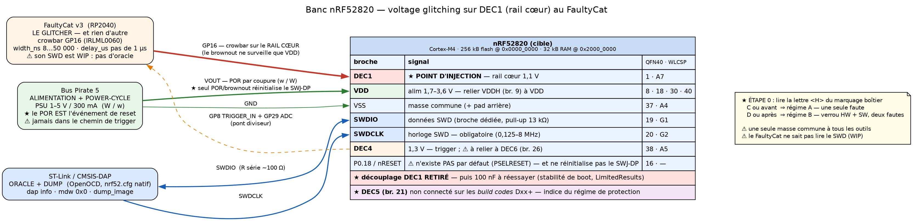

# 08 — Dump de la flash d'un nRF52820 par voltage glitching (bypass APPROTECT)

> **Objet.** Extraire la flash interne d'un **Nordic nRF52820** (Cortex-M4) via **SWD**, en levant sa
> protection en lecture **APPROTECT** par injection de faute par la tension.
>
> **⚠ Ce document est volontairement AUTONOME.** Il est fait pour être copié tel quel dans une autre
> session / un autre dépôt : tous les faits nécessaires sont **portés en ligne**, avec leur source,
> plutôt que renvoyés vers d'autres fichiers du projet.
>
> **Étiquettes de provenance** (respectées à chaque affirmation) :
> | Étiquette | Signification |
> |---|---|
> | **`[PS]`** | *nRF52820 Product Specification* **v1.3** (réf. interne `4463_156 v1.3`), 452 p. — **document officiel Nordic Semiconductor**, cité §/page ; archivé sous `datasheet/cible_nRF52820/` |
> | **`[LR]`** | Les deux write-ups **LimitedResults**, *nRF52 Debug Resurrection (APPROTECT Bypass)* parties 1 et 2 — **`[ref]` de praticien**, **cité par URL, jamais par page** (la pagination du PDF archivé est un artefact de notre conversion) |
> | **`[lit]`** | Littérature académique/conférence d'injection de fautes (papier nommé à chaque fois) |
> | **`[ref]`** | Autre source publique externe (dépôt, outil, page constructeur) — **citée par URL** |
> | **`[reco]`** | **Recommandation d'ingénierie de ma part** — pas une source |
>
> **Règle d'or appliquée ici** : *aucun paramètre de glitch n'est inventé*. LimitedResults **n'en
> publie aucun** ; tout ce qui n'est pas sourcé est donc marqué **« à caractériser »**.
>
> URL des deux write-ups `[LR]` (vérifiées en ligne le 2026-09-15, HTTP 200) :
> **P1** — https://www.limitedresults.com/results/nrf52-debug-resurrection-approtect-bypass
> **P2** — https://www.limitedresults.com/results/nrf52-debug-resurrection-approtect-bypass-part-2
>
> Vérifié le **2026-09-15**.

---

## 0. TL;DR — la première chose à faire est de lire **une lettre** sur le boîtier

★★ **Ce document n'a pas un playbook mais deux, et c'est la version du silicium qui décide lequel
s'applique.** Contrairement au STM32 ou au BAT32G135, où le modèle de protection est le même sur tous
les exemplaires, le nRF52820 existe en **deux régimes d'APPROTECT incompatibles**, et la
documentation officielle les distingue par le ***build code*** de la puce `[PS]` §4.8.2, p. 41 :

| Régime | *Build code* | Protection par défaut | Ce qu'il faut fauter | Statut public |
|---|---|---|---|---|
| **A** | **`Cxx` et antérieurs** | **désactivée** — il faut l'activer | **une seule faute** sur l'initialisation matérielle | ★ **cassé publiquement** `[LR]` (sur d'autres nRF52) |
| **B** | **`Dxx` et ultérieurs** | ★ **activée** | verrou **matériel ET logiciel** ⇒ **deux fautes** | ⚠ **aucun travail public connu** |

⇒ **Étape 0 de toute campagne : lire la lettre `<H>` du marquage boîtier à la loupe binoculaire**
(§2.4). Elle coûte deux minutes et elle décide si ce document est un **playbook** (régime A) ou une
**étude de faisabilité** (régime B).

⚠️ **Et l'espérance n'est pas bonne pour une puce achetée aujourd'hui.** La révision **v1.3 de la PS
(novembre 2021)** inscrit dans l'*Ordering information* que les ***« Build codes Cxx not recommended
for new designs »*** `[PS]` §1, p. 9. Un composant récent est donc **probablement en régime B**.

★★ **Ce document a deux cibles concrètes, et l'une d'elles est déjà tranchée.**

| Cible | Régime | Statut |
|---|---|---|
| ★★ **Dongle Logitech CU0021** (§1bis) | ★★ **A — attesté** | Marquage `N52820 / QDAACA / 2011AA` lu sur les **photos internes du dossier FCC** : `<H>` = **`C`** ⇒ *build code* `Cxx` ⇒ **une seule faute suffit**. Et `<PP>` = **`QD`** ⇒ **QFN40**, `DEC1` = **broche 1**, accessible au fer |
| **Souris Logitech Signature M650 / M650 L** (§1ter) | ⚠️ **probablement B** | nRF52820 attesté `[ref]` sur la variante *Signature* seulement ; lancée **janvier 2022**, soit **après** les deux jalons du durcissement ⇒ la probabilité penche vers le régime durci |

⇒ ★ **Commencer par le dongle.** C'est la seule des deux dont le régime soit **lu et non supposé**,
son boîtier est **soudable**, sa puce est **nue** (ni coque, ni blindage, ni potting), et le
`<H>` se relit **à la binoculaire sans rien alimenter** sur n'importe quel exemplaire.
⚠️ **Réserve** : le marquage décodé est celui de l'unité photographiée en **2020** par le
laboratoire — il établit que **des `Cxx` existent**, pas que *ton* exemplaire en est un (§1bis.1).

**Le reste en bref :**

1. **Cible** : Cortex-M4, **256 kB de flash en `0x0000_0000`**, 32 kB de RAM en `0x2000_0000`,
   VDD **1,7–3,6 V**. **SWD = `SWDIO` + `SWDCLK`** sur des broches **dédiées** (pas des GPIO).
   `[PS]` §*Pin assignments*, p. 419.
2. ★ **Point d'injection : `DEC1`** — la broche de découplage du **rail cœur 1,1 V**, soit l'homologue
   nRF du `VCAP` d'un STM32. **Broche 1 en QFN40**, **bille A7 en WLCSP** `[PS]` p. 419-421.
   C'est le rail que `[LR]` glitche (*« definitively the CPU power line »*).
3. ★★ **Le détecteur de brownout ne regarde pas ce rail.** La PS imprime que le brownout
   ***« only applies to the voltage on VDD »*** `[PS]` §5.3.8, p. 71 — donc
   une impulsion sur `DEC1`, **en aval du régulateur**, ne le déclenche pas *a priori* (§6.3).
4. ⚠️ **La cadence de campagne est MAUVAISE, et c'est la contrainte dimensionnante.** Seuls le
   **power-on reset** et le **brownout reset** réinitialisent le port de debug ; **le pin reset ne le
   fait pas** `[PS]` §5.3.6.8, table *Reset behavior*, p. 61. Chaque tentative exige donc un
   **événement d'alimentation**, pas une impulsion de reset (§5).
5. **Il n'y a pas de bootROM** : l'initialisation du port de debug est **purement matérielle** `[LR]`
   ⇒ **rien à désassembler**, la fenêtre se trouve **uniquement par analyse de consommation** (§9).
6. ★ **Une seule faute réussie suffit à vie** (régime A) : dumper, puis `ERASEALL` et reflasher avec
   `UICR.APPROTECT` patché — le glitch ne sert plus jamais (§9, phase 4).
7. ⚠️ **`[LR]` ne publie AUCUN paramètre de glitch** — ni largeur, ni profondeur, ni offset. Tout est
   **à caractériser**, et ce document ne comble pas ce vide par de l'invention.

---

## 1. Fiche de la cible

Toutes les valeurs de cette section sont `[PS]`.

| Élément | Valeur | Source |
|---|---|---|
| Fabricant | **Nordic Semiconductor** | `[PS]` p. 1 |
| Cœur | **ARM Cortex-M4** (sans FPU sur cette référence) | `[PS]` §*Debug*, p. 40 |
| **Code flash** | **256 kB @ `0x0000_0000`** | `[PS]` Table 144, p. 448 |
| **RAM** | **32 kB @ `0x2000_0000`** | `[PS]` Table 144, p. 448 |
| **UICR** | **`0x1000_1000`** — *User information configuration registers* | `[PS]` §4.5, p. 33-34 |
| **FICR** | **`0x1000_0000`** — *Factory information configuration registers*, non effaçables | `[PS]` §4.4, p. 24-25 |
| Alimentation | **VDD 1,7 – 3,0 – 3,6 V** · `VDDH` 2,5 – 3,7 – 5,5 V · `VBUS` 4,35 – 5,0 – 5,5 V | `[PS]` Table 140, p. 444 |
| `VDD,POR` | **1,75 V** — tension nécessaire pendant le power-on reset | `[PS]` Table 140, p. 444 |
| `tR_VDD` | **60 ms max** — temps de montée de l'alim (0 V → 1,7 V) | `[PS]` Table 140, p. 444 |
| Température | −40 → +85 °C (étendu jusqu'à +105 °C) | `[PS]` Table 140, p. 444 |
| **Boîtiers** | **QFN 5×5 mm, 40 broches, pas 0,4 mm** (`<PP>` = `QD`) · **WLCSP 2,531 × 2,531 mm, 44 billes, pas 0,35 mm** (`<PP>` = `CF`) | `[PS]` Table 143, p. 448 |
| Flash — écriture | `tWRITE` = **42,5 µs** par mot de 32 bits ; **2 écritures max** avant effacement (`nWRITE`) | `[PS]` §4.3.10.1, p. 24 |
| Flash — effacement | `tERASEPAGE` = **87,5 ms** · **`tERASEALL` = 173 ms** · endurance **10 000 cycles/page** | `[PS]` §4.3.10.1, p. 24 |
| **Device ID** | **64 bits**, `FICR.DEVICEID[0]` = `0x1000_0060`, `[1]` = `0x1000_0064` | `[PS]` §4.4.1.3, p. 26 |
| Régulation | **DC/DC et LDO on-chip**, deux modes d'alimentation : *Normal Voltage* (VDD relié à VDDH) et *High Voltage* (VDDH seul) | `[PS]` §5.3.1, p. 53 |

**Registres FICR utiles une fois la puce ouverte** `[PS]` §4.4, p. 24-25 : `CODEPAGESIZE` (`0x010`),
`CODESIZE` (`0x014`), `INFO.PART` (`0x100`), ★ **`INFO.VARIANT` (`0x104`) = le *build code***,
`INFO.PACKAGE` (`0x108`), `INFO.RAM` (`0x10C`), `INFO.FLASH` (`0x110`).

> ★ **À noter tout de suite** : le *build code* qui décide du régime de protection (§2) est **lisible
> dans `FICR.INFO.VARIANT`** — mais la FICR n'est accessible qu'**une fois le debug ouvert**. Avant
> l'attaque, il faut donc le lire **sur le boîtier** (§2.4). C'est la raison pour laquelle l'étape 0
> de ce document est optique, pas électrique.

---

## 1bis. ★★ Cible A — dongle **Logitech CU0021** : un nRF52820 en **régime A, attesté**

C'est **la** cible favorable de ce document, et la seule dont le régime de protection soit **lu et
non supposé**. Source : **photos internes du dossier FCC** du dongle — rapport **Bureau Veritas
réf. 200615E03, pages 4/5 et 5/5** — où le marquage du composant est lisible à la loupe sur deux
clichés distincts. `[ref]` FCC ID **JNZCU0021** (*Wireless USB dongle*, Logitech Far East Ltd,
autorisation du **12 août 2020**, BLE + GFSK 2,4 GHz), https://fccid.io/JNZCU0021 (archive 2026-10-05 : https://web.archive.org/web/20261005001635/https://fccid.io/JNZCU0021)

### 1bis.1 ★★ Le marquage, décodé champ par champ

Marquage relevé sur les deux photos : **`N52820`** / **`QDAACA`** / **`2011AA`**.
Décodage contre la Figure 166 (§10.1, p. 446) et les Tables 143 à 150 (§10.4, p. 448) `[PS]` :

| Champ | Valeur | Table `[PS]` | Signification |
|---|---|---|---|
| produit | `N52820` | Figure 166 | **nRF52820** |
| **`<PP>`** | **`QD`** | Table 143 | ★ **QFN 5×5 mm, 40 broches, pas 0,4 mm** ⇒ **`DEC1` = broche 1**, et **pas de WLCSP** |
| **`<VV>`** | **`AA`** | Table 144 | 256 kB flash / 32 kB RAM / ★ ***« Controlled by hardware »*** — **pas `AA-D`** |
| ★★ **`<H>`** | ★★ **`C`** | Table 145 | *Hardware version identifier* ⇒ ***build code `Cxx`*** ⇒ ★★ **RÉGIME A** (§2.2) |
| `<P>` | `A` | Table 146 | `[0..9]` = *production device identifier* · **`[A..Z]` = *engineering device identifier*** |
| `<YY>` | `20` | Table 148 | année de production **2020** |
| `<WW>` | `11` | Table 149 | **semaine 11** ⇒ ~**mars 2020** |
| `<LL>` | `AA` | Table 150 | identifiant de lot wafer |

★★★ **Conclusion : cet exemplaire est en régime A.** Une **seule faute** sur l'initialisation
matérielle suffit — c'est exactement le régime que `[LR]` met en défaut. Et le boîtier est un
**QFN40 à pas de 0,4 mm**, donc **`DEC1` est une broche accessible au fer**, pas une bille de WLCSP.

★ **Cohérence interne remarquable** : la date de production (**semaine 11 de 2020**) est **antérieure
à la publication de `[LR]`** (juin 2020) et **très antérieure au durcissement** documenté en
juillet 2021 (§2.5). Tout concorde.

★ **Et les deux identifiants du §2.4 concordent sur la même pièce** : `<VV>` = `AA`
(*« controlled by hardware »*) **et** `<H>` = `C` (*build code* `Cxx`). C'est **une observation
confirmante** de la corrélation `AA-D ↔ Dxx` — voir §2.4, où elle **reste `[reco]`** : un exemplaire
n'établit pas une règle.

> ⚠️ **Deux limites de portée à ne pas gommer.**
> ① **Ce marquage est celui de l'unité photographiée par Bureau Veritas en 2020**, pas celui d'un
> dongle acheté aujourd'hui. Il établit que **des CU0021 en `Cxx` existent** — il n'établit pas que
> *ton* exemplaire en est un. **Lire le marquage sur la pièce réelle** reste l'étape 0 (§2.4) ; c'est
> gratuit, la puce est nue et le texte est lisible à la binoculaire sans rien alimenter.
> ② **`<P>` = `A` signifie *engineering device identifier*** d'après la Table 146. Qu'un dongle
> certifié FCC et commercialisé porte un tel code est **inexpliqué** ; c'est relevé ici parce que le
> tableau le dit, **et rien n'en est déduit**.

### 1bis.2 Ce que le format « dongle » change, en bien

- ★★ **Aucune ouverture mécanique** : le PCB fait environ **2 cm**, la puce est **nue** (pas de
  blindage, pas de potting, pas de coque à démonter au-delà du capot plastique). Sur les clichés du
  dossier FCC, le QFN40 **et sa couronne de condensateurs** sont directement lisibles — on distingue
  les repères `C3`, `C5`, `C6`, `C7`, `C8`, `C9`, `C12`, `C13`, `C15`, `C16`, `C18`.
- ★ **Le `<H>` se lit sans alimenter quoi que ce soit** : c'est de l'optique, pas de l'électronique.
  Sur plusieurs dongles, c'est **la façon la moins chère de trouver un `Cxx`**.
- ★ **Le module RF est distinct de la partie USB** sur les photos (référence de carte `VB050820`,
  antenne PCB repérée par le rapport) — utile pour se repérer au moment de sonder.

### 1bis.3 ⚠️ Le piège d'alimentation propre à ce format — **à vérifier avant de câbler**

Un dongle USB reçoit **5 V**. Or le nRF52820 a deux modes `[PS]` §5.3.1, p. 53 :

| Mode | Câblage | Conséquence |
|---|---|---|
| **Normal Voltage** | `VDD` **et** `VDDH` reliés ensemble (1,7–3,6 V) | c'est l'hypothèse du §4.3 |
| ★ **High Voltage** | **`VDDH` seul** alimenté (2,5–5,5 V), `VDD` **non relié** à une source | REG0 alimente REG1 en interne |

⇒ ★ **Un dongle alimenté en 5 V USB est très probablement en *High Voltage mode*** — `[reco]`, à
confirmer. **Cela contredit la règle de câblage du §4.3** (« relier `VDDH` à `VDD` ») : ici, les
relier serait une **modification de la cible**, pas une mise en conformité.

> ★ **À faire avant tout câblage** : sonder **`VDD` (broches 8, 18, 30, 40)** et **`VDDH` (broche 9)**
> sur la carte, dongle branché. S'ils sont au même potentiel ⇒ *Normal Voltage*. Si `VDDH` ≈ 5 V et
> `VDD` ≈ une tension régulée inférieure ⇒ ***High Voltage mode***, et c'est **`VDDH` qu'il faut
> alimenter** depuis le banc.
> ⚠️ **Conséquence sur §6.3** : la chaîne de régulation en amont de `DEC1` n'est alors pas la même,
> ce qui peut changer la réponse à la question « un creux sur `DEC1` tire-t-il `VDD` et déclenche-t-il
> le brownout ? ». **Sonder les trois rails ensemble** (`DEC1`, `VDD`, `VDDH`) pendant la
> caractérisation.

### 1bis.4 Deux inconnues, et un faux problème à écarter

- ⚠️ **Les pads SWD ne sont pas identifiés.** Les broches **19 (`SWDIO`)** et **20 (`SWDCLK`)** du
  QFN40 sont connues (§4.2), mais **rien sur les clichés FCC ne dit si Logitech les a sorties sur des
  points de test**. À chercher à la binoculaire ; à défaut, contact direct sur les broches — possible
  à 0,4 mm de pas avec une pointe fine, impossible en WLCSP (d'où l'importance du `<PP>` = `QD`).
- ⚠️ **Le mode d'alimentation** (§1bis.3).
- ★ **Le faux problème** : *« l'USB sert à la fois à l'alimentation et à la communication »* — c'est le
  critère qui a fait choisir l'**EMFI** à Riscure sur le KeepKey `[lit]`. ⚠️ **Il ne s'applique pas
  ici** : on ne glitche pas *à travers* l'USB. On **alimente le module directement** depuis le banc et
  on **dialogue en SWD** — l'USB n'est dans aucune des deux boucles. Ne pas transposer le critère.

---

## 1ter. Cible B — souris **Logitech Signature M650 / M650 L** (non attestée, probablement régime B)

★ **Le nRF52820 visé par ce document n'est pas un composant nu sur une carte d'évaluation : il est
dans une souris grand public.** Cela change trois choses — l'accès (facile), le sourcing
d'échantillons (bon marché) et la probabilité du régime de protection (défavorable, §1ter.3).

### 1ter.1 Ce qui est attesté, et ce qui ne l'est pas

| Fait | Statut |
|---|---|
| La **Signature M650** est pilotée par un **nRF52820** | ★ **`[ref]` attesté** — teardown iFixit : *« The mouse in controlled by a Nordic Semiconductor nRF52820 chip »*, https://www.ifixit.com/Teardown/Logitech+Signature+M650+Teardown/198034 |
| La **M650 L** (grand format) embarque **le même MCU** | ⚠️ **`[reco]`, NON attesté** — le teardown iFixit de la M650 L (https://www.ifixit.com/Teardown/Logitech+M650+L++Mouse+Teardown/180824) **ne nomme aucun composant** |
| Le **boîtier** de la puce (QFN40 ou WLCSP) | ⚠️ **inconnu** — aucun teardown ne le décrit (§1ter.4) |

> ⚠️ **La coupure la plus importante de cette section.** Les deux variantes partagent la gamme, la
> génération, la date de lancement, le prix et la connectivité — il est **vraisemblable** qu'elles
> partagent le MCU, mais **aucun document ne le dit**. ⇒ **La toute première chose à faire en ouvrant
> la coque est de lire le marquage de la puce** : il donne d'un coup la référence **et** le *build
> code* `<H>` (§2.4), c'est-à-dire les deux inconnues qui commandent toute la campagne.

### 1ter.2 Accès mécanique — une cible favorable

D'après le teardown iFixit `[ref]` (même URL) :

1. Retirer la pile (couvercle coulissant sous la souris).
2. **2 vis Phillips PH00** à l'arrière, puis séparer les coques — ⚠️ **un fil relie la coque
   supérieure**, à déconnecter avant de forcer.
3. **4 vis PH00** supplémentaires libèrent la carte mère (les deux du haut tiennent aussi la molette
   et son palier magnétique).
4. Retirer les ressorts de contact de pile, puis retourner la carte : les composants sont accessibles.

⇒ **Pas de potting, pas de blindage à retirer, pas de colle** — six vis et un connecteur. À comparer
au matériel encapsulé où l'EMFI devient le seul vecteur praticable.

### 1ter.3 ⚠️ Chronologie — et elle joue contre le régime favorable

| Date | Événement |
|---|---|
| **juillet 2021** | PS v1.1 — introduction du **régime B** (HW + SW) `[PS]` §1, p. 9 |
| **novembre 2021** | PS v1.3 — *« Build codes Cxx **not recommended for new designs** »* `[PS]` §1, p. 9 |
| **11 janvier 2022** | ★ **Lancement de la Signature M650** (`[ref]`, communiqué Logitech) — M650, **M650 L** et version gaucher, **39,99 $** |

⇒ ★ **La souris a été conçue et produite APRÈS les deux jalons.** Il est donc **plus probable qu'elle
embarque un `Dxx` (régime B) qu'un `Cxx` (régime A)** — c'est-à-dire le régime **sans travail public
connu**, à deux fautes.
⚠️ **« Plus probable » n'est pas « certain »** : un premier lot peut consommer un stock de puces
antérieur, et Logitech ne publie évidemment pas ses *build codes*. **Seule l'inspection tranche.**

### 1ter.4 ★ Ce que le format grand public apporte en compensation

- ★★ **La stratégie multi-échantillons devient abordable.** À **~40 $ neuf** (moins d'occasion), on
  peut acquérir **plusieurs unités**, lire `<H>` sur chacune, et **la répartition `Cxx`/`Dxx` entre
  elles est elle-même le résultat**. C'est l'inverse de la situation d'une cible rare, où
  l'échantillon est précieux et où le premier essai doit être le bon. `[reco]` **Acheter 3 à 5
  exemplaires, si possible de lots différents** (revendeurs distincts, dates d'achat espacées) :
  c'est la façon la moins chère d'obtenir un `Cxx`.
- ★ **Le précédent est direct, et c'est le même fabricant.** `[LR]` P2 valide précisément son attaque
  sur une **souris Logitech** (G Pro, nRF52840) et note que *« The PCB design **matches perfectly the
  nRF52840 reference design** (found in the Nordic Datasheet). **It's like a copy-paste design.** »*
  ⇒ `[reco]` **Il est raisonnable d'espérer que la M650 suive de même le design de référence
  nRF52820**, donc que le **découplage de `DEC1` se trouve à un emplacement identifiable** par
  comparaison avec la *reference circuitry* de la PS, plutôt qu'à un endroit propre à Logitech.
- **Un exemplaire sacrificiel coûte 40 $**, pas une carte de développement plus le temps de portage.

### 1ter.5 Conséquence sur le point d'injection

Le boîtier n'étant pas documenté, **les deux moitiés du §4.2 restent ouvertes** — QFN40 (broche 1,
pas de 0,4 mm) ou WLCSP (bille A7, pas de 0,35 mm, **non soudable à la main**). Dans une souris
compacte, le WLCSP est parfaitement plausible.

⇒ ★ **Le plan par défaut n'est donc plus de souder sur la broche, mais sur le condensateur de
découplage de `DEC1` côté PCB** — ce que fait d'ailleurs `[LR]` sur la G Pro, où il travaille sur les
emplacements **C5/C15** et non sur les broches du composant. Le §4.2 le donnait comme repli ; **pour
cette cible, c'est le plan principal.**

---

## 2. Le modèle de protection — deux régimes, et c'est la version de la puce qui tranche

### 2.1 Le mécanisme commun aux deux régimes

**APPROTECT** (*Access Port Protection*) *« blocks the debugger from read and write access to all CPU
registers and memory-mapped addresses when enabled »* `[PS]` §4.8.2, p. 41.

Deux ports de debug coexistent `[PS]` §4.8, p. 40-44 :

| Port | Rôle | Bloqué par APPROTECT ? |
|---|---|---|
| **AHB-AP** | accès mémoire et contrôle du CPU — **c'est lui qu'on veut** | ★ **oui** |
| **CTRL-AP** | port de contrôle propriétaire : *« enables control of the device when other access ports are disabled »* | ★ **non — il reste joignable** |

**Registres du CTRL-AP**, par offset `[PS]` §4.8.3.1, p. 43-44 :

| Registre | Offset | Rôle |
|---|---|---|
| `RESET` | `0x000` | soft reset déclenché via CTRL-AP |
| **`ERASEALL`** | `0x004` | **efface toute la flash ET la RAM** — c'est le retrait de protection officiel |
| `ERASEALLSTATUS` | `0x008` | `0` = *Ready* · `1` = *Busy* |
| ★ **`APPROTECTSTATUS`** | **`0x00C`** | ★ **`0` = protection ACTIVE · `1` = protection NON active** |
| `IDR` | `0x0FC` | identification du CTRL-AP |

> ⚠️ **La polarité d'`APPROTECTSTATUS` est contre-intuitive : lire `1` signifie « déverrouillé ».**
> `[PS]` §4.8.3.1.4, p. 44 donne les deux valeurs du champ sous forme de table — `Enabled` = **`0`**,
> *« Access port protection enabled »* ; `Disabled` = **`1`**, *« Access port protection not
> enabled »*. C'est exactement ce que `[LR]` lit dans son OpenOCD :
> `nrf52.dap apreg 1 0x0c` avec le commentaire *« 0x0 Access port protection enabled — 0x1 APP
> disabled »*. Voir §8.2 : ce registre est un **candidat oracle**, mais **pas encore validé**.

**L'octet de protection lui-même** vit dans la **UICR**, une partition de flash non volatile :
**`UICR.APPROTECT` = `0x1000_1000 + 0x208` = `0x1000_1208`** `[PS]` §4.5.1.5, p. 36.

### 2.2 Régime A — *build codes* `Cxx` et antérieurs : « controlled by hardware »

`[PS]` §4.8.2, p. 41, verbatim :

> *« By default, access port protection is **disabled**. Access port protection is enabled by writing
> `UICR.APPROTECT` to `Enabled` and performing any reset. […] Access port protection is disabled by
> issuing an `ERASEALL` command via CTRL-AP. This command will erase the flash, UICR, and RAM,
> including `UICR.APPROTECT`. »*

⇒ **Un seul verrou, chargé par une initialisation matérielle.** C'est le régime que `[LR]` met en
défaut : une impulsion bien placée pendant ce chargement et l'AHB-AP reste ouvert.

### 2.3 Régime B — *build codes* `Dxx` et ultérieurs : « controlled by hardware **and software** »

`[PS]` §4.8.2, p. 41, verbatim :

> *« **By default, access port protection is enabled.** […] To keep access port protection disabled,
> the following actions must be performed : **Program `UICR.APPROTECT` to `HwDisabled`.** This
> disables the **hardware part** of the access port protection scheme after the first reset of any
> type. […] **Firmware must write `APPROTECT.DISABLE` to `SwDisable`.** This disables the **software
> part** of the access port protection scheme. »*

**Registres du périphérique APPROTECT**, base **`0x4000_0000`** `[PS]` §4.8.2, p. 43 :

| Registre | Offset | Valeur | Effet |
|---|---|---|---|
| `FORCEPROTECT` | `0x550` | `Force` = `0x0` | force l'activation d'APPROTECT **jusqu'au prochain reset** |
| **`DISABLE`** | **`0x558`** | **`SwDisable` = `0x5A`** | désactive la **partie logicielle** du verrou |

★ **`APPROTECT.DISABLE` est remis à zéro** *« after pin reset, power or brownout reset, watchdog
reset, or wake from System OFF »* `[PS]` §4.8.2, p. 41 — **à chaque reset, donc.**
Durcissement **recommandé par Nordic lui-même** `[PS]` §4.8.2, p. 42 : écrire `Enabled` dans
`UICR.APPROTECT` **et** faire écrire `FORCEPROTECT = Force` par le firmware.

> ★★ **Ce que le régime B change pour l'attaquant — trois conséquences, et aucune n'est favorable.**
> 1. **Le défaut est inversé.** En régime A, l'état « ouvert » est le défaut du silicium ; en régime
>    B, c'est l'état « fermé ». L'anti-pattern *« default to unprotected »* — celui qui rend le
>    LPC1343 et le BAT32G135 si faciles — **a été corrigé**.
> 2. **Une faute ne suffit plus.** Fauter l'initialisation matérielle ne lève pas le verrou logiciel.
>    Il faut **deux fautes**, ou une faute sur un chemin qui les commande toutes deux — inconnu.
> 3. ⚠️ **Et un multi-glitch coûte bien plus cher que le produit de ses taux.** `[lit]`
>    ***Fill your Boots*** (TCHES 2021, p. 13) mesure sur STM8 deux glitchs à **0,6 %** et **0,1 %**,
>    dont la combinaison devrait donner **≈ 0,0036 %** : le taux réel est **0,0001 %**, soit
>    **36 fois moins**. Cause imprimée : le **pipeline**, dont le contenu au moment du second glitch
>    n'est plus celui du profilage. **Ne jamais budgéter un régime B en multipliant les taux.**
>
> ⚠️ **Statut de connaissance, à dire franchement** : **aucun travail public n'est connu sur le
> régime B.** Ce document ne prétend pas qu'il est cassable ; il dit **ce qu'il faudrait fauter** et
> **ce que cela coûterait**.

### 2.4 Comment savoir dans quel régime on est — avant de souder quoi que ce soit

★★ **Le marquage du boîtier porte le *build code*, et c'est le seul discriminant accessible sur une
puce déjà soudée.** `[PS]` §10.1, Figure 166, p. 446 : le composant est marqué

```
        N   5   2   8   2   0
        <PP>   <VV>   <H> <P>
        <YY>   <WW>   <LL>
```

avec, `[PS]` §10.4, p. 448 : `<H>` = *« Hardware version/revision identifier (incremental) »*,
`[A..Z]` · `<P>` = code de configuration de production · `<YY><WW><LL>` = code de traçabilité.

⇒ **Lire `<H>` : `A`, `B` ou `C` ⇒ régime A. `D` ou au-delà ⇒ régime B.**

★★ **Où regarder, concrètement : la 5ᵉ position de la 2ᵉ ligne.** La ligne du milieu fait
**exactement 6 caractères**, `<PP><VV><H><P>`, et une seule d'entre elles décide du régime :

```
        N 5 2 8 2 0          <- le produit : nRF52820
        Q D A A C A          <- les 6 caracteres qui comptent
        │ │ │ │ │ └─ <P>  configuration de production  (A..Z = engineering, 0..9 = production)
        │ │ │ │ └─── <H>  ★★ LE DISCRIMINANT : C ou avant = regime A · D ou apres = regime B
        │ │ └─┴───── <VV> variante fonctionnelle (2 caracteres seulement)
        └─┴───────── <PP> boitier : QD = QFN40 (DEC1 = broche 1) · CF = WLCSP (DEC1 = bille A7)
        2 0 1 1 A A          <- tracabilite : annee, semaine, lot -- SANS effet sur le regime
```

| Ce qu'on lit en 5ᵉ position | Verdict |
|---|---|
| **`QDAA`**`C`**`A`** — ou `A`/`B` à la place du `C` | ★★ **Régime A** — une seule faute, playbook du §9 applicable |
| **`QDAA`**`D`**`A`** — ou toute lettre après `D` | ⚠️ **Régime B** — verrou HW + SW, deux fautes, §2.3 |

⚠️ **Deux pièges de lecture.** ① La **3ᵉ ligne (`2011AA`) ne dit rien du régime** : c'est de la
traçabilité (année, semaine, lot). Deux puces de dates différentes peuvent partager le même `<H>`, et
inversement. ② À la binoculaire, **`C` se confond avec `G` ou `O`, et `D` avec `O` ou `0`** — en cas
de doute, photographier en éclairage rasant et agrandir, la gravure laser est peu contrastée.

> ★ **Et attention au piège du code de commande.** La PS précise, même figure : ***« Only the first
> two characters of the function variant code are used in the `<VV>` entry »***. Or la **Table 144**
> (§10.4, p. 448) distingue justement les variantes **`AA`** (*« Controlled by hardware »*) et
> **`AA-D`** (*« Controlled by hardware and software »*) — références de commande réelles
> `nRF52820-QDAA-D-R7`, `nRF52820-QDAA-D-R`, `nRF52820-CFAA-D-R7`, `nRF52820-CFAA-D-R` `[PS]` p. 450.
> **Le suffixe `-D` n'est donc PAS marqué sur la puce**, seuls les deux premiers caractères le sont.
> Sur un composant en sachet, on lit le régime sur le **bon de commande** (`<VV>`) ; sur un composant
> soudé, on le lit sur le **boîtier** (`<H>`) — **deux chemins différents**.
>
> ★ **Une observation confirmante existe désormais** (§1bis.1) : sur le nRF52820 du dongle CU0021,
> `<VV>` = **`AA`** (*« controlled by hardware »*) **et** `<H>` = **`C`** — les deux identifiants
> désignent le même régime sur la même pièce. ⚠️ **Un exemplaire n'établit pas une règle** : la
> corrélation **reste `[reco]`**.
>
> ⚠️ **Coupure de provenance à conserver** : la PS **ne relie jamais explicitement** `<VV> = AA-D` au
> *build code* `Dxx`. §4.8.2 indexe le régime sur le **build code**, la Table 144 sur le **code de
> variante fonctionnelle**. Que les deux désignent la même chose est **plausible** (même vocabulaire,
> même lettre `D`, mêmes deux libellés mot pour mot) mais **`[reco]`, pas `[PS]`**. En cas de doute,
> c'est `<H>` qui fait foi, parce que c'est lui que §4.8.2 nomme.

**Deux indices secondaires, utiles en recoupement :**

- ★ **`DEC5` (broche 21 en QFN40, bille F1 en WLCSP) est *« Not connected for build codes Dxx and
  later »*** `[PS]` p. 419 et p. 421 — sur les `Cxx`, c'est un découplage de régulateur 1,3 V. Une
  broche 21 sans condensateur **suggère** un `Dxx`. ⚠️ `[reco]` : un intégrateur peut avoir omis ce
  découplage pour une autre raison — indice, pas preuve.
- Une fois la puce ouverte, **`FICR.INFO.VARIANT` (`0x1000_0104`)** donne le *build code* en clair
  `[PS]` §4.4, p. 24-25 — utile pour **confirmer après coup**, inutile avant.

### 2.5 Chronologie — 13 mois entre la publication de l'attaque et le correctif documenté

Reconstituée depuis l'historique de révisions de la PS `[PS]` §1, p. 9, et les dates de publication
des write-ups `[LR]` :

| Date | Événement | Source |
|---|---|---|
| **juin 2020** | **PS v1.0** — première publication du nRF52820 | `[PS]` §1, p. 9 |
| **10 et 14 juin 2020** | **Publication des deux write-ups** LimitedResults (nRF52840, puis nRF52832/52833) | `[LR]` |
| **12 juin 2020** | Nordic confirme la vulnérabilité par **notice d'information à tous ses clients** | `[LR]` P2 |
| ★ **juillet 2021** | **PS v1.1** — *« Debug […] and UICR — **Updated access port protection** »*, *« FICR — Updated […] **INFO.VARIANT device variants** »*, *« Pin assignments on page 418 - **Added note on DEC5** »* ⇒ **c'est la révision qui introduit le régime B** | `[PS]` §1, p. 9 |
| **septembre 2021** | PS v1.2 — ajout du boîtier WLCSP | `[PS]` §1, p. 9 |
| ★ **novembre 2021** | **PS v1.3** — *« Ordering information — **Build codes Cxx not recommended for new designs** »* | `[PS]` §1, p. 9 |

> ★ **Lecture de cette chronologie.** `[LR]` conclut en juin 2020 : *« The vulnerability resides in
> Silicon. There is **no way to patch without HW revision**. »* — **Nordic a fait la révision
> matérielle**, et l'a documentée treize mois plus tard. C'est, dans tout ce projet, le seul cas où
> l'on peut suivre **le cycle complet** : attaque publiée → confirmation constructeur → redesign
> silicium → dépréciation des anciennes séries.
> ⚠️ **Ce que cela ne dit pas** : la PS ne mentionne **jamais** l'attaque, ni ne présente le régime B
> comme un correctif de sécurité. Le lien entre les deux est une **lecture `[reco]`**, appuyée sur la
> concordance des dates et sur la nature du changement — pas une déclaration de Nordic.

---

## 3. Ce que LimitedResults a réellement fait — et sur quoi

⚠️ **Section de cadrage : à lire avant d'espérer quoi que ce soit du nRF52820.**

### 3.1 Les cibles réellement fautées

| Cible | Support | Résultat | Source |
|---|---|---|---|
| **nRF52840** | dev-kit **nRF52840-DK** | SWD réactivé, flash dumpée, persistance obtenue | `[LR]` P1 |
| **nRF52840** | ★ **produit commercial** — souris **Logitech G Pro** | idem, sur une carte de production | `[LR]` P2 |
| **nRF52832** | dev-kit nRF52-DK | SWD réactivé | `[LR]` P2 |
| **nRF52833** | dev-kit nRF52833-DK | SWD réactivé | `[LR]` P2 |

### 3.2 ★★ Le nRF52820, lui, n'a **jamais** été glitché

`[LR]` P2 énumère six références *« vulnerable »* — **nRF52810, nRF52811, nRF52820, nRF52832,
nRF52833, nRF52840** — mais cette liste suit immédiatement la phrase *« **NordicSemiconductor
confirmed** all their nRF52 versions are vulnerable »*.

⇒ **Attribution stricte à respecter** : la **revendication** est de **Nordic** (notice clients du
12 juin 2020), la **liste** est du **write-up**, et **la mesure n'existe pas** pour le 52820.
Ce qui le rattache au résultat est un **argument d'architecture**, formulé ainsi par `[LR]` :
*« The nRF52 SoCs shares the Cortex-M4 CPU, the same Debug Ports, the same Flash Memory (except the
memory array), and the same NVMC. In this context, it is likely the vulnerability is common to the
entire nRF52 series SoC family. »*

⚠️ **Et cet argument ne couvre pas le régime B** : il porte sur le silicium de 2020, c'est-à-dire sur
des puces en *build code* `Cxx`. Le redesign de juillet 2021 lui est postérieur (§2.5).

⚠️ **Aucun CVE n'existe.** Un commentateur le demande explicitement sous P2 ; l'auteur élude. On cite
donc le score et son vecteur, jamais un identifiant : **CVSS 7,6 (High)**,
`CVSS:3.0/AV:P/AC:L/PR:N/UI:N/S:C/C:H/I:H/A:H` `[LR]` P2.

⚠️ **À ne pas compter comme un résultat FI** : l'antécédent **nRF51 / RBPCONF** (Include Security,
2015), cité par `[LR]` P1 en introduction, est une **faille de conception logicielle** — un *gadget*
`ldr` exécuté via le debugger — **sans aucune injection de faute**.

### 3.3 Le mécanisme — et pourquoi il est structurellement différent d'un STM32

★★ **Le nRF52 n'a pas de bootROM.** `[LR]` P1 : *« The Boot Process is relatively simple, due to the
fact that the nRF52840 does not contain bootROM code (so no embedded boot-loader routines, nor
IAP/ISP routines to reverse-engineer…) […] All the blocks, like the NVMC, the memories, the Debug
Access Port… are initialised **purely in Hardware**. »*

La fenêtre visée est donc le transfert, **par le contrôleur mémoire (NVMC)**, de la valeur
`UICR.APPROTECT` vers le cœur ou directement vers le bloc AHB-AP — *« this is achieved by pure
Hardware and it has to be done during the early boot process, **before the CPU start to load from
Flash and execute Code** »* `[LR]` P1.

> ★ **Trois conséquences opératoires, toutes transposables au nRF52820 :**
> 1. **Il n'y a rien à désassembler.** Là où chip.fail lit la bootROM d'un STM32F2 en RDP0 pour
>    comprendre *pourquoi* le glitch marche `[lit]`, ici **aucun code n'est impliqué**.
> 2. **La fenêtre se localise uniquement par analyse de consommation.** C'est ce que fait `[LR]` :
>    l'activité flash est visible au trigger, le **CPU démarre son exécution à 19 µs** après le
>    repère, et le motif attribué au NVMC est isolé **en comparant deux rails** (`DEC1` = cœur,
>    `DEC4` = système).
> 3. **L'effet est observable à l'oscilloscope** : `[LR]` note qu'après une faute réussie *« the power
>    consumption of the System is modified after the glitch. This is the result you want to obtain. »*
>    ⇒ un **oracle de pré-filtrage gratuit**, avant même de tenter le SWD (§8.3).

### 3.4 Le banc de LimitedResults, tel qu'il est décrit

| Élément | Ce que dit `[LR]` |
|---|---|
| **Glitcher** | système maison, *« The total cost of this electronic board is **less than 5$** »* |
| **Rail glitché** | **`DEC1`** — *« DEC1 is definitively the CPU power line »*, mesuré **0,8–0,9 V** sur nRF52840 |
| **Trigger** | **`DEC4`** (mesuré 1,2–1,3 V sur nRF52840, *« probably supplies the entire digital system »*) ; sur la souris Logitech, c'est **`VDD_nRF`** qui sert de référence |
| **Modification de carte** | condensateurs de découplage **C5, C15, C16, C11 retirés** (dev-kit) ; **C5 et C15** seulement sur la souris |
| ★ **Nuance** | *« I re-soldered a **100nF capacitor at C5** location to have more "stability" of the CPU power during boot-up. This is not really necessary but it can help in case of unexpected CPU crashes. »* |
| **Instrumentation** | oscilloscope 4 voies : UART cible · consommation via `DEC1` · commande de glitch · consommation via `DEC4` (trigger) |
| **Orchestration** | script Python : arme l'oscilloscope, règle les paramètres, **reset la carte** entre les tentatives |
| **Après succès** | CPU figé en boucle à `0x61C4` ; PC forcé à `0x2B4` (point d'entrée) pour reprendre l'exécution |
| ⚠️ **Paramètres** | ★ **aucun n'est publié** : ni largeur, ni profondeur, ni offset, ni taux de succès, ni nombre de tentatives |

**Estimation de l'auteur**, à prendre pour ce qu'elle est — une estimation : *« I have no doubt any
motivated proficient hacker could reproduce this attack in **less than one day** and with **less than
500$ equipment** »* `[LR]` P1. ⚠️ Ces 500 $ désignent **le banc complet** (dont l'oscilloscope), pas
le glitcher à 5 $.

---

## 3bis. ★ Un second banc public sur nRF52840 — le fork **raiden-pico d'iceman1001** `[ref]`

> **Nature : `[ref]`.** Documentation d'un **fork tiers de raiden-pico** —
> `iceman1001/raiden-pico`, branche `feat/unique-dump-paths`, commit **`90b547e`** (2026-06-04),
> cité par URL SHA-figée (§11, source 5bis).
> ⚠️ **Troisième « raiden » du projet, à ne pas confondre** : ni l'upstream `AdamLaurie/raiden-pico`
> (§7.3), ni le fork local v0.14 du banc BAT32G135.
> ⚠️⚠️ **Deux coupures de provenance à tenir.**
> ① **La cible est un nRF52840 (dongle PCA10059 rev 2), PAS un nRF52820.** Tout chiffre ci-dessous est
> **de cette puce et de ce banc** — ce n'est **pas** un `[fait]` au sens du projet (mesuré sur *notre*
> banc), et cela **ne comble pas** le vide « `[LR]` ne publie aucun paramètre » pour le nRF52820, qui
> reste **à caractériser** (§0, §3.4, §6.1, §10). ② Ce fork **outille exactement l'attaque du §3** : il
> ajoute `TARGET NRF52840` et `TARGET GLITCH APPROTECT` (balayage 2D delay × width), **crowbar sur
> `DEC1`**, piloté par le RP2350. C'est la preuve qu'un **second praticien** a monté ce banc — pas une
> source indépendante sur la physique.

### 3bis.1 Le point de fonctionnement publié — attribué, et sur nRF52840

| Grandeur | Valeur `[ref]` iceman | Note |
|---|---|---|
| Balayage par défaut (`TARGET GLITCH APPROTECT`) | delay **1000 → 20 000 µs** (pas 25) × width **150 → 450 cyc** (pas 75) ; off 60 ms, settle 8 ms | width en **cycles de 6,67 ns** (≈ 1–3 µs) |
| ★ Point validé (PCA10059 rev 2, 2026-06-02) | width **225–265 cyc** (~1,5–1,77 µs) · delay **~1065–1170 µs** post-power-on (fenêtre ~110 µs) · off **18 ms** | ~1–2 min/unlock, reproduit 3–7× |

⚠️ **Ce point ne se transpose pas tel quel au nRF52820** : puce différente, rail différent (§6.4), banc
tiers. Il **oriente** un départ de balayage (§9 phase 1), il ne le **fixe** pas.

### 3bis.2 ★ Cinq apports concrets que `[LR]` ne donne pas

1. ⚠️ **Garde-fou anti-effacement : la largeur est bornée en dur à ≤ 450 cycles (~3 µs).** Le **fait**
   `[ref]` est le **clamp firmware**. La **raison donnée par iceman** (son explication, pas un mécanisme
   établi) : *« a glitch too long can push the boot into a mass-erase (NVMC ERASEALL) instead of an
   APPROTECT-readback fault, wiping the flash you want to dump »*. ★ **Distinct du `ERASEALL`
   volontaire** de la phase 4 (§9) : là, on efface **exprès** pour reflasher ; ici, un glitch trop
   large déclencherait l'effacement **par accident**. ⇒ borne haute de balayage à respecter (§9 phase 1).
2. **Raison indépendante pour laquelle le reset chaud échoue.** iceman confirme que la variante **nRST
   (warm reset) ne marche pas**, avec un mécanisme **physique** : *« the crowbar can't fault DEC1 once
   the LDO holds it up (steady state) — only the cold ramp is glitchable »*. ★ C'est une **seconde
   raison, indépendante** de celle du §5.1 (où le pin reset ne ré-arme pas le SWJ-DP) : **même
   conclusion opératoire** — il faut un **power-cycle à froid** — par un autre chemin.
3. **Un bouton d'amplitude par la résistance de source du MOSFET.** iceman câble une **`Rsrc`
   (source du MOSFET → GND)** et la désigne *« KEY KNOB — amplitude tuning »* : **10 Ω = régime
   fault-sans-reset**, **0 Ω = trop fort (même 6 ns crashe)**. ⚠️ **À ne confondre avec aucune des
   résistances du crowbar du projet** : ni `Rs` (série alim), ni `R_damp` (drain), ni `R_pd`
   (grille→source). `Rsrc` est au **même nœud** que le `R2 = 0,22 Ω` de COSIC `[lit]` (limitation par la
   source). ★ **Et c'est une philosophie différente** : le projet règle la profondeur par `Rs`/`R_damp`
   en tenant que *« la profondeur n'est jamais le facteur limitant »*, là où iceman en fait son bouton
   principal. **Concorder n'est pas être juste** : deux approches **parallèles** de contrôle de force,
   pas une confirmation mutuelle.
4. **Oracle : un second praticien préfère une vraie lecture mémoire au bit de statut.** ⚠️ **Nuance
   intra-source à dire honnêtement** : `NRF52840_APPROTECT.md` définit le succès du *firmware* comme
   *« DPIDR `0x2BA01477` **and** APPROTECTSTATUS bit0 set »*, **mais** le fichier qu'iceman désigne comme
   *« the working one »* (`NRF52840_WIRING_POWERCYCLE.md`, campagne du 2026-06-02) tranche autrement :
   *« Detection = a real AHB read (`FICR.INFO.PART == 0x52840`), **not** the unreliable APPROTECTSTATUS
   bit »*. ⇒ **la campagne réelle a abandonné le bit.** C'est un praticien **indépendant qui trouve
   `APPROTECTSTATUS` peu fiable et préfère une lecture mémoire réelle** — ce qui **conforte le choix
   d'oracle principal du §8.1** (lecture AHB). ⚠️ **Cela ne tranche PAS la question ouverte du §8.2** :
   le test discriminant en 3 étapes reste à faire.
5. **Bypass transitoire confirmé.** *« A genuine hit shows UICR.APPROTECT still = 0xFFFFFF00 (locked)
   while debug is open = clean skip, not UICR corruption. Re-locks on the next power-cycle → dump
   flash+RAM while open »* ⇒ corrobore la consigne du §9 phase 3 (**ne pas couper l'alimentation** après
   un succès) et l'observation `[LR]` du §8.2 (debug ouvert malgré un `UICR.APPROTECT` toujours à
   `0xFFFFFF00`).

### 3bis.3 ⚠️ Une divergence sur `DEC1` — à vérifier, pas à trancher

iceman écrit *« DEC1 (~1.3 V core regulator output) »*. Or le §6.4 porte déjà **deux** valeurs pour
`DEC1` : **0,8–0,9 V** mesurés par `[LR]` sur nRF52840, et **1,1 V** spécifiés par la `[PS]` sur
nRF52820. iceman apporte une **troisième** valeur — **~1,3 V** — sur la **même puce que `[LR]`**
(nRF52840), et qui **ressemble à la tension de `DEC4`** (1,2–1,3 V, l'alim système). ⚠️ **Ne pas
trancher** : soit iceman nomme « DEC1 » un rail que `[LR]` appelle `DEC4`, soit la tension varie selon
le mode d'alimentation (§1bis.3). **Sonder `DEC1` à l'oscilloscope sur la pièce réelle** avant de se
fier à une valeur.

### 3bis.4 Ce qui corrobore des faits déjà au document (sans rien y ajouter)

La carte de registres (`DPIDR 0x2BA01477`, CTRL-AP `ERASEALL 0x04` / `APPROTECTSTATUS 0x0C`,
`UICR.APPROTECT 0x1000_1208` = `0xFFFFFF00` protégé, `FICR.INFO.PART 0x1000_0100`) est **identique** à
celle du §2.1 et du §1 — deuxième attestation `[ref]`. Le **retrait des condensateurs de `DEC1` et
`VDD`** (noté *« REQUIRED »*) recoupe le §6.2. La **localisation de la fenêtre par boot-marker et
analyse de consommation** (scripts `nrf_timing_marker.py`, `crashmap`) recoupe le §3.3 et la phase 0.9.

---

## 4. Brochage — connexion SWD et point d'injection

### 4.1 Les broches qui comptent

Toutes `[PS]` §*Pin assignments*, p. 419-421.

| Signal | Rôle | Remarque |
|---|---|---|
| **`SWDIO`** | *Serial wire debug I/O* | ★ **broche dédiée**, pas un GPIO — **pull-up interne** |
| **`SWDCLK`** | *Serial wire debug clock input* | ★ **broche dédiée** — **pull-down interne** |
| ★ **`DEC1`** | **découplage de l'alim numérique 1,1 V** | ★ **le point d'injection** — rail cœur |
| `DEC4` | découplage régulateur 1,3 V | **doit être relié à `DEC6`** ; sert de trigger chez `[LR]` |
| `DEC6` | découplage régulateur 1,3 V | **doit être relié à `DEC4`** |
| `DEC5` | découplage régulateur 1,3 V | ★ **non connecté sur les *build codes* `Dxx` et ultérieurs** |
| `DEC3` | découplage d'alimentation | — |
| `DCC` | sortie du convertisseur DC/DC | — |
| `VDD` | alimentation | **quatre broches** en QFN40 |
| `VDDH` | alimentation haute tension | à relier à `VDD` pour le mode *Normal Voltage* |
| `VSS` | masse | + pad arrière |
| **`P0.18` / `nRESET`** | GPIO ★ **configurable** en pin reset | voir §5.3 — **il n'y en a pas par défaut** |

**Caractéristiques électriques du SWD** `[PS]` §4.8.4, p. 45 :
`Rpull` (pull-up `SWDIO` / pull-down `SWDCLK`) = **13 kΩ** · `fSWDCLK` = **0,125 à 8 MHz**.

### 4.2 Numéros de broches par boîtier

**QFN 5×5 mm, 40 broches, pas 0,4 mm** (`nRF52820-QDxx`) `[PS]` p. 419 — extrait utile :

| Broche | Fonction | | Broche | Fonction |
|---:|---|---|---:|---|
| **1** | ★ **`DEC1`** (1,1 V, **injection**) | | 21 | `DEC5` (NC si `Dxx`+) |
| 8 | `VDD` | | 26 | `DEC6` (→ relier à br. 38) |
| 9 | `VDDH` | | 27 | `DEC3` |
| 10 | `VBUS` | | 30 | `VDD` |
| 11 | `DECUSB` | | 37 | **`VSS`** |
| **16** | `P0.18` / **`nRESET`** (configurable) | | 38 | `DEC4` (1,3 V, **trigger**) |
| 18 | `VDD` | | 39 | `DCC` |
| **19** | ★ **`SWDIO`** | | 40 | `VDD` |
| **20** | ★ **`SWDCLK`** | | — | pad arrière = masse |

**WLCSP 2,531 × 2,531 mm, 44 billes, pas 0,35 mm** (`nRF52820-CFxx`) `[PS]` p. 421 :

| Bille | Fonction |
|---|---|
| **A7** | ★ **`DEC1`** (1,1 V, **injection**) |
| A5 | `DEC4` (→ relier à `DEC6`, bille C2) |
| A6 | `DCC` |
| A3 | `VDD` · A4 | `VSS` |
| C2 | `DEC6` · F1 | `DEC5` (NC si `Dxx`+) |
| **G1** | ★ **`SWDIO`** |
| **G2** | ★ **`SWDCLK`** |

> ⚠️ **Le WLCSP est un autre métier.** 2,53 mm de côté, **pas de 0,35 mm**, billes sous le composant :
> `DEC1` (A7) n'est pas accessible au fer sans rework BGA. `[reco]` **Sur une cible en WLCSP, viser le
> condensateur de découplage de `DEC1` sur le PCB** plutôt que la bille — c'est d'ailleurs ce que fait
> `[LR]` sur la souris Logitech (il travaille sur les emplacements C5/C15, pas sur les broches).

### 4.3 Câblage du banc



> 📎 **Note d'export.** Le schéma est **aussi** rendu en ASCII ci-dessous : ce document reste complet
> et lisible une fois exporté hors du dépôt, sans le fichier PNG. Source :
> `assets/schemas/src/nrf52820_bench.dot` (graphviz), régénérable par
> `assets/schemas/src/generate.sh`.

```
   ┌──────────────────────┐                       ┌────────────────────────────────┐
   │   Bus Pirate 5       │  VOUT 1,8–3,6 V ─────►│ VDD   (br. 8/18/30/40 · A3)    │
   │  = ALIM + POR        │  (relier VDDH à VDD)  │ VDDH  (br. 9)                  │
   │  ★ le power-cycle    │  GND ────────────────►│ VSS   (br. 37 + pad arrière)   │
   │    EST l'evenement   │                       │                                │
   │    de reset (§5)     │                       │  ★ découplage DEC1 RETIRÉ      │
   └──────────────────────┘                       │    (puis 100 nF à réessayer)   │
                                                  │                                │
   ┌──────────────────────┐                       │                                │
   │   FaultyCat v3       │  GP16 crowbar HP ────►│ ★ DEC1  (br. 1 · bille A7)     │
   │   = LE GLITCHER      │                       │   = rail cœur 1,1 V            │
   │   (pas d'oracle SWD) │  GP8  TRIGGER_IN ◄────┤ DEC4 (br. 38) via pont div.    │
   │                      │  GP29 ADC monitor ◄───┤ DEC1 via pont diviseur         │
   └──────────────────────┘                       │                                │
                                                  │                                │
   ┌──────────────────────┐                       │                                │
   │  ST-Link / CMSIS-DAP │  SWCLK ───────────────► SWDCLK (br. 20 · bille G2)     │
   │  = ORACLE + DUMP     │  SWDIO ◄─────────────►│ SWDIO  (br. 19 · bille G1)     │
   │  (OpenOCD/nrfjprog)  │  GND ─────────────────► VSS                            │
   └──────────────────────┘                       │                                │
                                                  │ nRESET : ⚠ n'existe PAS par    │
   ── masse commune unique à tous les outils ──   │  défaut (§5.3)                 │
                                                  └────────────────────────────────┘
```

⚠️ **Quatre règles de câblage :**

1. **Une seule masse commune** à tous les instruments et à la cible.
2. ★ **Déterminer le mode d'alimentation AVANT de câbler — ne pas appliquer une règle unique.**
   `[PS]` §5.3.1, p. 53 définit deux modes : *Normal Voltage* (`VDD` **et** `VDDH` reliés, 1,7–3,6 V)
   et *High Voltage* (**`VDDH` seul**, 2,5–5,5 V, `VDD` non relié à une source externe).
   - **Sur une carte que l'on conçoit** (ou un breakout) : relier `VDDH` à `VDD` ⇒ *Normal Voltage*.
   - ⚠️ **Sur une carte existante alimentée en 5 V — typiquement un dongle USB** : elle est
     **probablement en *High Voltage mode***, et **relier `VDDH` à `VDD` serait une modification de
     la cible**, pas une mise en conformité. **Sonder `VDD` (br. 8/18/30/40) et `VDDH` (br. 9)** pour
     trancher, puis alimenter **le rail que la carte utilise réellement** (§1bis.3).
3. ★ `[reco]` **Protéger le debugger du crowbar.** Pendant l'impulsion, `DEC1` s'effondre alors que le
   ST-Link maintient `SWDCLK`/`SWDIO` à 3,3 V : du courant peut refluer par les diodes de protection
   des I/O. Prévoir des **résistances série (~100 Ω)** sur les deux lignes, et vérifier à
   l'oscilloscope que le creux atteint bien la profondeur voulue **debugger branché**.
4. ★ **Ne pas oublier `DEC4`–`DEC6`.** La PS impose que ces deux broches soient **reliées entre
   elles** `[PS]` p. 419 — sur un montage maison, les laisser séparées fausse le réseau
   d'alimentation avant même le premier glitch.

---

## 5. Reset et fenêtre d'attaque — la contrainte qui fixe le débit de campagne

### 5.1 ★★ Seuls le POR et le brownout réinitialisent le port de debug

C'est **le fait dimensionnant de tout ce document**. `[PS]` §5.3.6.8, table *Reset behavior*, p. 61 —
colonnes reproduites pour ce qui nous concerne :

| Source de reset | CPU | Périphériques | **Debug** | ★ **SWJ-DP** | RAM |
|---|:---:|:---:|:---:|:---:|:---:|
| CPU lockup | ✔ | ✔ | — | **—** | — |
| Soft reset | ✔ | ✔ | — | **—** | — |
| Réveil de System OFF | ✔ | ✔ | ✔ | **—** | ✔ |
| Watchdog reset | ✔ | ✔ | ✔ | **—** | ✔ |
| **Pin reset** | ✔ | ✔ | ✔ | ★ **—** | ✔ |
| ★ **Brownout reset** | ✔ | ✔ | ✔ | ★ **✔** | ✔ |
| ★ **Power-on reset** | ✔ | ✔ | ✔ | ★ **✔** | ✔ |

⇒ **Le pin reset ne réinitialise pas le SWJ-DP.** Une impulsion sur `nRESET` **ne rejoue donc pas la
fenêtre d'initialisation du port de debug** : il faut un **événement d'alimentation**.

C'est cohérent avec `[LR]` P1, qui relève la même ligne sur le nRF52840 : *« The last line is
interesting. A **Power-on Reset** will reset the entire SoC, **included the Debug Port**. »*

### 5.2 Ce que cela coûte, et comment le réduire

⚠️ **Comparé aux autres cibles du projet, cette cadence est mauvaise.** Là où un BAT32G135 recharge
ses option bytes à **chaque** reset (impulsion minimale de 10 µs) et où un STM32F103 se glitche dans
un échange bootloader, ici **chaque tentative exige de couper puis rétablir l'alimentation**.

Ordre de grandeur, `[reco]`, à recalculer sur banc :

| Poste | Valeur | Source |
|---|---|---|
| Décharge des capacités du rail | à mesurer | — |
| **Remontée de l'alim (0 → 1,7 V)** | **jusqu'à 60 ms** (`tR_VDD`, max) | `[PS]` Table 140, p. 444 |
| Boot jusqu'à la fenêtre | ordre de la dizaine de µs (`[LR]` situe le départ CPU à **19 µs**) | `[LR]` P1 |
| Interrogation SWD (oracle) | ~1 s si OpenOCD est relancé en sous-processus ; ~ms si la session reste ouverte | `[reco]` |

⇒ **Borne haute optimiste ≈ 8 tentatives/s** si tout est intégré dans un contrôleur unique — le
`settle` de 120 ms du script du §10bis plafonne à lui seul vers **8/s** ;
**≈ 1 tentative/s** avec un OpenOCD relancé à chaque tir. Pour **10⁴–10⁵ tentatives**, cela fait
**3 h à plus d'une journée**. ★ **La première optimisation à faire n'est pas le glitcher mais
l'oracle** : garder une session OpenOCD ouverte et lui parler par son port telnet (4444).

> ★★ **Une piste qui peut tout changer, et qui est `[reco]`** : la même table donne le **brownout
> reset** comme réinitialisant **aussi** le SWJ-DP. Or `VBOR,ON` vaut **1,57 – 1,60 – 1,63 V**
> `[PS]` §5.3.8, p. 71. **Faire brièvement plonger `VDD` sous ~1,6 V pourrait donc ré-armer la
> fenêtre bien plus vite qu'un power-cycle complet** — sans attendre les 60 ms de `tR_VDD`.
> C'est **à caractériser** : la PS ne dit pas quelle durée sous seuil est nécessaire pour que le
> brownout soit reconnu, ni combien de temps le SWJ-DP reste en reset. Mesure à faire en phase 0 ;
> c'est potentiellement la différence entre une campagne de 24 h et une de 3 h.

### 5.3 ⚠️ Il n'existe pas de broche de reset par défaut

`[PS]` §4.5.1.4, p. 35 — `PSELRESET[0]` (`0x1000_1200`) et `PSELRESET[1]` (`0x1000_1204`) :

> *« All `PSELRESET` registers have to contain the same value for a pin mapping to be valid. **If
> values are not the same, there will be no `nRESET` function exposed on a GPIO.** As a result, the
> device will always start independently of the levels present on any of the GPIOs. »*

**Valeur de reset des deux registres : `0xFFFFFFFF`**, dont le champ `CONNECT` = `1` =
**`Disconnected`** `[PS]` p. 36. La valeur par défaut du champ `PIN` est **18** (soit `P0.18`), mais
elle n'a d'effet que si `CONNECT` est programmé à `0` **dans les deux registres**.

⇒ ★ **Sur une carte inconnue, ne pas présumer qu'un pin reset existe.** Il faut que le développeur
l'ait explicitement configuré en UICR. `[reco]` : le vérifier à l'oscilloscope (br. 16 activité au
boot) ou simplement **ne pas en dépendre** — de toute façon, §5.1 montre qu'il ne rejoue pas la
fenêtre utile.

---

## 6. Point d'injection et budget de profondeur

### 6.1 Pourquoi `DEC1`, et pourquoi le régime d'impulsion n'est PAS celui du BAT32G135

**`DEC1` est le découplage du rail numérique 1,1 V** `[PS]` p. 419 — c'est-à-dire **la sortie du
régulateur interne**, accessible de l'extérieur. C'est exactement la situation d'un STM32 qui expose
`VCAP`, et **l'inverse** d'un BAT32G135 qui n'expose rien.

> ★★ **Conséquence à ne pas copier depuis un autre document.** Quand le régulateur est **dans le
> chemin** (injection sur `VDD` d'une puce sans broche de cœur), il faut des impulsions **larges** —
> centaines de ns à quelques µs — pour que le creux traverse le LDO. **Ici, le régulateur n'est pas
> dans le chemin** : on attaque le rail cœur directement. Le régime de départ attendu est donc
> **plus étroit**, pas plus large.
> ⚠️ **Mais « attendu » n'est pas « sourcé »** : `[LR]` ne publie aucune largeur. Le point de départ
> du balayage reste **à caractériser** (§9, phase 3) ; ce qui précède dit seulement **dans quel sens
> chercher en premier**.

★ **Corollaire sur le choix du MOSFET** `[lit]` (O'Flynn, *Fault Injection using Crowbars on Embedded
Systems*, ePrint 2016/810, p. 2) : un `RDS(on)` de l'ordre de 35–45 mΩ *« would be **less effective
against low-impedance power rails** likely to be found on high-speed processor boards »*. Un rail cœur
à **1,1 V** est précisément un rail **basse impédance**.
⇒ `[reco]` **Vérifier le `RDS(on)` du MOSFET de crowbar avant de conclure à un échec de paramètres.**
Le FaultyCat v3 embarque un **IRLML0060** sur sa sortie haute puissance (§7.2) ; **sa spécification
est à contrôler sur datasheet constructeur** — ce document ne la cite pas de mémoire.

### 6.2 Le découplage — trois positions, pas deux

| Position | Effet attendu | Source |
|---|---|---|
| **Tout retirer** | le rail s'effondre franchement, temps de recharge minimal | `[lit]` Bozzato, TCHES 2019, p. 203 |
| **Garder/exploiter la capacité** | le vecteur devient le ***ringing*** à la relâche du crowbar, pas le creux | `[lit]` O'Flynn, ePrint 2016/810, p. 3-9 |
| ★ **Retirer, puis remettre un peu** | *« re-soldered a 100nF capacitor at C5 […] to have more stability of the CPU power during **boot-up** […] it can help in case of **unexpected CPU crashes** »* | `[LR]` P1 |

★ **La troisième position est celle qui compte ici**, et sa logique est différente des deux autres :
elle n'optimise pas la **forme** du glitch mais le **taux de tentatives valides**. Sur une cible où
chaque essai coûte un power-cycle (§5.2), une puce qui crashe au boot une fois sur deux **divise le
débit par deux**. `[reco]` : monter `C_DEC1` sur **cavalier** et traiter sa valeur comme un
**paramètre de campagne**, au même titre que la largeur d'impulsion.

### 6.3 ★★ Le détecteur de brownout ne surveille pas le rail attaqué

`[PS]` §5.3.8 *Electrical specification* du chapitre POWER, p. 71, imprime pour les deux
paramètres de brownout la même restriction :

> les deux lignes de table `VBOR,OFF` (*« Brownout reset voltage range System OFF mode »*) et
> `VBOR,ON` (*« …System ON mode »*) portent, chacune dans sa colonne de description, la même phrase :
> ***« Brownout only applies to the voltage on VDD »***

⇒ `[reco]` **Une impulsion sur `DEC1` — en aval du régulateur — ne devrait pas déclencher le
détecteur de brownout**, puisque celui-ci observe `VDD`, en amont. C'est un **avantage structurel du
point d'injection choisi**, et une explication plausible de la réussite de `[LR]` : le principal
capteur de sous-tension de la puce regarde ailleurs.

> ⚠️ **Deux réserves, l'une de méthode, l'autre de physique.**
> ① La phrase citée est **sourcée** ; la conclusion qu'un glitch sur `DEC1` échappe au détecteur est
> **une inférence `[reco]`** — la PS ne décrit pas le comportement du bloc face à un transitoire sur
> le rail régulé.
> ② **Le revers à mesurer** : une impulsion assez profonde sur `DEC1` peut **tirer `VDD` à travers le
> régulateur** et déclencher le brownout malgré tout. Ce serait d'ailleurs, d'après §5.2, une bonne
> nouvelle pour la cadence — mais une mauvaise pour la répétabilité. **Sonder `VDD` et `DEC1`
> simultanément** pendant la caractérisation.

### 6.4 Budget de profondeur — les repères chiffrés

| Grandeur | Valeur | Ce que ça implique | Source |
|---|---|---|---|
| **VDD nominal** | 1,7 – **3,0** – 3,6 V | plage de sous-alimentation disponible **sur VDD** | `[PS]` Table 140, p. 444 |
| **`VBOR,ON`** | **1,57 – 1,60 – 1,63 V** | plancher de `VDD` avant brownout en fonctionnement | `[PS]` §5.3.8, p. 71 |
| `VDD,POR` | **1,75 V** | tension nécessaire **pendant** le POR | `[PS]` Table 140, p. 444 |
| **`DEC1` nominal** | **1,1 V** *(spécifié)* | le rail attaqué | `[PS]` p. 419 |
| `DEC1` chez `[LR]` | **0,8–0,9 V** *(mesuré, nRF52840)* | ⚠️ **autre puce, et mesuré ≠ spécifié** | `[LR]` P1 |
| `tR_VDD` | **60 ms** max | coût d'un power-cycle (§5.2) | `[PS]` Table 140, p. 444 |

> ⚠️ **Ne jamais fusionner les deux valeurs de `DEC1`** : **0,8–0,9 V** est une **mesure de
> LimitedResults sur un nRF52840** ; **1,1 V** est la **spécification Nordic pour le nRF52820**. Puces
> différentes, nature de la donnée différente. Sur ta cible, **mesurer**.

★ **Sous-alimentation `[lit]`** : abaisser `VDD` **juste au-dessus du seuil de brownout** rallonge les
délais de propagation (`t_pLH ∝ 1/(V_DD − V_th)²`) et élargit la fenêtre utile — mesuré par *Who
Watches the Watchers* (TCHES 2024, p. 173), où un passage de 1,0 V à 0,93 V fait grimper le taux de
faux-négatifs d'un détecteur de ~50 % à ~100 %. ⚠️ **Sur nRF52820, ce levier s'applique à `VDD`**
(1,7 V spécifié comme minimum, `VBOR,ON` ≈ 1,6 V), **pas au rail cœur**, qui est régulé et n'est pas
librement réglable. **Plancher pratique à mesurer en phase 0.**

---

## 7. Le banc

### 7.1 Répartition des rôles

| Fonction | Outil | Pourquoi lui |
|---|---|---|
| **Alimentation, power-cycle, mesure V/I** | **Bus Pirate 5** `[ref]` | PSU programmable **1–5 V / 300 mA** (`W <V>` on, `w` off, `v` lit V **et** I) — et ici le power-cycle **est** l'événement de reset (§5.1) |
| **Trigger → délai → impulsion crowbar** | **FaultyCat v3** `[ref]` | seul du lot à réunir un MOSFET de puissance et un moteur de glitch temps réel |
| **Oracle SWD + dump** | **ST-Link / CMSIS-DAP + OpenOCD**, ou **nrfjprog** | ★ le nRF52 a un **support OpenOCD natif** (`target/nrf52.cfg`) — avantage majeur sur une cible exotique |
| **Affinage temporel** | **raiden-pico** (RP2350) `[ref]` | **6,67 ns** de résolution, contre 1 µs de granularité de délai au FaultyCat |

> ⚠️ **Le Bus Pirate 5 ne doit jamais se trouver dans le chemin de trigger** : c'est un outil
> terminal, pas un contrôleur temps réel déterministe. Il alimente, il coupe, il mesure, il parle.

### 7.2 FaultyCat v3 — ce qu'il sait faire, et ce qu'il ne sait pas

Faits relevés dans le dépôt `ElectronicCats/FaultyCat-Firmware` (firmware **v3.0.0.0**, matériel
**v2.x**, RP2040) et dans l'outil hôte `ElectronicCats/faultycat-TUI` `[ref]` :

| Élément | Valeur |
|---|---|
| **Sortie crowbar haute puissance** | **GP16** — MOSFET **IRLML0060**, désignée *« real voltage glitch path »* ⚠️ spécification `RDS(on)` **à vérifier sur datasheet** avant de la juger adaptée à un rail cœur (§6.1) |
| Sortie crowbar basse puissance | GP17 |
| **Entrée de trigger externe** | **GP8**, seuil réglé par **`TRIGGER_VREF`** |
| **ADC de monitoring cible** | **GP29** |
| **Largeur d'impulsion** | `width_ns` : **8 ns min, 50 000 ns max** |
| **Délai après trigger** | `delay_us` : **0 à 1 000 000 µs**, ★ **granularité 1 µs** |
| Polarités de trigger | `IMMEDIATE`, `EXT_RISING`, `EXT_FALLING`, `EXT_PULSE_POS`, `EXT_PULSE_NEG` |
| Mode campagne | balayage cartésien `delay` × `width` × `power`, `settle_ms` entre tirs, journal en ring buffer |

> ⚠️⚠️ **Le FaultyCat ne peut PAS servir d'oracle SWD en v3.** L'outil hôte l'indique explicitement :
> le sous-shell SWD et le JTAG sont *« WIP and hidden from this release's public surface ; the
> firmware responds with **`ERR wip`** »*. Seul `scan swd` est public, et c'est un **scanner de
> brochage**, pas un client de debug. ⇒ **d'où la topologie à trois outils du §4.3.**
>
> ★ **La granularité de délai de 1 µs est-elle un problème ici ?** ⚠️ **Probablement oui, et
> contrairement au cas d'une cible à LDO.** §6.1 établit qu'on attaque le rail cœur directement, donc
> qu'on ne peut pas compter sur des impulsions de plusieurs µs pour rendre la grille de délai
> contiguë. Si le balayage à 1 µs ne donne rien, **c'est le premier soupçon à lever** — passer au
> raiden-pico (6,67 ns) avant de conclure à un échec (§9, phase 3).

### 7.3 raiden-pico — ce qui transpose, et ce qui ne transpose pas

`AdamLaurie/raiden-pico` `[ref]`, RP2350 à 150 MHz, résolution **6,67 ns**.

| ✅ Transpose au nRF52820 | ❌ **Ne transpose PAS** |
|---|---|
| Le moteur de glitch PIO (`SET PAUSE/WIDTH/GAP/COUNT`, `ARM`, `GLITCH`) | ★ `TARGET GLITCH BYPASS` — exige un **BOOT0**, que le nRF52 n'a pas |
| `SWD IDCODE / HALT / READ / WRITE` — primitives **génériques Cortex-M** | `TARGET STM32Fx` / `TARGET LPC` — entrées en bootloader propriétaires, inexistantes ici |
| `TRACE` (capture ADC) pour la cartographie de consommation | ★ **`SWD RDP` / `SWD OPT`** — décodent les **option bytes STM32**, pas l'UICR Nordic |
| Contrôle d'alimentation cible + mode crowbar externe | `SWD CONNECTRST` — ⚠️ **de peu d'usage ici** : §5.1 montre que le pin reset **ne réinitialise pas le SWJ-DP** |

⚠️ **Deux pièges vérifiés dans `src/command_parser.c`**, qui font échouer une campagne **en silence** :
① **`TARGET RESET` avec des arguments ne fait que CONFIGURER** — seul `TARGET RESET` **nu** exécute
réellement le reset ; ② **`SWD READ` affiche le dump OCTET par octet** (`0xAAAAAAAA: 00 11 22 …`), le
seul groupe de 8 hex d'une ligne étant **l'adresse** — un parseur orienté mots lirait des adresses.
Le **compte**, lui, est bien un nombre de **mots**.

⚠️ **Un fork tiers l'a déjà porté sur cette cible.** `iceman1001/raiden-pico` (branche
`feat/unique-dump-paths`) ajoute `TARGET NRF52840` et `TARGET GLITCH APPROTECT` (balayage 2D sur un
crowbar `DEC1`) — c'est-à-dire l'attaque complète du §3, outillée sur RP2350 (détail et point de
fonctionnement en **§3bis**). ⚠️ **3ᵉ raiden, à ne pas confondre** avec l'upstream AdamLaurie
ci-dessus ni avec le fork local v0.14 du banc BAT32G135.

---

## 8. Oracles — comment savoir ce qui se passe

### 8.1 L'oracle principal : connexion AHB-AP + plausibilité des vecteurs

C'est la méthode de `[LR]`, et c'est la seule qui soit **certaine** :

```tcl
# nrf52820_probe.cfg — sonde minimale, à relancer après chaque tir
source [find interface/stlink-dap.cfg]
transport select dapdirect_swd
source [find target/nrf52.cfg]
adapter speed 1000
init
dap info                 ;# l'AHB-AP répond-il ?
mdw 0x00000000 2         ;# SP initial puis Reset_Handler
shutdown
```

**Lecture du résultat** — table de décision :

| Observation | Interprétation |
|---|---|
| `dap info` échoue / *« Could not find MEM-AP to control the core »* | APPROTECT toujours actif — **tentative ratée** |
| `dap info` OK **et** `mdw 0x0` renvoie **SP ∈ `0x2000_0000`–`0x2000_8000`** et **PC ∈ `0x0`–`0x40000` avec bit 0 = 1** | ★ **SUCCÈS** — table de vecteurs Cortex-M plausible |
| `dap info` OK mais lecture constante (`0x00000000` / `0xFFFFFFFF`) | accès partiel, mémoire toujours masquée |
| plus aucune réponse, même après power-cycle | **brick** → changer d'échantillon |

> ★ **Pourquoi les bornes ci-dessus sont sûres** : la RAM du nRF52820 fait **32 kB à `0x2000_0000`**
> et la flash **256 kB à `0x0000_0000`** `[PS]` Table 144, p. 448 — d'où `SP` dans
> `[0x2000_0000 ; 0x2000_8000]` et `PC` dans `[0 ; 0x40000]`, **bit 0 à 1** (Thumb). Les trois
> conditions réunies rendent un faux positif très improbable.

### 8.2 ⚠️ `APPROTECTSTATUS` — le candidat oracle rapide, **non validé**

Le CTRL-AP expose `APPROTECTSTATUS` à l'offset `0x00C` (`0` = protégé, `1` = non protégé, §2.1), et il
reste **joignable même quand l'AHB-AP est fermé**. Lecture, telle que `[LR]` la pratique :

```
> nrf52.dap apreg 1 0x0c        # 0x0 = protection active · 0x1 = protection levée
```

★ **Si ce registre passait à `1` après un glitch réussi, ce serait le meilleur oracle de tout le
projet** : rapide, non destructif, lisible **pendant** la protection, et produisant un score bien plus
riche qu'un bit par power-cycle.

> ⚠️ **Mais rien ne le prouve, et un indice invite à la prudence.** `[LR]` P1 observe qu'après une
> faute réussie, *« even if the APPROTECT value shows the nRF52840 is protected (`0xFFFFFF00`), it is
> now possible to debug the target »*. Il s'agit là du **mot UICR**, pas d'`APPROTECTSTATUS` — deux
> registres différents — mais cela suffit à rendre l'inférence risquée : rien ne garantit que le
> statut du CTRL-AP suive l'état réel de l'AHB-AP après une faute.
>
> ★ **Le test discriminant, à faire en phase 0 sur un exemplaire non protégé** :
> ① puce vierge → lire `apreg 1 0x0c`, **attendre `1`** ; ② activer APPROTECT
> (`nrfjprog --memwr 0x10001208 --val 0xFFFFFF00`) + power-cycle → **attendre `0`** ; ③ après un
> glitch réussi, **relire** : si `1`, l'oracle rapide est validé ; si `0` alors que l'AHB-AP répond,
> il ne vaut rien. **Tant que ce test n'est pas fait, scorer avec le §8.1.**
>
> ★ **Un second praticien a tranché dans le sens de la prudence** (§3bis.2 pt 4) : la campagne
> `iceman1001/raiden-pico` sur nRF52840 **abandonne `APPROTECTSTATUS`** au profit d'une lecture
> `FICR.INFO.PART == 0x52840` — *« not the unreliable APPROTECTSTATUS bit »*. Cela **conforte le choix
> d'oracle du §8.1** (lecture mémoire réelle), mais **ne valide pas** pour autant le test discriminant
> ci-dessus, qui reste à faire pour savoir si le bit *pourrait* servir d'oracle rapide.

### 8.3 Un pré-filtre gratuit : la signature de consommation

`[LR]` P1 note qu'après une faute réussie, *« the power consumption of the System is modified after
the glitch. **This is the result you want to obtain.** »* ⇒ `[reco]` **brancher l'ADC de monitoring
(FaultyCat GP29, ou le `TRACE` de raiden-pico) sur `DEC1` via un pont diviseur**, et **ne lancer
l'interrogation SWD que si la signature a changé**. Sur une cible où l'oracle SWD coûte ~1 s (§5.2),
ce pré-filtre peut valoir un ordre de grandeur de débit.

### 8.4 Scoring en 5 catégories

À instrumenter dès le premier essai :

| Catégorie | Signification sur cette cible |
|---|---|
| **negative** | la cible démarre normalement, SWD toujours fermé |
| **positive** | comportement anormal visible (consommation, UART) mais SWD fermé |
| **crash / reset** | la cible redémarre ou se fige — **mode dominant attendu**, à mesurer |
| ★ **success** | `dap info` répond **et** `mdw 0x0` donne des vecteurs plausibles (§8.1) |
| **brick** | plus rien, même après power-cycle ⇒ changer d'échantillon |

---

## 9. Playbook de campagne

> **Hypothèse posée explicitement : le premier exemplaire est sacrificiel.** Idéalement, disposer
> d'un second exemplaire **non protégé** pour calibrer le banc et valider la chaîne de dump avant
> d'attaquer la vraie cible.

### Phase 0 — Triage et caractérisation (aucun glitch)

1. ★★ **Lire la lettre `<H>` sur le boîtier** à la binoculaire (§2.4). **`C` ou avant ⇒ continuer.
   `D` ou après ⇒ lire §2.3 et décider si l'on engage une étude de faisabilité.**
2. Repérer `DEC1`, `SWDIO`, `SWDCLK`, `VDD`, `VSS` (§4.2). Vérifier que `DEC4` et `DEC6` sont bien
   reliés, et que `VDDH` est au potentiel de `VDD`.
3. **Retirer le condensateur de découplage de `DEC1`** ; le remonter sur cavalier (§6.2).
4. Alimenter par le Bus Pirate 5 (`W 3.3`), lire `v` (tension et courant).
5. **Tenter le SWD nu** → remplir la table du §8.1. *Si la puce répond et que `0x0` est lisible :
   elle n'est pas protégée — passer directement à la phase 4 pour valider la chaîne de dump.*
6. ★ **Exécuter le test discriminant d'`APPROTECTSTATUS`** (§8.2) : il décide de l'oracle des
   phases 2-3, donc du débit de toute la campagne.
7. ★ **Mesurer le plancher d'alimentation** : descendre `VDD` par pas de 50 mV jusqu'à ce que la
   cible cesse de démarrer. Le point obtenu est le **brownout réel** (`VBOR,ON` ≈ 1,6 V annoncé) et
   il fixe le point de sous-alimentation (§6.4).
8. ★ **Mesurer le coût d'un ré-armement** : comparer le temps d'un **power-cycle complet** à celui
   d'un **creux bref de `VDD` sous ~1,6 V** (§5.2). C'est la mesure qui décide de la durée de la
   campagne.
9. **Cartographier le boot** : sonde sur `DEC1` (consommation) et `DEC4`, déclenchée sur la montée de
   `VDD`. Chercher l'activité flash, le départ CPU (`[LR]` le situe à **19 µs** sur nRF52840) et le
   motif attribué au NVMC — c'est **la seule façon de localiser la fenêtre** (§3.3).

### Phase 1 — Glitch grossier au FaultyCat

**Configuration de départ `[reco]`** — les bornes sont des **bornes de recherche**, pas des
paramètres sourcés (`[LR]` n'en publie aucun) :

| Paramètre | Départ | Justification |
|---|---|---|
| `output` | **`CROWBAR_OUT_HP`** (GP16) | seul chemin qualifié « real voltage glitch path » |
| `trigger` | **`EXT_RISING` sur GP8**, câblé sur `DEC4` (ou `VDD`) via pont diviseur | la montée de l'alim **est** l'événement de reset (§5.1) |
| `delay_us` | **0 → 200**, pas 1 | couvre largement le départ CPU à 19 µs ; à resserrer après la phase 0.9 |
| `width_ns` | **50 → 2 000**, pas 50 | ⚠️ commencer **étroit** : on attaque le rail cœur, pas à travers un LDO (§6.1) |
| `settle_ms` | ≥ **100** | > `tR_VDD` (60 ms) + marge |
| Tension `VDD` | **juste au-dessus du plancher mesuré** en phase 0.7 | sous-alimentation (§6.4) |

⚠️ **Borne haute de largeur — garde-fou anti-effacement.** Le fork raiden `iceman1001` clampe la
largeur à **≤ 450 cycles (~3 µs)** pour éviter qu'un glitch trop long ne bascule le boot en
`NVMC ERASEALL` accidentel (§3bis.2) ; sur **nRF52840** son point validé tombe à **225–265 cyc**
`[ref]`. ⇒ **ne pas balayer au-delà de ~3 µs** sans oscilloscope, et prendre ces valeurs comme un
**repère de départ** — à re-caractériser sur nRF52820 (puce et rail différents, §3bis.1).

**Boucle** : `power-cycle (BP5) → le front montant déclenche le FaultyCat → tir → pré-filtre
consommation (§8.3) → oracle SWD si signature modifiée → scorer (§8.4) → répéter`.

★ **Stratégie de balayage `[lit]`** : plutôt qu'un balayage uniforme, Carpi *et al.* (CARDIS 2013)
montrent qu'une **dichotomie 2D « adaptive zoom & bound »** trouve la zone en **192 mesures** là où
FastBoxing en demande 2048 et un génétique 1560 — pour un **meilleur** taux. Modèle en deux phases :
**la forme d'abord** (profondeur, largeur), **l'instant ensuite** ; et **répéter 3× chaque point**.

### Phase 2 — Affinage si la phase 1 plafonne

- ⚠️ **Premier soupçon : la granularité de 1 µs du FaultyCat** (§7.2). Passer le trigger au
  **raiden-pico** (6,67 ns), qui pilote soit son propre crowbar, soit l'entrée GP8 du FaultyCat.
- Balayer **profondeur × largeur ensemble, le long de la diagonale** : la zone de succès mesurée sur
  STM32F415RG dans *Controlling PC on ARM* (FDTC 2016) est une **crête diagonale** `[lit]` — balayer
  un axe puis l'autre la manque.
- ★ **Mesurer la période de *ringing* du rail avant d'affiner la largeur** `[lit]` (Zussa *et al.*,
  HOST 2014) : la faute naît au *tip* d'une oscillation, pas sur le plateau de l'impulsion commandée ;
  régler la largeur sur la **demi-période** du ringing réduit fortement l'amplitude nécessaire.
- **Vérifier le MOSFET** (§6.1) : sur un rail cœur basse impédance, un `RDS(on)` trop élevé peut
  rendre tout balayage stérile.

### Phase 3 — Dump et exploitation

★ **Dès qu'un `success` est obtenu : ne pas couper l'alimentation.** Le déverrouillage ne survit pas
au prochain POR tant que `UICR.APPROTECT` n'a pas été réécrit.

```tcl
# via OpenOCD (telnet 4444), commandes reprises de [LR] et adaptées aux tailles du nRF52820
dump_image FLASH.bin 0x00000000 0x40000    ;# 256 kB de flash  [PS] Table 144
dump_image UICR.bin  0x10001000 0x1000     ;# UICR
dump_image FICR.bin  0x10000000 0x1000     ;# FICR — dont INFO.VARIANT (build code) et DEVICEID
dump_image RAM.bin   0x20000000 0x8000     ;# 32 kB de RAM
```

**Vérifier le dump avant toute autre manipulation** : vecteur de reset plausible (§8.1), entropie non
uniforme, chaînes lisibles. ★ **Lire `FICR.INFO.VARIANT` (`0x1000_0104`)** : il confirme *a posteriori*
le *build code* lu au boîtier en phase 0.1 — et donc la validité du régime supposé.

### Phase 4 — Rendre l'ouverture permanente (optionnel, destructif)

`[LR]` P1, procédure reprise telle quelle :

1. Dumper **flash + UICR** (phase 3) — **et les vérifier**.
2. `nrfjprog -f NRF52 --recover` (ou `ERASEALL` via CTRL-AP) — efface flash, UICR et RAM.
3. Reflasher le contenu extrait, **avec `UICR.APPROTECT` patché à `0xFFFFFFFF`**.

⇒ ★ **Le glitch n'aura servi qu'une seule fois** : la puce reste ouverte pour toute la suite de
l'analyse. ⚠️ **Opération irréversible et destructive du point de vue de la cible** (elle réécrit la
flash) : à réserver aux pièces qui n'ont pas à être restituées intactes, et **après un dump vérifié**.
⚠️ **En régime B**, cette procédure ne suffit pas : `UICR.APPROTECT` devrait être mis à `HwDisabled`
**et** le firmware reflashé devrait écrire `APPROTECT.DISABLE = SwDisable` (§2.3).

---

## 10. Budget de campagne — ordres de grandeur

⚠️ **Aucun de ces chiffres n'est mesuré sur nRF52820** ; ce sont des repères, à réviser dès la phase 0.

| Élément | Repère | Origine |
|---|---|---|
| **Cadence** | **~1 à 8 tentatives/s**, dominée par le power-cycle (`tR_VDD` ≤ 60 ms ⇒ `settle` ≥ 120 ms) et par l'oracle | `[reco]`, §5.2 |
| Volume à provisionner | **10⁴ – 10⁵** tentatives | ordre de grandeur usuel du domaine `[lit]` |
| Durée correspondante | **3 h → plus d'une journée** | calcul depuis les deux lignes ci-dessus |
| Taux de succès attendu (**régime A**) | **quelques %** une fois les paramètres trouvés | fourchette usuelle `[lit]` ; ⚠️ `[LR]` **n'en publie aucun** |
| Taux attendu (**régime B**) | ⚠️ **inconnu** — multi-glitch, pénalité *Fill your Boots* applicable | §2.3 |
| Coût du glitcher | **< 5 $** à quelques dizaines d'euros | `[LR]` P1 |
| Coût du banc complet | *« less than 500$ »* selon l'auteur (oscilloscope compris) | `[LR]` P1 |

> ★★ **Les deux garde-fous méthodologiques du domaine, applicables tels quels** `[lit]` :
> ① ***Fill your Boots*** (TCHES 2021, p. 13) — un multi-glitch réussit **36× moins** que le produit
> de ses taux individuels. **Ne jamais budgéter un régime B par multiplication.**
> ② **Hériveaux** (Black Hat USA 2020) — **343 617 injections sur plusieurs jours sans un seul
> succès**, puis succès **en deux minutes** après re-caractérisation de la cible. **Caractériser bat
> accumuler** : c'est pourquoi la phase 0 n'est pas optionnelle, et pourquoi sa mesure la plus
> rentable ici est celle du **ré-armement** (§5.2).

---

## 10bis. Script de campagne — FaultyCat + Bus Pirate 5 + OpenOCD

> **Nature : `[reco]`.** Les **opcodes et noms de commandes** viennent du code de
> `ElectronicCats/faultycat-TUI` `[ref]` ; **les séquences et les valeurs de départ sont mes
> recommandations, et rien n'a été testé sur un nRF52820 réel.** Valider d'abord un **tir unique** à
> la main (ci-dessous) avant de lancer la boucle.

**Tir unique, en ligne de commande — à faire en premier :**

```bash
faultycmd doctor                                   # verifie crowbar + appairage des CDC
faultycmd crowbar ping                             # doit repondre "F5"
faultycmd crowbar configure --trigger ext_rising --output hp --delay-us 20 --width-ns 500
faultycmd crowbar arm
faultycmd crowbar fire --trigger-timeout-ms 5000   # BLOQUE jusqu au trigger
#   -> pendant l attente, power-cycler la cible au Bus Pirate :  w   puis   W 3.3
faultycmd crowbar status                           # relit delay_us_actual / pulse_width_ns_actual
faultycmd crowbar disarm
```

⚠️ **`fire` est bloquant** — d'où le fil d'exécution séparé dans le script ci-dessous. Un
`TRIGGER_TIMEOUT` systématique signifie que le front n'arrive pas sur `GP8` : vérifier le pont
diviseur et `TRIGGER_VREF` **avant** de toucher aux paramètres de glitch.

```python
#!/usr/bin/env python3
"""Campagne de voltage glitch nRF52820 : FaultyCat (crowbar sur DEC1) + Bus Pirate 5 (alim/POR)
+ OpenOCD/ST-Link (oracle SWD).

Cible du glitch : l'initialisation MATERIELLE du port de debug a partir de UICR.APPROTECT
(0x10001208), pendant le power-on reset -- seul POR et brownout reinitialisent le SWJ-DP.

Statut : [reco], NON TESTE SUR MATERIEL. Valider le tir unique ci-dessus d'abord.
Prerequis : pip install faultycat-tui pyserial ; openocd dans le PATH ; firmware FaultyCat v3.
Cablage   : FaultyCat GP16 -> DEC1 (br. 1) ; GP8 <- DEC4 ou VDD via pont diviseur ;
            BP5 VOUT -> VDD (+VDDH) ; ST-Link -> SWDIO (br. 19) / SWDCLK (br. 20) ; masse commune.
"""
import argparse, csv, re, subprocess, threading, time
from datetime import datetime

import serial
from faultycmd.protocols.crowbar import (
    CrowbarClient, CrowbarTrigger, CrowbarOutput, EngineError,
)

P = argparse.ArgumentParser(description="Campagne crowbar nRF52820 (APPROTECT)")
P.add_argument('--bp-port', default='/dev/ttyACM1', help="port du Bus Pirate 5")
P.add_argument('--vdd', default='3.3', help="tension cible (V) -- viser juste au-dessus du plancher mesure")
# delay_us : granularite 1 us cote FaultyCat.  width_ns : 8..50000 ns.
P.add_argument('--delay-start', type=int, default=0)
P.add_argument('--delay-end',   type=int, default=200)     # 200 us couvre largement le depart CPU (19 us)
P.add_argument('--delay-step',  type=int, default=1)
P.add_argument('--width-start', type=int, default=50)      # /!\ commencer ETROIT : rail coeur, pas de LDO
P.add_argument('--width-end',   type=int, default=2000)
P.add_argument('--width-step',  type=int, default=50)
P.add_argument('--shots', type=int, default=3, help="tirs par point (Carpi : repeter 3x)")
P.add_argument('--settle', type=float, default=0.12, help="s -- doit couvrir tR_VDD (60 ms max)")
P.add_argument('--openocd', default='openocd')
P.add_argument('--probe-cfg', default='nrf52820_probe.cfg')
P.add_argument('--csv', default=None)
A = P.parse_args()

# ---------------------------------------------------------------- Bus Pirate 5
bp = serial.Serial(A.bp_port, 115200, timeout=0.5)
bp.reset_input_buffer(); time.sleep(0.3)

def bp_cmd(c, settle=0.15):
    bp.write((c + '\r\n').encode()); time.sleep(settle)
    return bp.read(bp.in_waiting or 1).decode('utf-8', 'ignore')

def power_cycle():
    """Coupe puis retablit VDD -> POR -> reinitialise le SWJ-DP (seul POR/brownout le font).
    C'est CE front montant que le FaultyCat attend sur GP8."""
    bp_cmd('w', settle=0.10)                  # PSU off
    bp_cmd(f'W {A.vdd}', settle=0.02)         # PSU on -> front montant = trigger

# ------------------------------------------------------------------- oracle SWD
# Table de vecteurs Cortex-M : mot0 = SP initial (RAM 32 kB @ 0x20000000),
# mot1 = Reset_Handler (flash 256 kB @ 0x0) avec bit0 = 1 (Thumb).  [PS] Table 144
MDW = re.compile(r'0x0{8}:\s*([0-9a-fA-F]{8})\s+([0-9a-fA-F]{8})')
RAM_LO, RAM_HI, FLASH_HI = 0x20000000, 0x20008000, 0x00040000

def probe():
    """Rend (categorie, detail) -- scoring du §8.4."""
    try:
        r = subprocess.run([A.openocd, '-f', A.probe_cfg],
                           capture_output=True, text=True, timeout=15)
    except subprocess.TimeoutExpired:
        return 'no_ap', 'openocd_timeout'
    out = r.stdout + r.stderr
    # /!\ parentheses obligatoires : 'and' lie plus fort que 'or'.
    if ('Could not find MEM-AP' in out) or ('Error' in out and 'dap init' in out.lower()):
        return 'no_ap', 'ahb_ap_ferme'
    m = MDW.search(out)
    if not m:
        return ('no_ap', 'pas de reponse') if 'Error' in out else ('ap_alive_mem_blocked', 'pas de mdw')
    sp, pc = int(m.group(1), 16), int(m.group(2), 16)
    if RAM_LO <= sp <= RAM_HI and 0 < pc < FLASH_HI and (pc & 1):
        return 'SUCCESS', f'SP={sp:08X} PC={pc:08X}'
    if (sp, pc) in ((0, 0), (0xFFFFFFFF, 0xFFFFFFFF)):
        return 'ap_alive_mem_blocked', 'lecture constante'
    return 'perturbed', f'SP={sp:08X} PC={pc:08X}'

# ---------------------------------------------------------------------- campagne
def main():
    path = A.csv or f'nrf52820_glitch_{datetime.now():%Y%m%d_%H%M%S}.csv'
    delays = range(A.delay_start, A.delay_end + 1, A.delay_step)
    widths = range(A.width_start, A.width_end + 1, A.width_step)
    total = len(delays) * len(widths) * A.shots
    print(f'{total} tirs -> {path}')

    bp_cmd(f'W {A.vdd}')
    with CrowbarClient.discover() as cb, open(path, 'w', newline='') as fh:
        print('crowbar ping:', cb.ping())
        w = csv.writer(fh)
        w.writerow(['ts', 'delay_us', 'width_ns', 'shot', 'category', 'detail', 'fire_err'])
        n = 0
        try:
            for delay_us in delays:
                for width_ns in widths:
                    for shot in range(A.shots):
                        n += 1
                        fire_err = ''
                        cb.configure(CrowbarTrigger.EXT_RISING, CrowbarOutput.HP,
                                     delay_us, width_ns)
                        cb.arm()
                        # fire() BLOQUE jusqu'au trigger : on provoque le POR en parallele.
                        t = threading.Timer(0.25, power_cycle); t.start()
                        try:
                            cb.fire(trigger_timeout_ms=3000)
                        except EngineError as e:
                            fire_err = str(e)               # p.ex. TRIGGER_TIMEOUT
                        finally:
                            t.join()
                            try:
                                cb.disarm()
                            except EngineError:
                                pass
                        time.sleep(A.settle)                # couvre tR_VDD
                        cat, det = probe()
                        w.writerow([datetime.now().isoformat(timespec='seconds'),
                                    delay_us, width_ns, shot, cat, det, fire_err])
                        fh.flush()
                        print(f'\r[{n}/{total}] delay={delay_us:>5} us  width={width_ns:>5} ns'
                              f'  -> {cat:<22}', end='', flush=True)
                        if cat == 'SUCCESS':
                            print(f'\n\n*** APPROTECT CONTOURNE *** {det}')
                            print('*** NE PAS COUPER L ALIMENTATION - DUMPER MAINTENANT ***')
                            print('    dump_image FLASH.bin 0x0 0x40000')
                            print('    dump_image UICR.bin  0x10001000 0x1000')
                            return
        except KeyboardInterrupt:
            print('\ninterrompu')
        finally:
            bp_cmd('w')
    print(f'\nfini -- journal : {path}')


if __name__ == '__main__':
    main()
```

★ **Trois optimisations à faire dès que la boucle tourne**, par ordre de rendement (§5.2, §8.3) :
① **garder une session OpenOCD ouverte** et lui parler par telnet (4444) au lieu de la relancer —
c'est le facteur limitant ; ② **ajouter le pré-filtre de consommation** sur `GP29` pour n'interroger
le SWD que si la signature a changé ; ③ **remplacer le power-cycle par un creux de `VDD` sous
~1,6 V** si la phase 0.8 montre que le brownout ré-arme la fenêtre plus vite.

---

## 11. Sources

| # | Source | Statut | Ce qu'elle fournit ici |
|---|---|---|---|
| 1 | ***nRF52820 Product Specification*** **v1.3** (réf. `4463_156 v1.3`), 452 p., Nordic Semiconductor — archivée sous `datasheet/cible_nRF52820/` | **`[PS]` — officiel** | §4.8.2 les **deux régimes d'APPROTECT** · §4.8.3 le **CTRL-AP** · §4.5.1.5 `UICR.APPROTECT` · §4.5.1.4 `PSELRESET` · §5.3.6.8 la **table des resets** · §10.1/10.4 **marquage et codes** · brochages · caractéristiques électriques |
| 2 | **LimitedResults — *nRF52 Debug Resurrection (APPROTECT Bypass)*, partie 1** — https://www.limitedresults.com/results/nrf52-debug-resurrection-approtect-bypass | **`[LR]`**, cité **par URL** | le **mécanisme** (pas de bootROM, init matérielle), le rail **`DEC1`**, le banc **< 5 $**, la cartographie par consommation, la **persistance** |
| 3 | **LimitedResults — … partie 2** — https://www.limitedresults.com/results/nrf52-debug-resurrection-approtect-bypass-part-2 | **`[LR]`**, cité **par URL** | validation sur **produit réel** (Logitech G Pro), reproduction sur **nRF52832/52833**, **CVSS 7,6**, **notice Nordic du 12 juin 2020**, liste des six références |
| 4 | `github.com/ElectronicCats/FaultyCat-Firmware` et `github.com/ElectronicCats/faultycat-TUI` | `[ref]` | brochage v2.x, bornes `width_ns` / `delay_us`, protocole crowbar ; ★ atteste que le **sous-shell SWD est WIP** (`ERR wip`) |
| 5 | `github.com/AdamLaurie/raiden-pico` (`README.md`, `CHANGELOG.md`, `src/command_parser.c`) | `[ref]` | moteur de glitch **6,67 ns**, primitives SWD génériques, et les **deux pièges** de §7.3 |
| 5bis | ★ **`github.com/iceman1001/raiden-pico` @ `90b547e`** (branche `feat/unique-dump-paths`) — `NRF52840_APPROTECT.md`, `NRF52840_GLITCH_SETUP.md`, `NRF52840_WIRING_POWERCYCLE.md` | `[ref]`, **3ᵉ raiden**, cité par URL **SHA-figée** | §3bis : second banc public sur **nRF52840** — point de fonctionnement, garde-fou **ERASEALL**, **cold-boot-only**, bouton **`Rsrc`**, oracle **`FICR.PART`**, bypass transitoire. ⚠️ **nRF52840, pas 52820** |
| 6 | `https://docs.buspirate.com` | `[ref]` | PSU **1–5 V / 300 mA**, commandes `W` / `w` / `v` |
| 7 | OpenOCD — `target/nrf52.cfg` (support amont natif) · **nrfjprog** (Nordic Command Line Tools) | `[ref]` | oracle et dump ; ★ contrairement à une cible exotique, **aucun `.cfg` maison n'est nécessaire** |
| 7bis-a | ★★ **FCC ID `JNZCU0021`** — *Wireless USB dongle*, **Logitech Far East Ltd**, autorisation du **12 août 2020**, BLE + GFSK 2,4 GHz — https://fccid.io/JNZCU0021 · **photos internes** du rapport **Bureau Veritas réf. 200615E03, p. 4/5 et 5/5** (fournies par l'utilisateur) | `[ref]` | ★★ **le marquage `N52820 / QDAACA / 2011AA`**, d'où tout le §1bis : **`<H>` = `C` ⇒ régime A**, **`<PP>` = `QD` ⇒ QFN40**, production **semaine 11 / 2020**. Montre aussi le PCB nu, l'antenne et les repères de condensateurs |
| 7bis | **iFixit — *Logitech Signature M650 Teardown*** — https://www.ifixit.com/Teardown/Logitech+Signature+M650+Teardown/198034 · et *Logitech M650 L Mouse Teardown* — https://www.ifixit.com/Teardown/Logitech+M650+L++Mouse+Teardown/180824 | `[ref]` | ★ **le premier nomme le nRF52820** ; ⚠️ **le second ne nomme aucun composant** — c'est de là que vient la coupure du §1ter.1. Procédure de démontage (6 vis PH00) |
| 7ter | **Logitech — communiqué de lancement Signature M650** (11 janvier 2022) — https://ir.logitech.com/press-releases/press-release-details/2022/Logitech-Signature-M650-Mouse-Offers-a-More-Personalized-Experience-and-a-Left-Handed-Option/default.aspx | `[ref]` | **date de lancement**, existence des variantes **M650 / M650 L / gaucher**, prix **39,99 $** — base de la chronologie du §1ter.3 |
| 8 | Littérature FI citée nommément : O'Flynn *Fault Injection using Crowbars* (ePrint 2016/810) · Zussa *et al.* (HOST 2014) · Carpi *et al.* (CARDIS 2013) · *Fill your Boots* (TCHES 2021) · *Controlling PC on ARM* (FDTC 2016) · *Who Watches the Watchers* (TCHES 2024) · Hériveaux (BH USA 2020) | `[lit]` | choix du MOSFET, ringing du PDN, stratégie de balayage, garde-fou multi-glitch, crête diagonale, sous-alimentation, « caractériser bat accumuler » |

---

## 12. Questions ouvertes

À trancher sur banc ou par recherche complémentaire — **seule la première est bloquante**.

1. ★★ **Quel est le *build code* `<H>` de l'exemplaire réellement en main ?** C'est **la** question :
   elle décide entre un playbook éprouvé (régime A) et une étude de faisabilité sans antécédent
   public (régime B). Réponse à la binoculaire, en deux minutes (§2.4).
   - ★ **Partiellement résolue pour le dongle CU0021** : l'unité photographiée au dossier FCC porte
     `<H>` = **`C`** ⇒ **régime A** (§1bis.1). ⚠️ **Mais c'est cette unité-là, pas nécessairement la
     tienne** — relire le marquage sur la pièce réelle reste l'étape 0.
   - ⚠️ **Ouverte pour la M650** : la chronologie penche vers `Dxx` (§1ter.3), d'où la stratégie
     multi-exemplaires.
1bis. ★ **Sur le CU0021 : mode *Normal* ou *High Voltage* ?** Un dongle USB reçoit 5 V et est
   **probablement en High Voltage mode** (`VDDH` seul). Cela **change la règle de câblage du §4.3** et
   peut changer la réponse à la question 4. **Sonder `VDD` (br. 8/18/30/40) et `VDDH` (br. 9) avant de
   câbler** (§1bis.3).
1ter. ★ **Sur le CU0021 : les broches SWD sont-elles sorties sur des points de test ?** Les broches
   **19 (`SWDIO`)** et **20 (`SWDCLK`)** sont connues, mais les clichés FCC ne montrent aucun pad
   identifié. À chercher à la binoculaire ; à défaut, contact direct sur les broches — praticable au
   pas de 0,4 mm (§1bis.4).
1quater. ★ **La M650 L embarque-t-elle réellement un nRF52820 ?** Attesté `[ref]` sur la **Signature
   M650** seulement ; le teardown de la **L** ne nomme aucun composant (§1ter.1). **À lire sur le
   marquage** en même temps que `<H>` — même geste, même instant.
1quinquies. ★ **Quel boîtier — QFN40 ou WLCSP ?** ★ **Résolu pour le dongle CU0021** : `<PP>` = `QD`
   ⇒ **QFN40**, `DEC1` = broche 1 (§1bis.1). ⚠️ **Toujours ouvert pour la M650** (§1ter.5), où il
   décide de la faisabilité d'un contact direct sur la broche. **Plan par défaut pour la souris :
   viser le condensateur de découplage de `DEC1` côté PCB.**
2. ★ **`APPROTECTSTATUS` (CTRL-AP `0x00C`) est-il un oracle valide après une faute ?** Test
   discriminant décrit en §8.2. Il conditionne le débit de toute la campagne.
3. ★ **Un creux bref de `VDD` sous `VBOR,ON` (~1,6 V) ré-arme-t-il la fenêtre plus vite qu'un
   power-cycle complet ?** §5.2. Potentiellement un facteur 10 sur la durée de campagne.
4. **Une impulsion sur `DEC1` échappe-t-elle vraiment au détecteur de brownout ?** La PS dit que le
   brownout *« only applies to the voltage on VDD »* ; reste à vérifier qu'un creux profond sur
   `DEC1` ne tire pas `VDD` à travers le régulateur (§6.3). **Sonder les deux rails ensemble.**
5. **La granularité de 1 µs du FaultyCat suffit-elle ?** §7.2 — contrairement à une cible à LDO, rien
   ne garantit ici que les impulsions se recouvrent. Si la phase 1 ne donne rien, c'est le premier
   soupçon à lever, avant de conclure à un mauvais jeu de paramètres.
6. **Le `RDS(on)` de l'IRLML0060 du FaultyCat convient-il à un rail cœur 1,1 V ?** §6.1 — à vérifier
   sur datasheet constructeur, pas de mémoire.
7. **Le régime B est-il attaquable, et à quel prix ?** Aucun travail public connu. Les deux verrous
   étant de **natures différentes** (matériel au boot, logiciel à l'exécution), une piste `[reco]`
   serait de les traiter séparément plutôt que par un double glitch simultané — mais rien n'étaye
   cette approche à ce jour.
8. **Existe-t-il une broche `nRESET` sur la carte cible ?** §5.3 — il n'y en a **pas par défaut**.
   Sans conséquence sur l'attaque elle-même (le pin reset ne rejoue pas la fenêtre), mais utile à
   savoir pour l'instrumentation.
9. **Ce qui se transfère d'un exemplaire à l'autre** `[lit]` : Carpi *et al.* (CARDIS 2013) mesure
   que les **paramètres de forme** (profondeur, largeur) sont les mêmes d'un exemplaire à l'autre du
   même composant, **mais pas les paramètres temporels**. ⇒ calibrer la **forme** sur l'échantillon
   sacrificiel, **re-balayer le seul offset** sur la cible réelle.

---

> **Avertissement.** Recherche en sécurité matérielle à des fins d'évaluation et d'éducation.
> N'attaquez que du matériel vous appartenant ou pour lequel vous disposez d'une autorisation
> explicite.
