# 09 — Banc FaultyCat + raiden-pico sur le T310 : câblages pour voltage glitch, puis EMFI

> **Objet.** Les **câblages concrets** entre un **FaultyCat v2.2**, un **raiden-pico**
> (RP2350) et un capteur **Tapo T310** (MCU **Cmsemicon BAT32G135**), pour tenter de faire
> tomber la puce du **Level 1 au Level 0** par injection de faute, puis dumper sa flash.
> Quatre variantes, leurs limites électriques, et le protocole de campagne.
>
> **Ce document est la suite matérielle du [`07_BAT32G135_FAULTYCAT.md`](07_BAT32G135_FAULTYCAT.md).** Le 07 établit la
> cible, son modèle de protection (`OCDEN`/`OCDM`), le budget de profondeur et les oracles ;
> le 08 dit **où mettre les fils**. Les renvois `§n (07)` pointent vers lui.
>
> **Étiquettes de provenance** (respectées à chaque affirmation) :
>
> | Étiquette | Signification |
> |---|---|
> | **`[fw]`** | **lu dans le code source** du firmware concerné (fichier cité) |
> | **`[fait]`** | mesuré sur le banc réel |
> | **`[ref]`** | source publique externe, citée par URL |
> | **`[reco]`** | **recommandation d'ingénierie** — pas une source |
>
> **Règle d'or appliquée ici** : aucun numéro de broche n'est deviné. Chaque GPIO est
> traçable à `drivers/include/board_v2.h` (FaultyCat) ou à `include/config.h` + la commande
> `PINS` (raiden-pico).
>
> Vérifié le **2026-09-05**. Firmwares de référence : **FaultyCat v3** (matériel v2.2),
> **raiden-pico v0.13** (le fork est passé en **v0.14** depuis — §7.4).
>
> ---
>
> ### 📦 Où vivent les artefacts cités
>
> Ce document cite des **scripts, journaux et dumps qui ne sont PAS dans ce dépôt**. Ils vivent
> dans l'archive **`tplink_tapo-20260909.tgz`** (md5 **`710552fd8478250644d69eb233fddb1e`**),
> sous le préfixe `tplink_tapo_bootloader_dump/`. Tout chemin `src/*.py`,
> `raiden-pico/**` ou `assets/bat32_dump_*/` s'y rapporte — **jamais à `voltage_glitch/`**.
> Les seules exceptions sont `assets/schemas/**`, qui **sont** dans ce dépôt (§4.8).
> Lecture sans extraction :
>
> ```bash
> tar -xzOf tplink_tapo-20260909.tgz tplink_tapo_bootloader_dump/<chemin>
> ```
>
> ⚠ **Le dossier de travail d'origine n'existe plus** : cette archive en est la seule copie.
>
> ⚠ **Le compte du corpus ne bouge pas.** Rien ici n'est un PDF de `docs_pdf/` : ce sont des
> mesures de banc et des lectures de code. **Le corpus reste à 68 papiers.**
>
> ### ⚠ Arbitrage entre les deux sources de ce document
>
> Ce document fusionne le doc de câblage (**2026-09-05/08**) et le **runbook de banc
> (2026-09-07)**, plus récent. **En cas de contradiction, le runbook prime** — c'est le cas
> pour l'identité de la carte raiden (§3.3) et pour l'état des ADC (§11). Les passages
> réfutés sont **conservés et barrés**, jamais effacés : c'est ce qui rend la correction
> vérifiable.
>
> **§4 (variante B) refondu et chiffré le 2026-09-08** : carte crowbar AO3400A complète,
> huit figures regénérables, et un modèle recoupé par ngspice. Trois résultats y remontent
> dans le reste du document — la crête réelle du §3.3bis, la non-transportabilité du modèle
> `τ = R_on·C`, et deux règles électriques de plus au §8.

---

## 0. TL;DR opérationnel

1. **Le partage des rôles qui marche : le raiden-pico tient le TEMPS et l'ORACLE, le
   FaultyCat tient la PUISSANCE.** Le raiden pilote `RESETB`, se déclenche sur son propre
   front, applique le délai fin à **6,67 ns**, et n'envoie au FaultyCat qu'un front. Le
   FaultyCat ne fait que fermer son MOSFET pendant `width_ns`. C'est la **variante A**, §3.

2. ★ **Cette répartition est justifiée par le code, pas par l'intuition.** Le trigger
   externe du FaultyCat est un **`WAIT` PIO sur la broche**, pas une interruption CPU
   (`services/glitch_engine/pio_glitch_prog.h`) `[fw]` : la latence trigger → impulsion est
   **déterministe** — quelques dizaines de ns, à **gigue d'un tick (8 ns)**, et surtout
   **constante**, donc calibrable une fois pour toutes. On peut donc lui confier la
   largeur sans lui sacrifier la résolution temporelle du raiden. **§2.2.**

3. **Le FaultyCat ne peut pas servir d'oracle** : son sous-shell SWD est WIP et répond
   `ERR wip` (§7.2 du 07) `[ref]`. L'oracle et le dump restent sur le SWD du raiden, qui est
   éprouvé sur cette puce.

4. **Alimentation retenue** : rail partagé du T310, **résistance série de 4,3 Ω** entre la
   source 3,3 V et le `VCC` de la carte, **découplage de la carte retiré**, et un
   **réservoir de 100 µF côté source** de la résistance. Sans ce réservoir, l'appel de
   0,77 A pendant le tir fait plonger le rail de l'instrument. **§3.3, l'arithmétique y est.**
   ★ **La valeur de cette résistance se MESURE, elle ne se choisit pas** : entre 2 et 22 Ω
   le plancher est toujours très en dessous de `VPDR`, et c'est la **capacité résiduelle du
   rail** qui tranche — 10 Ω si la carte est bien dénudée, 4,3 Ω sinon. **§3.3bis.**

5. **Console : quatre voies, et une seule à utiliser aujourd'hui.** ★ **`raiden_bridge.py`
   donne une console RÉSEAU dès maintenant**, sans toucher au firmware ni changer de carte —
   et c'est **mesuré** : même md5, mêmes 26 s pour un dump 64 Ko qu'en USB direct. En
   revanche ⚠ **la CLI TCP Wi-Fi n'existe pas encore** (`net_cli.c` associe la carte, mais
   **aucun serveur TCP n'écoute**, et il faut un Pico 2 W), et ⚠ **le pont UART du FaultyCat
   n'a jamais vu un fil** : la modif raiden **v0.14 est faite et flashée** (`VERSION` le
   confirme), mais GP0/GP1 n'ont pas encore été câblés ni mesurés. **§7, tableau §7.1.**

6. ★★ **Avant de dépenser 10⁴–10⁵ tirs, essayer la voie gratuite du §2bis.5 (07)** : au
   Level 1 la SRAM reste grande ouverte, et `SWD BAT32 RAMREAD` (payload exécuté par le
   cœur) est **déjà validé au Level 0**. Zéro matériel, zéro tir. **§9, phase −1.**

7. ⚠ **Pré-vol non négociable** : `scripts/bat32_dataflash.py backup` **frais** avant tout
   ré-armement du Level 1. Le chip erase épargne la data flash, mais `bat32_restore.py`
   **n'a jamais été exercé sur `0x00500000`** — la restauration de l'appairage est
   plausible, pas vérifiée.

---

## 1. Répartition des rôles

| Fonction | Outil | Pourquoi lui |
|---|---|---|
| **Reset de la cible, délai fin, oracle SWD, dump** | **raiden-pico** | 6,67 ns de résolution, SWD éprouvé sur ce BAT32, `SWD OPT` décode déjà `OCDEN`/`OCDM`/`BTEN`/`SWDIS` |
| **Impulsion crowbar (le MOSFET)** | **FaultyCat** | seul à porter un N-MOSFET de puissance (IRLML0060) sur une sortie dédiée |
| **EMFI (plus tard)** | **FaultyCat** | générateur HV ~250 V + sortie SMA pour la sonde |
| **Alimentation de la cible** | ★ **le raiden lui-même** — sa sortie 3,3 V (⚠ §3.3 : pas forcément la br. 36) | **plus de Bus Pirate** : le réservoir de 100 µF absorbe la crête, le régulateur ne voit qu'une moyenne de quelques µA (§3.3) |
| **Power-cycle** (sortir d'un blocage) | **raiden GP10** + interrupteur de charge | `TARGET POWER EXT` ; **facultatif** — le rechargement des option bytes se fait déjà par `RESETB` |
| **Console / pilotage** | **USB natif**, ou **`raiden_bridge.py`** en TCP | §7 — le pont TCP est **mesuré** ; le Wi-Fi et le pont UART du FaultyCat ne le sont pas |

> ⚠ **Ce que le FaultyCat ne fait pas** : lire de la mémoire. Son `scan swd` est un
> **scanner de brochage**, et le sous-shell SWD répond `ERR wip` dans cette version
> (`faultycmd/protocols/scanner.py`) `[ref]`. Il glitche, il ne dumpe pas.

---

## 2. Faits matériels vérifiés

### 2.1 FaultyCat — matériel v2.2, firmware v3

Tout ce tableau est lu dans `drivers/include/board_v2.h` et `docs/HARDWARE_V2.md` `[fw]`.

| Élément | Valeur |
|---|---|
| **Sortie crowbar HP** (le vrai glitch) | **GP16** → gate du **IRLML0060**, net `HPGLITCH2` |
| Sortie crowbar LP | GP17, net `LPGLITCH2` |
| **Entrée trigger externe** | **GP8**, net `TRIGGER_IN`, adaptée en niveau par `TRIGGER_VREF` |
| **EMFI** | **GP14** `HVPULSE`, GP20 PWM flyback ~2,5 kHz, GP18 `CHARGED` (actif bas), ~250 V, sortie **SMA** |
| ADC de monitoring cible | **GP29** (ADC canal 3) |
| **Header scanner** 1×10 | **GP0–GP7** + `VCC` + `GND`, **tous derrière un TXS0108EPW** |
| Boutons / LED | GP28 ARM · GP11 PULSE · GP9 « HV DETECTED » · GP10 « STATUS » · GP27 « CHARGE ON » |
| **Largeur d'impulsion crowbar** | **8 ns … 50 000 ns**, tick PIO de **8 ns** (125 MHz) |
| **Délai après trigger** | **0 … 1 000 000 µs**, granularité **1 µs** |
| Polarités de trigger | `IMMEDIATE`, `EXT_RISING`, `EXT_FALLING`, `EXT_PULSE_POS`, `EXT_PULSE_NEG` |
| **CDC USB** | **CDC0** EMFI · **CDC1** crowbar · **CDC2** shell texte + diag · **CDC3** « Target UART » |

★ **Attention à une formulation trompeuse, y compris dans le 07.** Écrire
« FaultyCat GP16 ──► VDD » est un **raccourci**. `GP16` est la **grille** du MOSFET, sur le
PCB ; le fil qui part vers la cible est le **drain**, sur le connecteur de sortie glitch.
**Repérer la sérigraphie avant de câbler** — brancher une broche du RP2040 directement sur
le rail d'alimentation d'une cible est un excellent moyen de tuer les deux.

### 2.2 ★ Le trigger externe est un `WAIT` PIO — la mesure qui commande le banc

`services/glitch_engine/pio_glitch_prog.h` `[fw]` compile le trigger `EXT_RISING` en
**deux instructions PIO** — `WAIT 0 PIN0` puis `WAIT 1 PIN0` — au milieu d'un programme qui
enchaîne ensuite le délai et l'impulsion **sans jamais repasser par le CPU** :

```
  PULL / OUT X,32 / PULL / OUT ISR,32 / PULL   ; repeat-1, delay_ticks, width_ticks
  WAIT 0 PIN0                                  ; attendre l'état bas
  WAIT 1 PIN0                                  ; <-- LE FRONT : l'événement
  MOV Y, ISR                                   ; Y = delay_ticks
  JMP Y--, self                                ; boucle de délai
  MOV Y, OSR                                   ; Y = width_ticks
  SET PINS, 1                                  ; front montant de l'impulsion
  JMP Y--, self                                ; maintien
  SET PINS, 0                                  ; relâche
  JMP X--, pulse                               ; multi-impulsion
  IRQ 1                                        ; fin, signalée au CPU
```

**Le CPU n'intervient qu'après coup, pour lire l'IRQ.** Conséquences directes sur la
conception du banc :

- avec `delay_us = 0`, le retard entre le front sur GP8 et la fermeture du MOSFET vaut le
  **synchroniseur d'entrée (2 cycles)** plus une poignée d'instructions, soit **quelques
  dizaines de ns** (ordre de grandeur : ~50 ns) — **le chiffre exact se mesure, il ne se
  calcule pas** (§10 point 2) — avec une gigue d'**un tick, 8 ns** ;
- ce retard est un **offset fixe**, donc **calibrable une fois pour toutes** à
  l'oscilloscope (§10, point 2) ;
- ⇒ **le délai fin peut vivre côté raiden** (6,67 ns) sans être détruit par la
  transmission. C'est toute la justification de la variante A.

> ⚠ **Ce qui s'ajoute quand même à l'offset** : le **délai de propagation du TXS0108EPW**
> sur `TRIGGER_IN`. Fixe lui aussi, donc absorbé par la même calibration — mais il
> **interdit de raisonner sur des valeurs théoriques** : c'est l'oscilloscope qui donne le
> chiffre.

### 2.3 FaultyCat — le pont UART, ce qu'il est vraiment

`services/uart_passthrough/` + `hal/src/rp2040/uart.c` + `apps/faultycat_fw/main.c` `[fw]` :

- **UART0 matériel, broches figées : `CH0 = GP0 = TX` (sort du FaultyCat), `CH1 = GP1 = RX`.**
- **Contrôle sur CDC2**, **données sur CDC3**. Commandes :
  `uart enter [<baud> <n|e|o> <1|2>]` (défaut 115200 N1), puis
  `uart baud <n>` · `uart parity <n|e|o>` · `uart stopbits <1|2>` · `uart status` · `uart exit`.
- Le pont **prend le verrou du bus header** (`SWD_BUS_OWNER_UART_PASSTHRU`) : tant qu'il est
  actif, `scan swd`, `jtag`, `buspirate` et `serprog` sont indisponibles. Sans conséquence
  ici, le SWD du FaultyCat étant WIP de toute façon.
- Le pont est **pompé toutes les 1 ms** dans la boucle principale.
- ⚠ **Sens hôte → UART** : buffer de rattrapage de 256 octets, et un compteur
  `uart_passthrough_get_tx_dropped()` qui reste à 0 en fonctionnement normal.
- ⚠ **Sens UART → hôte** : `uart_write_byte_cb()` **ignore la valeur de retour** de
  `usb_composite_cdc_write()`. **Si la FIFO CDC3 est pleine, les octets sont perdus en
  silence.** Seuls deux compteurs (`fwd` vs `cdc_acc`) et les compteurs d'erreurs
  FE/PE/BE/OE le révèlent, sur le heartbeat émis vers CDC2 une fois par seconde.
- ⚠ Une **chute de DTR sur CDC3 démonte le pont** : fermer le terminal équivaut à
  `uart exit`.

### 2.4 raiden-pico v0.13 — ce qui sert ici

Brochage (`include/config.h`, `swd.h`, commande `PINS`) :

| Broche | Rôle |
|---|---|
| **GP2** | sortie glitch / trigger externe (polarité gérée) |
| **GP3** | entrée trigger GPIO (broche **fixe**) |
| GP6 | générateur d'horloge |
| **GP15** | `nRST` cible (actif bas) |
| **GP17 / GP18** | SWCLK / SWDIO |
| GP19 / GP20 / GP21 | TDI / TDO / RTCK **(JTAG — non disponibles)** |
| GP22 | `GLITCH_FIRED` (sortie PIO, utile à l'oscillo) |
| **GP26** | ADC0 — seuil `VMIN` / profondeur |
| **GP27** | ADC1 — `TRACE` (capture ~500 ksps) |
| GP10/11/12 | groupe alimentation ; en `TARGET POWER EXT` : GP10 = enable, **GP11 = grille de crowbar**, GP12 = réserve |
| GP0 / GP1 | UART0 ChipSHOUTER — **les seules broches candidates pour une console UART**, §7.4 |

Commandes utiles : `SET PAUSE|WIDTH|GAP|COUNT <cycles>` (**6,67 ns par cycle**) ·
`TRIGGER GPIO RISING` · `ARM ON|OFF` · `GLITCH` · `TARGET BAT32` · `SWD SPEED n` ·
`SWD CONNECT` · `SWD OPT` · `SWD RACE [<us>]` · `SWD BAT32 RAMREAD` · `TRACE [n] [pre%]`.

---

## 3. Variante A — **recommandée** : raiden = temps + oracle, FaultyCat = puissance

### 3.1 Schéma

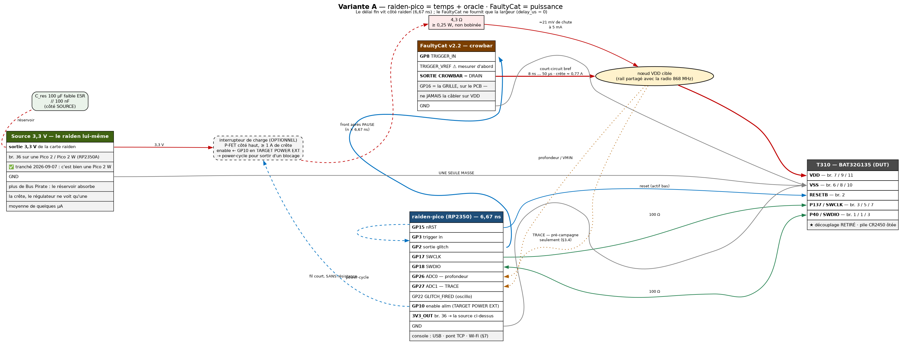

> 📎 **Note d'export.** Les images de ce document sont un **complément** : chaque schéma est
> **aussi** rendu en ASCII juste en dessous, donc le document reste complet et lisible une
> fois sorti du dépôt. Les quatre PNG sont regénérables par
> `python3 assets/schemas/src/gen_09_banc.py` (aucune dépendance Python tierce : le script
> produit du Graphviz et appelle `dot`).

```
   ── ALIMENTATION ET NŒUD DE GLITCH ────────────────────────────────────────────

   raiden 3,3 V ─────┬── C_res 100 µF faible ESR // 100 nF   ← réservoir, côté SOURCE
   (⚠ pas forcément br. 36 — §3.3)                                 de la résistance
                     │
                     │  [ interrupteur de charge — FACULTATIF ]
                     │    P-FET côté haut ≥1 A, enable ◄── GP10   → power-cycle
                     │
                     └──[ 4,3 Ω ≥0,25 W, non bobinée ]──┬────► T310 VCC / BAT32 VDD
                                                        │        (br. 7 / 9 / 11)
                                                        │      ★ découplage de la
                                                        │        carte RETIRÉ
                                                        │
                                                        ├──◄── FaultyCat SORTIE CROWBAR
                                                        │        (DRAIN du IRLML0060,
                                                        │         PAS la broche GP16)
                                                        │
                                                        ├──► raiden GP26 (ADC0)
                                                        └──► raiden GP27 (ADC1)

   ── LES TROIS BOÎTIERS ────────────────────────────────────────────────────────

   ┌───────────────────────────┐                    ┌──────────────────────────┐
   │  raiden-pico (RP2350)     │                    │  T310 / BAT32G135 (DUT)  │
   │  MAÎTRE : reset + SWD     │                    │                          │
   │   + délai fin + ALIM      │                    │                          │
   │  3V3_OUT (br. 36) ────────┼──► la chaîne ci-dessus                        │
   │  GP10 ────────────────────┼──► enable interrupteur (facultatif)           │
   │  GP15 nRST ───────────────┼───────────────────►│ RESETB     (br. 2)       │
   │  GP15 ────┐ (fil court,   │                    │                          │
   │  GP3  ◄───┘  sans R)      │                    │                          │
   │  GP17 SWCLK ──[100 Ω]─────┼───────────────────►│ P137/SWCLK (br. 3 / 5 / 7)│
   │  GP18 SWDIO ──[100 Ω]─────┼◄──────────────────►│ P40/SWDIO  (br. 1 / 1 / 3)│
   │  GND ─────────────────────┼────────────────────┤ VSS        (br. 6 / 8 / 10)│
   │  GP26 ◄───────────────────┼──── nœud VDD ci-dessus                        │
   │  GP27 ◄───────────────────┼──── nœud VDD ci-dessus                        │
   │  GP2 glitch out ──────────┼──┐                 │                          │
   │  GP22 GLITCH_FIRED ───────┼──┼──► sonde oscillo (facultatif)              │
   └───────────────────────────┘  │                 │                          │
                                  │                 │                          │
   ┌───────────────────────────┐  ▼                 │                          │
   │  FaultyCat v2.2           │  │                 │                          │
   │  ESCLAVE : largeur + FET  │  │                 │                          │
   │  GP8 TRIGGER_IN  ◄────────┼──┘                 │                          │
   │  TRIGGER_VREF ⚠ mesurer   │                    │                          │
   │       avant (§8 point 8)  │                    │                          │
   │  SORTIE CROWBAR ──────────┼──► nœud VDD ci-dessus                         │
   │  GND ─────────────────────┼────────────────────┤ VSS                      │
   └───────────────────────────┘                    └──────────────────────────┘

   ⚠ UNE SEULE MASSE COMMUNE : raiden, FaultyCat, alimentation et cible.
```

### 3.2 Réglages, dans l'ordre

```
# --- raiden-pico : LE DÉLAI FIN EST ICI ------------------------------------
TARGET BAT32
SWD SPEED 4                 # ~125 kHz. JAMAIS SPEED 0 (§0bis du 07)
SET PAUSE <n>               # n x 6,67 ns après le front de relâche de RESETB
SET WIDTH 1                 # GP2 n'est qu'un FRONT : la largeur minimale suffit
SET COUNT 1
TRIGGER GPIO RISING         # GP3, câblé sur GP15
ARM ON

# --- FaultyCat : LA LARGEUR EST ICI ----------------------------------------
faultycmd crowbar configure --trigger ext_rising --output hp --delay-us 0 --width-ns 2000
faultycmd crowbar arm
faultycmd crowbar fire --trigger-timeout-ms 3000   # BLOQUANT : dans un thread
```

> ⚠ **`fire` est bloquant** : le firmware ne répond qu'une fois le trigger reçu **ou** le
> délai écoulé. Le tir du raiden doit donc partir **pendant** cette attente, depuis un autre
> fil d'exécution — c'est le motif déjà employé au §9quater.3 du 07.
>
> ⚠ **`TRIGGER_TIMEOUT` ne veut pas dire « mauvais paramètres »** : cela veut dire que le
> front n'est jamais arrivé sur GP8. Vérifier `TRIGGER_VREF` et la masse commune **avant**
> de toucher au moindre paramètre de glitch.

### 3.3 Le budget électrique des 4,3 Ω — l'arithmétique, pas l'intuition

| Grandeur | Calcul | Conséquence |
|---|---|---|
| Chute en régime établi | 5 mA × 4,3 Ω = **21 mV** ; 30 mA (radio en TX) = **129 mV** | négligeable : la cible démarre normalement |
| **Courant crête pendant le tir** | 3,3 V / 4,3 Ω ≈ **0,77 A** *(valable avec le `R_on` ≈ 0,5 Ω du IRLML0060 ; avec un MOSFET moderne la crête LC monte à ~8 A — §4.4)* | **aucun régulateur de banc ne fournit ça en quelques µs** |
| Charge tirée pour un tir de 20 µs | 0,77 A × 20 µs ≈ **15 µC** | sur **100 µF** ⇒ ΔV ≈ **150 mV** : rail stable |
| *(le même calcul avec un réservoir trop petit)* | sur 10 µF ⇒ ΔV ≈ **1,5 V** | ⇒ **brownout de l'instrument, campagne ruinée** |
| Énergie dissipée dans la résistance | 2,5 W pendant 20 µs = **50 µJ** | thermiquement nul ; prendre **≥ 0,25 W et non bobinée** (une bobinée ajoute une inductance en série, exactement ce qu'on ne veut pas) |

⇒ **`[reco]` Le réservoir n'est pas optionnel** : **100 µF faible ESR + 100 nF, côté SOURCE**
de la résistance — **jamais côté cible**, où le §6.2 du 07 impose au contraire de retirer
le découplage.

**D'où vient ce 3,3 V ? — ★ du raiden lui-même, et c'est le réservoir qui l'autorise.**

⚠ **Correction d'une première rédaction de cette section.** Elle écartait le raiden au motif
qu'« un affaissement de son rail emporterait l'état SWD ». **C'est vrai sans réservoir, et
faux avec.** Le pic de 0,77 A ne vient *pas* du régulateur : il vient du condensateur, qui
est directement en travers du rail 3,3 V. Le régulateur, lui, ne rembourse que **15 µC par
tir** — à 10 tirs/s, cela fait **150 µA de moyenne**. Le rail du Pico encaisse les 150 mV de
creux calculés ci-dessus sans conséquence : le cœur RP2350 vit sur son propre 1,1 V, et
aucune transaction SWD n'a lieu pendant la fenêtre de tir.

⇒ **`[reco]` Source : la sortie 3,3 V de la carte raiden**, avec `C_res` **au plus près de
la broche**. C'est ce qui permet de **supprimer complètement le Bus Pirate du banc**.

⚠ **Ne pas recopier « broche 36 » sans vérifier** la sérigraphie de la carte réellement
présente avant de brancher quoi que ce soit.

> ⛔⛔ **CORRECTION DU 2026-09-07 — ce paragraphe portait un `[fait]` FAUX, et c'est la leçon
> la plus importante du document sur la provenance.** Il affirmait : *« la carte du banc n'est
> pas une Pico 2 : `STATUS` lit `PACKAGE_SEL` et rapporte **RP2350B, QFN-80, 48 GPIOs,
> PSRAM** `[fait]` »*. **C'est le firmware qui interprète mal `package_sel`**
> (`command_parser.c:552`), pas le silicium qui est exotique :
>
> - la **sérigraphie** de la carte porte `GP26_A0 / GP27_A1 / GP28_A2` — étiquetage de la
>   famille Raspberry Pi Pico ;
> - la **datasheet Pico 2 W (RP-008304-DS-3)** §1.2 dit *« **30** multi-function general
>   purpose I/O (four can be used for ADC) »* et §2.1 *« GPIO 26-28 … as **ADC inputs** »*.
>   **30 GPIO ⇒ RP2350A, QFN-60.**
>
> ⇒ La carte **est une Pico 2 W**, `GP26/GP27` **sont** bien ADC0/ADC1, et les fils de
> l'opérateur étaient sur les bonnes broches depuis le début. La question ouverte §12 item 8
> est **close**, et son corollaire sur le numéro de la broche 3,3 V tombe avec elle.
>
> ★ **Règle de provenance à en tirer** : *un `[fait]` dérivé d'une lecture logicielle ne vaut
> que ce que vaut le décodage qui le produit.* Une sérigraphie et un datasheet — deux
> instruments indépendants du firmware — ont tranché contre un registre lu par ce firmware.
> Préférer toujours une mesure dont l'instrument est indépendant de l'objet mesuré.

**Les trois autres fonctions qu'il assurait, et par quoi elles sont reprises :**

| Fonction | Reprise par |
|---|---|
| Power-cycle / POR | **`TARGET POWER EXT` + GP10** sur l'enable d'un interrupteur de charge côté haut. ⚠ Le placer **après** `C_res` (le réservoir reste chargé, la coupure est nette) et le choisir pour **passer la crête** — un P-FET type AO3401, **pas** un load-switch 200 mA. **Facultatif** : les option bytes se rechargent déjà sur `RESETB` (§28.1 `[UM]`, cité au §0 du 07) ; l'interrupteur sert à **sortir d'un blocage** après un tir raté, ce qui arrivera |
| Mesure V / I | **les ADC du raiden** — c'est déjà le montage (§3.4) |
| ★ **Tension variable** | **rien** — voir ci-dessous |

⚠ **La seule fonction réellement perdue est la tension réglable.** La phase 0 mesure le
plancher d'alimentation en descendant lentement la tension jusqu'à ce que la cible cesse de
démarrer : c'est ce qui donne le **seuil LVD réel** et borne le budget de profondeur (§6.3
du 07). Un `3V3_OUT` fixe ne sait pas faire ça. `[reco]` — un **petit régulateur ajustable**
(LM317, AMS1117-ADJ, module buck MP1584) inséré **en amont de `C_res`**, pour quelques
euros ; à défaut, une alimentation de laboratoire. **Cette mesure peut être différée, pas
supprimée** : sans elle, on balaie sans savoir si le LVD coupe avant que le creux ne serve à
quoi que ce soit.

### 3.3bis Quelle valeur pour la résistance série ? — ce qui décide vraiment

`[reco]` **Ce n'est pas la profondeur qui contraint le choix, c'est la capacité résiduelle
du rail.** Deux formules suffisent à s'en convaincre.

**Le plancher pendant le tir** est un simple diviseur entre la résistance série et le
`R_DS(on)` du MOSFET :

```
V_plancher = 3,3 V × R_on / (R_série + R_on)
```

Avec `R_on ≈ 0,5 Ω` (IRLML0060 piloté à 3,3 V de grille), **toutes** les valeurs usuelles
donnent un plancher très en dessous de `VPDR` (1,37 V) :

| `R_série` | Plancher | Crête *(majorée : `3,3/R`, `R_on` négligé)* | ΔV sur C_res 100 µF (tir de 20 µs) | Chute statique à 30 mA | Sensibilité `TRACE` | Rétablissement `3RC` si C_résid = 1 µF |
|---:|---:|---:|---:|---:|---:|---:|
| 2,2 Ω | 0,61 V | **1,5 A** | 300 mV | 66 mV | 2,7 LSB/mA | 6,6 µs |
| **4,3 Ω** | 0,34 V | 0,77 A | 150 mV | 129 mV | 5,3 LSB/mA | 13 µs |
| **10 Ω** | 0,16 V | 0,33 A | 66 mV | 300 mV | **12,4 LSB/mA** | 30 µs |
| 22 Ω | 0,07 V | 0,15 A | 30 mV | **660 mV** | 27,3 LSB/mA | 66 µs |

⚠ **La colonne « Crête » est en réalité un RÉGIME ÉTABLI**, pas une crête. Elle vaut
`3,3/R_série`, c'est-à-dire ce que la source pousse une fois l'oscillation amortie. La
**vraie crête** est celle de la maille LC — `I ≈ V/Z0` avec `Z0 = √(L_boucle / C_résid)` —
et elle vaut **~8 A** dans la configuration nominale (§4.4). Sans conséquence sur la
résistance, qui ne voit pas ce courant, mais **déterminante pour le choix du MOSFET** :
l'AO3400A est donné pour 30 A pulsés, l'IRLML0060 pour 1,2 A continus.

⚠ **`R_on = 0,5 Ω` est une hypothèse `[reco]`, pas une valeur lue.** L'IRLML0060 est un
composant **60 V** dont le `R_DS(on)` est spécifié à `Vgs = 10 V` ; piloté à 3,3 V il peut
être nettement plus haut. **Le plancher se lit à l'oscilloscope au premier tir** — c'est la
seule colonne du tableau qui bouge si `R_on` vaut 2 Ω plutôt que 0,5 Ω, et même dans ce cas
le plancher à 4,3 Ω reste à 1,05 V, **toujours sous `VPDR`**.

⚠ **Et dans l'autre sens** : avec un MOSFET *bien plus* conducteur (AO3400A, 19 mΩ), la
colonne « plancher » de ce tableau devient **fausse par excès de pessimisme** — 15 mV au
lieu de 0,34 V — **et le ringing prend sa place comme facteur limitant**. Poser la
`R_damp` du §4.4 rend au tableau sa validité **telle quelle**.

⇒ **Entre ~2 et ~22 Ω, la profondeur n'est jamais le facteur limitant.** Chercher une valeur
« qui descend plus bas » est une fausse piste.

**Ce qui contraint réellement, c'est le rétablissement du rail** — et c'est là que la
résistance série n'est plus symétrique :

```
τ_descente  = (R_on ∥ R_série) × C_résiduelle  ≈  R_on × C_résiduelle   (car R_on << R_série)
τ_remontée  =            R_série × C_résiduelle
                                               (rétablissement pratique ≈ 3τ)
```

> ⚠⚠ **Ce modèle `τ = R_on × C` est calibré sur l'IRLML0060, et il ne se transporte pas.**
> Il marche ici par **coïncidence** : le `R_on` supposé (0,5 Ω) vaut à peu près
> `Z0 = √(L_boucle / C_résid)`, donc l'amortissement est quasi critique et l'inductance de
> boucle reste invisible. Avec un **AO3400A à 19 mΩ**, la coïncidence disparaît : la maille
> devient fortement sous-amortie, le rail **oscille jusqu'à −2,37 V** et la crête de courant
> monte à **8 A**. ⇒ **§4.4**, qui donne la règle de rattrapage
> (`R_damp ≈ Z0`) et la protection des entrées ADC qui en découle.

★ **C'est cette asymétrie qui fait marcher le montage.** Pendant le tir, la source continue de pousser du courant à travers `R_série`,
mais le MOSFET l'emporte largement : la descente se fait donc en `R_on × C`, la remontée en
`R_série × C`. À 10 Ω, la remontée est **20 fois plus lente que la descente** — on obtient
un front descendant net et une relâche douce, ce qui est exactement le profil recherché. En
contrepartie, **c'est la remontée qui consomme le budget de 300 µs**, pas l'impulsion.

★ **Et il y a un plafond dur** : `TPW = 300 µs`, la largeur minimale de POR du BAT32
(§6.3 du 07). **Un creux plus court que 300 µs ne déclenche pas de POR** — donc
`impulsion + 3τ` doit rester nettement sous ces 300 µs, sinon on ne faute pas la puce, on
la redémarre. Avec `C_résiduelle = 10 µF` (rail non dénudé, radio comprise), 10 Ω donne déjà
`3τ = 300 µs` : **on est exactement sur la limite du POR**.

### La règle de choix, en trois lignes

1. **Garder 4,3 Ω pour la mise en route.** C'est le meilleur compromis à capacité inconnue :
   plancher à 0,34 V, crête de 0,77 A que le IRLML0060 (1,2 A continus) et un réservoir de
   100 µF absorbent sans broncher, et un rétablissement court même si la carte est encore
   capacitive. **4,7 Ω (série E12, bien plus courante) est électriquement identique ici** —
   9 % d'écart, aucune conséquence sur les colonnes ci-dessus. Ne pas courir après la valeur
   exacte.
2. **Puis mesurer, une seule fois.** Un tir de test, l'oscilloscope sur le nœud VDD :
   relever le **plancher** et la **constante de remontée τ**. Alors
   `C_résiduelle = τ / R_série` — et c'est ce chiffre-là, pas la valeur de la résistance, qui
   dit si la carte est prête.
3. **Enfin, arbitrer :**
   - `C_résiduelle ≲ 1 µF` (carte bien dénudée) ⇒ ★ **passer à 10 Ω** : `3τ = 30 µs`, dix
     fois sous le plafond POR, crête divisée par deux, et surtout **2,3× de sensibilité en
     plus sur `TRACE`** — ce qui **supprime le besoin de changer de résistance entre la
     phase 0bis et la campagne** (§3.4). C'est la meilleure valeur *si la mesure l'autorise*.
   - `C_résiduelle ≳ 5 µF` ⇒ **rester à 4,3 Ω**, et surtout **retirer davantage de
     condensateurs**. Descendre la résistance à 2,2 Ω pour compenser est un mauvais échange :
     on paie 1,5 A de crête et 300 mV d'affaissement du réservoir pour un gain qui appartient
     au condensateur, pas à la résistance.
   - **Au-delà de 22 Ω, ne pas y aller** : 0,66 V de chute statique dès que la radio émet,
     et un rétablissement qui flirte avec le POR.

⚠ **Détails de mise en œuvre qui comptent** :
- **Résistance non bobinée** (couche métal ou carbone). Une bobinée ajoute une inductance en
  série avec le rail — exactement l'élément parasite qu'on cherche à éviter.
- **La monter sur borne à vis ou support**, pas soudée en dur : sa valeur est un
  **paramètre mesuré**, pas un choix définitif, et on doit pouvoir l'échanger en dix
  secondes.
- **Jamais un potentiomètre** : inductance, mauvais contact, et tenue en puissance
  inconnue sur un pic de 0,77 A.

### 3.4 Ce que les deux ADC mesurent — et quand

Les deux entrées ADC sont sur le **nœud cible**, donc du **même côté que le drain du
crowbar**. Elles lisent donc `V_source − I × 4,3 Ω`, ce qui veut dire deux choses
différentes selon le moment :

| Moment | Ce que GP26/GP27 lisent | Usage |
|---|---|---|
| **Crowbar au repos** (phase 0bis, aucun tir) | la chute ohmique ⇒ **image du courant consommé** | cartographie de consommation du boot : c'est ce qui localise la lecture d'`OCDEN` |
| **Pendant un tir** | le rail effondré | **profondeur du creux**, pas un courant |

⚠ **GP27 n'est donc PAS un capteur de courant pendant les tirs.** Une `TRACE` prise au
milieu d'un balayage ne mesure pas ce qu'on croit : la cartographie de consommation est une
mesure **pré-campagne**, à faire une fois, crowbar désarmé.

⚠ **Résolution.** Avec 4,3 Ω, l'ADC lit ~3,28 V au repos, soit le haut de l'échelle
(0,8 mV/LSB ⇒ 5 mA ≈ 27 LSB). C'est **suffisant pour voir le creux du glitch**, et **juste**
pour le profil de consommation. ⇒ **Si la phase 0bis manque de sensibilité, c'est un
argument de plus pour passer à 10 Ω** — mais seulement si la capacité résiduelle mesurée
l'autorise : la décision se prend au **§3.3bis**, pas ici.

---

## 4. Variante B — raiden seul, MOSFET externe

À construire **si la cadence de tir devient le facteur limitant** (§9, critère de bascule).

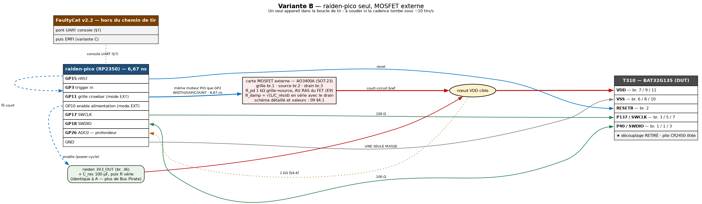

`TARGET POWER EXT AHIGH` retaskise le groupe d'alimentation : **GP10 = enable de la source,
GP11 = grille du crowbar**, pilotée par le même moteur PIO que GP2 (mêmes `WIDTH`/`GAP`/
`COUNT`, même trigger). Un seul appareil dans la boucle, un seul `ARM`, plus d'aller-retour
USB vers un second firmware.

```
   3,3 V ── C_res ──[ 4,3 Ω ]──┬────────► T310 VCC        (identique à la variante A)
                               │
   raiden GP11 ──► grille d'un N-FET (AO3400A) : drain → ce nœud, source → VSS
                   ⚠ avec pull-down 1 kΩ et R_damp — §4.1, ce n'est PAS un fil direct
   raiden GP10 ──► enable de la source 3,3 V              (facultatif, pour le power-cycle)
   raiden GP15 ──► RESETB          GP3 ◄── GP15
   raiden GP17/GP18 ──[100 Ω]──► SWCLK / SWDIO
   raiden GP26/GP27 ──[1 kΩ]──► nœud VDD                  ⚠ résistance ajoutée — §4.4

   FaultyCat : hors du chemin de tir (pont UART, puis EMFI)
```

| | Variante A | Variante B |
|---|---|---|
| Matériel à fabriquer | rien | une petite carte MOSFET |
| Résolution du délai | 6,67 ns (raiden) | 6,67 ns (raiden) |
| Résolution de la largeur | 8 ns (FaultyCat) | 6,67 ns (raiden) |
| Appareils dans la boucle de tir | **2** | **1** |
| Cadence | bornée par deux piles USB | bornée par la cible |

> ⚠ **Polarité de la grille.** `AHIGH` = assertion à l'état haut, repos bas (N-FET côté
> bas — le cas usuel) ; `ALOW` pour un P-FET côté haut. La grille est **au repos désarmé**
> au boot et sur `ARM OFF`, mais **une grille non câblée n'est pas une grille au repos** :
> en variante A, laisser **GP11 non connecté**, pas connecté « au cas où ».

> 📎 Les six sous-sections qui suivent ont été écrites **après** avoir chiffré le montage.
> Le firmware, lui, était déjà prêt : `include/config.h:37` déclare `PIN_CROWBAR_GATE 11`,
> `target_set_power_mode()` (`src/target_uart.c:1430`) retaskise le groupe, et
> `target_crowbar_gate_idle()` (`src/target_uart.c:1402`) pose un repos **piloté**, sans
> fenêtre haute impédance ni assert parasite. **Il ne manquait que la carte.**

---

### 4.1 La carte crowbar — schéma complet et nomenclature

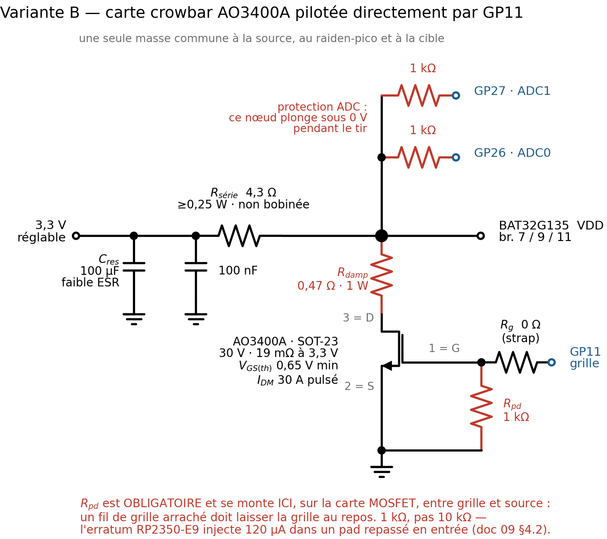

```
   3,3 V ──┬── C_res 100 µF//100 nF ──[ R_série 4,3 Ω ]──┬──────► BAT32G135 VDD
   réglable│         (côté SOURCE)     ≥0,25 W non bob.  │        (br. 7 / 9 / 11)
           │                                             │
          GND                                            ├──[ 1 kΩ ]──► GP26 · ADC0
                                                         ├──[ 1 kΩ ]──► GP27 · ADC1
                                                         │    ⚠ §4.4 — protection
                                                         │
                                                   [ R_damp ]  ⚠ §4.4 — valeur à mesurer
                                                         │
                                                  br.3 = DRAIN
   GP11 ──[ R_g 0 Ω ]──┬───────── br.1 = GRILLE ─┤ AO3400A (SOT-23)
     grille            │                          └ br.2 = SOURCE
                  [ R_pd 1 kΩ ]                        │
                       │                               │
                       └───────────────────────────────┴──► GND (étoile, banc entier)
```

**Brochage AO3400A, SOT-23** — vu de DESSUS, la broche **seule**, en face des deux autres,
est le **DRAIN** :

```
        ┌───┐  3 = DRAIN          broche 1 = GRILLE
        │   ├─────                broche 2 = SOURCE
        │   │                     broche 3 = DRAIN
        │   ├──┬──
        └───┘  │
         1=G  2=S
```

Valeurs du datasheet `[AOS Rev 3.1, juillet 2023]` : `V_DS` 30 V · `V_GS` ±12 V ·
`I_D` 5,7 A · **`I_DM` 30 A pulsé** · `P_D` 1,4 W · **`V_GS(th)` 0,65 / 1,05 / 1,45 V**
(min/typ/max à `I_D` = 250 µA) · `R_DS(on)` **19 mΩ typ / 32 mΩ max à `V_GS` = 4,5 V**,
24/48 mΩ à 2,5 V · `C_iss` 630 pF · `R_g` interne 3 Ω typ · `Q_g` 6 nC typ.

| Rep. | Valeur | Note |
|---|---|---|
| Q1 | **AO3400A** SOT-23 | sur breakout SOT-23→DIP, ou perfboard 2×3 cm |
| R_pd | **1 kΩ** 1/16 W | grille→source, **au ras du MOSFET** — §4.2 |
| R_g | **0 Ω** (strap) | empreinte conservée ; toute valeur ≥10 Ω ne fait que ralentir le front |
| R_damp | **jeu de 0,15 / 0,47 / 1,2 Ω** 1 W non bobinées | en série avec le drain ; **la valeur se choisit après mesure** — §4.4 |
| R_adc ×2 | **1 kΩ** | en série sur GP26 et GP27, **à poser en premier** — §4.4 |

Câblage : grille **torsadée avec un retour de masse**, drain **court et gros**, source
directement sur la masse étoile. Une seule masse commune (§8 règle 1).

⚠ **Contrefaçons AO3400 fréquentes.** Contrôle au multimètre **avant** soudure, en mode
diode : rouge sur br. 2 (S), noir sur br. 3 (D) ⇒ **0,5–0,7 V** (diode de corps, `V_SD`
typ 0,7 V) ; sens inverse ⇒ OL ; grille isolée des deux autres ⇒ OL. Tout autre résultat
= rebut.

---

### 4.2 Le pull-down de grille — **1 kΩ**, et pourquoi ni 10 kΩ ni 100 Ω

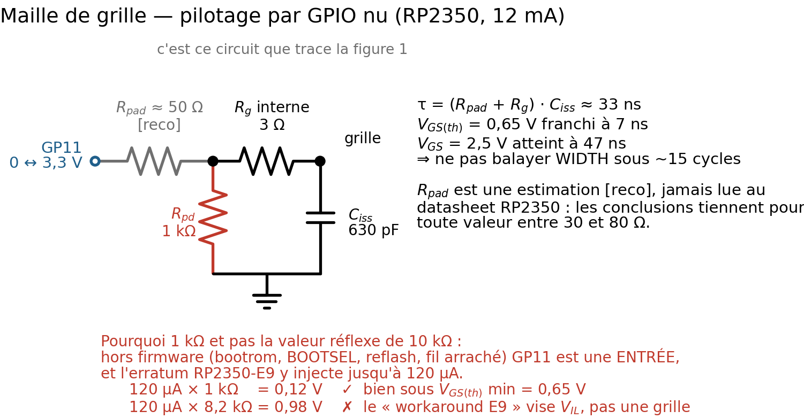

```
   GP11 ──[ R_pad ≈ 50 Ω ]──┬──[ R_g interne 3 Ω ]──┬── grille
   0 ↔ 3,3 V   [reco]       │                       │
                       [ R_pd 1 kΩ ]           [ C_iss 630 pF ]
                            │                       │
                            └───────────┬───────────┘
                                       GND
```

**Le pull-down est obligatoire.** `V_GS(th)` min = **0,65 V** : une grille flottante n'est
pas une grille au repos, et le MOSFET conduit alors en permanence — **court-circuit franc
du rail**.

Le firmware pilote GP11 en sortie (repos 0 V en `AHIGH`, jamais haute impédance,
`target_uart.c:1402-1415`) `[fw]`. **La fenêtre de danger est donc hors firmware** :
bootrom avant `target_init()`, BOOTSEL / reflash UF2, plantage, et **fil de grille
débranché**. Dans cette fenêtre GP11 est une **entrée**, et l'**erratum RP2350-E9** y
injecte jusqu'à **120 µA**. Le critère de choix est donc `120 µA × R_pd < V_GS(th)` :

| `R_pd` | `V_grille` sous E9 | Verdict |
|---:|---:|---|
| 10 kΩ | 1,20 V | ❌ **le réflexe habituel est faux sur RP2350** |
| 8,2 kΩ *(le « workaround E9 » des notes d'application)* | 0,98 V | ❌ il vise `V_IL` (0,99 V), **pas une grille de MOSFET** |
| 4,7 kΩ | 0,56 V | ⚠ 14 % de marge, et les deux bornes bougent du mauvais côté : 120 µA est un *max*, et 0,65 V est un `V_GS(th)` **à 25 °C** qui dérive de ~−2 mV/°C |
| **1 kΩ** | **0,12 V** | ✅ **retenu** — facteur 5 de marge, insensible à la température |
| 100 Ω | 0,012 V | ✅ sûr, mais inutile derrière un GPIO nu — §4.3 |

⚠ **Le pull-down se monte physiquement sur la carte MOSFET**, entre grille et source, pas
côté Pico. C'est le seul montage où **un fil de grille arraché laisse la grille au repos**.

#### Ce que la montée de grille impose au balayage

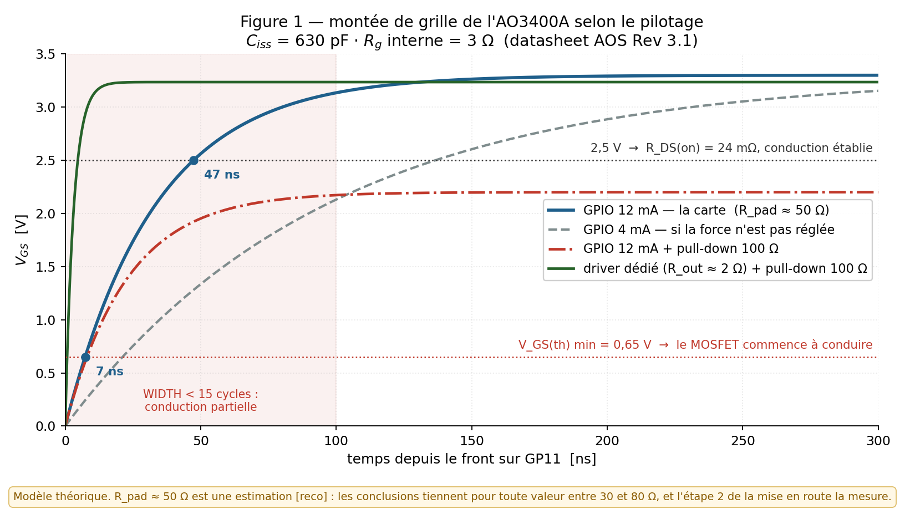

`τ` = (`R_pad` + `R_g`) × `C_iss` ≈ **33 ns** (GP11 est bien à **12 mA** : `target_init()`
le règle au boot pour tout le groupe GP10/11/12, `src/target_uart.c:342-346`, et
`gpio_set_function` / `pio_gpio_init` ne touchent pas au champ DRIVE du pad) `[fw]`.

| Pilotage | Asymptote `V_GS` | Seuil 0,65 V | 2,5 V |
|---|---:|---:|---:|
| **GPIO 12 mA — la carte** | 3,30 V | **7,3 ns** | **47,3 ns** |
| GPIO 4 mA (force non réglée) | 3,30 V | 21 ns | 139 ns |
| GPIO 12 mA + pull-down 100 Ω | **2,20 V** | 6 ns | jamais |
| Driver dédié + pull-down 100 Ω | 3,24 V | 0,3 ns | 2 ns |

⚠ **`R_pad ≈ 50 Ω` est une estimation `[reco]`, jamais lue au datasheet RP2350.** Elle
porte trois calculs de cette section ; les conclusions tiennent pour **tout `R_pad` entre
30 et 80 Ω**, et l'étape 2 du §4.7 la mesure directement.

---

### 4.3 Le driver dédié — le seul montage où 100 Ω est la bonne valeur


```
   GP11 ──► [ UCC27511 / TC4427 ]  OUT ──┬──────── grille AO3400A
              R_out ≈ 2 Ω               │              drain → nœud VDD
              VDD 3,3–5 V          [ 100 Ω ]           source → GND
                                        │
                                       GND
```

Le pull-down de 100 Ω qu'on voit sur beaucoup de montages de crowbar **n'est pas une
erreur** : c'est la valeur d'un montage à **driver de grille dédié**. Avec `R_out` ≈ 2 Ω,
`τ` tombe à 1,6 ns et les 33 mA de charge statique ne gênent pas un composant prévu pour
l'ampère.

**Derrière un GPIO nu, la même résistance forme un diviseur** : `V_GS` plafonne à 2,2 V et
le pad débite 23 mA alors qu'il est donné pour 12. Le coût réel est dérisoire (le plancher
passe de 15 mV à 23 mV) — mais le gain l'est aussi. ⇒ **1 kΩ sur la carte, 100 Ω le jour
où un driver entre dans la boucle.** `[reco]`

---

### 4.4 ★ L'amortissement de drain — ce que le §3.3bis ne pouvait pas voir

Le §3.3bis modélise la descente par `τ = R_on × C_résiduelle`. **Ce modèle est calibré sur
l'IRLML0060**, dont le `R_on` supposé (0,5 Ω) se trouve valoir à peu près `Z0` — donc
amortissement quasi critique, par coïncidence. **L'AO3400A à 19 mΩ casse la coïncidence.**

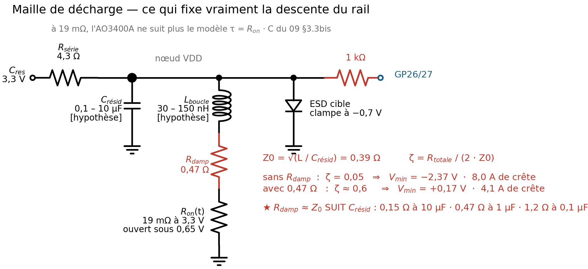

```
   C_res ──[ R_série 4,3 Ω ]──┬── nœud VDD ──┬──[ ESD cible ] ──┬──[ 1 kΩ ]──► GP26/27
                              │              │   clampe −0,7 V  │
                        [ C_résid ]    [ L_boucle ]            GND
                        0,1 – 10 µF    30 – 150 nH
                        [hypothèse]    [hypothèse]
                             │              │
                            GND       [ R_damp ]
                                            │
                                      [ R_on(t) ]  19 mΩ à 3,3 V, ouvert sous 0,65 V
                                            │
                                           GND

   Z0 = √(L / C_résid)          ζ = R_totale / (2 · Z0)
```

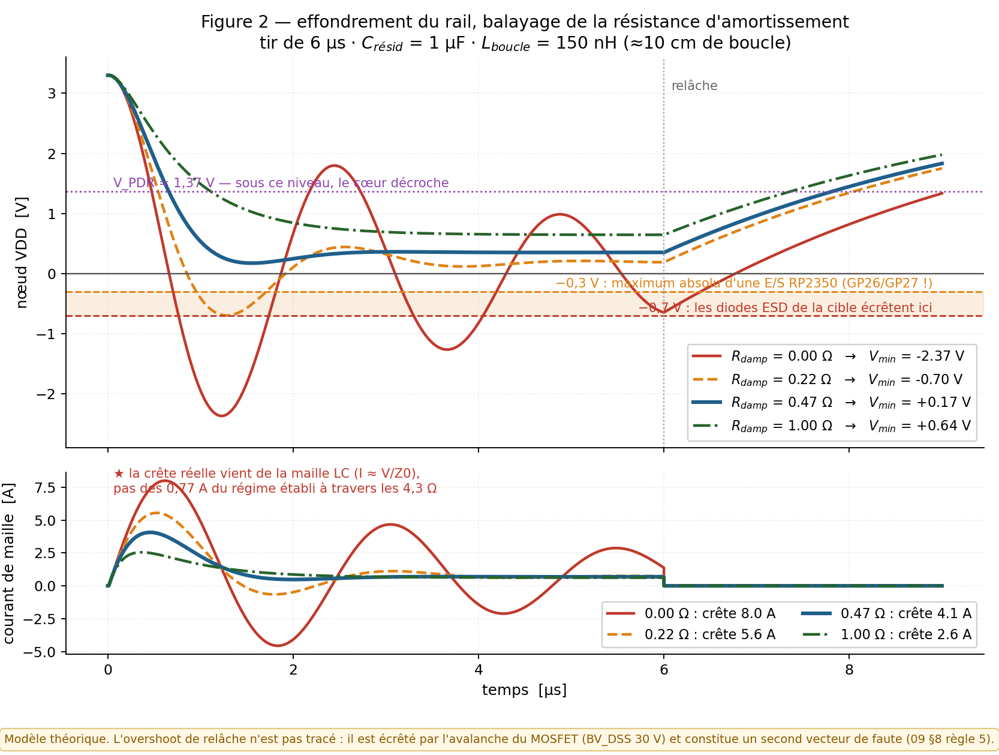

Modèle RLC intégré (`solve_ivp`, `R_on(t)` asservi à `V_GS(t)`), tir de 6 µs,
`C_résid` = 1 µF, `L_boucle` = 150 nH — **et recoupé indépendamment par ngspice à 0,7 %
près** (§4.8) :

| `R_damp` | `V_min` du nœud VDD | Plancher établi | Crête de courant |
|---:|---:|---:|---:|
| **0 Ω** | **−2,37 V** ⚠ | 0,031 V | **8,0 A** |
| 0,22 Ω | −0,70 V | 0,189 V | 5,6 A |
| **0,47 Ω** | **+0,17 V** ✅ | **0,351 V** | 4,1 A |
| 1,0 Ω | +0,64 V | 0,643 V | 2,6 A |

Trois conséquences, dans l'ordre d'importance.

**★★ 1. La crête de courant réelle est ~8 A, pas 0,77 A.** Les 0,77 A du §3.3bis sont le
**régime établi** à travers les 4,3 Ω ; la vraie crête est celle de la maille LC,
`I ≈ V/Z0` = 3,3/0,39. L'**AO3400A l'encaisse sans discussion** (`I_DM` = 30 A) ;
l'IRLML0060 (1,2 A continus) beaucoup moins confortablement. La résistance de 4,3 Ω, elle,
**ne voit pas ce courant** — son dimensionnement 0,25 W reste bon.

**★★ 2. `R_damp` n'est pas un nombre, c'est une règle : `R_damp ≈ Z0 = √(L / C_résid)`.**

| `C_résid` mesurée | `Z0` (à `L` = 150 nH) | `R_damp` à poser | Plancher qui en résulte |
|---:|---:|---:|---:|
| 10 µF | 0,12 Ω | 0,15 Ω | 0,12 V |
| **1 µF** | **0,39 Ω** | **0,47 Ω** | **0,35 V** |
| 100 nF | 1,22 Ω | **1,2 Ω** | 0,83 V |

⚠ **Le tracé ne suffit pas** : ramener la boucle de 10 à 3 cm (150 → 30 nH) donne
`ζ` ≈ 0,055 au lieu de 0,05 — ça sonne juste plus vite. **Seule une résistance en série
avec le drain amortit.** Et 0,47 Ω n'est la bonne valeur **que si `C_résid` vaut ≈1 µF** :
à 100 nF — précisément la cible que vise la règle 3 du §3.3bis — elle laisse encore
**−0,63 V** sur le nœud. ⇒ **`R_damp` se choisit APRÈS l'étape 5 du §4.7.**

À 1 µF, les 0,47 Ω ramènent le plancher à **0,35 V**, c'est-à-dire **exactement la valeur
que le tableau du §3.3bis tabule déjà** — qui redevient donc valable tel quel.

**★ 3. GP26 et GP27 sont galvaniquement sur ce nœud** (§3.1), et le maximum absolu d'une
E/S RP2350 est **−0,3 V**. ⇒ **1 kΩ en série sur chaque entrée ADC**, à poser **avant le
premier tir** : le clamp interne limite alors à (2,4 − 0,7)/1 kΩ ≈ 1,7 mA, dans le
tolérable. 1 kΩ ne dégrade ni la bande passante `TRACE` (échantillonneur ~2 ns) ni la
lecture. **Pas de condensateur** : 1 nF donnerait 1 µs de constante et tuerait la
résolution de `TRACE` à 500 ksps.

> ⚠ **Ce qui n'est PAS modélisé** : l'overshoot de relâche, c'est-à-dire l'énergie stockée
> dans `L_boucle` au moment où le MOSFET s'ouvre. En pratique il est écrêté par l'avalanche
> du MOSFET (`BV_DSS` 30 V), et c'est **un second vecteur de faute, distinct** — déjà noté
> à la règle 5 du §8.

---

### 4.5 Combien de découplage faut-il retirer de la carte cible ?

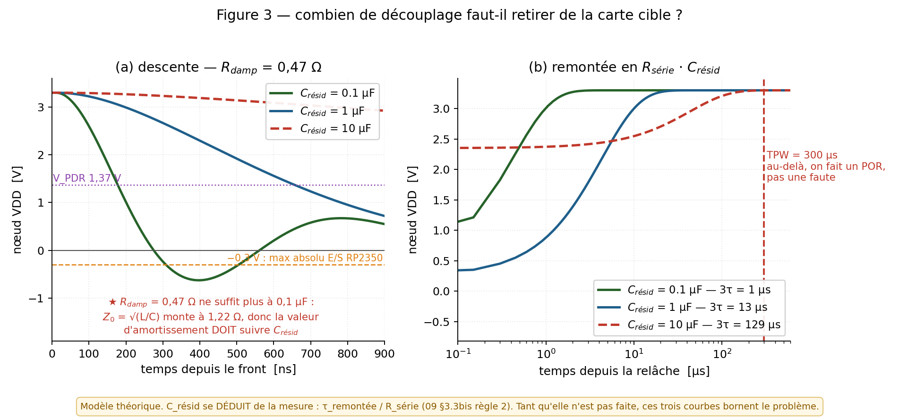

| `C_résid` | `V_min` (avec `R_damp` = 0,47 Ω) | `3τ` de remontée | Verdict |
|---:|---:|---:|---|
| 0,1 µF | −0,63 V | **1 µs** | ✅ profondeur et rapidité, mais **`R_damp` doit passer à 1,2 Ω** |
| 1 µF | +0,17 V | 13 µs | ✅ le cas nominal |
| 10 µF | +2,35 V | 129 µs | ❌ **le rail ne s'effondre pas** — retirer davantage de condensateurs |

Le plafond dur reste `TPW` = 300 µs (§6.3 du 07) : `impulsion + 3τ` doit rester nettement
en dessous, **sinon on ne faute pas la puce, on la redémarre**. À 10 µF on en consomme déjà
43 %.

⇒ `C_résid` **se déduit** de la mesure : `C_résid = τ_remontée / R_série` (§3.3bis règle 2).
Tant qu'elle n'est pas faite, ces trois courbes **bornent** le problème.

---

### 4.6 Les deux planchers de `WIDTH` — et ils ne disent pas la même chose

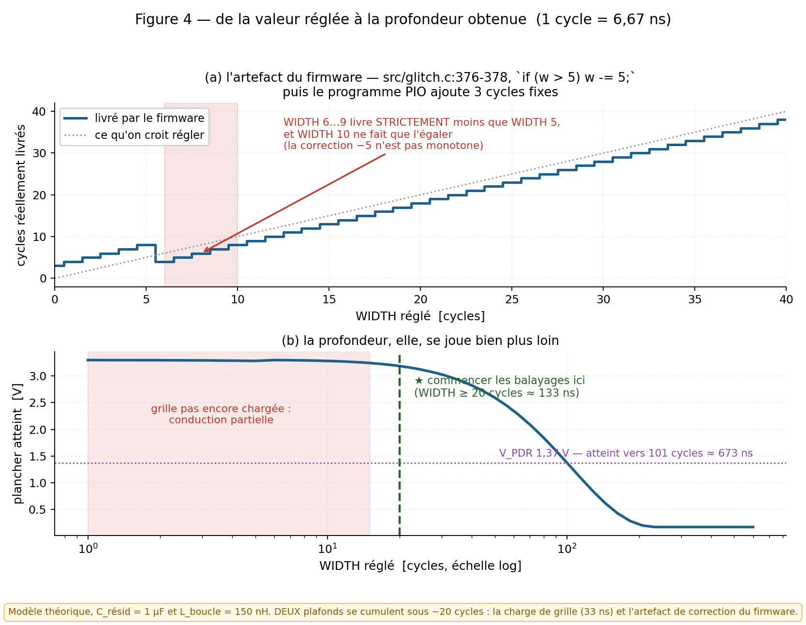

En variante A, `SET WIDTH 1` est correct : GP2 n'est qu'un **front**, la largeur est réglée
côté FaultyCat. **En variante B, GP11 porte la largeur réelle** — et deux plafonds
distincts se cumulent.

**Plancher instrumental — 133 ns (20 cycles).** En dessous, la valeur réglée ne veut rien
dire, pour deux raisons indépendantes :

1. **La grille.** Sous ~15 cycles, `V_GS` n'a pas atteint 2,5 V : le MOSFET n'est que
   partiellement passant et la relation `WIDTH` → profondeur n'est plus linéaire (§4.2).
2. ⚠ **Le firmware.** `src/glitch.c:376-378` applique `if (w > 5) w -= 5;`, et
   `src/glitch.pio:92-104` tient le pad haut pendant `mov x, isr` (1 cycle) +
   `set pins, 1` (1) + `jmp x--` exécuté `W+1` fois — soit **`W + 3` cycles**. Vérifié à
   la source, pas déduit. `[fw]`

   | `WIDTH` réglé | Chargé dans le PIO | Cycles réellement hauts |
   |---:|---:|---:|
   | 0 | 0 | **3** (≈20 ns — le vrai minimum) |
   | 5 | 5 | **8** |
   | 6 | 1 | **4** ⚠ |
   | 9 | 4 | 7 ⚠ |
   | 10 | 5 | 8 — *égale* `WIDTH` 5 |
   | ≥ 11 | `W−5` | `W − 2` |

   ⇒ **`WIDTH` 6 à 9 livrent strictement moins que `WIDTH` 5, et `WIDTH` 10 ne fait que
   l'égaler.** Le minimum réel est **3 cycles ≈ 20 ns**, et non 6,67 ns comme l'annonçait
   `raiden-pico/README.md` (corrigé dans la même passe).

**Plancher utile — ≈ 673 ns (101 cycles).** C'est là que le rail passe sous `VPDR` = 1,37 V
à `C_résid` = 1 µF. En dessous, le tir est propre mais **ne faute rien**.

⇒ **C'est le second qui borne le balayage.** La plage `width_ns` 1000–20000 retenue à la
phase 2 du §9 démarre donc au bon endroit — mais on sait enfin **pourquoi**, et de combien
la marge est confortable.

---

### 4.7 Mise en route — ordre non négociable

Chaque étape se valide **avant** de passer à la suivante.

0. **Débrancher physiquement les fils GP10/11/12 → nœud VDD** (runbook, §« nœud de
   glitch »). En variante B, GP11 part vers la **grille**, jamais vers le rail. Puis
   `TARGET POWER EXT` pour que le firmware cesse de croire qu'il alimente la cible.
   ★ **Poser les deux 1 kΩ de GP26/GP27 dès maintenant** : l'étape 4 se fait volontairement
   `R_damp` au strap, donc dans la configuration où l'excursion négative est maximale.
1. **Repos de grille, carte MOSFET débranchée.** Oscilloscope sur GP11 : `TARGET POWER EXT`
   + `AHIGH` ⇒ **0 V piloté**. Vérifier qu'il le reste à travers reset du RP2350, entrée
   BOOTSEL, reflash UF2, débranchement USB. **Une polarité de repos fausse laisse le MOSFET
   passant en permanence.**
2. **Grille seule connectée, drain en l'air.** Utiliser le script déjà écrit,
   `raiden-pico/scripts/crowbar_scope_test.py` (**CH1 = GP2, CH2 = GP11**, trigger montant
   sur GP2, ~200 ns/div — GP2 et GP11 partent du même `wait 1 irq 0`, au même cycle).
   `ARM ON` puis `GLITCH` : vérifier l'impulsion, **mesurer le temps de montée réel**
   (attendu 30–50 ns) et confirmer le retour à 0 V.
   ⚠ `tests/test_power_mode.py:194-197` le rappelle : **GP11 doit avoir sa propre ligne**,
   surtout pas rester strappé au harnais GP10/GP12 — sinon il se bat contre GP10.
3. **Drain connecté, cible non alimentée.** Puis mise sous tension : le nœud VDD doit se
   poser à 3,3 V − I·4,3 Ω. **Toute conduction permanente = arrêt immédiat.**
4. **Premier tir, oscilloscope sur le nœud VDD**, `R_damp` encore au strap. Relever :
   plancher · temps de descente · **fréquence et amplitude du ringing** · **excursion
   négative** · constante de remontée `τ`.
5. **Arbitrage.** `C_résid = τ / R_série`, puis poser `R_damp ≈ √(L_boucle / C_résid)`
   selon le tableau du §4.4. Si l'excursion négative passe sous −0,7 V ou si les résultats
   sont erratiques, c'est que `R_damp` est trop faible pour la capacité réelle.
6. `pytest tests/ -v --config=power-ext` **uniquement crowbar débranché de la cible** — ce
   mode *tire*.

| Critère de recette | Attendu |
|---|---|
| GP11 au repos, tous états (reset, BOOTSEL, USB débranché) | **0 V**, jamais > 0,65 V |
| Montée de grille sur `GLITCH` | 30–50 ns jusqu'à 2,5 V |
| Plancher du nœud VDD pendant le tir | 0,12 à 0,83 V selon `R_damp` — **très sous `VPDR` = 1,37 V** |
| Excursion négative du nœud VDD | **> −0,7 V** une fois `R_damp` posée |
| `impulsion + 3τ_remontée` | **≪ 300 µs** (`TPW`) |
| Cadence de tir | > 10 tirs/s, sinon la bascule n'a rien réglé |

---

### 4.8 Reproduire les figures — et le recoupement qui les valide

```bash
python3 assets/schemas/src/gen_09_crowbar_schemas.py    # les 4 schémas  → 09_crowbar_*.png|svg
python3 assets/schemas/src/gen_09_crowbar_courbes.py      # les 4 courbes  → 09_courbe_*.png
python3 assets/schemas/src/check_09_crowbar_spice.py  # recoupement ngspice — DOIT sortir en 0
```

Dépendances : `schemdraw`, `matplotlib`, `numpy`, `scipy`, et le binaire `ngspice`.

★ **Les figures 2 à 4 ne sont pas des dessins, ce sont des résultats recoupés.** Le modèle
Python (`solve_ivp`, `R_on` variable avec `V_GS(t)`) et une netlist ngspice indépendante
(interrupteur idéal à 19 mΩ) tombent sur les mêmes valeurs :

| `R_damp` | `V_min` scipy | `V_min` ngspice | écart | `I_crête` scipy | ngspice | écart |
|---:|---:|---:|---:|---:|---:|---:|
| 0 Ω | −2,372 V | −2,394 V | **0,7 %** | 8,00 A | 8,03 A | 0,4 % |
| 0,22 Ω | −0,698 V | −0,709 V | 0,3 % | 5,55 A | 5,57 A | 0,3 % |
| 0,47 Ω | +0,172 V | +0,167 V | 0,2 % | 4,07 A | 4,08 A | 0,2 % |
| 1,0 Ω | +0,644 V | +0,638 V | 0,2 % | 2,55 A | 2,56 A | 0,1 % |

`check_09_crowbar_spice.py` **sort en code 1** dès qu'un écart dépasse 10 %.

⚠ On appelle le binaire `ngspice -b`, **pas PySpice** : PySpice 1.5 refuse ngspice 47
(« Unsupported Ngspice version ») et réclame `libngspice.so`, que `ldconfig` n'expose pas.

⚠⚠ **Concorder n'est pas être juste.** `L_boucle` et `C_résid` restent des **hypothèses** ;
`R_pad ≈ 50 Ω` est une estimation `[reco]`. Ces figures bornent le problème et fixent
l'ordre de grandeur — **seules les mesures des étapes 2, 4 et 5 du §4.7 les remplacent.**

---

## 5. Variante C — EMFI (plus tard), positionnement **manuel**

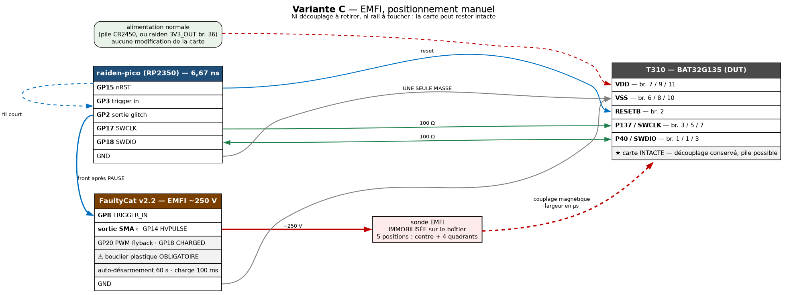

L'EMFI lève les deux contraintes les plus pénibles du crowbar : **plus besoin de retirer le
découplage**, et **plus besoin de toucher au rail d'alimentation**. La carte peut rester
intacte, voire tourner sur sa pile.

```
   raiden GP15 ──► RESETB          GP3 ◄── GP15    (chaîne de trigger identique à A)
   raiden GP2  ──► FaultyCat GP8 TRIGGER_IN
   raiden GP17/GP18 ──[100 Ω]──► SWCLK / SWDIO     (oracle inchangé)
   FaultyCat SMA ──► sonde EMFI, posée sur le boîtier du BAT32
   masse commune raiden ↔ FaultyCat ↔ cible

   ⚠ Bouclier plastique HV OBLIGATOIRE. Ne jamais toucher la sortie SMA ni le
     condensateur HV lorsque l'appareil est armé. Auto-désarmement 60 s côté firmware,
     et invariant de charge de 100 ms — ce sont des sécurités de pilote, pas des options.
```

**Ce qui change dans les paramètres** : la largeur s'exprime en **µs** (et non en ns), et
l'axe « power » devient la **cible de charge HV en ticks ADC** — ce n'est plus un choix de
chemin de sortie. Le protocole vit sur **CDC0**, mêmes opcodes `0x01`, `0x10`–`0x14`.

**Procédure manuelle** (pas de plateau XY sur ce banc) :

1. **Repérer le die.** Sur QFN32/LQFP32 il est centré et occupe ~40 % de la surface du
   boîtier. Marquer **5 positions** au feutre fin — centre + 4 quadrants — plutôt que
   d'essayer de balayer.
2. **Une position = une campagne de délai complète**, sonde **immobilisée** (pâte adhésive,
   bras articulé, support micrométrique). Déplacer la sonde entre deux tirs rend toute
   comparaison invalide : on ne saurait plus si c'est le délai ou la position qui a changé.
3. **Ordre de priorité** : le centre d'abord, puis le quadrant côté broches 1–8 — c'est là
   qu'arrivent `SWDIO`, `RESETB`, `SWCLK` et `VDD`, donc souvent près de la logique de
   contrôle. `[reco]`
4. **Journaliser la position dans le CSV** (colonne `pos`). Sans elle, les résultats des
   cinq positions deviennent inexploitables dès qu'ils sont mélangés.

> ⚠ `glitch_heatmap.py` et `grid_scan.py` du dépôt raiden **supposent un plateau GRBL** :
> ne pas les utiliser tels quels. Ici la carte devient **1D (délai) par position**, et cinq
> courbes valent mieux qu'une fausse carte 2D.

---

## 6. Variante D — repli historique : FaultyCat + Bus Pirate, sans raiden

Déjà décrite au **§9quater du 07** et conservée telle quelle : POR produit par le Bus
Pirate, trigger sur le **front montant de VDD**, oracle par ST-Link + OpenOCD.

⚠ **C'est la seule variante de ce document qui exige encore un Bus Pirate 5** — c'est
précisément ce dont les variantes A, B et C se passent. À n'utiliser que si le raiden est
indisponible : la cadence est bornée par le power-cycle (~50–100 ms) et la granularité du
délai retombe à **1 µs**.

---
## 7. Les chemins de console — USB, TCP, Wi-Fi, UART

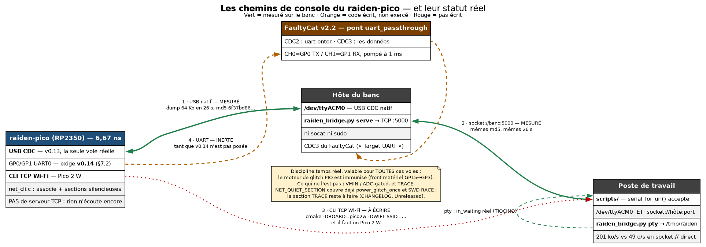

### 7.1 Les quatre voies et leur statut réel

Le banc n'a pas *une* console mais quatre chemins possibles vers la CLI du raiden, et ils
ne sont **pas au même stade**. Confondre les deux derniers avec les deux premiers ferait
perdre une soirée.

| # | Voie | Statut | Ce qui la conditionne |
|---|---|---|---|
| **1** | **USB CDC natif** (`/dev/ttyACM0`) | ✅ **mesuré** | rien — c'est le chemin de référence, et **celui du dump** |
| **2** | **`raiden_bridge.py`** — TCP par-dessus l'USB | ✅ **mesuré** | rien : script hôte pur, ni `socat` ni `sudo` |
| **3** | **CLI TCP sur Wi-Fi** (Pico 2 W) | ❌ **le serveur TCP n'est pas écrit** | une carte **Pico 2 W** + le code serveur |
| **4** | **Pont UART du FaultyCat** (CDC3) | ⚠ **firmware fait et flashé (v0.14)**, lien physique **non vérifié** | un fil GP0/GP1 ↔ CH0/CH1, et le test de bouclage du §7.4 |

★ **La réponse pratique aujourd'hui, c'est la voie 2.** Elle donne une console **réseau**
sans toucher au firmware ni changer de carte, et elle est **mesurée sur ce banc précis** :
le même dump 64 Ko rend le **même md5** (`6f37bd86…` code, `4a5114b8…` data) et les **mêmes
26 s** par les trois chemins — USB direct, `socket://` via le pont, et pty via le pont
(`CHANGELOG.md`, entrée *Unreleased*) `[fait]`.

### 7.2 Voies 1 et 2 — l'USB natif et le pont TCP `[fait]`

```bash
# Côté banc — expose le port série en TCP (le raiden reste sur son USB)
python3 scripts/raiden_bridge.py serve --serial /dev/ttyACM0     # écoute :5000

# Côté poste de travail — deux usages au choix
python3 scripts/bat32_dump.py --port socket://banc:5000          # direct
python3 scripts/raiden_bridge.py pty --target banc:5000          # -> /tmp/raiden
python3 scripts/bat32_dump.py --port /tmp/raiden                 # pyserial inchangé
```

⚠ **Le mode `pty` est le chemin recommandé, et la raison est mesurée.** Sur une URL
`socket://`, le `in_waiting` de pyserial renvoie `len(select(...))` — **0 ou 1, jamais un
nombre d'octets** (`serial/urlhandler/protocol_socket.py:136-142`). Tout script qui fait
`read(in_waiting)` dans une boucle temporisée retombe alors à **49 o/s et tronque en
silence**. Sur un pty, `in_waiting` passe par `TIOCINQ` et rend un vrai compte : **201 ko/s**.

> ★ **Les cinq scripts du dépôt ont déjà été corrigés** : ils ouvrent leur port par
> `serial_for_url()` (qui accepte indifféremment `/dev/ttyACM0` et `socket://hôte:port`),
> utilisent l'idiome `read(4096)` et non `read(in_waiting)`, et posent `write_timeout=5` —
> le défaut `None` bloque à l'infini sur un socket. **Rien à refaire côté hôte.**

**Ce que la voie 2 apporte concrètement à ce banc** : la campagne peut tourner depuis le
poste de travail alors que le raiden, le FaultyCat et la cible restent sur une machine du
banc — et le pont ne change **ni** le débit **ni** le contenu du dump, c'est mesuré.

### 7.3 Voie 3 — la CLI TCP sur Wi-Fi (Pico 2 W) : ce qui existe, ce qui manque

⚠ **À lire avant d'acheter une carte.** `src/net_cli.c` (126 lignes) **associe** le Pico 2 W
au réseau et gère les **sections silencieuses** — c'est tout. **Il n'y a ni `tcp_bind`, ni
`tcp_listen`, ni serveur : rien n'écoute.** `NET_CLI_TOKEN` est prévu dans le `CMakeLists.txt`
mais n'est référencé nulle part dans le code. Le CHANGELOG est explicite : *« Non testé
faute de matériel : tout le Wi-Fi (aucun Pico 2 W câblé). »*

**Ce qui est déjà fait, et qui a de la valeur** — les trois pièges du portage, corrigés
d'avance et **vérifiés sur le Pico 2 non-W** (`SWD CONNECT` bit-bang et PIO, `SWD RACE`
`SUCCESS`, `SWD RACE PERSIST` `READ_OK`) :

- `src/pio_alloc.c` — `pio_resources_reserve()` réclame les 7 state machines câblées en dur
  **avant** `cyw43_arch_init()`. Sans elle, le pilote CYW43 (qui itère les PIO en ordre
  **décroissant**) prendrait **pio2 SM0**, celle de `swd_phy` : tout marcherait jusqu'à la
  première commande SWD.
- `swd_phy_preload_programs()` — le programme PIO nRST n'était chargé qu'au **premier
  `SWD RACE`**, depuis la section chronométrée.
- `src/main.c` — sur Pico 2 W, **GP25 n'est pas une LED** mais le chip-select du bus Wi-Fi ;
  l'ancien `#define LED_PIN 25` aurait compilé sans warning en tuant la liaison.

**Build** : `cmake -S . -B build -DBOARD=pico2w -DWIFI_SSID=… -DWIFI_PASSWORD=…`
(`BOARD=pico2w` pose `PICO_BOARD=pico2_w` et `RAIDEN_HAS_WIFI`, et lie
`pico_cyw43_arch_lwip_poll` — **pas** `_threadsafe_background`, qui exécuterait lwIP depuis
une interruption de fond, exactement l'asynchronisme qu'un firmware de glitch ne tolère pas).

⇒ `[reco]` **Ne pas attendre le Wi-Fi pour démarrer la campagne.** La voie 2 donne déjà une
console réseau, mesurée, sur la carte qui est au banc. Le Wi-Fi supprimerait le dernier
câble USB — c'est un confort, pas un prérequis.

### 7.4 Voie 4 — le pont UART du FaultyCat : la modification raiden (v0.13 → v0.14) `[fait]`

> ✅ **Faite, flashée et passée à la suite de tests le 2026-09-05.** `VERSION` rend
> `Raiden Pico Glitcher v0.14` suivi de
> `Console: USB CDC + UART0 GP0/GP1 @115200 (ChipSHOUTER disabled)`, `CS` refuse
> explicitement, `PINS` nomme le bon propriétaire de GP0/GP1. Build :
> `cmake -S . -B build -DBOARD=pico2 -DRAIDEN_CONSOLE_UART=ON`.
> `pytest tests/ -q --config=swd` sur cible BAT32 câblée : **153 passés, 48 ignorés,
> 16 échecs — tous préexistants et attribués un par un** (voir l'entrée `[0.14]` du
> `CHANGELOG.md` de raiden-pico).
>
> ⚠ **Ce qui reste non vérifié : les broches elles-mêmes.** Aucun FaultyCat ni adaptateur
> USB-UART n'était câblé. ★ **Le test à un fil qui tranche** : relier **GP0 à GP1**
> (bouclage), puis envoyer `VERSION` **par l'USB**. La réponse sort par GP0, rentre par GP1,
> et la CLI parse sa propre sortie — il doit apparaître `ERROR: Unknown command 'Raiden'`.
> Cette erreur **prouve les deux sens** du lien ; son absence dit que rien ne circule.

Bonne nouvelle : la CLI passe intégralement par `printf`/`getchar` (`src/uart_cli.c`), et le
pilote `stdio` du SDK **multiplexe** USB et UART. **Activer le pilote a suffi — aucun code
métier touché**, les deux consoles fonctionnent en parallèle.

1. `CMakeLists.txt` : `pico_enable_stdio_uart(raiden_pico 1)` derrière une option
   `RAIDEN_CONSOLE_UART` (OFF par défaut, pour ne rien changer aux builds existants).
2. **Broches : UART0 sur GP0/GP1.** Ce sont les seules disponibles — GP12/GP13 sont pris
   (groupe alimentation / BOOT0) et GP19/20/21 sont TDI/TDO/RTCK. GP0/GP1 appartiennent au
   **ChipSHOUTER** : la console et le ChipSHOUTER deviennent **mutuellement exclusifs**,
   exactement comme UART1 l'est déjà entre Target et GRBL. Sans conséquence sur ce banc,
   puisque l'EMFI passera par le FaultyCat.
3. `src/main.c` : ne pas appeler `chipshot_uart_init()` quand l'option est active — les deux
   réclament `uart0`, et le second gagne en silence.
4. Discipline du dépôt à respecter dans le **même** changement : skill `pins` (GP0/GP1
   changent de propriétaire), skill `version-bump` (**v0.13 → v0.14**), et la doc
   (`README.md`, `CHANGELOG.md`) dans la même session.

⚠ **Le piège à consigner au CHANGELOG.** Le pilote `stdio` UART du SDK est **bloquant** :
attente active sur la FIFO TX, ~87 µs par octet une fois qu'elle est pleine à 115200 bauds.
Or ce dépôt a construit tout le mécanisme `net_quiet_enter()` **parce que** `target_uart.c`
a *mesuré* que quelques instructions de dispatch d'interruption suffisent à rater la fenêtre
de restauration du rail dans la boucle ADC. D'où la ligne de partage :

- ✅ **Le moteur de glitch PIO est immunisé** : il part du front matériel GP15 → GP3, l'état
  du CPU lui est indifférent. La console UART est donc **sans danger pour la campagne
  BAT32** décrite ici.
- ❌ **Le chemin `VMIN` / ADC-gated ne l'est pas** : console **silencieuse ou désactivée**
  pendant tout `SET VMIN`, ou traitée comme le réseau (`net_quiet_*`).

### 7.5 Câblage du pont UART

*(la voie 4 du schéma en tête de section)*

```
   raiden GP0 (TX) ─────────────► FaultyCat CH1 = GP1 (RX)
   raiden GP1 (RX) ◄───────────── FaultyCat CH0 = GP0 (TX)
   raiden GND ─────────────────── FaultyCat GND          (header scanner)
   FaultyCat header VCC ───────── 3,3 V ⚠ voir ci-dessous
```

⚠ **Avant de brancher `VCC`** : multimètre sur la broche `VCC` du header, FaultyCat
alimenté, **rien d'autre connecté**.
- Si elle **sort 3,3 V** ⇒ c'est une **sortie** : n'y injecter rien.
- Si elle est **flottante** ⇒ c'est la **référence** du TXS0108EPW : l'alimenter en 3,3 V.

Le level-shifter ne pose pas de problème pour l'UART : chaque ligne est **unidirectionnelle
push-pull**, exactement comme le JTAG, qui est validé à travers lui. Le défaut connu du
TXS0108EPW ne touche que les protocoles **bidirectionnels sur une même ligne** — donc le
SWD, pas l'UART (`docs/HARDWARE_V2.md` §2) `[fw]`.

### 7.6 Mise en service du pont UART (le jour où v0.14 existe)

```bash
# CDC2 — le shell FaultyCat
uart enter 115200 n 1
uart status                      # doit rendre: enabled baud=115200 parity=N stopbits=1

# CDC3 — « Target UART » : la console raiden y apparaît
picocom -b 115200 /dev/ttyACM<CDC3>
VERSION                          # doit rendre: Raiden Pico Glitcher v0.14
```

Côté scripts, `serial_for_url()` est déjà utilisé partout dans `scripts/` : il suffit de
pointer `RAIDEN_PORT` sur le port CDC3.

### 7.7 Plafond de débit du pont UART — à **mesurer**, pas à supposer

Le firmware expose déjà l'oracle qu'il faut : compteurs `fwd` / `cdc_acc`, `tx_dropped`, et
FE/PE/BE/OE sur le heartbeat CDC2 (une fois par seconde).

**Le test qui tranche en une minute** : lire 4 Ko par `SWD READ` **via le pont**, comparer
octet à octet avec la même lecture par l'USB natif du raiden, et surveiller le heartbeat.
Un `OE` non nul, ou un écart entre `fwd` et `cdc_acc`, signifie que le débit est trop haut :
baisser le baud.

> ★ **Règle de conduite, quelle que soit la mesure — et elle ne vise QUE la voie 4.** Le
> pont UART sert au **pilotage de campagne** (commandes courtes, oracle, journal) ; le
> **dump final ne passe pas par lui**. Le §9sexies du 07 le dit une fois pour toutes :
> **« un dump complet mais faux ressemble exactement à un bon dump »** — et un pont qui perd
> des octets en silence est précisément la machine à fabriquer ça.
>
> ⚠ **Ne pas étendre cette règle à la voie 2.** Le pont TCP, lui, a été **mesuré** sur un
> dump 64 Ko complet : mêmes md5, mêmes 26 s qu'en USB direct (§7.2). Il n'a pas de chemin
> de perte silencieuse — c'est du TCP, pas une FIFO CDC qu'on écrase. **Dumper par la voie 2
> est légitime** ; par la voie 4, non.

### 7.8 ★ La discipline temps réel, commune aux quatre voies

C'est le point qui relie la console au glitch, et il vaut pour **toutes** les voies :

| Chemin de tir | Sensible à la console ? | Pourquoi |
|---|---|---|
| **Moteur de glitch PIO** (`TRIGGER GPIO`, la campagne BAT32) | ✅ **non** | il part du **front matériel** GP15 → GP3 ; l'état du CPU lui est indifférent |
| **`VMIN` / ADC-gated** (`power_glitch_once`) | ❌ **oui** | boucle CPU : `target_uart.c` a *mesuré* que quelques instructions de dispatch d'interruption suffisent à rater la fenêtre de restauration du rail |
| **`TRACE`** | ❌ **oui**, et ce n'est **pas encore protégé** | la section silencieuse `TRACE` est explicitement listée « reste à faire » |

`NET_QUIET_SECTION` masque **la seule broche host-wake du CYW43** — jamais `IO_IRQ_BANK0`
en entier, qui porte aussi nRST et `GLITCH_FIRED` — et suspend le poll réseau. Elle couvre
déjà **la fenêtre ADC de `power_glitch_once`** et **les deux variantes de `SWD RACE`**.

⚠ **Trois conséquences pour ce banc :**
1. Pour la campagne BAT32 telle qu'elle est décrite au §9, **aucune des quatre voies n'est
   dangereuse** : le tir part du PIO.
2. **Ne pas prendre de `TRACE` (phase 0bis) avec le Wi-Fi actif** tant que sa section
   silencieuse n'est pas écrite. Sur la voie 2, la question ne se pose pas — l'USB n'arme
   aucune interruption de fond comparable.
3. La console UART (voie 4) pose le **même problème d'une autre manière** : son pilote
   `stdio` est **bloquant** (§7.4). Console silencieuse pendant tout `SET VMIN`.

## 8. Les règles électriques du banc

1. **Une seule masse commune** à tous les instruments et à la cible.
2. ★ **La sortie crowbar n'est pas `GP16`.** `GP16` est la **grille** du IRLML0060 sur le
   PCB ; le fil vers la cible part du **drain**, sur le connecteur de sortie glitch.
   Vérifier la sérigraphie avant de câbler.
3. **Résistances série ~100 Ω sur `SWCLK` et `SWDIO`** (§4.4 point 3 du 07). Sans elles, le
   debugger maintient ses lignes à 3,3 V pendant le creux et réinjecte du courant dans la
   cible par les diodes de protection de ses E/S : **le rail ne descend pas**. Vérifier la
   profondeur à l'oscilloscope **debugger branché**, jamais seulement débranché.
4. **Réservoir de 100 µF côté source des 4,3 Ω** (§3.3). Et **ne jamais alimenter la cible
   depuis GP10/11/12** (12 mA par broche) avec un crowbar sur le rail.
5. **Découplage de la carte T310 retiré** (§6.2 du 07). `[reco]` monter le condensateur sur
   un **cavalier** : avec découplage, la relâche du crowbar produit un *overshoot* suivi
   d'un *ringing* qui est **un second vecteur de faute**, distinct — essayer les deux.
6. **Cible** : pile **CR2450 retirée**, 3,3 V injecté aux bornes du support à travers les
   4,3 Ω. Le rail reste **partagé avec la radio 868 MHz** — choix assumé, réversible, au
   prix d'une capacité parasite. ⚠ **Si le creux mesuré à l'oscilloscope ne passe pas sous
   le seuil LVD, c'est le premier suspect.** Réponses possibles, dans l'ordre : augmenter la
   résistance série, retirer davantage de condensateurs, ou passer à l'**EMFI** (§5), qui ne
   dépend pas du rail.
7. **Jamais plus de 3,3 V sur une E/S du FaultyCat** (RP2040), `TRIGGER_VREF` comprise.
8. ⚠ **`TRIGGER_VREF` : même précaution que la broche `VCC` du header (§7.5).** Les deux
   appartiennent au même arbre `VREF` (`docs/HARDWARE_V2.md` §3) `[fw]`. Mesurer au
   multimètre avant d'y injecter quoi que ce soit : si la broche sort déjà une tension,
   c'est une sortie et on n'y branche rien ; si elle est flottante, c'est la référence
   d'entrée du level-shifter et on l'alimente en 3,3 V.
9. ★ **Jamais de grille de crowbar sans pull-down monté sur la carte MOSFET.** Il se pose
   entre grille et source, **au ras du transistor** — pas côté Pico : un fil de grille
   arraché doit laisser la grille au repos. Sa valeur est bornée par l'**erratum RP2350-E9**
   (120 µA injectés dans un pad repassé en entrée), **pas** par `V_IL` : **1 kΩ**, surtout
   pas les 10 kΩ réflexes ni les 8,2 kΩ des notes d'application. Arithmétique au **§4.2**.
10. ★ **Une entrée ADC posée sur le nœud de glitch se protège par 1 kΩ en série.** Le nœud
    plonge sous 0 V pendant le tir (§4.4) et le maximum absolu d'une E/S RP2350 est
    **−0,3 V**. GP26 et GP27 sont concernés dans **les deux variantes**.

---

## 9. Protocole de campagne

| Phase | Contenu | Outil |
|---|---|---|
| **−1** | ★★ **Payload SRAM au Level 1** (§2bis.5 du 07) — **zéro matériel, zéro tir**. La SRAM reste ouverte au Level 1 et `SWD BAT32 RAMREAD` est validé au Level 0. **Si ça marche, la campagne s'arrête là.** ⇒ **`scripts/bat32_l1_ramread_test.py`** conduit la séquence entière (voir ci-dessous) | raiden seul |
| **0** | Sauvegarde **fraîche** de la data flash · `SWD OPT` · ⚠ **plancher d'alimentation** (seuil LVD réel, en descendant lentement la tension) — **exige une source réglable, que le `3V3_OUT` n'est pas** (§3.3) · période de *ringing* du rail à l'oscilloscope | raiden + régulateur ajustable |
| **0bis** | **Cartographie de consommation du boot** : ADC1/GP27 sur le nœud VDD, `TRACE 4096 50` déclenché par le front de `RESETB`, **crowbar désarmé** (§3.4). C'est ce qui localise la lecture d'`OCDEN` et **borne le balayage de `PAUSE`** | `TRACE` |
| **1** | Ré-armer le Level 1 (`OCDEN = 0xC3`), confirmer par `SWD OPT` | raiden |
| **2** | **Balayage grossier** : `PAUSE` sur la fenêtre trouvée en 0bis (pas de ~150 cycles = 1 µs), `width_ns` de 1000 à 20000 par pas de 1000, **3 tirs par point**. ★ En variante B, ces bornes sont confirmées par le §4.6 : le plancher *utile* est à ≈673 ns et le plancher *instrumental* à 133 ns — la plage démarre au-dessus des deux | A (ou B) |
| **3** | **Affinage** autour des points classés `perturbed` : pas de **1 cycle = 6,67 ns** sur `PAUSE`, largeurs voisines | A (ou B) |
| **4** | Sur `SUCCESS` : `SWD OPT` d'abord (confirmer le niveau), **puis** dump vérifié **par l'USB natif**. Envisager ensuite la fixation définitive (§12 item 8 du 07 — **destructif**, seulement après un dump complet et vérifié) | `bat32_dump.py` |

**Oracle** : réutiliser le scoring en 5 catégories du §8.2 du 07 et la logique déjà écrite
dans `scripts/bat32_race_sweep.py` — `no_dp` / `dp_alive_mem_blocked` / `perturbed` /
`SUCCESS` — qui parle déjà la CLI raiden et place les octets **par adresse**.

★ **Critère de bascule vers la variante B.** En variante A, chaque tir coûte un aller-retour
USB vers le FaultyCat (`configure` / `arm` / `fire` bloquant) **plus** l'aller-retour vers le
raiden : la cadence est bornée par **deux piles USB**, pas par le POR de la cible. **Si le
banc tombe sous ~10 tirs/s, souder le MOSFET de la variante B** — la boucle repasse à un
seul appareil et le budget de 10⁴–10⁵ tirs (§10 du 07) redevient tenable en une soirée.

★ **La carte à souder n'est plus à concevoir** : schéma, nomenclature, valeurs justifiées,
ordre de mise en route et critères de recette à l'oscilloscope sont au **§4.1 à §4.7**, et
les huit figures qui les fondent sont regénérables en trois commandes (§4.8). Deux points y
sont **non négociables et absents de la variante A** : le **pull-down de grille de 1 kΩ** et
la **résistance d'amortissement de drain** — sans elle le rail oscille jusqu'à −2,4 V, ce
que les deux entrées ADC ne supportent pas.

⚠ **Pré-vol avant toute phase 1.** `scripts/bat32_dataflash.py backup` **le jour même**. Le
chip erase épargne la data flash, mais **`bat32_restore.py` n'a jamais été exercé sur
`0x00500000`** : le chemin d'écriture n'est validé que sur la code flash. La restauration de
l'appairage est **plausible, pas vérifiée** — et l'image appairée n'existe plus qu'en
fichier (`assets/bat32_dump_20260902/bat32_data_flash.20260902_appaire.bin`).

---

## 10. Mise en service — l'ordre des vérifications

1. **Relecture des broches.** Chaque GPIO utilisé doit être traçable à `board_v2.h`
   (FaultyCat) ou à `include/config.h` + `PINS` (raiden). Aucune valeur devinée.
2. ★ **Chaîne de trigger, cible NON connectée.** Câbler GP15 → GP3 → GP2 → GP8, `ARM ON`,
   puis un `SWD RACE 0`. Attendu : `faultycmd crowbar status` rend un
   `pulse_width_ns_actual` non nul, et GP22 (`GLITCH_FIRED`) pulse. **À l'oscilloscope,
   mesurer le retard réel front `RESETB` → front crowbar** : c'est l'offset fixe (§2.2) qui
   calibre toute la campagne. Le noter dans le journal de banc.
3. **Profondeur.** Oscilloscope sur le nœud VDD, découplage retiré, **debugger branché** :
   le creux doit passer sous le seuil LVD mesuré en phase 0. Sinon → §8 point 6.
4. **Consoles.** Voie 2 **dès maintenant** : `raiden_bridge.py serve` puis un
   `bat32_dump.py --port socket://…` — le md5 doit être **identique** à celui obtenu en USB
   direct. Voie 4 (si v0.14 posée) : `VERSION` sur CDC3, puis le test 4 Ko du §7.7.
5. **Aucune commande destructive** — chip erase, ré-armement du Level 1 — sans la sauvegarde
   de data flash du jour.

---

## 11. Sources

| # | Source | Statut | Ce qu'elle fournit ici |
|---|---|---|---|
| 1 | `TPLink_Tapo/07_BAT32G135_FAULTYCAT.md` (ce dépôt) | — | cible, modèle de protection `OCDEN`/`OCDM`, budget de profondeur, oracles, scoring, budget de campagne |
| 2 | `github.com/ElectronicCats/FaultyCat-Firmware` — `drivers/include/board_v2.h`, `docs/HARDWARE_V2.md`, `docs/GLITCHING.md` | **`[fw]`** | brochage v2.x, chemins crowbar / EMFI, bornes `width_ns` / `delay_us`, défaut TXS0108EPW |
| 3 | idem — `services/glitch_engine/pio_glitch_prog.h`, `services/glitch_engine/crowbar/crowbar_pio.c` | **`[fw]`** | ★ **le trigger externe est un `WAIT` PIO** (§2.2), tick de 8 ns, ordre des FIFO |
| 4 | idem — `services/uart_passthrough/`, `hal/src/rp2040/uart.c`, `usb/include/usb_composite.h`, `apps/faultycat_fw/main.c` | **`[fw]`** | pont UART : CH0/CH1, CDC3, commandes `uart *`, pompage 1 ms, **perte silencieuse côté CDC** |
| 5 | `github.com/ElectronicCats/faultycat-TUI` — `faultycmd/protocols/crowbar.py`, `protocols/scanner.py` | `[ref]` | API hôte `configure`/`arm`/`fire`, et l'attestation que **le sous-shell SWD est WIP** |
| 6 | `github.com/ElectronicCats/faultycat` — wiki *Understanding Faulty Cat* | `[ref]` | ~240 V, alimentation USB-C ou 3× AA, avertissement 3,3 V max sur les E/S |
| 7 | `AdamLaurie/raiden-pico` + fork local v0.13 — `README.md`, `include/config.h`, `src/uart_cli.c`, `src/main.c` | `[ref]` / **`[fw]`** | brochage, syntaxe exacte des commandes, `TARGET POWER EXT`, `TRACE`, et le fait que la CLI est USB-only |
| 8 | `https://docs.buspirate.com` | `[ref]` | PSU 1–5 V / 300 mA — **seulement pour la variante D**, les autres s'en passent |
| 8bis | `raiden-pico/scripts/raiden_bridge.py`, `src/net_cli.c`, `src/pio_alloc.c`, `CMakeLists.txt`, `CHANGELOG.md` (entrée *Unreleased*) | **`[fw]`** / **`[fait]`** | les quatre voies de console du §7 : pont TCP **mesuré** (mêmes md5, mêmes 26 s), état réel du Wi-Fi (**pas de serveur TCP**), `NET_QUIET_SECTION` et sa couverture |
| 9 | `assets/schemas/src/gen_09_banc.py` (ce dépôt) | — | **générateur des quatre schémas de vue d'ensemble** : Graphviz + `dot`, sans dépendance Python tierce |
| 10 | `assets/schemas/src/gen_09_crowbar_schemas.py` + `gen_09_crowbar_courbes.py` + `check_09_crowbar_spice.py` (ce dépôt) | — | **générateurs des huit figures du §4** : schemdraw pour les 4 schémas, scipy pour les 4 courbes, et le **recoupement ngspice** qui les valide (sortie non nulle si un écart dépasse 10 %) |
| 11 | `aosmd.com/pdfs/datasheet/AO3400A.pdf` — Alpha & Omega, **Rev 3.1, juillet 2023** | `[ref]` | brochage SOT-23, `V_GS(th)` 0,65/1,05/1,45 V, `R_DS(on)` 19 mΩ typ à 4,5 V, `C_iss` 630 pF, `R_g` 3 Ω, `I_DM` 30 A — **toutes** les valeurs du §4 en viennent |
| 12 | ★ **Erratum RP2350-E9 — source REQUALIFIÉE le 2026-09-16** : ce n'est pas un fil de forum mais une **section de la datasheet RP2350 officielle**, `../datasheet/RP2350_RaspberryPi.pdf` §RP2350-E9 (*« Increased leakage current on Bank 0 GPIO when pad input is enabled »*) | **officiel** (était `[ref]`) | Texte officiel : un pad **en entrée** dont la tension est dans la région logique indéfinie fuit *« typically around **120 µA** »*, **maintient le pad vers 2,2 V**, et le **pull-down interne est trop faible** pour l'en sortir (30 µA seulement à `IOVDD` 1,8 V). C'est ce chiffre, et **pas `V_IL`**, qui borne le pull-down de grille (§4.2) — la datasheet recommande « 8,2 kΩ ou moins » **pour la logique**, ce qui laisse 0,98 V sur une grille. ⚠ **Annoncé sur le stepping `RP2350 A2`**, silicium corrigé mentionné : **vérifier le stepping** |
| 13 | `raiden-pico/src/glitch.c:376-378` + `src/glitch.pio:92-104` (fork local) | **`[fw]`** / **`[vérifié]`** | la largeur réellement livrée : `W+3` cycles, correction `−5` non monotone, minimum réel 3 cycles ≈ 20 ns (§4.6) — **lu à la source, pas déduit** |

---

## 12. Questions ouvertes

Aucune n'empêche de démarrer ; toutes se tranchent au banc.

1. **La broche `VCC` du header scanner du FaultyCat est-elle une sortie ou une référence
   d'entrée ?** Idem pour `TRIGGER_VREF`. **Multimètre, §7.5 et §8 point 8.** Sans objet
   pour l'alimentation, qui vient désormais du `3V3_OUT` du raiden (§3.3) — mais la question
   reste ouverte pour la référence de niveau du pont UART et du trigger.
2. **Le rail partagé avec la radio 868 MHz laisse-t-il le creux descendre sous le LVD ?**
   C'est la question qui décide entre le crowbar (§3) et l'EMFI (§5). Mesure : oscilloscope
   sur VDD pendant un tir, découplage retiré, debugger branché.
3. **Quel est l'offset fixe réel `RESETB` → crowbar ?** Somme du `WAIT` PIO, du
   synchroniseur, du TXS0108EPW et des câbles. §10 point 2.
4. **Quel baud le pont UART supporte-t-il sans perte ?** §7.7 — et la réponse ne change pas
   la règle : le dump final passe par l'USB natif.
5. **Où, dans le temps, la lecture d'`OCDEN` a-t-elle lieu ?** Phase 0bis. C'est le
   paramètre qui décide de la durée de la campagne.
6. **La voie SRAM du §2bis.5 (07) fonctionne-t-elle au Level 1 ?** Non testée. Si oui, tout
   ce document devient facultatif. ⇒ **Le banc d'essai existe** :
   `scripts/bat32_l1_ramread_test.py` (2026-09-06). Préflight et oracle de niveau
   exercés contre le **firmware v0.14 du banc** ; les dix-huit scénarios de succès et
   d'échec contre un simulateur du protocole CLI. Il n'a **pas encore été lancé au
   Level 1** — la puce du banc est au Level 0 depuis la reconstruction du 02/09, et le
   script **refuse** justement de tirer sur une puce non protégée (au Level 0 le
   debugger a déjà le droit de lire la flash : un succès n'y prouverait rien).
   `--arm` fait l'aller ; `--allow-level0` sert seulement à éprouver le harnais. Trois façons d'en sortir, dans l'ordre de ce que ça
   apprend :
   - `CORE_FAULT` (DFSR bit 3, VCATCH) : le cœur faute en lisant la flash ⇒ la protection
     ne vise pas que le debugger, **§2bis.5 est close** et ce document redevient la voie ;
   - `SRAM_RO` / `NO_DCRSR` / `NO_RESUME` : la flash n'est même pas atteinte, c'est
     l'injection ou le contrôle du cœur qui est bloqué ⇒ même conclusion, autre cause ;
   - lecture conforme à la référence ⇒ **Level 1 contourné sans injection de faute**.
7. **La CLI TCP sur Wi-Fi vaut-elle son coût ?** Le serveur reste à écrire et il faut une
   carte Pico 2 W ; la voie 2 rend déjà le service. À trancher **après** la campagne, pas
   avant — et en n'oubliant pas que la section silencieuse de `TRACE` manque encore (§7.8).
8. ✅ **RÉPONDU le 2026-09-07 — c'est une Pico 2 W, donc une RP2350A.** La question était
   *« quelle carte est réellement au banc ? »*, posée parce que `STATUS` rapportait
   **RP2350B / QFN-80 / 48 GPIOs**. **C'était un défaut de décodage de `package_sel` par le
   firmware** (`command_parser.c:552`) : la sérigraphie porte `GP26_A0/GP27_A1/GP28_A2` et la
   datasheet **Pico 2 W (RP-008304-DS-3)** §1.2 annonce **30 GPIO**, soit une RP2350A QFN-60.
   ⇒ `GP26`/`GP27` **sont** ADC0/ADC1, le câblage était bon, et le corollaire sur le numéro de
   la broche 3,3 V tombe. Détail et règle de provenance au §3.3. ⚠ **Reste ouvert** : le
   décodage `package_sel` du firmware est à corriger — il induira en erreur la prochaine fois.
9. **Le `3V3_OUT` du raiden tient-il la cadence en campagne longue ?** L'arithmétique dit
   oui (150 µA de moyenne à 10 tirs/s), mais elle suppose `C_res` **au plus près de la
   sortie 3,3 V**. À confirmer à l'oscilloscope sur le rail 3,3 V de la carte, pas seulement sur
   le nœud cible.

---

> **Avertissement.** Recherche en sécurité matérielle à des fins d'évaluation et
> d'éducation. N'attaquez que du matériel vous appartenant ou pour lequel vous disposez
> d'une autorisation explicite.

---

# Partie II — Runbook opératoire du banc

> **Origine et statut.** Ce qui suit vient du `BANC_RUNBOOK.md` du projet d'origine, daté du
> **2026-09-07** — donc **postérieur** à la partie I. Il exécute ce que la partie I décrit, une
> phase par section, **chacune avec une porte de passage** : tant qu'elle n'est pas franchie, la
> suivante ne prouve rien.
>
> ⚠ **Les verdicts propres à la CIBLE ne sont pas ici.** Le résultat de la phase F (RAMREAD au
> Level 1 → `LOCKUP`, sonde différentielle `VTOR`, absence de fuite `.data`) appartient au
> modèle de protection du BAT32G135 et vit dans
> **[`07_BAT32G135_FAULTYCAT.md` §2ter](07_BAT32G135_FAULTYCAT.md)**. Ce document-ci est le
> **banc** ; le 07 est la **cible**.
>
> ⚠ Les scripts cités (`src/portmap.py`, `src/link_check.py`, `src/preflight.py`,
> `src/campaign.py`, `src/boot_trace.py`, `src/l1_*.py`, `raiden-pico/scripts/*.py`) vivent
> **dans l'archive**, pas dans ce dépôt — voir l'encadré « Où vivent les artefacts cités ».

## Phase A0 — le câblage du pont UART

**L'UART se croise.** Les deux cartes ont la même convention, donc un câblage
droit-fil relie deux sorties ensemble et deux entrées ensemble : rien ne passe.

| | GP0 | GP1 | Source |
|---|---|---|---|
| raiden-pico | **TX** (sortie) | **RX** (entrée) | `include/config.h:18-19`, `src/command_parser.c:966-967` |
| FaultyCat | **CH0 = TX** (sortie) | **CH1 = RX** (entrée) | aide de `faultycmd uart enter` : « CH0=TX/CH1=RX on the scanner header » |

```
   raiden GP0 (TX) ─────────────► FaultyCat CH1 = GP1 (RX)
   raiden GP1 (RX) ◄───────────── FaultyCat CH0 = GP0 (TX)
   raiden GND ─────────────────── FaultyCat GND      (header scanner)
```

Deux contrôles au multimètre, **appareil seul alimenté** :

1. **Broche `VCC` du header scanner.** Sort 3,3 V ⇒ c'est une **sortie**, n'y
   injecter rien. **Flottante** ⇒ c'est la **référence du TXS0108EPW**, il faut
   l'alimenter en 3,3 V — sans quoi le level-shifter ne laisse rien passer,
   **même une fois le croisement fait**.
2. **`TRIGGER_VREF`** — même arbre `VREF`, même raisonnement. Jamais plus de
   3,3 V sur une E/S du RP2040.

---

## Phase A — mise en service et preuve de la voie 4

```bash
python3 src/link_check.py
```

Enchaîne : inventaire by-id → `faultycmd verify` → `crowbar ping` (doit rendre
`F5`) → `uart enter` → `VERSION` sur CDC3 → `PINS` → **porte d'intégrité**.

**Porte** : `VERSION` = v0.14 avec la ligne `Console: USB CDC + UART0 …`, **et**
4 Ko de code flash lus deux fois, identiques entre eux **et** identiques à
`assets/bat32_dump_20260906/bat32_code_flash.bin`.

> ⚠ **Le pont retombe quand le port se ferme.** Une chute de DTR sur CDC3
> équivaut à `uart exit` (09 §2.3) : le script qui monte le pont le démonte en
> sortant. Les quatre scripts le remontent donc d'eux-mêmes via
> `tapoglitch.uartbridge.ensure()` — il n'y a pas à relancer `link_check.py`
> avant chaque phase.

### Si `VERSION` ne rend rien : `bridge_diag.py`

```bash
python3 src/bridge_diag.py
```

Le firmware du FaultyCat émet une fois par seconde, sur CDC2, l'état brut de
son UART0. Ces compteurs **séparent « rien n'arrive » de « ça arrive mal »**,
ce qu'aucun essai de `VERSION` ne peut faire :

| Lecture | Ce que ça veut dire |
|---|---|
| `rd=0`, `fe=pe=be=oe=0` | **rien n'arrive** — ce n'est PAS un mauvais réglage : un baud faux donnerait `fe>0`, une parité fausse `pe>0`, une ligne collée au 0 `be>0`. La ligne est au repos et silencieuse |
| `rd>0`, `fe/pe>0` | ça arrive, mais mal cadré : baud ou parité |
| `oe>0` | ça arrive trop vite : baisser le baud |
| `rd>0`, tout à 0 | le lien est bon |

**Mesure du 2026-09-06, câblage croisé, FaultyCat rebranché** :
`en=1 rxpin=1 rd=0 fe=0 pe=0 be=0 oe=0`, `fwd=0 cdc_acc=0 tx_dropped=0`,
`fsel_tx=2 fsel_rx=2 cr=0x301 lcr=0x70` — l'UART0 du FaultyCat est **correctement
configuré en 8N1 et à l'écoute**, et **rien n'arrive**. Suspect n°1 : le
raiden n'émet pas (alimentation, ou binaire sans `RAIDEN_CONSOLE_UART`).

> ⚠ **Correction mesurée du 09 §2.3.** Le doc annonce qu'une chute de DTR sur
> CDC3 démonte le pont. **Observé le 2026-09-06 : le pont a survécu** à la
> fermeture du CDC3 par `link_check.py` — le `uart enter` suivant a répondu
> `ERR uart_in_use`. `uartbridge.ensure()` lit donc l'état avant d'agir plutôt
> que d'entrer systématiquement.

Le reste du diagnostic est dans la sortie du script. Le
bouclage `GP0↔GP1` du 09 §7.4 n'est **pas** utilisable ici : il suppose le
raiden sur l'USB. Le test qui tranche est le **bouclage côté FaultyCat**
(`CH0` court-circuité sur `CH1`), qui isole les deux moitiés du lien.

---

## Phase B — préflight

```bash
python3 src/preflight.py --expect L0
```

Ne tire pas. Établit le niveau de protection par ce que la puce **fait** :

| flash `0x0` | SRAM `0x20000008` | verdict |
|---|---|---|
| lue | lue | **L0** — aucune protection |
| FAULT | lue | **L1** — la protection ne couvre que la flash |
| FAULT | FAULT | **MUET** — *pas un niveau* : câblage, pas de `TARGET RESET`, ou `SWD SPEED 0` |
| lue | FAULT | **ANORMAL** — lien instable, ralentir l'horloge |

`SWD OPT` est affiché **à titre indicatif seulement** : ses option bytes vivent
en code flash, donc illisibles précisément au Level 1.

**Porte** : niveau mesuré = niveau attendu. Le refus est le défaut ; `--force`
pour outrepasser.

`preflight.py` ajoute deux contrôles **qui ne tirent pas** :

**[3] Entrée trigger `GP15 → GP3`.** C'est le premier maillon de toute la
chaîne de tir : sans front sur GP3, `SET PAUSE` n'a pas de point de départ et
le moteur ne part jamais. Le contrôle est possible **sans tirer** parce que
`ARM TRACE` retire le générateur d'impulsion : il arme uniquement
`GP3 → PIO → GP22 → IRQ de trace`. Si la trace se déclenche, le cavalier
conduit. ⚠ GP3 est une broche **fixe** côté firmware, et GP22 est **interne** —
le seul fil externe à poser est `GP15 → GP3`, court et sans résistance.

**[4] Alimentation de la cible.** `STATUS` dit d'où vient le courant. Le 09 §8
point 4 interdit `TARGET POWER INTERNAL` (GP10/11/12, 12 mA par broche) **dès
qu'un crowbar est sur le rail** : fermer le MOSFET mettrait à la masse un rail
tenu par des GPIO du Pico. L'hôte ne peut pas voir si le drain est câblé, donc :
**avertissement** en préflight ordinaire, **refus** dès qu'un tir est demandé —
et `campaign.py` refuse de démarrer en mode INTERNAL (sauf `--dry-run`).

**État mesuré au 2026-09-06** : niveau **L0** ✅ · lien SWD **prouvé** sur
4 Ko ✅ · cavalier `GP15 → GP3` **NE CONDUIT PAS** ❌ · alimentation
**GP10/11/12 (INTERNAL)** avec sortie crowbar **non reliée** ⇒ sans danger tant
qu'on ne tire pas, à corriger avant la campagne.

> ⚠⚠ **Un faux positif à connaître, parce qu'il a été commis.** Une première
> version de ce contrôle a annoncé « le cavalier conduit » alors qu'il ne
> conduisait pas. Cause : `Raiden.cmd()`, recopié de `bat32_race_sweep.py`, ne
> **purgeait pas le tampon d'entrée avant d'écrire**. La queue de la réponse
> précédente se collait en tête de la suivante, et la réponse d'`ARM TRACE`
> était en réalité le prompt `>` de la commande d'avant. Deux corrections :
>
> 1. `_cmd_once()` purge maintenant **avant** d'écrire, et draine la traîne
>    **après** le marqueur — l'idiome de `bat32_dump._send()`, pas celui de
>    `bat32_race_sweep.cmd()`. ⚠ Si vous reprenez du code de la famille
>    `scripts/`, sachez que les deux helpers ne se valent pas.
> 2. Le contrôle exige un **acquittement positif** (`OK: Trace armed`) et lit
>    l'état sur la **ligne `Trace:` ancrée**, jamais une sous-chaîne flottante.
>    Une absence d'erreur n'est pas une preuve.

Les deux contrôles qui **tirent**, sortie crowbar **débranchée du nœud VDD** :

```bash
python3 src/preflight.py --trigger-chain    --yes    # le front atteint-il le MOSFET ?
python3 src/preflight.py --starvation-test  --yes    # ★ la console survit-elle à `fire` ?
```

Le second décide de l'avenir de la variante A : le pont UART est pompé toutes
les 1 ms dans la boucle principale du FaultyCat, et `fire` bloque. Console
muette ⇒ brancher le raiden en USB, ou passer en variante B.

---

## Le nœud de glitch — où va le crowbar, et le fil à retirer d'abord

```
   source 3,3 V ──┬── C_res 100 uF faible ESR // 100 nF     <- cote SOURCE
                  │
                  └──[ 4,3 Ohm >=0,25 W, NON bobinee ]──┬──> BAT32 VCC
                                                        │
                                                        ├──< SORTIE CROWBAR
                                                        │    (DRAIN du MOSFET,
                                                        │     PAS la broche GP16)
                                                        │    variante B : via R_damp
                                                        │
                                                        ├──[ 1 kOhm ]──> GP26 (ADC0)
                                                        └──[ 1 kOhm ]──> GP27 (ADC1 = TRACE)
```

★ **Les deux 1 kΩ ne sont pas décoratifs et se posent EN PREMIER.** Le nœud
plonge **sous 0 V** pendant le tir — jusqu'à −2,4 V si l'amortissement de drain
n'est pas encore posé — alors que le maximum absolu d'une E/S RP2350 est
**−0,3 V**. Avec 1 kΩ, le clamp interne encaisse ~1,7 mA, et ni la bande
passante de `TRACE` ni la lecture ne bougent. **Jamais de condensateur là** :
1 nF donnerait 1 µs de constante et tuerait la résolution à 500 ksps.
Démonstration et courbes : 09 §4.4.

Le drain du crowbar va **côté cible** de la résistance : la résistance limite ce
que la source peut débiter, le MOSFET court-circuite le nœud. Mettre le drain
côté source ne ferait que court-circuiter l'alimentation.

### ⚠⚠ À RETIRER AVANT DE BRANCHER LE CROWBAR : les fils GP10/11/12

Dès qu'une source externe alimente le nœud VDD, **les fils qui vont de
GP10/11/12 du raiden vers ce nœud doivent être DÉBRANCHÉS physiquement**.
Aucun mode firmware ne les rend sûrs — c'est lu dans `target_uart.c:1430-1463` :

| Mode | GP10 | GP11 | GP12 |
|---|---|---|---|
| `INTERNAL` + `POWER ON` | 3,3 V, 12 mA | 3,3 V, 12 mA | 3,3 V, 12 mA |
| `INTERNAL` + `POWER OFF` | **0 V piloté** | **0 V piloté** | **0 V piloté** |
| `EXTERNAL` | enable (piloté) | grille crowbar (repos piloté) | **0 V piloté** |

Dans **tous** les cas ce sont des **sorties pilotées**, jamais de la haute
impédance — le firmware drive même GP12 à 0 V délibérément (« a bare input
floats/reads HIGH on RP2350, erratum E9 »). Une sortie à 0 V posée sur un rail
alimenté à travers 4,3 Ω, c'est **0,77 A en permanence** dans une broche prévue
pour 12 mA.

Une fois les fils retirés, passer le firmware en `TARGET POWER EXT` pour qu'il
cesse de croire qu'il alimente la cible — et **laisser GP11 non connecté** en
variante A, pas « connecté au cas où » (09 §4).

**En variante B**, GP11 part vers la **grille** du MOSFET, jamais vers le rail.
Il lui faut sa **propre ligne** : laissé strappé au harnais GP10/GP12, il se bat
contre GP10 (`raiden-pico/tests/test_power_mode.py:194-197`).

### Les six points que la doc rend non négociables

1. **`C_res` = 100 µF faible ESR + 100 nF, côté SOURCE de la résistance.** Pas
   optionnel : le tir tire 3,3 V / 4,3 Ω ≈ **0,77 A**, soit ~15 µC pour 20 µs.
   Sur 100 µF ⇒ ΔV ≈ 150 mV, rail stable. Sur 10 µF ⇒ **1,5 V**, brownout de
   l'instrument et campagne ruinée (09 §3.3).
2. **Découplage de la carte T310 RETIRÉ** (07 §6.2). Avec lui, le rail ne
   descend pas. `[reco]` le monter sur cavalier : la relâche produit alors un
   *overshoot* + *ringing* qui est un **second vecteur de faute**, à essayer.
3. **Résistances série ~100 Ω sur SWCLK et SWDIO.** Sans elles le debugger
   tient ses lignes à 3,3 V pendant le creux et réinjecte du courant par ses
   diodes de protection : **le rail ne descend pas**. Vérifier la profondeur à
   l'oscilloscope **debugger branché**, jamais seulement débranché.
4. **Une seule masse commune** — raiden, FaultyCat, source, cible.
5. **Pull-down de grille obligatoire, 1 kΩ, sur la carte MOSFET** (variante B).
   Entre grille et source, au ras du transistor : un fil arraché doit laisser la
   grille au repos. La valeur est bornée par l'**erratum RP2350-E9** (120 µA dans
   un pad repassé en entrée), **pas** par `V_IL` — donc ni 10 kΩ ni 8,2 kΩ.
   09 §4.2.
6. **Résistance d'amortissement en série avec le drain** (variante B, MOSFET
   moderne). Un AO3400A à 19 mΩ rend la maille fortement sous-amortie : le rail
   **oscille jusqu'à −2,4 V** et la crête monte à **8 A** (et non 0,77 A, qui est
   le régime établi). `R_damp ≈ √(L_boucle / C_résid)` : **0,15 Ω à 10 µF ·
   0,47 Ω à 1 µF · 1,2 Ω à 0,1 µF**. ⚠ **La valeur se choisit APRÈS la mesure de
   `C_résid`**, pas avant. 09 §4.4.

### ⚠ Question ouverte sur la source 3,3 V du FaultyCat

Le 09 §12 Q1 la pose et elle n'est **pas tranchée** : la broche `VCC` du header
scanner est-elle une **sortie 3,3 V** ou la **référence d'entrée** du
TXS0108EPW ? Multimètre, FaultyCat alimenté, **rien d'autre connecté** :
sort 3,3 V ⇒ sortie ; flottante ⇒ référence, et elle ne peut alors pas
alimenter quoi que ce soit. La variante A du doc prévoit le `3V3_OUT` du
**raiden** comme source, précisément parce que sa capacité est connue.

## Phase C — cartographie de consommation du boot

> ★★ **Le §9ter.4 du 07 est FAUX sur ce firmware.** Trois écarts lus dans le
> source et vérifiés au banc le 2026-09-06 :
>
> 1. **`TRACE <n> <pre%>` démarre déjà la capture** (`trace_start`,
>    `target_uart.c:5013`). Il n'y a pas de `START` séparé à envoyer.
> 2. ★ **La trace se déclenche sur `GP22`, pas sur `GP3`.** `trace_start()`
>    enregistre une IRQ sur `PIN_GLITCH_FIRED` = GP22. C'est `ARM TRACE` qui
>    fait le pont : `glitch_arm_trace()` (`glitch.c`) charge un PIO edge-detect
>    sur GP3 dont les *SET pins* sont GP22. GP3 monte → le PIO lève GP22 →
>    l'IRQ capture. `ARM TRACE` retire au passage le générateur d'impulsion :
>    il arme la **trace sans armer le glitch**, aucun tir n'est possible.
> 3. ⚠ **`glitch_arm_trace()` commence par `if (flags.armed) return false`.**
>    Sans `ARM OFF` préalable, la **première** trace passe et **toutes** les
>    suivantes échouent avec « Failed to arm trace ». `boot_trace.py` désarme
>    donc systématiquement, et `Raiden.__exit__` envoie `ARM OFF`
>    inconditionnellement — `ARM TRACE` ne passe pas par `arm()`, donc l'état
>    armé est invisible côté hôte.
>
> ⚠ **Bug cosmétique du firmware à connaître.** `TRACE 4096 50` émet un
> `ERROR: Unknown  '4096'` **parasite** avant son `OK` :
> `command_parser.c:335-337` appelle `match_and_replace(..., NULL)` sur un
> argument numérique, ignore son retour, et `api_error_printf` déréférence le
> contexte `NULL`. **La commande s'exécute quand même** — mais tout lecteur qui
> traite `ERROR:` comme une fin de réponse coupe au milieu. D'où
> `Raiden.START_MARKERS`.


```bash
python3 src/boot_trace.py --repeat 9
```

C'est cette phase qui **borne** le balayage `PAUSE` : sans elle on balaie
0 → 2 ms à l'aveugle. Le script **refuse** de tourner si le crowbar n'est pas
mesuré désarmé — GP26/27 ne lisent une image du **courant** que crowbar au
repos ; pendant un tir ils lisent la profondeur du creux.

Chercher **deux** accès distincts, pas un : `OCDEN` vit en code flash
(`0x000000C3`), `OCDM` en data flash (`0x00500004`) — deux matrices mémoire, donc
probablement deux timings.

**Porte** : bornes `PAUSE` imprimées, et stables d'une exécution à l'autre.

---

## Phase D — dumps frais

```bash
STAMP=$(date +%Y%m%d)
python3 raiden-pico/scripts/bat32_dump.py --port "$RAIDEN" \
        --out-dir assets/bat32_dump_$STAMP
python3 raiden-pico/scripts/bat32_dataflash.py backup --port "$RAIDEN"
```

**Porte** : `md5sum assets/bat32_dump_$STAMP/bat32_code_flash.bin` =
`6f37bd86c41a75c19db65cc5824f7199`, et `SP=0x20000E10` / `PC=0x000001A9` en
tête de fichier.

> ⚠ **Ce que cette porte vérifie réellement.** Exiger le md5 de référence sur un
> dump *frais* teste le **transport**, pas la puce : elle suppose la code flash
> inchangée depuis le 06/09. Hypothèse plausible — rien n'y a écrit depuis —
> mais c'est une hypothèse.
> ★ **Le vrai filet est ailleurs** : `--arm` (phase E) **relit la puce lui-même**
> et exige l'égalité stricte avec la sauvegarde fournie. Une corruption de
> transport fait donc échouer l'armement, indépendamment de cette porte-ci.
>
> `[reco]` Brancher le raiden en **USB direct** le temps des phases D à F reste
> l'assurance la moins chère : les scripts acceptent indifféremment
> `/dev/ttyACM*`, `socket://` et un pty.

---

## Phase E — armement du Level 1  ⚠ destructif

```bash
python3 raiden-pico/scripts/bat32_l1_ramread_test.py --port "$RAIDEN" --arm \
    --backup-code assets/bat32_dump_$STAMP/bat32_code_flash.bin \
    --backup-data assets/bat32_dump_$STAMP/bat32_data_flash.bin
```

**Interactif** : le script demande de taper littéralement `ARMER`. Il n'est pas
pilotable en headless, et c'est voulu.

Il refuse si le niveau ≠ L0, exige l'**égalité stricte** de la code flash relue,
tolère une dérive de la data flash ≤ 64 octets (elle est **vivante** : 12 octets
ont bougé en dix minutes le 02/09).

**Ce que ça engage** : la seule sortie du Level 1 est le chip erase, qui détruit
la code flash. Il **épargne la data flash**, appairage compris (mesuré le
02/09) — pour la blanchir il faudrait `SWD BAT32 SECTORERASE` sur `0x500000`,
`0x500200` et `0x500400`.

**Pré-vol non négociable** : la sauvegarde data flash **du jour** (phase D).

---

## Phase F — le contournement gratuit : RAMREAD au Level 1

```bash
python3 raiden-pico/scripts/bat32_l1_ramread_test.py --port "$RAIDEN" --full \
    --ref assets/bat32_dump_20260906/bat32_code_flash.bin
```

Zéro tir, zéro matériel. Au Level 1 la SRAM reste grande ouverte et le **cœur**,
lui, lit la flash — c'est sur elle qu'il s'exécute. La question ouverte est la
seule que le Level 0 ne peut pas trancher : le contrôleur flash distingue-t-il
un *fetch du cœur* d'un *accès du debugger* ?

Le script prend un **dump SRAM avant la première passe** : RAMREAD écrase
`0x20000000`-`0x2000101F`, et un reset n'en rend que **93 %**. Il n'y a pas de
seconde chance de le prendre.

**Trois sorties, par ordre décroissant de ce qu'elles apprennent :**

| Verdict | Conclusion |
|---|---|
| lecture conforme à `--ref` | ★★ **Level 1 contourné sans injection de faute** — la campagne devient inutile |
| `CORE_FAULT` (DFSR bit 3, VCATCH) | la protection gêne **aussi le cœur** ⇒ 07 §2bis.5 est close, le crowbar redevient la voie |
| `SRAM_RO` / `NO_DCRSR` / `NO_RESUME` | la flash n'est même pas atteinte ⇒ même conclusion, autre cause |

`PC_ELSEWHERE` (bit 1) **ne conclut rien**.

---

## Phase G — après le verdict

**Si la voie du glitch s'ouvre, laisser la puce au Level 1** : c'est l'état de
départ de la campagne. Puis, dans l'ordre :

1. calibrer l'offset `RESETB → crowbar` à l'oscilloscope (09 §10 point 2) ;
2. vérifier à l'oscilloscope que le creux passe **sous le seuil LVD**, découplage
   retiré et **debugger branché** (09 §12 Q2) ;
3. lancer la campagne, bornée par la phase C :

```bash
python3 src/campaign.py --pause-start <C> --pause-end <C> --shots 3 \
        --calibrated-offset-ns <mesuré> --allow-bridge
```

Le script **refuse** de tourner par le pont UART sans `--allow-bridge`, tant
que le `--starvation-test` de la phase B n'a pas tranché. Il mesure sa cadence
et rappelle le critère de bascule vers la variante B sous ~10 tirs/s.

**Pour revenir au Level 0** : `SWD BAT32 CHIPERASE CONFIRM` puis
`bat32_restore.py --image <dump> --confirm`.

---

## Garde-fous, en une page

1. **`SWD SPEED 0` est proscrit.** Il imite parfaitement une puce verrouillée :
   `ACK=0x7` (aucun code valide) et un DPIDR décalé d'un bit. ~7000 tirs y ont
   été perdus. `SPEED 4` partout.
2. **`TARGET RESET` avec arguments ne fait que CONFIGURER.** Seul `TARGET RESET`
   **nu** exécute. Une boucle qui envoie `TARGET RESET PERIOD 1` à chaque tour
   tire **zéro glitch, en silence**.
3. **Halter le cœur avant toute lecture flash.** Cœur en marche, la lecture
   ramène par moments le prefetch : `0x00004910` rendait `70 47 C0 46` cœur
   actif et `FF FF FF FF` juste après un halt, de façon reproductible.
4. **Ne jamais écrire `OCDM = 0x3C`** (`0x00500004`) : Level 2, sans retour
   documenté — le chip erase lui-même y est refusé.
5. **Le CDC du Pico ne se remet pas instantanément d'une fermeture.** Un
   script lancé juste après la fermeture du port par le précédent trouve une
   console muette au premier `VERSION`, alors que le même appel réussit
   quelques secondes plus tard. `Raiden.version()` réessaie donc avec
   réouverture — sans quoi tous les scripts échouaient à leur premier pas.
6. **Après un `SUCCESS`, ne PAS couper l'alimentation.** Le Level 0 obtenu ne
   survit pas au prochain reset tant qu'`OCDEN` n'a pas été réécrit.
7. **Un dump n'est jamais cru sur parole.** « Un dump complet mais faux
   ressemble exactement à un bon dump. » Deux passes concordantes, et un md5.
8. **Pas de MOSFET de power-cycle sur ce banc.** Ce n'est pas bloquant — les
   option bytes se rechargent à chaque `RESETB` — mais il n'y a **pas de
   troisième barreau** à l'échelle de déblocage : après le reset long, seule une
   main humaine peut couper le 3,3 V. D'où `--resume` sur la campagne.


---

# Partie III — Les ADC du banc : une panne, et sa vraie cause

> **Statut : `[fait]`, 2026-09-07.** Cette partie est conservée **avec sa fausse piste**, parce
> que l'erreur de raisonnement est plus instructive que la conclusion : une explication
> parfaitement cohérente a été construite sur un `[fait]` qui n'en était pas un.

## ⚠⚠ Les ADC du banc ne mesurent RIEN — décalage firmware / silicium (2026-09-07)

**Symptôme** : `ADC 0` et `ADC 1` rendent `raw = 4095`, `sigma = 0,00`, dans
**toutes** les conditions — cible alimentée ou non, sonde attachée ou non,
avant et après un reboot du raiden. Un `sigma` nul sur douze lectures n'est pas
une mesure, c'est un rail.

**Ce qui a été éliminé, dans l'ordre, et à tort :**

| Hypothèse | Réfutée par |
|---|---|
| Fils GP10/11/12 encore sur le nœud VDD | l'opérateur : aucun fil dessus |
| Pad latché haut (`adc_gpio_init`, erratum RP2350) | lecture identique sur raiden fraîchement rebooté, dès la 1ʳᵉ commande |
| Aucun courant dans la résistance série | **133 mV mesurés au multimètre** aux bornes de 9,4 Ω = **14,1 mA** |
| ADC branchés côté source | l'opérateur : déjà côté cible |
| `ADC_VREF` trop basse | **3,33 V mesurés** entre `ADC_VREF` et `AGND` |

> ⚠⚠ **SECTION RÉFUTÉE le 2026-09-07, conservée pour la trace.** L'explication
> ci-dessous s'appuyait sur `STATUS` rapportant `RP2350B / QFN-80 / 48 GPIOs`.
> **La sérigraphie de la carte dit `GP26_A0 / GP27_A1 / GP28_A2`** — étiquetage
> de la famille Raspberry Pi Pico, donc **RP2350A**, où GP26/GP27 SONT bien
> ADC0/ADC1. La carte est une **Pico 2 W**, et c'est l'interprétation de
> `package_sel` par le firmware qui est fausse, pas le brochage.
>
> ★ **Conséquence à porter au 09 §12 item 8** : l'affirmation « la puce rapporte
> RP2350B, ce n'est pas une Pico 2 » vient de cette même lecture et doit être
> révisée. Le corollaire sur le numéro de la broche 3,3 V tombe avec elle.
>
> ⇒ **RÉSOLU le 2026-09-07 par le datasheet Pico 2 W** (RP-008304-DS-3), voir
> la section « La saturation ADC expliquée » plus bas.

**La cause réelle (RÉFUTÉE).** Le firmware définit `ADC_POWER_PIN 26` / `ADC_SHUNT_PIN 27`
(`target_uart.c:1481`, `:4563`) — le brochage d'une **RP2350A / Pico 2**, où
ADC0 = GPIO26. Or la carte du banc est une **RP2350B, QFN-80, 48 GPIOs**,
lue dans `PACKAGE_SEL` et affichée par `STATUS` (`command_parser.c:552`). **Sur
RP2350B les entrées ADC sont sur GPIO40–GPIO47**, pas sur GPIO26–29.

`adc_select_input(0)` échantillonne donc **GPIO40**, une broche nue et non
câblée — et le firmware documente lui-même le comportement d'une telle broche :
*« a bare input floats/reads HIGH on RP2350 (erratum E9 input leakage) »*
(`target_uart.c`, mode EXTERNAL). D'où la pleine échelle sans bruit.

⇒ **Les fils de l'opérateur sur GP26/GP27 sont conformes à la documentation,
mais le firmware ne lit pas ces broches sur ce silicium.** Le binaire est
construit en `BOARD=pico2` alors que le dépôt prévoit `BOARD=xxl`
(Olimex RP2350-XXL, une RP2350B) — cf. `CMakeLists.txt:3-7`.

**Deux corrections possibles :**

1. **Déplacer les fils sur GPIO40 (ADC0) et GPIO41 (ADC1)** — repérer les
   broches physiques sur la sérigraphie de la carte réellement présente. Aucun
   rebuild, mais il faut que ces GPIO soient sortis sur un connecteur.
2. **Reconstruire le firmware** avec `ADC_POWER_PIN 40` / `ADC_SHUNT_PIN 41`
   (idéalement `-DBOARD=xxl`), puis reflasher. Plus propre, demande la toolchain.

⚠ **Portée du défaut** : il touche **tout** ce qui passe par l'ADC — `ADC`, la
**phase C** (`TRACE` utilise `ADC_SHUNT_CHAN 1`), `SET VMIN` et
`TARGET GLITCH SWEEP`. Une trace prise dans cet état aurait produit du bruit de
broche en l'air, dans lequel un détecteur de creux trouve sans peine de faux
« accès ». C'est exactement ce que le garde-fou de répétabilité de
`boot_trace.py` refuse.

★ Le 09 §12 item 8 avait posé la question de la carte — mais seulement pour le
numéro de la broche 3,3 V. La conséquence sur l'ADC n'avait pas été tirée.


---

## ✅ La saturation ADC expliquée — datasheet Pico 2 W (RP-008304-DS-3)

### 1. La carte EST une Pico 2 W, donc une RP2350A

> §1.2 : « **30 multi-function general purpose I/O (four can be used for ADC)** »
> §2.1 : « GPIO 26-28 can be used either as digital GPIO or as **ADC inputs** »

30 GPIO ⇒ **RP2350A, QFN-60**. `GP26/27/28 = ADC0/1/2`, exactement ce que dit la
sérigraphie. ⇒ **`package_sel` est mal interprété par le firmware**
(`command_parser.c:552`), et le 09 §12 item 8 — « la puce rapporte RP2350B, ce
n'est pas une Pico 2 » — est **faux**, ainsi que son corollaire sur le numéro de
la broche 3,3 V. Les fils de l'opérateur étaient sur les bonnes broches depuis
le début.

### 2. ★★ Pourquoi l'ADC sature sur le rail 3,3 V — par construction

> §3.3 : « The RP2350 ADC **does not have an on-chip reference; it uses its own
> power supply as a reference**. On Pico 2 W the ADC_AVDD pin is generated from
> the SMPS 3.3 V by using an **R-C filter (201 Ω into 2,2 µF)**. […] The ADC
> draws current (about 150 µA […]); there will be an **inherent offset of about
> 150 µA × 200 = ~30 mV**. »

```
   ADC_VREF  =  rail 3,3 V  −  ~30 mV      ← structurel, pas un défaut
```

⇒ **Une entrée posée sur le rail 3,3 V brut DÉPASSE la référence** et rend
`4095` avec `sigma = 0`. C'est inévitable et ça ne dépend d'aucun câblage
défectueux. La saturation observée est donc la **preuve** que les entrées sont
du **côté SOURCE** de la résistance série.

Côté cible, avec 133 mV de chute mesurés au multimètre :
`3167 / 3270 × 4095 ≈ **3966**` — franchement sous la saturation.

⇒ **Correctif : déplacer GP26 et GP27 sur la patte de la résistance qui va au
VCC du BAT32.** Aucun rebuild, aucun changement de broche.

### 3. ⚠ Pourquoi le contact à la masse a fait tomber le banc — ma faute

> §2.2 : « This pin can be used to power external circuitry (maximum output
> current will depend on RP2350 load and VSYS voltage; it is **recommended to
> keep the load on this pin under 300 mA**). »

Mettre le nœud à la masse à travers 9,4 Ω tire `3,3 / 9,4 = **351 mA**` — au
dessus de la limite recommandée. Le SMPS s'est mis en protection et les deux
cartes ont quitté le bus USB.

⇒ **Ne jamais tester une entrée ADC en la mettant à la masse tant qu'elle est
reliée à un nœud alimenté.** Débrancher le fil du nœud d'abord et toucher son
extrémité libre, ou intercaler 1 kΩ. La bonne mesure ici était au **multimètre
en tension**, qui ne fait circuler aucun courant.

### 4. Piste pour plus tard — réduire le bruit de l'ADC

> §3.3 : « Driving the SMPS mode pin (**WL_GPIO1**) high forces the power supply
> into PWM mode. This can greatly reduce the inherent ripple of the SMPS at
> light load, and therefore reduces the ripple on the ADC supply. »

Utile pour la phase C, où l'on cherche des creux de quelques LSB. ⚠ `WL_GPIO1`
appartient au CYW43 : inaccessible tant que le firmware est bâti en
`BOARD=pico2` sans pilote Wi-Fi.
